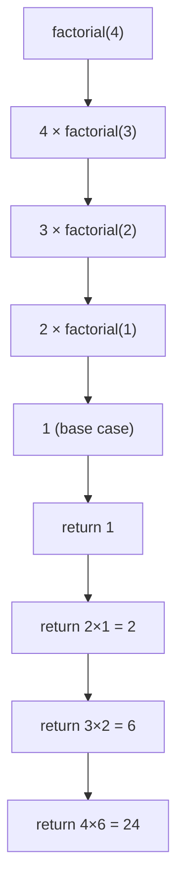

# 1. C++ Fundamentals & Programming Basics

## Table of Contents
- [1.1 Introduction](#11-introduction)
- [1.2 Input/Output](#12-inputoutput)
- [1.3 Data Types](#13-data-types)
- [1.4 Operators](#14-operators)
- [1.5 Control Flow](#15-control-flow)
- [1.6 Functions](#16-functions)
- [1.7 Recursion Basics](#17-recursion-basics)
- [1.8 Practice & Assessment](#18-practice--assessment)

---

## 1.1 Introduction

**What is C++?**  
C++ is a powerful, general-purpose programming language widely used in competitive programming, system software, game engines, and performance-critical applications. It supports procedural, object-oriented, and generic programming.

**Why C++ for DSA?**
- **Speed**: C++ is one of the fastest languages (compiled, close to hardware).
- **STL**: The Standard Template Library gives ready-made data structures and algorithms.
- **Control**: Fine-grained memory management with pointers and references.
- **Competitive Programming**: The majority of competitive programmers use C++.

---

## 1.2 Input/Output

### Basic I/O with `iostream`

```cpp
#include <iostream>
using namespace std;

int main() {
    int x;
    cout << "Enter a number: ";
    cin >> x;
    cout << "You entered: " << x << endl;
    return 0;
}
```

**Output:**
```
Enter a number: 42
You entered: 42
```

### Explanation
| Element | Purpose |
|---------|---------|
| `#include <iostream>` | Includes the I/O library |
| `using namespace std;` | Avoids writing `std::` before every standard function |
| `cin >> x;` | Reads input from the user into variable `x` |
| `cout << x;` | Prints the value of `x` to the console |
| `endl` | Inserts a newline and flushes the output buffer |

### Fast I/O (Competitive Programming Style)

```cpp
#include <bits/stdc++.h>
using namespace std;

int main() {
    ios::sync_with_stdio(false);
    cin.tie(NULL);
    
    int n;
    cin >> n;
    cout << n << "\n";  // "\n" is faster than endl
    return 0;
}
```

> **Tip**: `ios::sync_with_stdio(false)` and `cin.tie(NULL)` speed up I/O significantly. Use `"\n"` instead of `endl` (endl flushes the buffer every time).

### Reading Multiple Values

```cpp
int a, b, c;
cin >> a >> b >> c;  // reads three integers separated by spaces
cout << a + b + c << "\n";
```

### Reading Until EOF

```cpp
int x;
while (cin >> x) {
    cout << x << "\n";
}
```

---

## 1.3 Data Types

### Fundamental Data Types

| Type | Size (bytes) | Range | Use Case |
|------|-------------|-------|----------|
| `int` | 4 | -2×10⁹ to 2×10⁹ | General integers |
| `long long` | 8 | -9×10¹⁸ to 9×10¹⁸ | Large integers (use in CP) |
| `float` | 4 | ~7 decimal digits | Rarely used |
| `double` | 8 | ~15 decimal digits | Decimal numbers |
| `char` | 1 | -128 to 127 | Single characters |
| `bool` | 1 | `true` / `false` | Logical values |
| `string` | varies | — | Text (from `<string>`) |

### Common Pitfall: Integer Overflow

```cpp
int a = 1000000000;  // 10^9
int b = a * 2;       // OVERFLOW! Result exceeds int range

long long c = (long long)a * 2;  // CORRECT: cast before multiply
```

**Output:**
```
b = -1294967296   (garbage due to overflow)
c = 2000000000    (correct)
```

> **Rule of Thumb**: If a value can exceed ~2×10⁹, use `long long`.

### Type Casting

```cpp
int a = 7, b = 2;
cout << a / b << "\n";           // Output: 3 (integer division)
cout << (double)a / b << "\n";   // Output: 3.5 (floating-point division)
```

---

## 1.4 Operators

### Arithmetic Operators

| Operator | Meaning | Example | Result |
|----------|---------|---------|--------|
| `+` | Addition | `5 + 3` | `8` |
| `-` | Subtraction | `5 - 3` | `2` |
| `*` | Multiplication | `5 * 3` | `15` |
| `/` | Division | `7 / 2` | `3` (integer) |
| `%` | Modulus | `7 % 2` | `1` |

### Relational Operators

| Operator | Meaning | Example | Result |
|----------|---------|---------|--------|
| `==` | Equal to | `5 == 3` | `false` |
| `!=` | Not equal | `5 != 3` | `true` |
| `<` | Less than | `5 < 3` | `false` |
| `>` | Greater than | `5 > 3` | `true` |
| `<=` | Less or equal | `5 <= 5` | `true` |
| `>=` | Greater or equal | `3 >= 5` | `false` |

### Logical Operators

| Operator | Meaning | Example | Result |
|----------|---------|---------|--------|
| `&&` | AND | `true && false` | `false` |
| `\|\|` | OR | `true \|\| false` | `true` |
| `!` | NOT | `!true` | `false` |

### Increment/Decrement

```cpp
int x = 5;
cout << x++ << "\n";  // prints 5, then x becomes 6 (post-increment)
cout << ++x << "\n";  // x becomes 7, then prints 7 (pre-increment)
```

---

## 1.5 Control Flow

### 1.5.1 If-Else

```cpp
int x = 10;
if (x > 0) {
    cout << "Positive\n";
} else if (x == 0) {
    cout << "Zero\n";
} else {
    cout << "Negative\n";
}
```

**Output:** `Positive`

### Ternary Operator (Short If-Else)

```cpp
int x = 10;
string result = (x % 2 == 0) ? "Even" : "Odd";
cout << result << "\n";  // Output: Even
```

### 1.5.2 Switch Statement

```cpp
int choice = 2;
switch (choice) {
    case 1: cout << "One\n"; break;
    case 2: cout << "Two\n"; break;
    case 3: cout << "Three\n"; break;
    default: cout << "Other\n";
}
```

**Output:** `Two`

> **Common Pitfall**: Forgetting `break;` causes **fall-through** (executes all cases below).

### 1.5.3 Loops

#### For Loop

```cpp
// Print 1 to 5
for (int i = 1; i <= 5; i++) {
    cout << i << " ";
}
// Output: 1 2 3 4 5
```

#### While Loop

```cpp
int i = 1;
while (i <= 5) {
    cout << i << " ";
    i++;
}
// Output: 1 2 3 4 5
```

#### Do-While Loop

```cpp
int i = 1;
do {
    cout << i << " ";
    i++;
} while (i <= 5);
// Output: 1 2 3 4 5
```

#### Range-Based For Loop (C++11)

```cpp
vector<int> v = {10, 20, 30};
for (int x : v) {
    cout << x << " ";
}
// Output: 10 20 30
```

### Loop Control

| Keyword | Effect |
|---------|--------|
| `break` | Exits the loop immediately |
| `continue` | Skips current iteration, goes to next |
| `return` | Exits the entire function |

```cpp
for (int i = 1; i <= 10; i++) {
    if (i == 5) continue;  // skip 5
    if (i == 8) break;     // stop at 8
    cout << i << " ";
}
// Output: 1 2 3 4 6 7
```

---

## 1.6 Functions

### Function Definition

```cpp
// Function declaration
int add(int a, int b) {
    return a + b;
}

int main() {
    cout << add(3, 4) << "\n";  // Output: 7
    return 0;
}
```

### Pass by Value vs Pass by Reference

```cpp
// Pass by value: original unchanged
void increment_val(int x) {
    x++;
}

// Pass by reference: original is modified
void increment_ref(int &x) {
    x++;
}

int main() {
    int a = 5;
    increment_val(a);
    cout << a << "\n";  // Output: 5 (unchanged)
    
    increment_ref(a);
    cout << a << "\n";  // Output: 6 (modified)
    return 0;
}
```

### Default Arguments

```cpp
int power(int base, int exp = 2) {
    int result = 1;
    for (int i = 0; i < exp; i++)
        result *= base;
    return result;
}

cout << power(3) << "\n";    // Output: 9  (3^2, default exp=2)
cout << power(3, 3) << "\n"; // Output: 27 (3^3)
```

### Function Overloading

```cpp
int add(int a, int b) { return a + b; }
double add(double a, double b) { return a + b; }

cout << add(2, 3) << "\n";       // Output: 5
cout << add(2.5, 3.1) << "\n";   // Output: 5.6
```

---

## 1.7 Recursion Basics

### What is Recursion?

Recursion is when a function calls **itself** to solve a smaller version of the same problem. Every recursive function needs:
1. **Base case** – the simplest case that stops recursion.
2. **Recursive case** – the function calls itself with a smaller input.

### Example 1: Factorial



```cpp
int factorial(int n) {
    if (n <= 1) return 1;      // base case
    return n * factorial(n - 1); // recursive case
}

int main() {
    cout << factorial(5) << "\n";  // Output: 120
    return 0;
}
```

**Output:** `120`

**Dry Run:**
| Call | n | Returns |
|------|---|---------|
| `factorial(5)` | 5 | `5 * factorial(4)` = `5 * 24 = 120` |
| `factorial(4)` | 4 | `4 * factorial(3)` = `4 * 6 = 24` |
| `factorial(3)` | 3 | `3 * factorial(2)` = `3 * 2 = 6` |
| `factorial(2)` | 2 | `2 * factorial(1)` = `2 * 1 = 2` |
| `factorial(1)` | 1 | `1` (base case) |

### Example 2: Fibonacci

```cpp
int fib(int n) {
    if (n <= 1) return n;        // base cases: fib(0)=0, fib(1)=1
    return fib(n - 1) + fib(n - 2);
}

int main() {
    for (int i = 0; i < 8; i++)
        cout << fib(i) << " ";
    // Output: 0 1 1 2 3 5 8 13
    return 0;
}
```

> **Warning**: Naive Fibonacci is O(2ⁿ) — exponentially slow! We'll optimize it with Dynamic Programming later.

### Example 3: Sum of Digits

```cpp
int sumDigits(int n) {
    if (n == 0) return 0;
    return (n % 10) + sumDigits(n / 10);
}

cout << sumDigits(1234) << "\n";  // Output: 10 (1+2+3+4)
```

### Example 4: Power Function

```cpp
// O(log n) fast power using recursion
long long power(long long base, int exp) {
    if (exp == 0) return 1;
    long long half = power(base, exp / 2);
    if (exp % 2 == 0) return half * half;
    return base * half * half;
}

cout << power(2, 10) << "\n";  // Output: 1024
```

### Recursion vs Iteration

| Feature | Recursion | Iteration |
|---------|-----------|-----------|
| Uses | Function call stack | Loop variables |
| Memory | Higher (stack frames) | Lower |
| Readability | Often cleaner for tree/graph problems | Better for simple loops |
| Risk | Stack overflow for deep recursion | No stack overflow risk |
| Speed | Slight overhead from function calls | Generally faster |

---

## 1.8 Practice & Assessment

### MCQs

**Q1.** What is the output?
```cpp
int x = 5;
cout << x++ + ++x;
```
- A) 10
- B) 11
- C) 12
- D) Undefined behavior

**Answer:** D) Undefined behavior. Modifying `x` twice in the same expression without a sequence point is undefined.

---

**Q2.** Which data type should you use for a number up to 10¹⁸?
- A) `int`
- B) `unsigned int`
- C) `long long`
- D) `float`

**Answer:** C) `long long` (range up to ~9.2×10¹⁸)

---

**Q3.** What does `ios::sync_with_stdio(false)` do?
- A) Makes the program run in parallel
- B) Disables synchronization between C and C++ I/O for speed
- C) Enables multithreading
- D) Reduces memory usage

**Answer:** B) Disables synchronization between C and C++ I/O streams.

---

**Q4.** What is the output?
```cpp
for (int i = 0; i < 5; i++) {
    if (i == 3) continue;
    cout << i << " ";
}
```
- A) `0 1 2 3 4`
- B) `0 1 2 4`
- C) `0 1 2`
- D) `0 1 2 3`

**Answer:** B) `0 1 2 4`

---

**Q5.** What is the base case purpose in recursion?
- A) To make the function run faster
- B) To allocate memory
- C) To stop the recursion and prevent infinite calls
- D) To handle errors

**Answer:** C) To stop the recursion and prevent infinite calls.

---

### Output Prediction

**P1.** What is the output?
```cpp
int a = 10, b = 3;
cout << a / b << " " << a % b << "\n";
```
**Answer:** `3 1`

---

**P2.** What is the output?
```cpp
void mystery(int n) {
    if (n == 0) return;
    cout << n % 10 << " ";
    mystery(n / 10);
}
mystery(1234);
```
**Answer:** `4 3 2 1` (prints digits in reverse)

---

**P3.** What is the output?
```cpp
int x = 1;
for (int i = 0; i < 3; i++) {
    for (int j = 0; j < 3; j++) {
        if (i == j) continue;
        x++;
    }
}
cout << x;
```
**Answer:** `7` (skips 3 times when i==j, increments 6 times: 1+6=7)

---

### Short-Answer Questions

1. **Explain the difference between `cin` and `getline`.** When should you use each?
2. **Why is `endl` slower than `"\n"`?** Explain what flushing means.
3. **What happens if you forget the `break` in a switch statement?**
4. **Explain pass-by-reference with an example.** When is it preferable?
5. **Draw the call stack for `factorial(4)`.**

---

### Coding Exercises

| # | Problem | Difficulty | Source |
|---|---------|-----------|--------|
| 1 | Print "Hello World" | Easy | — |
| 2 | Sum of N natural numbers | Easy | — |
| 3 | Check if a number is prime | Easy | [GFG](https://practice.geeksforgeeks.org/problems/prime-number2314/1) |
| 4 | Find GCD of two numbers (recursive) | Easy | [LeetCode 1979](https://leetcode.com/problems/find-greatest-common-divisor-of-array/) |
| 5 | Reverse a number | Easy | [LeetCode 7](https://leetcode.com/problems/reverse-integer/) |
| 6 | Check palindrome number | Easy | [LeetCode 9](https://leetcode.com/problems/palindrome-number/) |
| 7 | Print Fibonacci series (iterative + recursive) | Easy | — |
| 8 | Tower of Hanoi | Medium | [GFG](https://practice.geeksforgeeks.org/problems/tower-of-hanoi-1587115621/1) |
| 9 | Count digits in a number (recursive) | Easy | — |
| 10 | Power function (O(log n)) | Medium | [LeetCode 50](https://leetcode.com/problems/powx-n/) |

### Sample Problem: Check Prime

```cpp
#include <bits/stdc++.h>
using namespace std;

bool isPrime(int n) {
    if (n <= 1) return false;
    for (int i = 2; i * i <= n; i++) {
        if (n % i == 0) return false;
    }
    return true;
}

int main() {
    int n;
    cin >> n;
    cout << (isPrime(n) ? "Prime" : "Not Prime") << "\n";
    return 0;
}
```

**Sample Input:** `17`  
**Sample Output:** `Prime`

---

### Interview Questions

1. **What is the difference between C and C++?**
2. **Explain `#include <bits/stdc++.h>`. Why is it used in competitive programming but not in production?**
3. **What is the difference between `++i` and `i++`? Which is preferred in loops and why?**
4. **What are the risks of integer overflow? How do you handle it in C++?**
5. **Explain the difference between stack memory and heap memory.**
6. **What is a segmentation fault? Give an example.**
7. **Why do we use `return 0;` in `main()`?**
8. **What is the time complexity of the recursive Fibonacci function? How can you optimize it?**
9. **Explain scope and lifetime of variables in C++.**
10. **What is tail recursion? Give an example and explain why compilers can optimize it.**

---

> **Next Topic**: [02 - Complexity Analysis](02-complexity-analysis.md)
