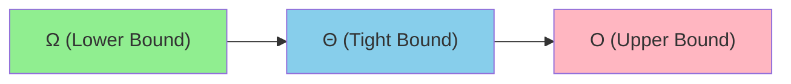
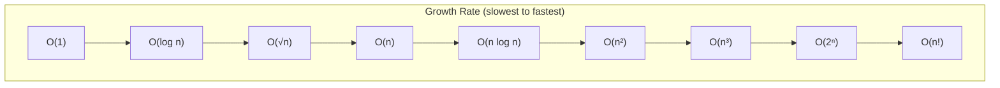
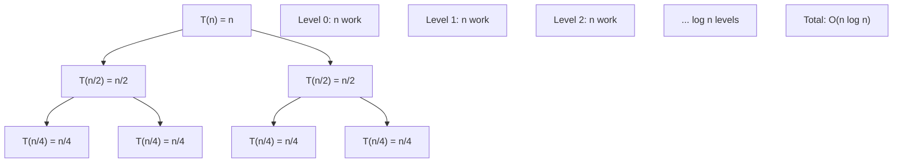

# 2. Complexity Analysis

## Table of Contents
- [2.1 Why Complexity Analysis?](#21-why-complexity-analysis)
- [2.2 Asymptotic Notations](#22-asymptotic-notations)
- [2.3 Common Complexity Classes](#23-common-complexity-classes)
- [2.4 Analyzing Loops](#24-analyzing-loops)
- [2.5 Analyzing Recursion](#25-analyzing-recursion)
- [2.6 Space Complexity](#26-space-complexity)
- [2.7 Practice & Assessment](#27-practice--assessment)

---

## 2.1 Why Complexity Analysis?

**Definition**: Complexity analysis measures how the **time** or **space** used by an algorithm grows as the input size increases.

**Why it matters**:
- Determines if your solution is fast enough for given constraints.
- Lets you compare algorithms without running them.
- Essential for interviews and competitive programming.

**Rule of Thumb** (for competitive programming):
- Modern computers process ~10⁸ operations/second.
- If `n = 10⁵`, an O(n²) algorithm does ~10¹⁰ operations → **too slow** (TLE).
- An O(n log n) algorithm does ~1.7×10⁶ → **fast enough**.

| Constraint on n | Expected Complexity |
|----------------|-------------------|
| n ≤ 10 | O(n!) or O(2ⁿ) |
| n ≤ 20 | O(2ⁿ) |
| n ≤ 500 | O(n³) |
| n ≤ 5000 | O(n²) |
| n ≤ 10⁶ | O(n log n) |
| n ≤ 10⁸ | O(n) |
| n ≤ 10¹⁸ | O(log n) or O(1) |

---

## 2.2 Asymptotic Notations

### Big-O (O) — Upper Bound (Worst Case)

**Definition**: f(n) = O(g(n)) means f(n) grows **at most** as fast as g(n) for large n.

> "The algorithm will **never** be slower than this."

**Example**: Linear search is O(n) — in the worst case, you check every element.

### Big-Omega (Ω) — Lower Bound (Best Case)

**Definition**: f(n) = Ω(g(n)) means f(n) grows **at least** as fast as g(n).

> "The algorithm will **always** take at least this long."

**Example**: Any comparison-based sorting algorithm is Ω(n log n).

### Big-Theta (Θ) — Tight Bound (Average Case)

**Definition**: f(n) = Θ(g(n)) means f(n) grows **exactly** as fast as g(n) (both upper and lower bound).

> "The algorithm takes **exactly** this much time asymptotically."

**Example**: Merge sort is Θ(n log n) in all cases.



### Summary Table

| Notation | Meaning | Analogy |
|----------|---------|---------|
| O(g(n)) | Upper bound (≤) | "At most g(n)" |
| Ω(g(n)) | Lower bound (≥) | "At least g(n)" |
| Θ(g(n)) | Tight bound (=) | "Exactly g(n)" |
| o(g(n)) | Strict upper bound (<) | "Strictly less than g(n)" |
| ω(g(n)) | Strict lower bound (>) | "Strictly more than g(n)" |

---

## 2.3 Common Complexity Classes

| Complexity | Name | Example | n=10⁶ ops |
|-----------|------|---------|-----------|
| O(1) | Constant | Array access by index | 1 |
| O(log n) | Logarithmic | Binary search | ~20 |
| O(√n) | Square root | Trial division primality | ~1000 |
| O(n) | Linear | Linear search, traversal | 10⁶ |
| O(n log n) | Linearithmic | Merge sort, STL sort | ~2×10⁷ |
| O(n²) | Quadratic | Bubble sort, nested loops | 10¹² ❌ |
| O(n³) | Cubic | Floyd-Warshall | 10¹⁸ ❌ |
| O(2ⁿ) | Exponential | Subsets, brute-force | Huge ❌ |
| O(n!) | Factorial | Permutations | Huge ❌ |



---

## 2.4 Analyzing Loops

### Single Loop — O(n)

```cpp
for (int i = 0; i < n; i++) {  // runs n times
    cout << i;                   // O(1) work
}
// Total: O(n)
```

### Nested Loop — O(n²)

```cpp
for (int i = 0; i < n; i++) {       // runs n times
    for (int j = 0; j < n; j++) {   // runs n times for each i
        cout << i + j;               // O(1) work
    }
}
// Total: O(n × n) = O(n²)
```

### Dependent Nested Loop — O(n²)

```cpp
for (int i = 0; i < n; i++) {
    for (int j = 0; j < i; j++) {  // j goes from 0 to i-1
        // work
    }
}
// Total: 0 + 1 + 2 + ... + (n-1) = n(n-1)/2 = O(n²)
```

### Logarithmic Loop — O(log n)

```cpp
for (int i = 1; i < n; i *= 2) {  // i doubles each time
    // work
}
// i takes values: 1, 2, 4, 8, ..., n → log₂(n) iterations
// Total: O(log n)
```

### Loop with Division — O(log n)

```cpp
int i = n;
while (i > 0) {
    i /= 2;   // i halves each time
}
// Total: O(log n)
```

### Nested with Log — O(n log n)

```cpp
for (int i = 0; i < n; i++) {         // O(n)
    for (int j = 1; j < n; j *= 2) {  // O(log n)
        // work
    }
}
// Total: O(n log n)
```

### Multiple Consecutive Loops — Take Maximum

```cpp
for (int i = 0; i < n; i++) { }       // O(n)
for (int i = 0; i < n; i++)
    for (int j = 0; j < n; j++) { }   // O(n²)
for (int i = 0; i < n; i++) { }       // O(n)

// Total: O(n) + O(n²) + O(n) = O(n²)  (dominated by the largest term)
```

### Tricky Example — O(n)

```cpp
for (int i = 0; i < n; i++) {
    for (int j = i; j < n; j += n) {  // this inner loop runs ~1 time!
        // work
    }
}
// Each inner loop: (n - i) / n ≈ 1 iteration
// Total: O(n × 1) = O(n)
```

---

## 2.5 Analyzing Recursion

### Method 1: Recurrence Relations

**Factorial**: `T(n) = T(n-1) + O(1)` → **O(n)**

**Fibonacci (naive)**: `T(n) = T(n-1) + T(n-2) + O(1)` → **O(2ⁿ)**

**Binary Search**: `T(n) = T(n/2) + O(1)` → **O(log n)**

**Merge Sort**: `T(n) = 2T(n/2) + O(n)` → **O(n log n)**

### Method 2: Master Theorem

For recurrences of the form: **T(n) = aT(n/b) + O(nᵈ)**

| Condition | Result |
|-----------|--------|
| d < log_b(a) | T(n) = O(n^(log_b(a))) |
| d = log_b(a) | T(n) = O(nᵈ × log n) |
| d > log_b(a) | T(n) = O(nᵈ) |

**Examples:**

| Recurrence | a | b | d | log_b(a) | Result |
|-----------|---|---|---|----------|--------|
| T(n) = 2T(n/2) + n | 2 | 2 | 1 | 1 | O(n log n) — Merge Sort |
| T(n) = T(n/2) + 1 | 1 | 2 | 0 | 0 | O(log n) — Binary Search |
| T(n) = 2T(n/2) + 1 | 2 | 2 | 0 | 1 | O(n) — Binary Tree Traversal |
| T(n) = 4T(n/2) + n | 4 | 2 | 1 | 2 | O(n²) |

### Recursion Tree Method (Visual)



For merge sort `T(n) = 2T(n/2) + n`:
- Level 0: 1 node does n work → total n
- Level 1: 2 nodes each do n/2 work → total n
- Level 2: 4 nodes each do n/4 work → total n
- ...
- log₂(n) levels, each doing n work → **O(n log n)**

---

## 2.6 Space Complexity

**Definition**: How much **extra memory** (beyond input) the algorithm uses.

| Example | Space |
|---------|-------|
| A few variables | O(1) |
| An array of size n | O(n) |
| A 2D matrix n×n | O(n²) |
| Recursive call stack of depth n | O(n) |
| Recursive call stack of depth log n | O(log n) |

```cpp
// O(1) space — in-place
void reverseArray(int arr[], int n) {
    int l = 0, r = n - 1;
    while (l < r) swap(arr[l++], arr[r--]);
}

// O(n) space — extra array
vector<int> reversed(vector<int>& v) {
    vector<int> res(v.rbegin(), v.rend());  // new vector of size n
    return res;
}
```

### Trade-Off: Time vs Space

| Strategy | Time | Space | Example |
|----------|------|-------|---------|
| Brute force | Slow | Low | Nested loops |
| Hash map lookup | Fast | High | Two-sum with hash map |
| Memoized recursion | Fast | Medium | DP Fibonacci |

---

## 2.7 Practice & Assessment

### MCQs

**Q1.** What is the time complexity of the following?
```cpp
for (int i = 1; i <= n; i *= 2)
    for (int j = 0; j < n; j++)
        cout << i + j;
```
- A) O(n)
- B) O(n log n)
- C) O(n²)
- D) O(log n)

**Answer:** B) O(n log n). Outer loop runs O(log n) times, inner loop runs O(n) times.

---

**Q2.** What is the time complexity of binary search?
- A) O(n)
- B) O(n log n)
- C) O(log n)
- D) O(1)

**Answer:** C) O(log n)

---

**Q3.** Which notation describes the **best case**?
- A) Big-O
- B) Big-Θ
- C) Big-Ω
- D) Little-o

**Answer:** C) Big-Ω

---

**Q4.** If f(n) = 3n² + 5n + 100, what is f(n) in Big-O?
- A) O(n)
- B) O(n²)
- C) O(n³)
- D) O(3n²)

**Answer:** B) O(n²). Constants and lower-order terms are dropped.

---

**Q5.** The Master Theorem applies to recurrences of the form:
- A) T(n) = T(n-1) + O(n)
- B) T(n) = aT(n/b) + O(nᵈ)
- C) T(n) = T(n/2) + T(n/3) + O(n)
- D) T(n) = T(√n) + O(1)

**Answer:** B) T(n) = aT(n/b) + O(nᵈ)

---

**Q6.** What is the space complexity of merge sort?
- A) O(1)
- B) O(log n)
- C) O(n)
- D) O(n log n)

**Answer:** C) O(n) — needs auxiliary array for merging.

---

### Output Prediction & Complexity

**P1.** How many times does "Hello" print?
```cpp
for (int i = n; i >= 1; i /= 2)
    cout << "Hello\n";
```
**Answer:** O(log n) times. i takes values n, n/2, n/4, ..., 1.

---

**P2.** How many times does the inner statement execute?
```cpp
for (int i = 0; i < n; i++)
    for (int j = 0; j < i; j++)
        x++;
```
**Answer:** 0+1+2+...+(n-1) = n(n-1)/2 → **O(n²)**

---

**P3.** What is the complexity of this function?
```cpp
void foo(int n) {
    if (n <= 0) return;
    foo(n - 1);
    foo(n - 1);
}
```
**Answer:** T(n) = 2T(n-1) + O(1) → **O(2ⁿ)**

---

### Short-Answer Questions

1. **Explain why O(n log n) is the lower bound for comparison-based sorting.**
2. **Given two algorithms — one O(n²) and one O(n log n) — is the O(n log n) always faster in practice?** (Hint: consider small n and constant factors.)
3. **Explain amortized analysis with the example of dynamic array resizing.**
4. **Why is O(log n) considered very efficient? Give a real-world analogy.**
5. **What is the complexity of a for loop that goes from 1 to √n?**

---

### Coding Exercises

| # | Problem | Difficulty | Source |
|---|---------|-----------|--------|
| 1 | Determine if an algorithm with given complexity will pass under constraints | Easy | — |
| 2 | Find time complexity of given code snippets | Easy | — |
| 3 | Running Sum of 1d Array | Easy | [LeetCode 1480](https://leetcode.com/problems/running-sum-of-1d-array/) |
| 4 | Count operations to reach n=0 (halving) | Easy | [LeetCode 2169](https://leetcode.com/problems/count-operations-to-obtain-zero/) |
| 5 | Analyze complexity of recursive Fibonacci vs iterative | Easy | — |
| 6 | Find the number of iterations for i=1; while(i<n) i*=3 | Medium | — |
| 7 | Compare two sorting algorithms on same data empirically | Medium | — |
| 8 | Solve a problem in O(n²) then optimize to O(n log n) | Medium | — |
| 9 | Implement and time binary search vs linear search | Medium | — |
| 10 | Amortized analysis of push_back on vector | Hard | — |

---

### Interview Questions

1. **Explain Big-O notation in simple terms.**
2. **What is the difference between time complexity and space complexity?**
3. **If you have two nested loops, is the complexity always O(n²)?** Give a counterexample.
4. **How do you analyze the time complexity of a recursive function?**
5. **What is amortized time complexity? Give an example.**
6. **Why is O(1) not always better than O(n)?** (Hint: constant factors)
7. **Explain the Master Theorem and when you can use it.**
8. **What complexity is acceptable for n = 10⁵? For n = 10⁶?**
9. **How does space complexity change in recursion vs iteration?**
10. **What is the worst-case complexity of quicksort and how do you avoid it?**

---

> **Next Topic**: [03 - Arrays & Strings](03-arrays-and-strings.md)
