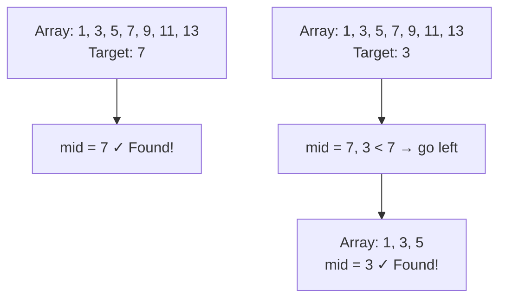
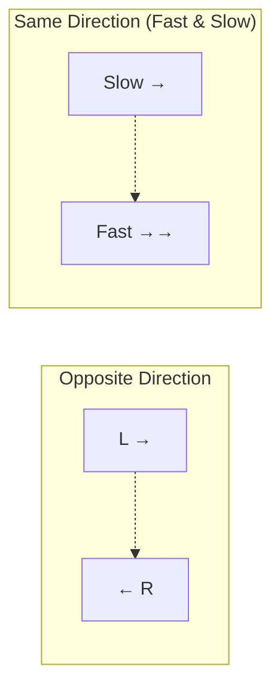
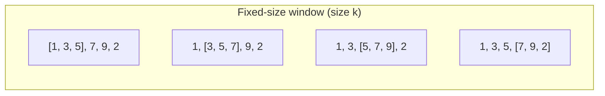

# 3. Arrays & Strings

## Table of Contents
- [3.1 Arrays – Basics](#31-arrays--basics)
- [3.2 Array Operations](#32-array-operations)
- [3.3 Searching Algorithms](#33-searching-algorithms)
- [3.4 Sorting Basics](#34-sorting-basics)
- [3.5 Two-Pointer Technique](#35-two-pointer-technique)
- [3.6 Sliding Window Technique](#36-sliding-window-technique)
- [3.7 Prefix Sums](#37-prefix-sums)
- [3.8 Kadane's Algorithm](#38-kadanes-algorithm)
- [3.9 Strings](#39-strings)
- [3.10 Pattern Matching](#310-pattern-matching)
- [3.11 Practice & Assessment](#311-practice--assessment)

---

## 3.1 Arrays – Basics

### Definition
An **array** is a contiguous block of memory that stores elements of the same type. Each element is accessed by its **index** (0-based in C++).

### Declaration & Initialization

```cpp
// C-style arrays
int arr[5];                        // uninitialized (garbage values)
int arr2[5] = {1, 2, 3, 4, 5};    // initialized
int arr3[5] = {1, 2};             // {1, 2, 0, 0, 0} — rest are 0
int arr4[] = {10, 20, 30};        // size deduced as 3

// C++ vector (preferred — dynamic size)
#include <vector>
vector<int> v;                     // empty vector
vector<int> v2(5, 0);             // {0, 0, 0, 0, 0}
vector<int> v3 = {1, 2, 3};       // {1, 2, 3}
vector<vector<int>> mat(n, vector<int>(m, 0));  // n×m matrix of zeros
```

### Array vs Vector

| Feature | C-style Array | `vector` |
|---------|--------------|----------|
| Size | Fixed at compile time | Dynamic |
| Bounds checking | No | `.at()` does; `[]` does not |
| Memory | Stack (usually) | Heap |
| Pass to function | Decays to pointer | Pass by reference |
| STL support | Limited | Full (iterators, algorithms) |

---

## 3.2 Array Operations

### Traversal — O(n)

```cpp
vector<int> v = {10, 20, 30, 40, 50};
for (int i = 0; i < v.size(); i++)
    cout << v[i] << " ";
// Output: 10 20 30 40 50

// Range-based
for (int x : v)
    cout << x << " ";
```

### Insertion — O(n) worst case

```cpp
// Insert 25 at index 2
vector<int> v = {10, 20, 30, 40};
v.insert(v.begin() + 2, 25);
// v = {10, 20, 25, 30, 40}
```

### Deletion — O(n) worst case

```cpp
// Delete element at index 2
v.erase(v.begin() + 2);
// v = {10, 20, 30, 40}
```

### Reversal — O(n)

```cpp
// In-place reversal
void reverseArray(vector<int>& arr) {
    int l = 0, r = arr.size() - 1;
    while (l < r) {
        swap(arr[l], arr[r]);
        l++; r--;
    }
}

// Using STL
reverse(v.begin(), v.end());
```

### Finding Max/Min — O(n)

```cpp
int mx = *max_element(v.begin(), v.end());
int mn = *min_element(v.begin(), v.end());
```

---

## 3.3 Searching Algorithms

### 3.3.1 Linear Search — O(n)

```cpp
int linearSearch(vector<int>& arr, int target) {
    for (int i = 0; i < arr.size(); i++) {
        if (arr[i] == target) return i;
    }
    return -1;  // not found
}
```

| Case | Complexity |
|------|-----------|
| Best | O(1) — found at first position |
| Average | O(n/2) = O(n) |
| Worst | O(n) — not found or last position |

### 3.3.2 Binary Search — O(log n)

**Prerequisite**: Array must be **sorted**.

**Intuition**: Compare with the middle element. If target is smaller, search left half; if larger, search right half. Each step halves the search space.



```cpp
// Iterative Binary Search
int binarySearch(vector<int>& arr, int target) {
    int lo = 0, hi = arr.size() - 1;
    while (lo <= hi) {
        int mid = lo + (hi - lo) / 2;  // avoids overflow
        if (arr[mid] == target) return mid;
        else if (arr[mid] < target) lo = mid + 1;
        else hi = mid - 1;
    }
    return -1;  // not found
}
```

**Dry Run** for `arr = {2, 5, 8, 12, 16, 23, 38, 56, 72, 91}`, target = 23:

| Step | lo | hi | mid | arr[mid] | Action |
|------|----|----|-----|----------|--------|
| 1 | 0 | 9 | 4 | 16 | 23 > 16, lo = 5 |
| 2 | 5 | 9 | 7 | 56 | 23 < 56, hi = 6 |
| 3 | 5 | 6 | 5 | 23 | Found! Return 5 |

```cpp
// Recursive Binary Search
int binarySearchRec(vector<int>& arr, int lo, int hi, int target) {
    if (lo > hi) return -1;
    int mid = lo + (hi - lo) / 2;
    if (arr[mid] == target) return mid;
    if (arr[mid] < target) return binarySearchRec(arr, mid + 1, hi, target);
    return binarySearchRec(arr, lo, mid - 1, target);
}
```

### STL Binary Search Functions

```cpp
vector<int> v = {1, 3, 5, 7, 9, 11};

// Check if element exists
bool found = binary_search(v.begin(), v.end(), 7);  // true

// First position >= target
auto it = lower_bound(v.begin(), v.end(), 6);  // points to 7 (index 3)

// First position > target
auto it2 = upper_bound(v.begin(), v.end(), 7);  // points to 9 (index 4)

// Count of element
int cnt = upper_bound(v.begin(), v.end(), 7) - lower_bound(v.begin(), v.end(), 7);  // 1
```

| Complexity | Time | Space |
|-----------|------|-------|
| Best | O(1) | O(1) |
| Average | O(log n) | O(1) |
| Worst | O(log n) | O(1) |

---

## 3.4 Sorting Basics

### Bubble Sort — O(n²)

```cpp
void bubbleSort(vector<int>& arr) {
    int n = arr.size();
    for (int i = 0; i < n - 1; i++) {
        bool swapped = false;
        for (int j = 0; j < n - i - 1; j++) {
            if (arr[j] > arr[j + 1]) {
                swap(arr[j], arr[j + 1]);
                swapped = true;
            }
        }
        if (!swapped) break;  // optimization: already sorted
    }
}
```

### Selection Sort — O(n²)

```cpp
void selectionSort(vector<int>& arr) {
    int n = arr.size();
    for (int i = 0; i < n - 1; i++) {
        int minIdx = i;
        for (int j = i + 1; j < n; j++)
            if (arr[j] < arr[minIdx]) minIdx = j;
        swap(arr[i], arr[minIdx]);
    }
}
```

### Insertion Sort — O(n²) worst, O(n) best

```cpp
void insertionSort(vector<int>& arr) {
    int n = arr.size();
    for (int i = 1; i < n; i++) {
        int key = arr[i], j = i - 1;
        while (j >= 0 && arr[j] > key) {
            arr[j + 1] = arr[j];
            j--;
        }
        arr[j + 1] = key;
    }
}
```

### Merge Sort — O(n log n)

```cpp
void merge(vector<int>& arr, int l, int m, int r) {
    vector<int> left(arr.begin() + l, arr.begin() + m + 1);
    vector<int> right(arr.begin() + m + 1, arr.begin() + r + 1);
    int i = 0, j = 0, k = l;
    while (i < left.size() && j < right.size())
        arr[k++] = (left[i] <= right[j]) ? left[i++] : right[j++];
    while (i < left.size()) arr[k++] = left[i++];
    while (j < right.size()) arr[k++] = right[j++];
}

void mergeSort(vector<int>& arr, int l, int r) {
    if (l >= r) return;
    int m = l + (r - l) / 2;
    mergeSort(arr, l, m);
    mergeSort(arr, m + 1, r);
    merge(arr, l, m, r);
}
```

### Quick Sort — O(n log n) avg, O(n²) worst

```cpp
int partition(vector<int>& arr, int lo, int hi) {
    int pivot = arr[hi], i = lo - 1;
    for (int j = lo; j < hi; j++) {
        if (arr[j] < pivot) {
            i++;
            swap(arr[i], arr[j]);
        }
    }
    swap(arr[i + 1], arr[hi]);
    return i + 1;
}

void quickSort(vector<int>& arr, int lo, int hi) {
    if (lo < hi) {
        int p = partition(arr, lo, hi);
        quickSort(arr, lo, p - 1);
        quickSort(arr, p + 1, hi);
    }
}
```

### Sorting Comparison Table

| Algorithm | Best | Average | Worst | Space | Stable? |
|-----------|------|---------|-------|-------|---------|
| Bubble Sort | O(n) | O(n²) | O(n²) | O(1) | Yes |
| Selection Sort | O(n²) | O(n²) | O(n²) | O(1) | No |
| Insertion Sort | O(n) | O(n²) | O(n²) | O(1) | Yes |
| Merge Sort | O(n log n) | O(n log n) | O(n log n) | O(n) | Yes |
| Quick Sort | O(n log n) | O(n log n) | O(n²) | O(log n) | No |
| STL sort | O(n log n) | O(n log n) | O(n log n) | O(log n) | No |

### STL Sort

```cpp
vector<int> v = {5, 2, 8, 1, 9};
sort(v.begin(), v.end());              // ascending: {1, 2, 5, 8, 9}
sort(v.begin(), v.end(), greater<>());  // descending: {9, 8, 5, 2, 1}

// Custom comparator
sort(v.begin(), v.end(), [](int a, int b) {
    return a > b;  // descending
});
```

---

## 3.5 Two-Pointer Technique

### Concept

Use two pointers (indices) that move toward each other or in the same direction to solve problems efficiently, often reducing O(n²) to O(n).



### Example 1: Two Sum (Sorted Array)

```cpp
// Given a sorted array, find two numbers that sum to target
// Time: O(n), Space: O(1)
pair<int,int> twoSum(vector<int>& arr, int target) {
    int l = 0, r = arr.size() - 1;
    while (l < r) {
        int sum = arr[l] + arr[r];
        if (sum == target) return {l, r};
        else if (sum < target) l++;
        else r--;
    }
    return {-1, -1};  // not found
}
```

**Dry Run**: `arr = {1, 3, 5, 7, 11}`, target = 8

| Step | l | r | arr[l]+arr[r] | Action |
|------|---|---|-------------|--------|
| 1 | 0 | 4 | 1+11=12 | 12>8, r-- |
| 2 | 0 | 3 | 1+7=8 | Found! Return {0,3} |

### Example 2: Remove Duplicates from Sorted Array

```cpp
// Time: O(n), Space: O(1)
int removeDuplicates(vector<int>& arr) {
    if (arr.empty()) return 0;
    int slow = 0;
    for (int fast = 1; fast < arr.size(); fast++) {
        if (arr[fast] != arr[slow]) {
            slow++;
            arr[slow] = arr[fast];
        }
    }
    return slow + 1;  // new length
}
```

### Example 3: Container With Most Water

```cpp
// Time: O(n), Space: O(1)
int maxArea(vector<int>& height) {
    int l = 0, r = height.size() - 1, ans = 0;
    while (l < r) {
        int area = min(height[l], height[r]) * (r - l);
        ans = max(ans, area);
        if (height[l] < height[r]) l++;
        else r--;
    }
    return ans;
}
```

---

## 3.6 Sliding Window Technique

### Concept

Maintain a **window** (subarray) of elements and slide it across the array, updating the result as you go. Avoids recomputing everything from scratch.



### Example 1: Maximum Sum of Subarray of Size k

```cpp
// Time: O(n), Space: O(1)
int maxSumSubarray(vector<int>& arr, int k) {
    int n = arr.size();
    int windowSum = 0;
    
    // Sum of first window
    for (int i = 0; i < k; i++)
        windowSum += arr[i];
    
    int maxSum = windowSum;
    
    // Slide the window
    for (int i = k; i < n; i++) {
        windowSum += arr[i] - arr[i - k];  // add new, remove old
        maxSum = max(maxSum, windowSum);
    }
    return maxSum;
}
```

**Dry Run**: `arr = {2, 1, 5, 1, 3, 2}`, k = 3

| Window | Sum | maxSum |
|--------|-----|--------|
| [2,1,5] | 8 | 8 |
| [1,5,1] | 7 | 8 |
| [5,1,3] | 9 | 9 |
| [1,3,2] | 6 | 9 |

**Answer**: 9

### Example 2: Smallest Subarray with Sum ≥ S (Variable Window)

```cpp
// Time: O(n), Space: O(1)
int minSubarrayLen(int target, vector<int>& arr) {
    int n = arr.size(), sum = 0, minLen = INT_MAX;
    int l = 0;
    for (int r = 0; r < n; r++) {
        sum += arr[r];
        while (sum >= target) {
            minLen = min(minLen, r - l + 1);
            sum -= arr[l++];
        }
    }
    return (minLen == INT_MAX) ? 0 : minLen;
}
```

### Example 3: Longest Substring Without Repeating Characters

```cpp
// Time: O(n), Space: O(min(n, 128))
int lengthOfLongestSubstring(string s) {
    vector<int> lastSeen(128, -1);
    int maxLen = 0, l = 0;
    for (int r = 0; r < s.size(); r++) {
        if (lastSeen[s[r]] >= l)
            l = lastSeen[s[r]] + 1;
        lastSeen[s[r]] = r;
        maxLen = max(maxLen, r - l + 1);
    }
    return maxLen;
}
```

---

## 3.7 Prefix Sums

### Concept

Build a prefix sum array so that any **range sum** can be answered in O(1).

```
arr    = [2, 4, 1, 3, 5]
prefix = [0, 2, 6, 7, 10, 15]

Sum(l..r) = prefix[r+1] - prefix[l]
Sum(1..3) = prefix[4] - prefix[1] = 10 - 2 = 8  (4+1+3)
```

```cpp
// Build prefix sum — O(n)
vector<int> buildPrefix(vector<int>& arr) {
    int n = arr.size();
    vector<int> prefix(n + 1, 0);
    for (int i = 0; i < n; i++)
        prefix[i + 1] = prefix[i] + arr[i];
    return prefix;
}

// Query range sum [l, r] — O(1)
int rangeSum(vector<int>& prefix, int l, int r) {
    return prefix[r + 1] - prefix[l];
}
```

### 2D Prefix Sum

```cpp
// Build 2D prefix sum — O(n*m)
vector<vector<int>> build2DPrefix(vector<vector<int>>& mat) {
    int n = mat.size(), m = mat[0].size();
    vector<vector<int>> pre(n + 1, vector<int>(m + 1, 0));
    for (int i = 1; i <= n; i++)
        for (int j = 1; j <= m; j++)
            pre[i][j] = mat[i-1][j-1] + pre[i-1][j] + pre[i][j-1] - pre[i-1][j-1];
    return pre;
}

// Query sum of submatrix (r1,c1) to (r2,c2) — O(1)
int query(vector<vector<int>>& pre, int r1, int c1, int r2, int c2) {
    return pre[r2+1][c2+1] - pre[r1][c2+1] - pre[r2+1][c1] + pre[r1][c1];
}
```

---

## 3.8 Kadane's Algorithm

### Problem: Maximum Subarray Sum

Find the contiguous subarray with the largest sum.

### Intuition

At each position, decide: extend the current subarray or start a new one? Keep track of the maximum.

```cpp
// Time: O(n), Space: O(1)
int maxSubarraySum(vector<int>& arr) {
    int maxSum = arr[0], curSum = arr[0];
    for (int i = 1; i < arr.size(); i++) {
        curSum = max(arr[i], curSum + arr[i]);
        maxSum = max(maxSum, curSum);
    }
    return maxSum;
}
```

**Dry Run**: `arr = {-2, 1, -3, 4, -1, 2, 1, -5, 4}`

| i | arr[i] | curSum | maxSum |
|---|--------|--------|--------|
| 0 | -2 | -2 | -2 |
| 1 | 1 | 1 | 1 |
| 2 | -3 | -2 | 1 |
| 3 | 4 | 4 | 4 |
| 4 | -1 | 3 | 4 |
| 5 | 2 | 5 | 5 |
| 6 | 1 | 6 | 6 |
| 7 | -5 | 1 | 6 |
| 8 | 4 | 5 | 6 |

**Answer**: 6 (subarray `{4, -1, 2, 1}`)

### Variant: Print the Subarray

```cpp
void maxSubarrayWithIndices(vector<int>& arr) {
    int maxSum = arr[0], curSum = arr[0];
    int start = 0, end = 0, tempStart = 0;
    for (int i = 1; i < arr.size(); i++) {
        if (arr[i] > curSum + arr[i]) {
            curSum = arr[i];
            tempStart = i;
        } else {
            curSum += arr[i];
        }
        if (curSum > maxSum) {
            maxSum = curSum;
            start = tempStart;
            end = i;
        }
    }
    cout << "Max sum: " << maxSum << "\n";
    cout << "Subarray: ";
    for (int i = start; i <= end; i++) cout << arr[i] << " ";
}
```

---

## 3.9 Strings

### String Basics

```cpp
#include <string>
string s = "hello";
cout << s.length() << "\n";     // 5
cout << s[0] << "\n";           // 'h'
cout << s.substr(1, 3) << "\n"; // "ell" (start=1, length=3)
s += " world";                  // concatenation: "hello world"

// String comparison
string a = "abc", b = "abd";
if (a < b) cout << "a comes first\n";  // lexicographic comparison
```

### Common String Operations

| Operation | Code | Complexity |
|-----------|------|-----------|
| Length | `s.length()` or `s.size()` | O(1) |
| Access char | `s[i]` or `s.at(i)` | O(1) |
| Append | `s += "text"` or `s.push_back('c')` | O(k) amortized |
| Substring | `s.substr(start, len)` | O(len) |
| Find | `s.find("pattern")` | O(n*m) |
| Reverse | `reverse(s.begin(), s.end())` | O(n) |
| Compare | `s == t` or `s.compare(t)` | O(n) |

### Example 1: Palindrome Check

```cpp
bool isPalindrome(string s) {
    int l = 0, r = s.size() - 1;
    while (l < r) {
        if (s[l] != s[r]) return false;
        l++; r--;
    }
    return true;
}
// isPalindrome("racecar") → true
// isPalindrome("hello") → false
```

### Example 2: Anagram Check

Two strings are anagrams if they contain the same characters with the same frequencies.

```cpp
bool isAnagram(string s, string t) {
    if (s.size() != t.size()) return false;
    int freq[26] = {};
    for (char c : s) freq[c - 'a']++;
    for (char c : t) freq[c - 'a']--;
    for (int i = 0; i < 26; i++)
        if (freq[i] != 0) return false;
    return true;
}
// isAnagram("listen", "silent") → true
```

### Example 3: Reverse Words in a String

```cpp
string reverseWords(string s) {
    // Use stringstream to extract words
    istringstream iss(s);
    string word, result;
    vector<string> words;
    while (iss >> word) words.push_back(word);
    reverse(words.begin(), words.end());
    for (int i = 0; i < words.size(); i++) {
        if (i > 0) result += " ";
        result += words[i];
    }
    return result;
}
```

---

## 3.10 Pattern Matching

### Naive Pattern Matching — O(n*m)

```cpp
vector<int> naiveSearch(string text, string pattern) {
    vector<int> positions;
    int n = text.size(), m = pattern.size();
    for (int i = 0; i <= n - m; i++) {
        int j = 0;
        while (j < m && text[i + j] == pattern[j]) j++;
        if (j == m) positions.push_back(i);
    }
    return positions;
}
```

### KMP Algorithm — O(n + m)

**Key Idea**: Precompute a failure function (LPS array) so that when a mismatch occurs, we don't re-check characters we've already matched.

```cpp
vector<int> computeLPS(string pattern) {
    int m = pattern.size();
    vector<int> lps(m, 0);
    int len = 0, i = 1;
    while (i < m) {
        if (pattern[i] == pattern[len]) {
            len++;
            lps[i] = len;
            i++;
        } else {
            if (len != 0) len = lps[len - 1];
            else { lps[i] = 0; i++; }
        }
    }
    return lps;
}

vector<int> KMPSearch(string text, string pattern) {
    vector<int> lps = computeLPS(pattern);
    vector<int> result;
    int n = text.size(), m = pattern.size();
    int i = 0, j = 0;
    while (i < n) {
        if (text[i] == pattern[j]) { i++; j++; }
        if (j == m) {
            result.push_back(i - j);
            j = lps[j - 1];
        } else if (i < n && text[i] != pattern[j]) {
            if (j != 0) j = lps[j - 1];
            else i++;
        }
    }
    return result;
}
```

---

## 3.11 Practice & Assessment

### MCQs

**Q1.** What is the time complexity of binary search?
- A) O(n)
- B) O(n²)
- C) O(log n)
- D) O(n log n)

**Answer:** C) O(log n)

---

**Q2.** Kadane's algorithm finds:
- A) The maximum element
- B) The maximum subarray sum
- C) The longest increasing subsequence
- D) The minimum subarray

**Answer:** B) The maximum subarray sum

---

**Q3.** What is the time complexity of the two-pointer technique on a sorted array?
- A) O(n²)
- B) O(n log n)
- C) O(n)
- D) O(log n)

**Answer:** C) O(n)

---

**Q4.** The prefix sum technique allows range sum queries in:
- A) O(n)
- B) O(log n)
- C) O(1)
- D) O(n log n)

**Answer:** C) O(1) after O(n) preprocessing.

---

**Q5.** Which sorting algorithm is NOT stable?
- A) Merge Sort
- B) Bubble Sort
- C) Insertion Sort
- D) Quick Sort

**Answer:** D) Quick Sort

---

**Q6.** `lower_bound` returns:
- A) Iterator to the last element ≤ target
- B) Iterator to the first element ≥ target
- C) Iterator to the first element > target
- D) Iterator to the exact element

**Answer:** B) Iterator to the first element ≥ target

---

### Output Prediction

**P1.**
```cpp
vector<int> v = {1, 2, 3, 4, 5};
cout << v[2] << " " << v.back() << "\n";
```
**Answer:** `3 5`

**P2.**
```cpp
string s = "abcdef";
cout << s.substr(2, 3) << "\n";
```
**Answer:** `cde`

**P3.**
```cpp
vector<int> v = {3, 1, 4, 1, 5, 9};
sort(v.begin(), v.end());
auto it = lower_bound(v.begin(), v.end(), 4);
cout << *it << " " << (it - v.begin()) << "\n";
```
**Answer:** `4 3` (sorted: {1,1,3,4,5,9}, lower_bound(4) points to index 3)

---

### Short-Answer Questions

1. **When would you prefer merge sort over quick sort?**
2. **Explain the sliding window technique. When is it applicable?**
3. **What is the advantage of prefix sums over brute-force range queries?**
4. **Why do we use `lo + (hi - lo) / 2` instead of `(lo + hi) / 2`?**
5. **Explain Kadane's algorithm in your own words.**

---

### Coding Exercises

| # | Problem | Difficulty | Source |
|---|---------|-----------|--------|
| 1 | Two Sum | Easy | [LeetCode 1](https://leetcode.com/problems/two-sum/) |
| 2 | Best Time to Buy and Sell Stock | Easy | [LeetCode 121](https://leetcode.com/problems/best-time-to-buy-and-sell-stock/) |
| 3 | Maximum Subarray (Kadane's) | Medium | [LeetCode 53](https://leetcode.com/problems/maximum-subarray/) |
| 4 | Binary Search | Easy | [LeetCode 704](https://leetcode.com/problems/binary-search/) |
| 5 | Container With Most Water | Medium | [LeetCode 11](https://leetcode.com/problems/container-with-most-water/) |
| 6 | 3Sum | Medium | [LeetCode 15](https://leetcode.com/problems/3sum/) |
| 7 | Minimum Size Subarray Sum | Medium | [LeetCode 209](https://leetcode.com/problems/minimum-size-subarray-sum/) |
| 8 | Longest Substring Without Repeating Chars | Medium | [LeetCode 3](https://leetcode.com/problems/longest-substring-without-repeating-characters/) |
| 9 | Valid Anagram | Easy | [LeetCode 242](https://leetcode.com/problems/valid-anagram/) |
| 10 | Merge Sorted Array | Easy | [LeetCode 88](https://leetcode.com/problems/merge-sorted-array/) |
| 11 | Sort Colors (Dutch National Flag) | Medium | [LeetCode 75](https://leetcode.com/problems/sort-colors/) |
| 12 | Find First and Last Position | Medium | [LeetCode 34](https://leetcode.com/problems/find-first-and-last-position-of-element-in-sorted-array/) |
| 13 | Subarray Sum Equals K | Medium | [LeetCode 560](https://leetcode.com/problems/subarray-sum-equals-k/) |
| 14 | Trapping Rain Water | Hard | [LeetCode 42](https://leetcode.com/problems/trapping-rain-water/) |
| 15 | Median of Two Sorted Arrays | Hard | [LeetCode 4](https://leetcode.com/problems/median-of-two-sorted-arrays/) |

---

### Interview Questions

1. **How does binary search work? What are the prerequisites?**
2. **Explain the two-pointer technique with an example.**
3. **What is the time complexity of STL `sort()`? What algorithm does it use?** (IntroSort — hybrid of QuickSort, HeapSort, InsertionSort)
4. **Compare stable vs unstable sorting algorithms. When does stability matter?**
5. **How would you find duplicates in an array in O(n) time?**
6. **Explain the sliding window technique. What types of problems can it solve?**
7. **What is Kadane's algorithm and what problem does it solve?**
8. **How do prefix sums work? What are some applications?**
9. **Explain the KMP algorithm and its advantage over naive pattern matching.**
10. **How would you search in a rotated sorted array?**

---

> **Next Topic**: [04 - Linked Lists](04-linked-lists.md)
