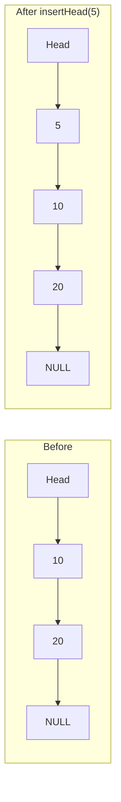
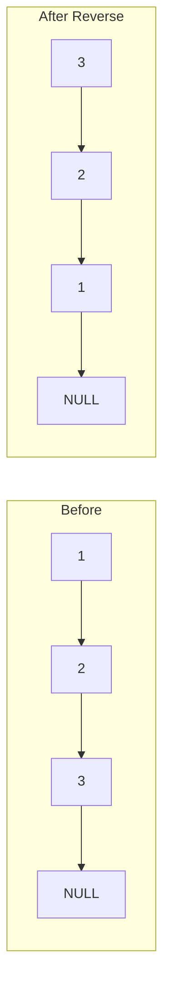
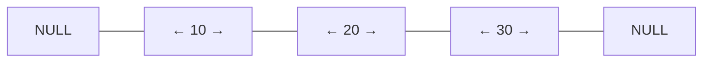
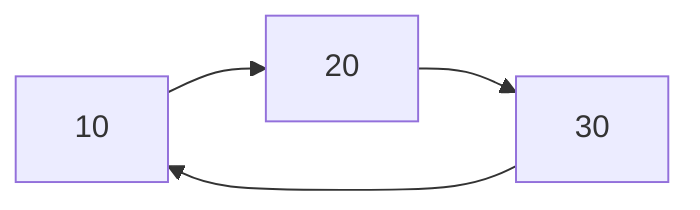
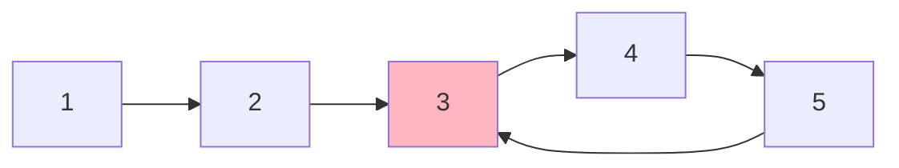
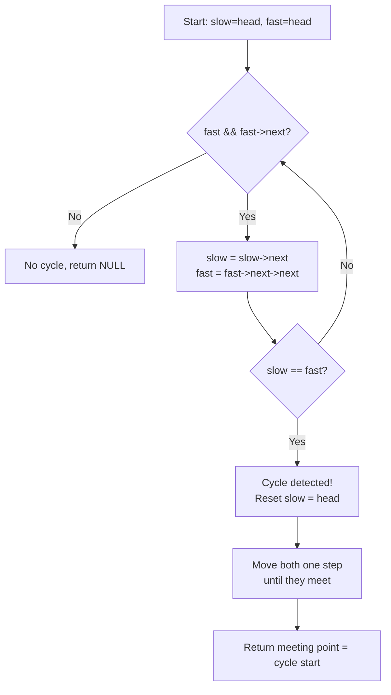

# 4. Linked Lists

## Table of Contents
- [4.1 Introduction](#41-introduction)
- [4.2 Singly Linked List](#42-singly-linked-list)
- [4.3 Doubly Linked List](#43-doubly-linked-list)
- [4.4 Circular Linked List](#44-circular-linked-list)
- [4.5 Classic Problems](#45-classic-problems)
- [4.6 Arrays vs Linked Lists](#46-arrays-vs-linked-lists)
- [4.7 Practice & Assessment](#47-practice--assessment)

---

## 4.1 Introduction

### Definition
A **Linked List** is a linear data structure where elements (**nodes**) are stored in non-contiguous memory. Each node contains data and a pointer to the next node.

### Why Linked Lists?
- **Dynamic size** — no need to declare size upfront.
- **Efficient insertions/deletions** — O(1) if you have a pointer to the position.
- **No wasted memory** — no pre-allocated unused space.

### Drawbacks
- **No random access** — must traverse from head (O(n) to access element).
- **Extra memory** — each node stores a pointer.
- **Poor cache locality** — nodes are scattered in memory.

---

## 4.2 Singly Linked List

### Node Structure


```cpp
struct Node {
    int data;
    Node* next;
    Node(int val) : data(val), next(nullptr) {}
};
```

### Operations

#### Insert at Head — O(1)

```cpp
void insertHead(Node*& head, int val) {
    Node* newNode = new Node(val);
    newNode->next = head;
    head = newNode;
}
```



#### Insert at Tail — O(n)

```cpp
void insertTail(Node*& head, int val) {
    Node* newNode = new Node(val);
    if (!head) { head = newNode; return; }
    Node* cur = head;
    while (cur->next) cur = cur->next;
    cur->next = newNode;
}
```

#### Insert at Position — O(n)

```cpp
void insertAt(Node*& head, int pos, int val) {
    if (pos == 0) { insertHead(head, val); return; }
    Node* cur = head;
    for (int i = 0; i < pos - 1 && cur; i++) cur = cur->next;
    if (!cur) return;  // position out of bounds
    Node* newNode = new Node(val);
    newNode->next = cur->next;
    cur->next = newNode;
}
```

#### Delete a Node — O(n)

```cpp
void deleteNode(Node*& head, int val) {
    if (!head) return;
    if (head->data == val) {
        Node* temp = head;
        head = head->next;
        delete temp;
        return;
    }
    Node* cur = head;
    while (cur->next && cur->next->data != val)
        cur = cur->next;
    if (cur->next) {
        Node* temp = cur->next;
        cur->next = temp->next;
        delete temp;
    }
}
```

#### Traverse / Print — O(n)

```cpp
void printList(Node* head) {
    while (head) {
        cout << head->data << " -> ";
        head = head->next;
    }
    cout << "NULL\n";
}
```

#### Search — O(n)

```cpp
bool search(Node* head, int val) {
    while (head) {
        if (head->data == val) return true;
        head = head->next;
    }
    return false;
}
```

#### Reverse a Singly Linked List — O(n)

```cpp
Node* reverseList(Node* head) {
    Node* prev = nullptr;
    Node* cur = head;
    while (cur) {
        Node* next = cur->next;
        cur->next = prev;
        prev = cur;
        cur = next;
    }
    return prev;  // new head
}
```



**Dry Run** for `1 -> 2 -> 3 -> NULL`:

| Step | prev | cur | next | Action |
|------|------|-----|------|--------|
| 1 | NULL | 1 | 2 | 1→NULL, prev=1, cur=2 |
| 2 | 1 | 2 | 3 | 2→1, prev=2, cur=3 |
| 3 | 2 | 3 | NULL | 3→2, prev=3, cur=NULL |
| Done | 3(head) | NULL | — | Return prev=3 |

#### Find Length — O(n)

```cpp
int length(Node* head) {
    int count = 0;
    while (head) { count++; head = head->next; }
    return count;
}
```

#### Find Middle Node — O(n)

```cpp
Node* findMiddle(Node* head) {
    Node* slow = head;
    Node* fast = head;
    while (fast && fast->next) {
        slow = slow->next;
        fast = fast->next->next;
    }
    return slow;  // middle node
}
```

### Complete Singly Linked List Example

```cpp
#include <bits/stdc++.h>
using namespace std;

struct Node {
    int data;
    Node* next;
    Node(int val) : data(val), next(nullptr) {}
};

int main() {
    Node* head = nullptr;
    
    // Insert elements
    insertHead(head, 30);  // 30
    insertHead(head, 20);  // 20 -> 30
    insertHead(head, 10);  // 10 -> 20 -> 30
    insertTail(head, 40);  // 10 -> 20 -> 30 -> 40
    
    printList(head);
    // Output: 10 -> 20 -> 30 -> 40 -> NULL
    
    // Reverse
    head = reverseList(head);
    printList(head);
    // Output: 40 -> 30 -> 20 -> 10 -> NULL
    
    // Delete
    deleteNode(head, 30);
    printList(head);
    // Output: 40 -> 20 -> 10 -> NULL
    
    return 0;
}
```

---

## 4.3 Doubly Linked List

### Node Structure



```cpp
struct DNode {
    int data;
    DNode* prev;
    DNode* next;
    DNode(int val) : data(val), prev(nullptr), next(nullptr) {}
};
```

### Insert at Head — O(1)

```cpp
void insertHead(DNode*& head, int val) {
    DNode* newNode = new DNode(val);
    newNode->next = head;
    if (head) head->prev = newNode;
    head = newNode;
}
```

### Insert at Tail — O(n)

```cpp
void insertTail(DNode*& head, int val) {
    DNode* newNode = new DNode(val);
    if (!head) { head = newNode; return; }
    DNode* cur = head;
    while (cur->next) cur = cur->next;
    cur->next = newNode;
    newNode->prev = cur;
}
```

### Delete a Node — O(1) if pointer given

```cpp
void deleteNode(DNode*& head, DNode* node) {
    if (!node) return;
    if (node->prev) node->prev->next = node->next;
    else head = node->next;  // deleting head
    if (node->next) node->next->prev = node->prev;
    delete node;
}
```

### Reverse — O(n)

```cpp
DNode* reverseDoubly(DNode* head) {
    DNode* cur = head;
    DNode* temp = nullptr;
    while (cur) {
        temp = cur->prev;
        cur->prev = cur->next;
        cur->next = temp;
        cur = cur->prev;  // move forward (prev and next are swapped)
    }
    return temp ? temp->prev : head;
}
```

### Singly vs Doubly

| Feature | Singly | Doubly |
|---------|--------|--------|
| Memory per node | 1 pointer | 2 pointers |
| Traverse backward | No | Yes |
| Delete given node | O(n) — need predecessor | O(1) |
| Insert before node | O(n) | O(1) |
| Use case | Simple lists, stacks | LRU cache, browser history |

---

## 4.4 Circular Linked List

### Concept
The **last node** points back to the **first node**, forming a circle.



```cpp
// Check if a list is circular
bool isCircular(Node* head) {
    if (!head) return true;
    Node* cur = head->next;
    while (cur && cur != head)
        cur = cur->next;
    return cur == head;
}
```

### Use Cases
- Round-robin scheduling
- Circular buffers
- Multiplayer game turns

---

## 4.5 Classic Problems

### Floyd's Cycle Detection (Tortoise and Hare)

**Problem**: Detect if a linked list has a cycle.

**Intuition**: Use two pointers — `slow` moves 1 step, `fast` moves 2 steps. If there's a cycle, they will meet.



```cpp
bool hasCycle(Node* head) {
    Node* slow = head;
    Node* fast = head;
    while (fast && fast->next) {
        slow = slow->next;
        fast = fast->next->next;
        if (slow == fast) return true;
    }
    return false;
}
```

### Find Cycle Start

```cpp
Node* detectCycleStart(Node* head) {
    Node* slow = head;
    Node* fast = head;
    while (fast && fast->next) {
        slow = slow->next;
        fast = fast->next->next;
        if (slow == fast) {
            // Move one pointer to head, advance both at same speed
            slow = head;
            while (slow != fast) {
                slow = slow->next;
                fast = fast->next;
            }
            return slow;  // cycle start
        }
    }
    return nullptr;  // no cycle
}
```



### Merge Two Sorted Lists

```cpp
Node* mergeSorted(Node* l1, Node* l2) {
    Node dummy(0);
    Node* tail = &dummy;
    while (l1 && l2) {
        if (l1->data <= l2->data) {
            tail->next = l1;
            l1 = l1->next;
        } else {
            tail->next = l2;
            l2 = l2->next;
        }
        tail = tail->next;
    }
    tail->next = l1 ? l1 : l2;
    return dummy.next;
}
```

### Check Palindrome — O(n) time, O(1) space

```cpp
bool isPalindrome(Node* head) {
    // 1. Find middle
    Node* slow = head;
    Node* fast = head;
    while (fast && fast->next) {
        slow = slow->next;
        fast = fast->next->next;
    }
    // 2. Reverse second half
    Node* prev = nullptr;
    while (slow) {
        Node* next = slow->next;
        slow->next = prev;
        prev = slow;
        slow = next;
    }
    // 3. Compare both halves
    Node* left = head;
    Node* right = prev;
    while (right) {
        if (left->data != right->data) return false;
        left = left->next;
        right = right->next;
    }
    return true;
}
```

---

## 4.6 Arrays vs Linked Lists

| Operation | Array | Linked List |
|-----------|-------|-------------|
| Access by index | O(1) | O(n) |
| Search | O(n) / O(log n) sorted | O(n) |
| Insert at beginning | O(n) | O(1) |
| Insert at end | O(1) amortized (vector) | O(n) / O(1) with tail |
| Insert at middle | O(n) | O(1) if pointer known |
| Delete | O(n) | O(1) if pointer known |
| Memory | Contiguous, cache-friendly | Scattered, pointer overhead |
| Size | Fixed or dynamic (vector) | Dynamic |

---

## 4.7 Practice & Assessment

### MCQs

**Q1.** What is the time complexity of inserting at the head of a singly linked list?
- A) O(1)
- B) O(n)
- C) O(log n)
- D) O(n²)

**Answer:** A) O(1)

---

**Q2.** In Floyd's cycle detection, the fast pointer moves:
- A) 1 step at a time
- B) 2 steps at a time
- C) n steps at a time
- D) Random steps

**Answer:** B) 2 steps at a time

---

**Q3.** Which linked list allows backward traversal?
- A) Singly Linked List
- B) Doubly Linked List
- C) Circular Linked List
- D) None

**Answer:** B) Doubly Linked List

---

**Q4.** What is the space overhead per node in a doubly linked list vs singly?
- A) Same
- B) One extra pointer
- C) Two extra pointers
- D) No pointers

**Answer:** B) One extra pointer (prev pointer added)

---

**Q5.** The middle of a linked list can be found in one pass using:
- A) Two pointers (slow & fast)
- B) Recursion
- C) Stack
- D) Counting then traversing

**Answer:** A) Two pointers (slow moves 1 step, fast moves 2 steps)

---

### Output Prediction

**P1.** What does this print?
```cpp
Node* head = nullptr;
insertHead(head, 3);
insertHead(head, 2);
insertHead(head, 1);
head = reverseList(head);
printList(head);
```
**Answer:** `3 -> 2 -> 1 -> NULL`

---

**P2.** After these operations, what is the list?
```cpp
Node* head = nullptr;
insertTail(head, 10);
insertTail(head, 20);
insertHead(head, 5);
deleteNode(head, 20);
printList(head);
```
**Answer:** `5 -> 10 -> NULL`

---

### Short-Answer Questions

1. **Why is random access O(n) in a linked list but O(1) in an array?**
2. **Explain Floyd's cycle detection algorithm step by step.**
3. **When would you use a linked list over an array?**
4. **How do you reverse a linked list in-place?**
5. **What is a dummy/sentinel node and why is it useful?**

---

### Coding Exercises

| # | Problem | Difficulty | Source |
|---|---------|-----------|--------|
| 1 | Reverse Linked List | Easy | [LeetCode 206](https://leetcode.com/problems/reverse-linked-list/) |
| 2 | Linked List Cycle | Easy | [LeetCode 141](https://leetcode.com/problems/linked-list-cycle/) |
| 3 | Merge Two Sorted Lists | Easy | [LeetCode 21](https://leetcode.com/problems/merge-two-sorted-lists/) |
| 4 | Middle of the Linked List | Easy | [LeetCode 876](https://leetcode.com/problems/middle-of-the-linked-list/) |
| 5 | Remove Nth Node From End | Medium | [LeetCode 19](https://leetcode.com/problems/remove-nth-node-from-end-of-list/) |
| 6 | Linked List Cycle II (find start) | Medium | [LeetCode 142](https://leetcode.com/problems/linked-list-cycle-ii/) |
| 7 | Palindrome Linked List | Medium | [LeetCode 234](https://leetcode.com/problems/palindrome-linked-list/) |
| 8 | Add Two Numbers | Medium | [LeetCode 2](https://leetcode.com/problems/add-two-numbers/) |
| 9 | Intersection of Two Linked Lists | Easy | [LeetCode 160](https://leetcode.com/problems/intersection-of-two-linked-lists/) |
| 10 | Flatten a Multilevel Doubly LL | Medium | [LeetCode 430](https://leetcode.com/problems/flatten-a-multilevel-doubly-linked-list/) |
| 11 | Reverse Nodes in k-Group | Hard | [LeetCode 25](https://leetcode.com/problems/reverse-nodes-in-k-group/) |
| 12 | LRU Cache | Medium | [LeetCode 146](https://leetcode.com/problems/lru-cache/) |

---

### Interview Questions

1. **How do you detect a cycle in a linked list? Prove why the two-pointer approach works.**
2. **How do you find the intersection point of two linked lists?**
3. **How would you implement an LRU cache using a linked list?**
4. **What are the trade-offs between arrays and linked lists?**
5. **How do you reverse a linked list iteratively and recursively?**
6. **How do you find the kth node from the end in one pass?**
7. **Explain the concept of a dummy node. When is it useful?**
8. **How do you merge k sorted linked lists efficiently?**
9. **What is XOR linked list? What are its advantages?**
10. **How does memory allocation differ for arrays vs linked lists?**

---

> **Next Topic**: [05 - Stacks](05-stacks.md)
