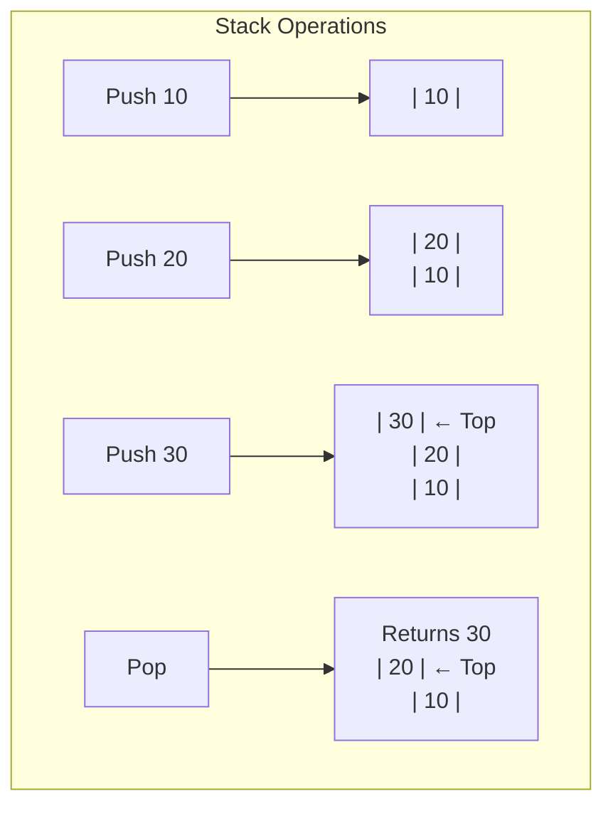

# 5. Stacks

## Table of Contents
- [5.1 Introduction](#51-introduction)
- [5.2 Array-Based Implementation](#52-array-based-implementation)
- [5.3 Linked List Implementation](#53-linked-list-implementation)
- [5.4 STL Stack](#54-stl-stack)
- [5.5 Applications](#55-applications)
- [5.6 Practice & Assessment](#56-practice--assessment)

---

## 5.1 Introduction

### Definition
A **Stack** is a linear data structure that follows **LIFO** (Last In, First Out) principle. The last element added is the first one to be removed.

Think of it like a stack of plates — you add to the top and remove from the top.



### Operations

| Operation | Description | Time |
|-----------|-------------|------|
| `push(x)` | Add element to top | O(1) |
| `pop()` | Remove top element | O(1) |
| `top()` / `peek()` | View top element | O(1) |
| `isEmpty()` | Check if stack is empty | O(1) |
| `size()` | Number of elements | O(1) |

---

## 5.2 Array-Based Implementation

```cpp
class Stack {
    int* arr;
    int topIdx;
    int capacity;
public:
    Stack(int cap) : capacity(cap), topIdx(-1) {
        arr = new int[capacity];
    }
    ~Stack() { delete[] arr; }
    
    void push(int x) {
        if (topIdx == capacity - 1) {
            cout << "Stack Overflow\n";
            return;
        }
        arr[++topIdx] = x;
    }
    
    int pop() {
        if (topIdx == -1) {
            cout << "Stack Underflow\n";
            return -1;
        }
        return arr[topIdx--];
    }
    
    int top() {
        if (topIdx == -1) return -1;
        return arr[topIdx];
    }
    
    bool isEmpty() { return topIdx == -1; }
    int size() { return topIdx + 1; }
};
```

---

## 5.3 Linked List Implementation

```cpp
struct Node {
    int data;
    Node* next;
    Node(int val) : data(val), next(nullptr) {}
};

class StackLL {
    Node* topNode;
    int sz;
public:
    StackLL() : topNode(nullptr), sz(0) {}
    
    void push(int x) {
        Node* node = new Node(x);
        node->next = topNode;
        topNode = node;
        sz++;
    }
    
    int pop() {
        if (!topNode) return -1;
        int val = topNode->data;
        Node* temp = topNode;
        topNode = topNode->next;
        delete temp;
        sz--;
        return val;
    }
    
    int top() { return topNode ? topNode->data : -1; }
    bool isEmpty() { return topNode == nullptr; }
    int size() { return sz; }
};
```

---

## 5.4 STL Stack

```cpp
#include <stack>
stack<int> st;

st.push(10);     // stack: [10]
st.push(20);     // stack: [10, 20]
st.push(30);     // stack: [10, 20, 30]

cout << st.top();  // 30
st.pop();          // stack: [10, 20]
cout << st.size(); // 2
cout << st.empty(); // 0 (false)
```

---

## 5.5 Applications

### 5.5.1 Balanced Parentheses

**Problem**: Check if brackets `()`, `{}`, `[]` are balanced.

```cpp
bool isValid(string s) {
    stack<char> st;
    for (char c : s) {
        if (c == '(' || c == '{' || c == '[') {
            st.push(c);
        } else {
            if (st.empty()) return false;
            char top = st.top();
            if ((c == ')' && top == '(') ||
                (c == '}' && top == '{') ||
                (c == ']' && top == '[')) {
                st.pop();
            } else {
                return false;
            }
        }
    }
    return st.empty();
}
```

**Examples:**
```
"(())" → true
"({[]})" → true
"(]" → false
"(()" → false
```

**Dry Run** for `"{[()]}`:

| Char | Stack | Action |
|------|-------|--------|
| `{` | `{` | Push |
| `[` | `{ [` | Push |
| `(` | `{ [ (` | Push |
| `)` | `{ [` | Match `(`, Pop |
| `]` | `{` | Match `[`, Pop |
| `}` | empty | Match `{`, Pop |
| End | empty | Return **true** |

### 5.5.2 Next Greater Element

**Problem**: For each element, find the next greater element to its right.

```cpp
vector<int> nextGreater(vector<int>& arr) {
    int n = arr.size();
    vector<int> result(n, -1);
    stack<int> st;  // stores indices
    
    for (int i = 0; i < n; i++) {
        while (!st.empty() && arr[st.top()] < arr[i]) {
            result[st.top()] = arr[i];
            st.pop();
        }
        st.push(i);
    }
    return result;
}
```

**Example**: `arr = {4, 5, 2, 25}`

| Element | Next Greater |
|---------|-------------|
| 4 | 5 |
| 5 | 25 |
| 2 | 25 |
| 25 | -1 |

**Output:** `{5, 25, 25, -1}`

**Dry Run:**

| i | arr[i] | Stack (values) | Action | Result |
|---|--------|---------------|--------|--------|
| 0 | 4 | [4] | Push 0 | [-1,-1,-1,-1] |
| 1 | 5 | [] → [5] | 5>4, pop 0, result[0]=5, push 1 | [5,-1,-1,-1] |
| 2 | 2 | [5, 2] | 2<5, push 2 | [5,-1,-1,-1] |
| 3 | 25 | [] → [25] | 25>2, pop 2, result[2]=25; 25>5, pop 1, result[1]=25; push 3 | [5,25,25,-1] |

### 5.5.3 Infix to Postfix Conversion

**Infix**: `A + B * C` → **Postfix**: `A B C * +`

**Algorithm:**
1. Scan left to right.
2. If operand → add to output.
3. If `(` → push to stack.
4. If `)` → pop and output until `(` is found.
5. If operator → pop operators with higher/equal precedence, then push.

```cpp
int precedence(char op) {
    if (op == '+' || op == '-') return 1;
    if (op == '*' || op == '/') return 2;
    if (op == '^') return 3;
    return 0;
}

string infixToPostfix(string infix) {
    string result;
    stack<char> st;
    
    for (char c : infix) {
        if (isalnum(c)) {
            result += c;
        } else if (c == '(') {
            st.push(c);
        } else if (c == ')') {
            while (!st.empty() && st.top() != '(') {
                result += st.top();
                st.pop();
            }
            st.pop();  // remove '('
        } else {
            // operator
            while (!st.empty() && precedence(st.top()) >= precedence(c)) {
                result += st.top();
                st.pop();
            }
            st.push(c);
        }
    }
    while (!st.empty()) {
        result += st.top();
        st.pop();
    }
    return result;
}
```

**Example**: `A*(B+C)-D`

| Char | Stack | Output | Action |
|------|-------|--------|--------|
| A | | A | Output operand |
| * | * | A | Push operator |
| ( | * ( | A | Push ( |
| B | * ( | AB | Output operand |
| + | * ( + | AB | Push operator |
| C | * ( + | ABC | Output operand |
| ) | * | ABC+ | Pop until ( |
| - | - | ABC+* | Pop *, push - |
| D | - | ABC+*D | Output operand |
| End | | ABC+*D- | Pop remaining |

**Result**: `ABC+*D-`

### 5.5.4 Evaluate Postfix Expression

```cpp
int evalPostfix(string expr) {
    stack<int> st;
    for (char c : expr) {
        if (isdigit(c)) {
            st.push(c - '0');
        } else {
            int b = st.top(); st.pop();
            int a = st.top(); st.pop();
            switch (c) {
                case '+': st.push(a + b); break;
                case '-': st.push(a - b); break;
                case '*': st.push(a * b); break;
                case '/': st.push(a / b); break;
            }
        }
    }
    return st.top();
}
// evalPostfix("23*5+") → 2*3+5 = 11
```

### 5.5.5 Min Stack

```cpp
class MinStack {
    stack<int> st;
    stack<int> minSt;
public:
    void push(int x) {
        st.push(x);
        if (minSt.empty() || x <= minSt.top())
            minSt.push(x);
    }
    
    void pop() {
        if (st.top() == minSt.top())
            minSt.pop();
        st.pop();
    }
    
    int top() { return st.top(); }
    int getMin() { return minSt.top(); }
};
```

### 5.5.6 Stock Span Problem

```cpp
vector<int> stockSpan(vector<int>& prices) {
    int n = prices.size();
    vector<int> span(n);
    stack<int> st;
    
    for (int i = 0; i < n; i++) {
        while (!st.empty() && prices[st.top()] <= prices[i])
            st.pop();
        span[i] = st.empty() ? (i + 1) : (i - st.top());
        st.push(i);
    }
    return span;
}
```

---

## 5.6 Practice & Assessment

### MCQs

**Q1.** A stack follows which principle?
- A) FIFO
- B) LIFO
- C) Random access
- D) Priority-based

**Answer:** B) LIFO

---

**Q2.** What is the postfix form of `A + B * C`?
- A) `AB+C*`
- B) `ABC*+`
- C) `+A*BC`
- D) `ABC+*`

**Answer:** B) `ABC*+` (multiply first due to precedence)

---

**Q3.** The time complexity of push and pop operations is:
- A) O(n)
- B) O(log n)
- C) O(1)
- D) O(n log n)

**Answer:** C) O(1)

---

**Q4.** What data structure is used internally by function call management?
- A) Queue
- B) Stack (call stack)
- C) Heap
- D) Array

**Answer:** B) Stack (call stack)

---

**Q5.** Which problem CANNOT be solved using a stack?
- A) Balanced parentheses
- B) BFS traversal
- C) Infix to postfix
- D) Next greater element

**Answer:** B) BFS traversal — BFS uses a queue.

---

### Output Prediction

**P1.**
```cpp
stack<int> st;
st.push(1); st.push(2); st.push(3);
cout << st.top() << " ";
st.pop();
cout << st.top() << "\n";
```
**Answer:** `3 2`

**P2.**
```cpp
cout << isValid("([)]") << "\n";
```
**Answer:** `0` (false — brackets are interleaved incorrectly)

**P3.**
```cpp
cout << evalPostfix("231*+9-") << "\n";
```
**Answer:** `231*+9-` → 2+(3*1)-9 = 2+3-9 = -4. **Answer: -4**

---

### Short-Answer Questions

1. **How does the call stack relate to recursion?**
2. **Explain the difference between stack overflow and underflow.**
3. **How can you implement a queue using two stacks?**
4. **What is monotonic stack? Give an example problem.**
5. **Why is stack useful for expression evaluation?**

---

### Coding Exercises

| # | Problem | Difficulty | Source |
|---|---------|-----------|--------|
| 1 | Valid Parentheses | Easy | [LeetCode 20](https://leetcode.com/problems/valid-parentheses/) |
| 2 | Min Stack | Medium | [LeetCode 155](https://leetcode.com/problems/min-stack/) |
| 3 | Next Greater Element I | Easy | [LeetCode 496](https://leetcode.com/problems/next-greater-element-i/) |
| 4 | Implement Queue using Stacks | Easy | [LeetCode 232](https://leetcode.com/problems/implement-queue-using-stacks/) |
| 5 | Daily Temperatures | Medium | [LeetCode 739](https://leetcode.com/problems/daily-temperatures/) |
| 6 | Evaluate Reverse Polish Notation | Medium | [LeetCode 150](https://leetcode.com/problems/evaluate-reverse-polish-notation/) |
| 7 | Largest Rectangle in Histogram | Hard | [LeetCode 84](https://leetcode.com/problems/largest-rectangle-in-histogram/) |
| 8 | Trapping Rain Water | Hard | [LeetCode 42](https://leetcode.com/problems/trapping-rain-water/) |
| 9 | Basic Calculator | Hard | [LeetCode 224](https://leetcode.com/problems/basic-calculator/) |
| 10 | Online Stock Span | Medium | [LeetCode 901](https://leetcode.com/problems/online-stock-span/) |

---

### Interview Questions

1. **How does a stack work internally? Explain with an array implementation.**
2. **How would you sort a stack using only another stack?**
3. **Explain the Next Greater Element problem and its stack-based solution.**
4. **How do you evaluate arithmetic expressions using stacks?**
5. **What is a monotonic stack? Name problems that use it.**
6. **How would you implement two stacks in one array?**
7. **Explain the relationship between stack and DFS.**
8. **How do you check for balanced parentheses with multiple bracket types?**
9. **What is the Largest Rectangle in Histogram problem? Explain the O(n) approach.**
10. **How would you design a stack that supports getMin() in O(1)?**

---

> **Next Topic**: [06 - Queues](06-queues.md)
