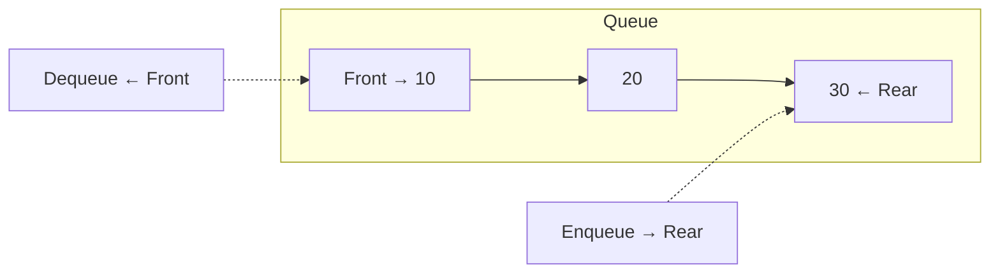
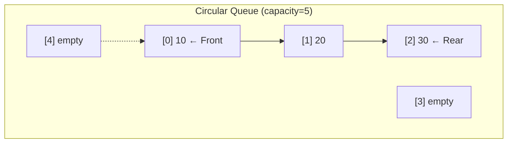

# 6. Queues

## Table of Contents
- [6.1 Introduction](#61-introduction)
- [6.2 Array-Based Implementation](#62-array-based-implementation)
- [6.3 Circular Queue](#63-circular-queue)
- [6.4 STL Queue & Deque](#64-stl-queue--deque)
- [6.5 Priority Queue](#65-priority-queue)
- [6.6 Applications](#66-applications)
- [6.7 Practice & Assessment](#67-practice--assessment)

---

## 6.1 Introduction

### Definition
A **Queue** is a linear data structure that follows **FIFO** (First In, First Out). Elements are added at the **rear** and removed from the **front**.

Think of a line at a ticket counter — first person in line gets served first.



### Operations

| Operation | Description | Time |
|-----------|-------------|------|
| `enqueue(x)` / `push(x)` | Add to rear | O(1) |
| `dequeue()` / `pop()` | Remove from front | O(1) |
| `front()` / `peek()` | View front element | O(1) |
| `isEmpty()` | Check if empty | O(1) |
| `size()` | Number of elements | O(1) |

---

## 6.2 Array-Based Implementation

```cpp
class Queue {
    int* arr;
    int frontIdx, rearIdx, sz, capacity;
public:
    Queue(int cap) : capacity(cap), frontIdx(0), rearIdx(-1), sz(0) {
        arr = new int[capacity];
    }
    ~Queue() { delete[] arr; }
    
    void enqueue(int x) {
        if (sz == capacity) { cout << "Queue Full\n"; return; }
        rearIdx = (rearIdx + 1) % capacity;
        arr[rearIdx] = x;
        sz++;
    }
    
    int dequeue() {
        if (sz == 0) { cout << "Queue Empty\n"; return -1; }
        int val = arr[frontIdx];
        frontIdx = (frontIdx + 1) % capacity;
        sz--;
        return val;
    }
    
    int front() { return sz > 0 ? arr[frontIdx] : -1; }
    bool isEmpty() { return sz == 0; }
    int size() { return sz; }
};
```

---

## 6.3 Circular Queue

### Why Circular?
In a simple array queue, after many enqueue/dequeue operations, the front moves forward, wasting space at the beginning. A **circular queue** wraps around.



The implementation above already uses `% capacity` for circular behavior.

```cpp
// Check if circular queue is full
bool isFull() { return sz == capacity; }

// Next index wraps around
int nextIdx(int i) { return (i + 1) % capacity; }
```

---

## 6.4 STL Queue & Deque

### `queue` — FIFO Queue

```cpp
#include <queue>
queue<int> q;

q.push(10);      // queue: [10]
q.push(20);      // queue: [10, 20]
q.push(30);      // queue: [10, 20, 30]

cout << q.front();  // 10
cout << q.back();   // 30
q.pop();            // removes 10, queue: [20, 30]
cout << q.size();   // 2
cout << q.empty();  // 0 (false)
```

### `deque` — Double-Ended Queue

Supports insertion/deletion at **both** ends in O(1).

```cpp
#include <deque>
deque<int> dq;

dq.push_back(10);   // [10]
dq.push_front(5);   // [5, 10]
dq.push_back(20);   // [5, 10, 20]

cout << dq.front();  // 5
cout << dq.back();   // 20
cout << dq[1];        // 10 (random access!)

dq.pop_front();      // [10, 20]
dq.pop_back();       // [10]
```

### Queue vs Deque vs Stack

| Feature | Stack | Queue | Deque |
|---------|-------|-------|-------|
| Order | LIFO | FIFO | Both ends |
| Insert front | ✗ | ✗ | O(1) |
| Insert back | O(1) | O(1) | O(1) |
| Remove front | ✗ | O(1) | O(1) |
| Remove back | O(1) | ✗ | O(1) |
| Random access | ✗ | ✗ | O(1) |

---

## 6.5 Priority Queue

### Definition
A **Priority Queue** always gives you the element with the highest (or lowest) priority. Internally implemented as a **heap**.

### STL `priority_queue`

```cpp
#include <queue>

// Max-heap (default) — largest element on top
priority_queue<int> maxPQ;
maxPQ.push(30);
maxPQ.push(10);
maxPQ.push(20);
cout << maxPQ.top();  // 30
maxPQ.pop();
cout << maxPQ.top();  // 20

// Min-heap — smallest element on top
priority_queue<int, vector<int>, greater<int>> minPQ;
minPQ.push(30);
minPQ.push(10);
minPQ.push(20);
cout << minPQ.top();  // 10
```

### Operations Complexity

| Operation | Time |
|-----------|------|
| `push(x)` | O(log n) |
| `pop()` | O(log n) |
| `top()` | O(1) |
| Build from array | O(n) |

### Custom Comparator

```cpp
// Min-heap of pairs by second element
auto cmp = [](pair<int,int>& a, pair<int,int>& b) {
    return a.second > b.second;  // min by second
};
priority_queue<pair<int,int>, vector<pair<int,int>>, decltype(cmp)> pq(cmp);

pq.push({1, 50});
pq.push({2, 30});
pq.push({3, 40});
cout << pq.top().first;  // 2 (has smallest second value: 30)
```

---

## 6.6 Applications

### 6.6.1 BFS (Level-Order Traversal)

Queues are essential for **Breadth-First Search**.

```cpp
// BFS on a binary tree
void levelOrder(TreeNode* root) {
    if (!root) return;
    queue<TreeNode*> q;
    q.push(root);
    while (!q.empty()) {
        int sz = q.size();
        for (int i = 0; i < sz; i++) {
            TreeNode* node = q.front(); q.pop();
            cout << node->val << " ";
            if (node->left) q.push(node->left);
            if (node->right) q.push(node->right);
        }
        cout << "\n";  // new line per level
    }
}
```

### 6.6.2 Sliding Window Maximum (Deque)

```cpp
vector<int> maxSlidingWindow(vector<int>& nums, int k) {
    deque<int> dq;  // stores indices of useful elements
    vector<int> result;
    
    for (int i = 0; i < nums.size(); i++) {
        // Remove elements outside window
        while (!dq.empty() && dq.front() <= i - k)
            dq.pop_front();
        
        // Remove smaller elements (they're useless)
        while (!dq.empty() && nums[dq.back()] <= nums[i])
            dq.pop_back();
        
        dq.push_back(i);
        
        if (i >= k - 1)
            result.push_back(nums[dq.front()]);
    }
    return result;
}
```

**Example**: `nums = {1,3,-1,-3,5,3,6,7}`, k = 3

| Window | Max |
|--------|-----|
| [1,3,-1] | 3 |
| [3,-1,-3] | 3 |
| [-1,-3,5] | 5 |
| [-3,5,3] | 5 |
| [5,3,6] | 6 |
| [3,6,7] | 7 |

**Output:** `{3, 3, 5, 5, 6, 7}`

### 6.6.3 Task Scheduling / Round Robin

```cpp
// Simulate round-robin scheduling
void roundRobin(vector<int>& tasks, int quantum) {
    queue<int> q;
    for (int t : tasks) q.push(t);
    
    int time = 0;
    while (!q.empty()) {
        int t = q.front(); q.pop();
        int run = min(t, quantum);
        time += run;
        t -= run;
        cout << "Time " << time << ": task remaining = " << t << "\n";
        if (t > 0) q.push(t);  // re-enqueue if not done
    }
}
```

### 6.6.4 Implement Stack Using Queues

```cpp
class StackUsingQueues {
    queue<int> q;
public:
    void push(int x) {
        q.push(x);
        // Rotate so newest element is at front
        for (int i = 0; i < q.size() - 1; i++) {
            q.push(q.front());
            q.pop();
        }
    }
    
    int pop() {
        int val = q.front();
        q.pop();
        return val;
    }
    
    int top() { return q.front(); }
    bool empty() { return q.empty(); }
};
```

---

## 6.7 Practice & Assessment

### MCQs

**Q1.** A queue follows which principle?
- A) LIFO
- B) FIFO
- C) Priority
- D) Random

**Answer:** B) FIFO

---

**Q2.** In C++ STL, `priority_queue<int>` is by default a:
- A) Min-heap
- B) Max-heap
- C) Sorted array
- D) BST

**Answer:** B) Max-heap

---

**Q3.** A deque supports:
- A) Insertion at front only
- B) Insertion at back only
- C) Insertion and deletion at both ends
- D) Random insertion

**Answer:** C) Insertion and deletion at both ends

---

**Q4.** What is the time complexity of `push` in a priority queue?
- A) O(1)
- B) O(n)
- C) O(log n)
- D) O(n log n)

**Answer:** C) O(log n)

---

**Q5.** Which data structure is used for BFS?
- A) Stack
- B) Queue
- C) Priority Queue
- D) Linked List

**Answer:** B) Queue

---

### Output Prediction

**P1.**
```cpp
queue<int> q;
q.push(1); q.push(2); q.push(3);
cout << q.front() << " ";
q.pop();
cout << q.front() << "\n";
```
**Answer:** `1 2`

**P2.**
```cpp
priority_queue<int> pq;
pq.push(5); pq.push(15); pq.push(10);
cout << pq.top() << " ";
pq.pop();
cout << pq.top() << "\n";
```
**Answer:** `15 10`

**P3.**
```cpp
deque<int> dq = {1, 2, 3};
dq.push_front(0);
dq.push_back(4);
dq.pop_front();
cout << dq.front() << " " << dq.back() << "\n";
```
**Answer:** `1 4`

---

### Short-Answer Questions

1. **What is the difference between a queue and a deque?**
2. **How is a priority queue implemented internally?**
3. **Explain circular queue and why it's needed.**
4. **How would you implement a queue using two stacks?**
5. **When would you use a min-heap vs a max-heap?**

---

### Coding Exercises

| # | Problem | Difficulty | Source |
|---|---------|-----------|--------|
| 1 | Implement Queue using Stacks | Easy | [LeetCode 232](https://leetcode.com/problems/implement-queue-using-stacks/) |
| 2 | Implement Stack using Queues | Easy | [LeetCode 225](https://leetcode.com/problems/implement-stack-using-queues/) |
| 3 | Design Circular Queue | Medium | [LeetCode 622](https://leetcode.com/problems/design-circular-queue/) |
| 4 | Number of Recent Calls | Easy | [LeetCode 933](https://leetcode.com/problems/number-of-recent-calls/) |
| 5 | Sliding Window Maximum | Hard | [LeetCode 239](https://leetcode.com/problems/sliding-window-maximum/) |
| 6 | Kth Largest Element in Stream | Easy | [LeetCode 703](https://leetcode.com/problems/kth-largest-element-in-a-stream/) |
| 7 | Top K Frequent Elements | Medium | [LeetCode 347](https://leetcode.com/problems/top-k-frequent-elements/) |
| 8 | Task Scheduler | Medium | [LeetCode 621](https://leetcode.com/problems/task-scheduler/) |
| 9 | Rotting Oranges | Medium | [LeetCode 994](https://leetcode.com/problems/rotting-oranges/) |
| 10 | Find Median from Data Stream | Hard | [LeetCode 295](https://leetcode.com/problems/find-median-from-data-stream/) |

---

### Interview Questions

1. **Explain the difference between a stack and a queue with real-world examples.**
2. **How would you implement a circular queue? What problems does it solve?**
3. **Explain priority queue and its applications.**
4. **How is a deque different from a queue? When would you use each?**
5. **How would you find the median of a stream of numbers?** (Two-heap approach)
6. **Explain BFS and why it uses a queue.**
7. **How would you design a task scheduler using a queue?**
8. **What is the sliding window maximum problem? Explain the deque solution.**
9. **Compare `queue`, `deque`, and `priority_queue` in C++ STL.**
10. **How would you implement a queue with O(1) push, pop, and getMin?**

---

> **Next Topic**: [07 - Trees](07-trees.md)
