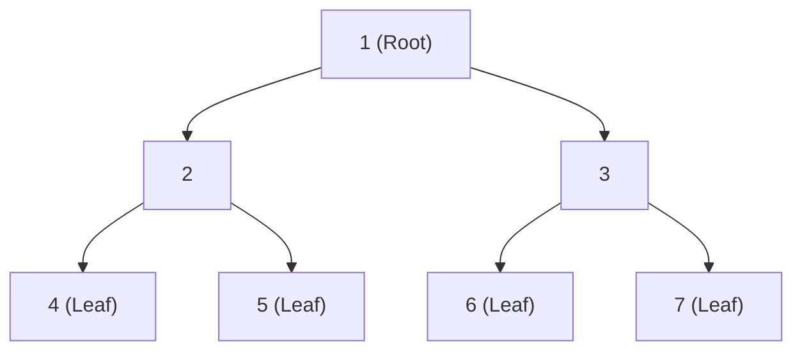
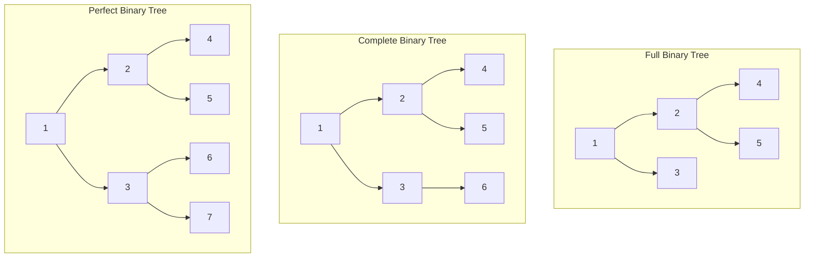
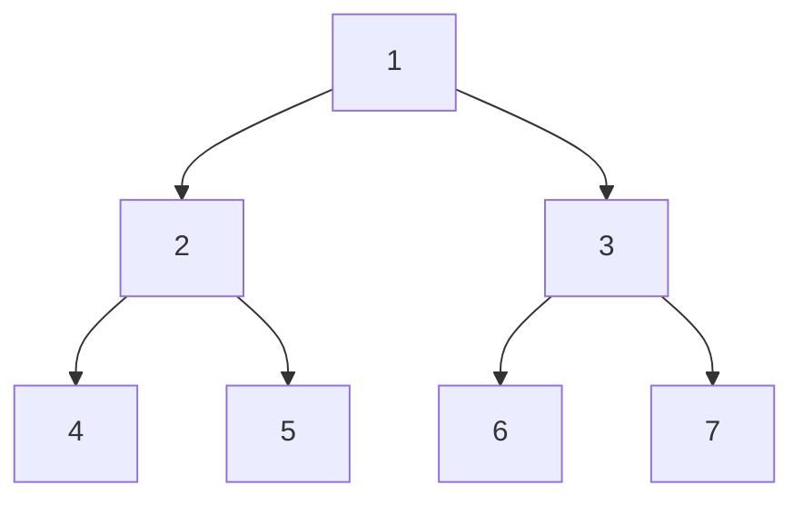
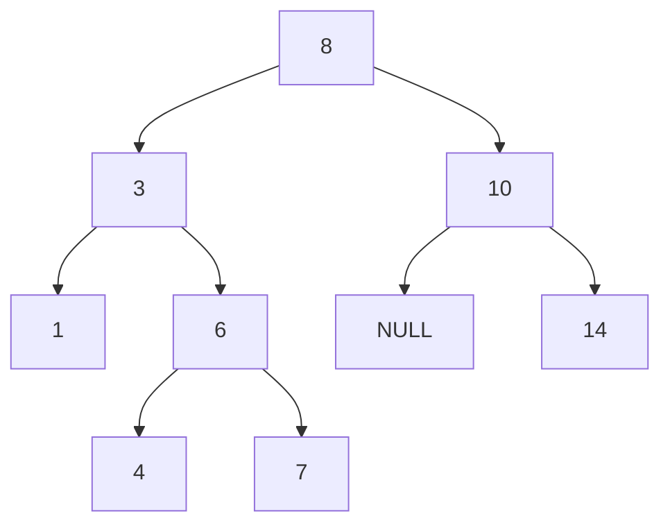
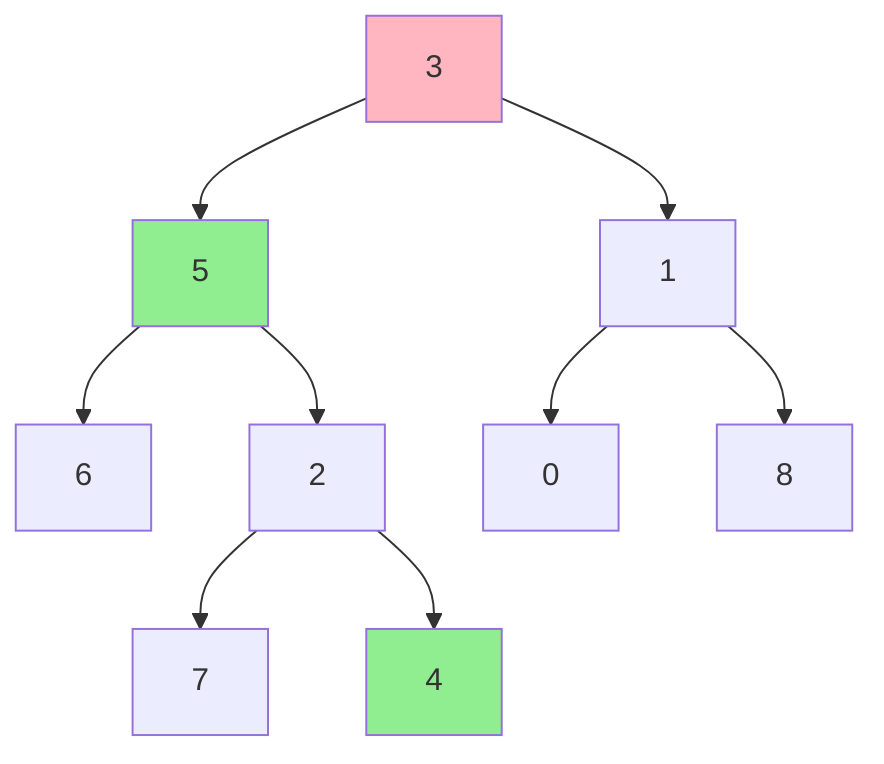

# 7. Trees

## Table of Contents
- [7.1 Introduction](#71-introduction)
- [7.2 Binary Tree Basics](#72-binary-tree-basics)
- [7.3 Tree Traversals](#73-tree-traversals)
- [7.4 Binary Search Tree (BST)](#74-binary-search-tree-bst)
- [7.5 Tree Properties](#75-tree-properties)
- [7.6 Lowest Common Ancestor (LCA)](#76-lowest-common-ancestor-lca)
- [7.7 Balanced Trees (Conceptual)](#77-balanced-trees-conceptual)
- [7.8 Practice & Assessment](#78-practice--assessment)

---

## 7.1 Introduction

### Definition
A **Tree** is a hierarchical data structure consisting of nodes connected by edges. It has:
- **Root**: The topmost node (no parent).
- **Children**: Nodes directly connected below a node.
- **Leaves**: Nodes with no children.
- **Height**: Longest path from root to a leaf.
- **Depth**: Distance from the root to a node.



### Terminology

| Term | Meaning |
|------|---------|
| Root | Top node, no parent |
| Parent | Node directly above |
| Child | Node directly below |
| Leaf | Node with no children |
| Height | Longest path from node to leaf |
| Depth | Distance from root to node |
| Subtree | A node and all its descendants |
| Degree | Number of children a node has |

---

## 7.2 Binary Tree Basics

### Definition
A **Binary Tree** is a tree where each node has **at most 2 children** (left and right).

### Node Structure

```cpp
struct TreeNode {
    int val;
    TreeNode* left;
    TreeNode* right;
    TreeNode(int x) : val(x), left(nullptr), right(nullptr) {}
};
```

### Types of Binary Trees



| Type | Definition |
|------|-----------|
| **Full** | Every node has 0 or 2 children |
| **Complete** | All levels full except possibly last (filled left to right) |
| **Perfect** | All internal nodes have 2 children, all leaves at same level |
| **Balanced** | Height difference between subtrees ≤ 1 |
| **Degenerate** | Each node has at most 1 child (like a linked list) |

---

## 7.3 Tree Traversals

### 7.3.1 Inorder (Left → Root → Right)

```cpp
void inorder(TreeNode* root) {
    if (!root) return;
    inorder(root->left);
    cout << root->val << " ";
    inorder(root->right);
}
```

### 7.3.2 Preorder (Root → Left → Right)

```cpp
void preorder(TreeNode* root) {
    if (!root) return;
    cout << root->val << " ";
    preorder(root->left);
    preorder(root->right);
}
```

### 7.3.3 Postorder (Left → Right → Root)

```cpp
void postorder(TreeNode* root) {
    if (!root) return;
    postorder(root->left);
    postorder(root->right);
    cout << root->val << " ";
}
```

### 7.3.4 Level Order (BFS)

```cpp
vector<vector<int>> levelOrder(TreeNode* root) {
    vector<vector<int>> result;
    if (!root) return result;
    queue<TreeNode*> q;
    q.push(root);
    while (!q.empty()) {
        int sz = q.size();
        vector<int> level;
        for (int i = 0; i < sz; i++) {
            TreeNode* node = q.front(); q.pop();
            level.push_back(node->val);
            if (node->left) q.push(node->left);
            if (node->right) q.push(node->right);
        }
        result.push_back(level);
    }
    return result;
}
```

### Traversal Example



| Traversal | Order | Result |
|-----------|-------|--------|
| Inorder | L → Root → R | 4, 2, 5, 1, 6, 3, 7 |
| Preorder | Root → L → R | 1, 2, 4, 5, 3, 6, 7 |
| Postorder | L → R → Root | 4, 5, 2, 6, 7, 3, 1 |
| Level Order | Level by level | 1, 2, 3, 4, 5, 6, 7 |

### Iterative Inorder (Using Stack)

```cpp
vector<int> inorderIterative(TreeNode* root) {
    vector<int> result;
    stack<TreeNode*> st;
    TreeNode* cur = root;
    while (cur || !st.empty()) {
        while (cur) {
            st.push(cur);
            cur = cur->left;
        }
        cur = st.top(); st.pop();
        result.push_back(cur->val);
        cur = cur->right;
    }
    return result;
}
```

---

## 7.4 Binary Search Tree (BST)

### Definition
A **BST** is a binary tree where for every node:
- All values in the **left subtree** are **less** than the node's value.
- All values in the **right subtree** are **greater** than the node's value.



**Property**: Inorder traversal of a BST gives a **sorted** sequence.  
Inorder of above: `1, 3, 4, 6, 7, 8, 10, 14`

### BST Search — O(h)

```cpp
TreeNode* search(TreeNode* root, int key) {
    if (!root || root->val == key) return root;
    if (key < root->val) return search(root->left, key);
    return search(root->right, key);
}
```

### BST Insert — O(h)

```cpp
TreeNode* insert(TreeNode* root, int key) {
    if (!root) return new TreeNode(key);
    if (key < root->val) root->left = insert(root->left, key);
    else if (key > root->val) root->right = insert(root->right, key);
    return root;
}
```

### BST Delete — O(h)

```cpp
TreeNode* findMin(TreeNode* root) {
    while (root->left) root = root->left;
    return root;
}

TreeNode* deleteNode(TreeNode* root, int key) {
    if (!root) return nullptr;
    if (key < root->val) {
        root->left = deleteNode(root->left, key);
    } else if (key > root->val) {
        root->right = deleteNode(root->right, key);
    } else {
        // Found the node to delete
        if (!root->left) {
            TreeNode* temp = root->right;
            delete root;
            return temp;
        }
        if (!root->right) {
            TreeNode* temp = root->left;
            delete root;
            return temp;
        }
        // Two children: replace with inorder successor
        TreeNode* successor = findMin(root->right);
        root->val = successor->val;
        root->right = deleteNode(root->right, successor->val);
    }
    return root;
}
```

### BST Operations Complexity

| Operation | Average | Worst (Skewed) |
|-----------|---------|---------------|
| Search | O(log n) | O(n) |
| Insert | O(log n) | O(n) |
| Delete | O(log n) | O(n) |

---

## 7.5 Tree Properties

### Height of a Tree

```cpp
int height(TreeNode* root) {
    if (!root) return -1;  // or 0 if counting nodes
    return 1 + max(height(root->left), height(root->right));
}
```

### Size (Number of Nodes)

```cpp
int size(TreeNode* root) {
    if (!root) return 0;
    return 1 + size(root->left) + size(root->right);
}
```

### Diameter (Longest Path Between Any Two Nodes)

```cpp
int diameter(TreeNode* root, int& ans) {
    if (!root) return 0;
    int left = diameter(root->left, ans);
    int right = diameter(root->right, ans);
    ans = max(ans, left + right);  // path through this node
    return 1 + max(left, right);   // height of subtree
}

int diameterOfBinaryTree(TreeNode* root) {
    int ans = 0;
    diameter(root, ans);
    return ans;
}
```

### Check if Balanced

```cpp
int checkBalanced(TreeNode* root) {
    if (!root) return 0;
    int left = checkBalanced(root->left);
    int right = checkBalanced(root->right);
    if (left == -1 || right == -1 || abs(left - right) > 1)
        return -1;  // not balanced
    return 1 + max(left, right);
}

bool isBalanced(TreeNode* root) {
    return checkBalanced(root) != -1;
}
```

### Check if Valid BST

```cpp
bool isValidBST(TreeNode* root, long lo = LONG_MIN, long hi = LONG_MAX) {
    if (!root) return true;
    if (root->val <= lo || root->val >= hi) return false;
    return isValidBST(root->left, lo, root->val) &&
           isValidBST(root->right, root->val, hi);
}
```

### Maximum Path Sum

```cpp
int maxPathHelper(TreeNode* root, int& maxSum) {
    if (!root) return 0;
    int left = max(0, maxPathHelper(root->left, maxSum));
    int right = max(0, maxPathHelper(root->right, maxSum));
    maxSum = max(maxSum, left + right + root->val);
    return root->val + max(left, right);
}

int maxPathSum(TreeNode* root) {
    int maxSum = INT_MIN;
    maxPathHelper(root, maxSum);
    return maxSum;
}
```

---

## 7.6 Lowest Common Ancestor (LCA)

### LCA in BST — O(h)

```cpp
TreeNode* lcaBST(TreeNode* root, TreeNode* p, TreeNode* q) {
    if (!root) return nullptr;
    if (p->val < root->val && q->val < root->val)
        return lcaBST(root->left, p, q);
    if (p->val > root->val && q->val > root->val)
        return lcaBST(root->right, p, q);
    return root;  // split point = LCA
}
```

### LCA in General Binary Tree — O(n)

```cpp
TreeNode* lcaGeneral(TreeNode* root, TreeNode* p, TreeNode* q) {
    if (!root || root == p || root == q) return root;
    TreeNode* left = lcaGeneral(root->left, p, q);
    TreeNode* right = lcaGeneral(root->right, p, q);
    if (left && right) return root;  // p and q in different subtrees
    return left ? left : right;
}
```



**Example**: LCA of 5 and 4 is **3** (marked in pink). Nodes 5 and 4 are in green.

---

## 7.7 Balanced Trees (Conceptual)

### AVL Tree
- Self-balancing BST.
- Balance factor (|height(left) - height(right)|) ≤ 1 for every node.
- Uses **rotations** to maintain balance after insert/delete.
- All operations O(log n) guaranteed.

### Red-Black Tree
- Self-balancing BST with color properties (red/black nodes).
- Less strictly balanced than AVL but fewer rotations.
- Used in C++ STL `map`, `set`, `multimap`, `multiset`.
- All operations O(log n) guaranteed.

### Comparison

| Feature | AVL | Red-Black |
|---------|-----|-----------|
| Balance | Strictly balanced | Approximately balanced |
| Search | Slightly faster | Slightly slower |
| Insert/Delete | More rotations | Fewer rotations |
| Use case | Read-heavy | Write-heavy, STL containers |

---

## 7.8 Practice & Assessment

### MCQs

**Q1.** Inorder traversal of a BST gives:
- A) Random order
- B) Sorted ascending order
- C) Sorted descending order
- D) Level-order

**Answer:** B) Sorted ascending order

---

**Q2.** The height of a balanced binary tree with n nodes is:
- A) O(n)
- B) O(n²)
- C) O(log n)
- D) O(1)

**Answer:** C) O(log n)

---

**Q3.** In a BST, which traversal gives sorted order?
- A) Preorder
- B) Postorder
- C) Inorder
- D) Level order

**Answer:** C) Inorder

---

**Q4.** The worst-case time complexity of search in a BST is:
- A) O(1)
- B) O(log n)
- C) O(n)
- D) O(n²)

**Answer:** C) O(n) — when the tree is skewed (like a linked list)

---

**Q5.** What is the maximum number of nodes in a binary tree of height h?
- A) h
- B) 2h
- C) 2^(h+1) - 1
- D) h²

**Answer:** C) 2^(h+1) - 1

---

**Q6.** LCA of two nodes in a BST can be found in:
- A) O(n)
- B) O(log n) average
- C) O(n²)
- D) O(1)

**Answer:** B) O(log n) on average (O(h))

---

### Output Prediction

**P1.** Given this tree, what is the preorder traversal?
```
        1
       / \
      2   3
     / \
    4   5
```
**Answer:** `1 2 4 5 3`

**P2.** Given BST: insert 5, 3, 7, 2, 4, 6, 8. What is the inorder?
**Answer:** `2 3 4 5 6 7 8`

**P3.** What does `height(root)` return for a single node?
**Answer:** `0` (if counting edges) or `1` (if counting nodes — depends on implementation)

---

### Short-Answer Questions

1. **What is the difference between a binary tree and a BST?**
2. **Explain the three main DFS traversals with examples.**
3. **How do you determine if a binary tree is balanced?**
4. **What is the diameter of a binary tree?**
5. **Explain LCA. How does the approach differ for BST vs general tree?**

---

### Coding Exercises

| # | Problem | Difficulty | Source |
|---|---------|-----------|--------|
| 1 | Maximum Depth of Binary Tree | Easy | [LeetCode 104](https://leetcode.com/problems/maximum-depth-of-binary-tree/) |
| 2 | Invert Binary Tree | Easy | [LeetCode 226](https://leetcode.com/problems/invert-binary-tree/) |
| 3 | Symmetric Tree | Easy | [LeetCode 101](https://leetcode.com/problems/symmetric-tree/) |
| 4 | Level Order Traversal | Medium | [LeetCode 102](https://leetcode.com/problems/binary-tree-level-order-traversal/) |
| 5 | Validate BST | Medium | [LeetCode 98](https://leetcode.com/problems/validate-binary-search-tree/) |
| 6 | LCA of BST | Medium | [LeetCode 235](https://leetcode.com/problems/lowest-common-ancestor-of-a-binary-search-tree/) |
| 7 | LCA of Binary Tree | Medium | [LeetCode 236](https://leetcode.com/problems/lowest-common-ancestor-of-a-binary-tree/) |
| 8 | Diameter of Binary Tree | Easy | [LeetCode 543](https://leetcode.com/problems/diameter-of-binary-tree/) |
| 9 | Construct Tree from Preorder & Inorder | Medium | [LeetCode 105](https://leetcode.com/problems/construct-binary-tree-from-preorder-and-inorder-traversal/) |
| 10 | Kth Smallest in BST | Medium | [LeetCode 230](https://leetcode.com/problems/kth-smallest-element-in-a-bst/) |
| 11 | Binary Tree Right Side View | Medium | [LeetCode 199](https://leetcode.com/problems/binary-tree-right-side-view/) |
| 12 | Serialize and Deserialize Tree | Hard | [LeetCode 297](https://leetcode.com/problems/serialize-and-deserialize-binary-tree/) |

---

### Interview Questions

1. **What are the different types of binary trees?**
2. **Explain all four tree traversals. When would you use each?**
3. **How do you check if a binary tree is a valid BST?**
4. **What is the time complexity of BST operations? When is it worst?**
5. **How do you find the LCA of two nodes?**
6. **What is the difference between AVL tree and Red-Black tree?**
7. **How do you find the diameter of a binary tree?**
8. **How do you serialize and deserialize a binary tree?**
9. **How would you convert a sorted array to a balanced BST?**
10. **Explain Morris traversal (inorder without stack/recursion).**

---

> **Next Topic**: [08 - Heaps](08-heaps.md)
