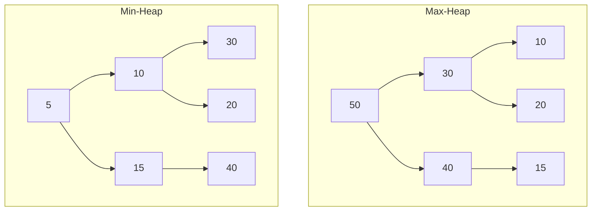
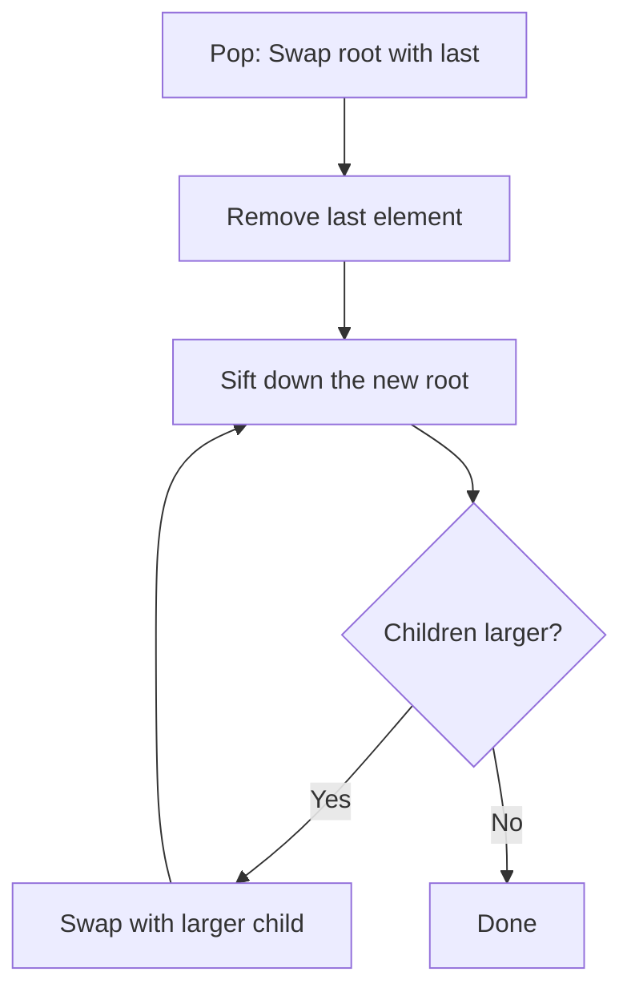

# 8. Heaps (Priority Queues)

## Table of Contents
- [8.1 Introduction](#81-introduction)
- [8.2 Heap Representation](#82-heap-representation)
- [8.3 Heap Operations](#83-heap-operations)
- [8.4 Build Heap](#84-build-heap)
- [8.5 Heap Sort](#85-heap-sort)
- [8.6 C++ STL Priority Queue](#86-c-stl-priority-queue)
- [8.7 Practice & Assessment](#87-practice--assessment)

---

## 8.1 Introduction

### Definition
A **Heap** is a complete binary tree that satisfies the **heap property**:
- **Max-Heap**: Every parent is **greater than or equal to** its children.
- **Min-Heap**: Every parent is **less than or equal to** its children.



### Key Properties
- **Complete binary tree** → stored efficiently in an array.
- **Root** is always max (max-heap) or min (min-heap).
- Height = O(log n).

---

## 8.2 Heap Representation

A heap is stored as an **array** where for node at index `i`:
- **Parent**: `(i - 1) / 2`
- **Left child**: `2 * i + 1`
- **Right child**: `2 * i + 2`

```
Array: [50, 30, 40, 10, 20, 15]
Index:   0   1   2   3   4   5

Tree representation:
        50 (0)
       /      \
    30 (1)   40 (2)
   /    \    /
 10(3) 20(4) 15(5)
```

---

## 8.3 Heap Operations

### Insert (Push) — O(log n)

**Steps**: Add at end, then **sift up** (bubble up) to restore heap property.

```cpp
class MaxHeap {
    vector<int> heap;
    
    void siftUp(int i) {
        while (i > 0 && heap[i] > heap[(i - 1) / 2]) {
            swap(heap[i], heap[(i - 1) / 2]);
            i = (i - 1) / 2;
        }
    }
    
    void siftDown(int i) {
        int n = heap.size();
        while (true) {
            int largest = i;
            int left = 2 * i + 1, right = 2 * i + 2;
            if (left < n && heap[left] > heap[largest]) largest = left;
            if (right < n && heap[right] > heap[largest]) largest = right;
            if (largest == i) break;
            swap(heap[i], heap[largest]);
            i = largest;
        }
    }
    
public:
    void push(int val) {
        heap.push_back(val);
        siftUp(heap.size() - 1);
    }
    
    int top() { return heap[0]; }
    
    void pop() {
        heap[0] = heap.back();
        heap.pop_back();
        if (!heap.empty()) siftDown(0);
    }
    
    int size() { return heap.size(); }
    bool empty() { return heap.empty(); }
};
```

### Extract Max/Min (Pop) — O(log n)

**Steps**: Replace root with last element, remove last, then **sift down** to restore heap property.



### Peek (Top) — O(1)

Simply return `heap[0]`.

---

## 8.4 Build Heap

### Method 1: Insert One by One — O(n log n)

```cpp
MaxHeap h;
vector<int> arr = {3, 1, 6, 5, 2, 4};
for (int x : arr) h.push(x);
```

### Method 2: Heapify (Bottom-Up) — O(n) ✓ Better!

```cpp
void buildHeap(vector<int>& arr) {
    int n = arr.size();
    // Start from the last non-leaf node
    for (int i = n / 2 - 1; i >= 0; i--) {
        heapify(arr, n, i);
    }
}

void heapify(vector<int>& arr, int n, int i) {
    int largest = i;
    int left = 2 * i + 1, right = 2 * i + 2;
    if (left < n && arr[left] > arr[largest]) largest = left;
    if (right < n && arr[right] > arr[largest]) largest = right;
    if (largest != i) {
        swap(arr[i], arr[largest]);
        heapify(arr, n, largest);
    }
}
```

> **Why O(n)?** Most nodes are near the bottom and need few swaps. Mathematical proof shows the total work is O(n).

---

## 8.5 Heap Sort

### Algorithm
1. Build a max-heap from the array.
2. Repeatedly extract the max (swap with last unsorted element) and heapify.

```cpp
void heapSort(vector<int>& arr) {
    int n = arr.size();
    
    // Build max-heap
    for (int i = n / 2 - 1; i >= 0; i--)
        heapify(arr, n, i);
    
    // Extract elements one by one
    for (int i = n - 1; i > 0; i--) {
        swap(arr[0], arr[i]);    // Move max to end
        heapify(arr, i, 0);     // Heapify reduced heap
    }
}
```

**Example**: `arr = {4, 10, 3, 5, 1}`

```
Build heap: [10, 5, 3, 4, 1]
Swap 10↔1:  [1, 5, 3, 4, | 10]  → heapify → [5, 4, 3, 1, | 10]
Swap 5↔1:   [1, 4, 3, | 5, 10]  → heapify → [4, 1, 3, | 5, 10]
Swap 4↔3:   [3, 1, | 4, 5, 10]  → heapify → [3, 1, | 4, 5, 10]
Swap 3↔1:   [1, | 3, 4, 5, 10]  → done
Result:     [1, 3, 4, 5, 10]
```

### Complexity

| Case | Time | Space |
|------|------|-------|
| Best | O(n log n) | O(1) |
| Average | O(n log n) | O(1) |
| Worst | O(n log n) | O(1) |

> **Advantage**: O(1) extra space (in-place). **Disadvantage**: Not stable.

---

## 8.6 C++ STL Priority Queue

```cpp
#include <queue>

// Max-heap (default)
priority_queue<int> maxPQ;
maxPQ.push(10);
maxPQ.push(30);
maxPQ.push(20);
cout << maxPQ.top() << "\n";  // 30

// Min-heap
priority_queue<int, vector<int>, greater<int>> minPQ;
minPQ.push(10);
minPQ.push(30);
minPQ.push(20);
cout << minPQ.top() << "\n";  // 10

// Build from vector — O(n)
vector<int> v = {5, 3, 8, 1, 2};
priority_queue<int> pq(v.begin(), v.end());
```

### Common Patterns

#### K Largest Elements

```cpp
// Find k largest elements using min-heap of size k — O(n log k)
vector<int> kLargest(vector<int>& arr, int k) {
    priority_queue<int, vector<int>, greater<int>> minPQ;
    for (int x : arr) {
        minPQ.push(x);
        if (minPQ.size() > k) minPQ.pop();
    }
    vector<int> result;
    while (!minPQ.empty()) {
        result.push_back(minPQ.top());
        minPQ.pop();
    }
    return result;
}
```

#### Merge K Sorted Arrays

```cpp
vector<int> mergeKSorted(vector<vector<int>>& arrays) {
    // {value, array_index, element_index}
    priority_queue<tuple<int,int,int>, vector<tuple<int,int,int>>, 
                   greater<tuple<int,int,int>>> pq;
    
    for (int i = 0; i < arrays.size(); i++)
        if (!arrays[i].empty())
            pq.push({arrays[i][0], i, 0});
    
    vector<int> result;
    while (!pq.empty()) {
        auto [val, ai, ei] = pq.top(); pq.pop();
        result.push_back(val);
        if (ei + 1 < arrays[ai].size())
            pq.push({arrays[ai][ei + 1], ai, ei + 1});
    }
    return result;
}
```

---

## 8.7 Practice & Assessment

### MCQs

**Q1.** A max-heap is a complete binary tree where:
- A) Parent ≤ children
- B) Parent ≥ children
- C) Left child < right child
- D) All leaves are at the same level

**Answer:** B) Parent ≥ children

---

**Q2.** Time complexity of building a heap from an array:
- A) O(n²)
- B) O(n log n)
- C) O(n)
- D) O(log n)

**Answer:** C) O(n) using bottom-up heapify

---

**Q3.** Heap sort is:
- A) Stable and in-place
- B) Unstable and in-place
- C) Stable and not in-place
- D) Unstable and not in-place

**Answer:** B) Unstable and in-place

---

**Q4.** What is stored at index 0 of a max-heap?
- A) Minimum element
- B) Maximum element
- C) Median element
- D) Random element

**Answer:** B) Maximum element

---

**Q5.** The parent of node at index `i` in an array-based heap is at:
- A) `i / 2`
- B) `(i - 1) / 2`
- C) `2 * i`
- D) `2 * i + 1`

**Answer:** B) `(i - 1) / 2` (for 0-indexed)

---

### Output Prediction

**P1.**
```cpp
priority_queue<int> pq;
pq.push(5); pq.push(1); pq.push(3);
cout << pq.top() << " ";
pq.pop();
pq.push(4);
cout << pq.top() << "\n";
```
**Answer:** `5 4`

**P2.** After inserting {10, 20, 5, 30, 15} into a max-heap, what is the root?
**Answer:** `30`

---

### Coding Exercises

| # | Problem | Difficulty | Source |
|---|---------|-----------|--------|
| 1 | Kth Largest Element | Medium | [LeetCode 215](https://leetcode.com/problems/kth-largest-element-in-an-array/) |
| 2 | Top K Frequent Elements | Medium | [LeetCode 347](https://leetcode.com/problems/top-k-frequent-elements/) |
| 3 | Merge K Sorted Lists | Hard | [LeetCode 23](https://leetcode.com/problems/merge-k-sorted-lists/) |
| 4 | Find Median from Data Stream | Hard | [LeetCode 295](https://leetcode.com/problems/find-median-from-data-stream/) |
| 5 | Last Stone Weight | Easy | [LeetCode 1046](https://leetcode.com/problems/last-stone-weight/) |
| 6 | K Closest Points to Origin | Medium | [LeetCode 973](https://leetcode.com/problems/k-closest-points-to-origin/) |
| 7 | Sort Characters By Frequency | Medium | [LeetCode 451](https://leetcode.com/problems/sort-characters-by-frequency/) |
| 8 | Reorganize String | Medium | [LeetCode 767](https://leetcode.com/problems/reorganize-string/) |
| 9 | Kth Smallest in Sorted Matrix | Medium | [LeetCode 378](https://leetcode.com/problems/kth-smallest-element-in-a-sorted-matrix/) |
| 10 | Ugly Number II | Medium | [LeetCode 264](https://leetcode.com/problems/ugly-number-ii/) |

---

### Interview Questions

1. **What is a heap? What are its types?**
2. **How is a heap stored in an array?**
3. **Explain the difference between insert and heapify.**
4. **What is the time complexity of building a heap and why is it O(n)?**
5. **Explain heap sort step by step.**
6. **How do you find the Kth largest element using a heap?**
7. **How would you merge K sorted arrays using a heap?**
8. **What is the difference between a heap and a BST?**
9. **How would you find the median from a data stream?**
10. **When would you use a min-heap vs a max-heap?**

---

> **Next Topic**: [09 - Hashing](09-hashing.md)
