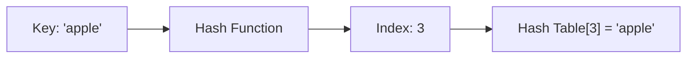
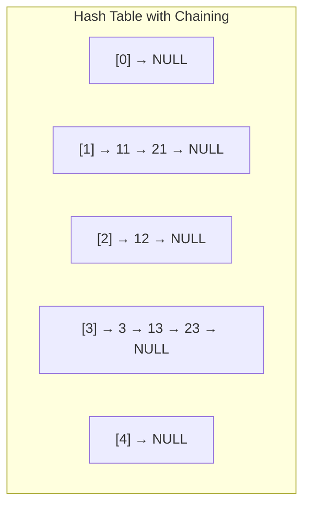

# 9. Hashing

## Table of Contents
- [9.1 Introduction](#91-introduction)
- [9.2 Hash Functions](#92-hash-functions)
- [9.3 Collision Resolution](#93-collision-resolution)
- [9.4 C++ STL Hash Containers](#94-c-stl-hash-containers)
- [9.5 Common Problems](#95-common-problems)
- [9.6 Practice & Assessment](#96-practice--assessment)

---

## 9.1 Introduction

### Definition
**Hashing** is a technique that maps keys to indices in an array (hash table) using a **hash function**. It provides **O(1) average** time for search, insert, and delete.

### How It Works



### Hash Table = Array + Hash Function

```
Key       → Hash Function → Index → Store in array
"apple"   → h("apple")    → 3     → table[3] = "apple"
"banana"  → h("banana")   → 7     → table[7] = "banana"
"cherry"  → h("cherry")   → 3     → COLLISION!
```

### Operations Complexity

| Operation | Average | Worst |
|-----------|---------|-------|
| Search | O(1) | O(n) |
| Insert | O(1) | O(n) |
| Delete | O(1) | O(n) |

> Worst case O(n) happens when all keys hash to the same index (many collisions).

---

## 9.2 Hash Functions

### Simple Hash Function (for integers)

```cpp
int hashFunc(int key, int tableSize) {
    return key % tableSize;
}
```

### For Strings

```cpp
int hashString(string key, int tableSize) {
    long long hash = 0;
    for (char c : key) {
        hash = (hash * 31 + c) % tableSize;
    }
    return hash;
}
```

### Properties of a Good Hash Function
1. **Deterministic**: Same input → same output.
2. **Uniform distribution**: Spreads keys evenly across the table.
3. **Fast to compute**: O(key length).
4. **Minimize collisions**: Different keys → different indices (as much as possible).

### Common Hash Functions

| Method | Formula | Notes |
|--------|---------|-------|
| Division | `key % m` | m should be prime |
| Multiplication | `⌊m × (key × A mod 1)⌋` | A ≈ 0.6180 (golden ratio) |
| Polynomial rolling | `Σ(s[i] × p^i) % m` | Good for strings |

---

## 9.3 Collision Resolution

### 9.3.1 Chaining (Separate Chaining)

Each slot holds a **linked list** of all elements that hash to that index.



```cpp
class HashTableChaining {
    int size;
    vector<list<pair<int,int>>> table;  // key-value pairs
    
    int hash(int key) { return key % size; }
    
public:
    HashTableChaining(int sz) : size(sz), table(sz) {}
    
    void insert(int key, int val) {
        int idx = hash(key);
        for (auto& p : table[idx]) {
            if (p.first == key) { p.second = val; return; }
        }
        table[idx].push_back({key, val});
    }
    
    int get(int key) {
        int idx = hash(key);
        for (auto& p : table[idx]) {
            if (p.first == key) return p.second;
        }
        return -1;  // not found
    }
    
    void remove(int key) {
        int idx = hash(key);
        table[idx].remove_if([key](pair<int,int>& p) {
            return p.first == key;
        });
    }
};
```

### 9.3.2 Open Addressing

All elements stored in the table itself. On collision, **probe** for next available slot.

**Linear Probing**: Try index+1, index+2, ...

```cpp
class HashTableLinear {
    int size;
    vector<int> table;
    vector<bool> occupied;
    
    int hash(int key) { return key % size; }
    
public:
    HashTableLinear(int sz) : size(sz), table(sz, -1), occupied(sz, false) {}
    
    void insert(int key) {
        int idx = hash(key);
        while (occupied[idx]) {
            idx = (idx + 1) % size;  // linear probing
        }
        table[idx] = key;
        occupied[idx] = true;
    }
    
    bool search(int key) {
        int idx = hash(key);
        int start = idx;
        while (occupied[idx]) {
            if (table[idx] == key) return true;
            idx = (idx + 1) % size;
            if (idx == start) break;
        }
        return false;
    }
};
```

**Quadratic Probing**: Try index+1², index+2², index+3², ...

**Double Hashing**: Use a second hash function: `idx = (h1(key) + i * h2(key)) % m`

### Comparison

| Method | Pros | Cons |
|--------|------|------|
| Chaining | Simple, handles high load | Extra memory for pointers |
| Linear Probing | Cache-friendly | Clustering problem |
| Quadratic Probing | Less clustering | May not find empty slot |
| Double Hashing | Best distribution | Two hash functions needed |

---

## 9.4 C++ STL Hash Containers

### `unordered_map` — Hash Map

```cpp
#include <unordered_map>
unordered_map<string, int> mp;

// Insert
mp["apple"] = 5;
mp["banana"] = 3;
mp.insert({"cherry", 7});

// Access
cout << mp["apple"] << "\n";  // 5

// Check existence
if (mp.count("banana")) cout << "Found\n";
if (mp.find("grape") == mp.end()) cout << "Not found\n";

// Iterate
for (auto& [key, val] : mp) {
    cout << key << ": " << val << "\n";
}

// Erase
mp.erase("banana");

// Size
cout << mp.size() << "\n";
```

### `unordered_set` — Hash Set

```cpp
#include <unordered_set>
unordered_set<int> s;

s.insert(10);
s.insert(20);
s.insert(10);  // duplicate ignored
cout << s.size() << "\n";  // 2
cout << s.count(10) << "\n";  // 1 (exists)
s.erase(10);
```

### `map` vs `unordered_map`

| Feature | `map` | `unordered_map` |
|---------|-------|-----------------|
| Implementation | Red-Black Tree | Hash Table |
| Order | Sorted by key | No order |
| Search | O(log n) | O(1) average |
| Insert | O(log n) | O(1) average |
| Worst case | O(log n) | O(n) |
| Memory | Less | More |
| Use when | Need sorted keys | Need fast lookup |

---

## 9.5 Common Problems

### 9.5.1 Frequency Counting

```cpp
void countFrequency(vector<int>& arr) {
    unordered_map<int, int> freq;
    for (int x : arr) freq[x]++;
    for (auto& [val, cnt] : freq)
        cout << val << " appears " << cnt << " times\n";
}
// arr = {1, 2, 1, 3, 2, 1}
// Output: 1 appears 3 times, 2 appears 2 times, 3 appears 1 times
```

### 9.5.2 Two Sum (Hash Map Approach)

```cpp
vector<int> twoSum(vector<int>& nums, int target) {
    unordered_map<int, int> mp;  // value → index
    for (int i = 0; i < nums.size(); i++) {
        int complement = target - nums[i];
        if (mp.count(complement))
            return {mp[complement], i};
        mp[nums[i]] = i;
    }
    return {};
}
```

**Dry Run**: `nums = {2, 7, 11, 15}`, target = 9

| i | nums[i] | complement | map | Result |
|---|---------|-----------|-----|--------|
| 0 | 2 | 7 | {2:0} | — |
| 1 | 7 | 2 | found 2→0 | return {0, 1} |

### 9.5.3 First Non-Repeating Character

```cpp
char firstUnique(string s) {
    unordered_map<char, int> freq;
    for (char c : s) freq[c]++;
    for (char c : s)
        if (freq[c] == 1) return c;
    return '_';  // no unique char
}
// firstUnique("leetcode") → 'l'
```

### 9.5.4 Group Anagrams

```cpp
vector<vector<string>> groupAnagrams(vector<string>& strs) {
    unordered_map<string, vector<string>> mp;
    for (string& s : strs) {
        string key = s;
        sort(key.begin(), key.end());
        mp[key].push_back(s);
    }
    vector<vector<string>> result;
    for (auto& [key, group] : mp)
        result.push_back(group);
    return result;
}
```

### 9.5.5 Longest Consecutive Sequence

```cpp
int longestConsecutive(vector<int>& nums) {
    unordered_set<int> s(nums.begin(), nums.end());
    int maxLen = 0;
    for (int n : s) {
        if (!s.count(n - 1)) {  // start of a sequence
            int len = 1;
            while (s.count(n + len)) len++;
            maxLen = max(maxLen, len);
        }
    }
    return maxLen;
}
// nums = {100, 4, 200, 1, 3, 2} → 4 (sequence: 1, 2, 3, 4)
```

### 9.5.6 Subarray Sum Equals K

```cpp
int subarraySum(vector<int>& nums, int k) {
    unordered_map<int, int> prefixCount;
    prefixCount[0] = 1;
    int sum = 0, count = 0;
    for (int n : nums) {
        sum += n;
        if (prefixCount.count(sum - k))
            count += prefixCount[sum - k];
        prefixCount[sum]++;
    }
    return count;
}
```

---

## 9.6 Practice & Assessment

### MCQs

**Q1.** The average time complexity of search in a hash table is:
- A) O(n)
- B) O(log n)
- C) O(1)
- D) O(n log n)

**Answer:** C) O(1)

---

**Q2.** Collision in a hash table occurs when:
- A) Two keys have the same value
- B) Two different keys hash to the same index
- C) The hash table is full
- D) A key is deleted

**Answer:** B) Two different keys hash to the same index

---

**Q3.** `unordered_map` in C++ is implemented using:
- A) BST
- B) Array
- C) Hash table
- D) Linked list

**Answer:** C) Hash table

---

**Q4.** Which collision resolution technique uses linked lists?
- A) Linear probing
- B) Quadratic probing
- C) Separate chaining
- D) Double hashing

**Answer:** C) Separate chaining

---

**Q5.** The load factor of a hash table is:
- A) Number of elements / table size
- B) Table size / number of elements
- C) Number of collisions
- D) Hash function output

**Answer:** A) Number of elements / table size

---

### Output Prediction

**P1.**
```cpp
unordered_map<string, int> mp;
mp["a"] = 1; mp["b"] = 2; mp["a"] = 3;
cout << mp["a"] << " " << mp.size() << "\n";
```
**Answer:** `3 2` (key "a" updated, size is 2)

**P2.**
```cpp
unordered_set<int> s = {1, 2, 3, 2, 1};
cout << s.size() << "\n";
```
**Answer:** `3` (duplicates ignored)

---

### Short-Answer Questions

1. **What is a hash function? What makes a good one?**
2. **Explain chaining vs open addressing.**
3. **What is the load factor and why does it matter?**
4. **When would you use `map` vs `unordered_map`?**
5. **How does the Two Sum problem use hashing?**

---

### Coding Exercises

| # | Problem | Difficulty | Source |
|---|---------|-----------|--------|
| 1 | Two Sum | Easy | [LeetCode 1](https://leetcode.com/problems/two-sum/) |
| 2 | Valid Anagram | Easy | [LeetCode 242](https://leetcode.com/problems/valid-anagram/) |
| 3 | First Unique Character | Easy | [LeetCode 387](https://leetcode.com/problems/first-unique-character-in-a-string/) |
| 4 | Group Anagrams | Medium | [LeetCode 49](https://leetcode.com/problems/group-anagrams/) |
| 5 | Longest Consecutive Sequence | Medium | [LeetCode 128](https://leetcode.com/problems/longest-consecutive-sequence/) |
| 6 | Subarray Sum Equals K | Medium | [LeetCode 560](https://leetcode.com/problems/subarray-sum-equals-k/) |
| 7 | Top K Frequent Elements | Medium | [LeetCode 347](https://leetcode.com/problems/top-k-frequent-elements/) |
| 8 | Contains Duplicate II | Easy | [LeetCode 219](https://leetcode.com/problems/contains-duplicate-ii/) |
| 9 | 4Sum II | Medium | [LeetCode 454](https://leetcode.com/problems/4sum-ii/) |
| 10 | Design HashMap | Easy | [LeetCode 706](https://leetcode.com/problems/design-hashmap/) |

---

### Interview Questions

1. **Explain hashing and its advantages over other data structures.**
2. **What is a collision? How do you resolve it?**
3. **Compare chaining and open addressing.**
4. **What is the worst-case scenario for a hash table?**
5. **How does `unordered_map` work internally in C++?**
6. **When would you choose `map` over `unordered_map`?**
7. **How do you handle hash collisions in a real-world system?**
8. **What is consistent hashing?**
9. **How would you design a hash function for strings?**
10. **Explain the Two Sum problem and its O(n) solution using hashing.**

---

> **Next Topic**: [10 - Graphs](10-graphs.md)
