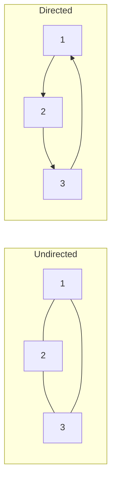
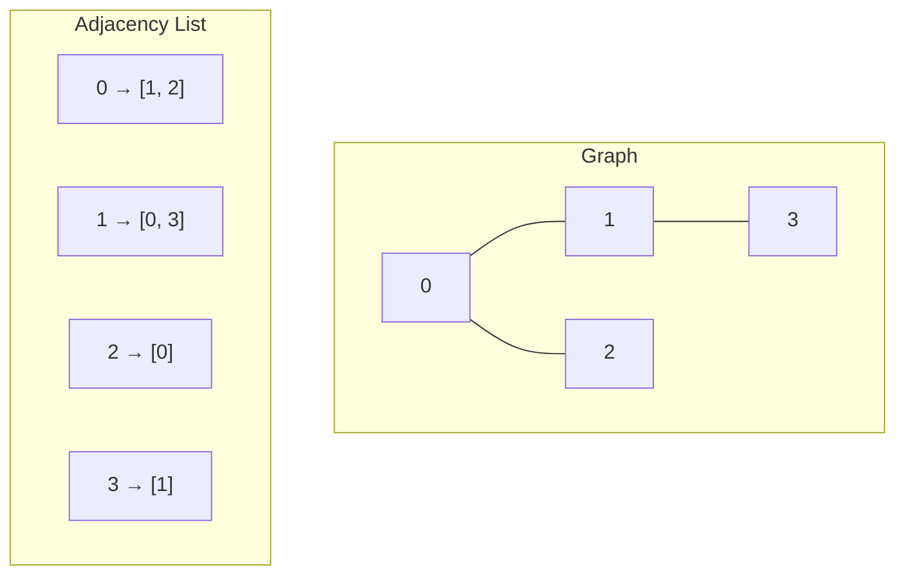
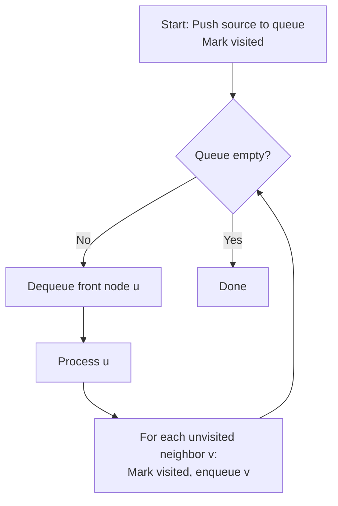
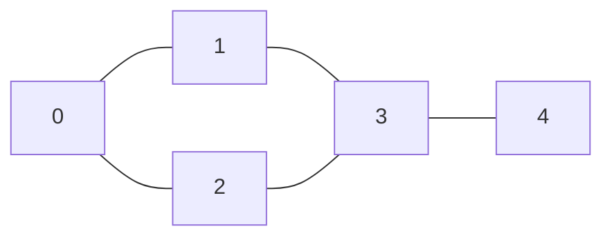
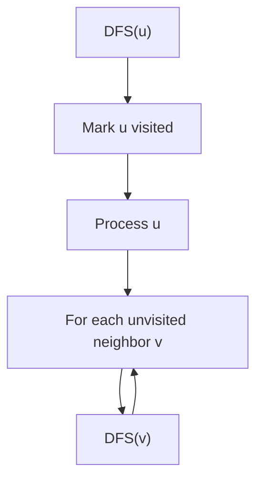
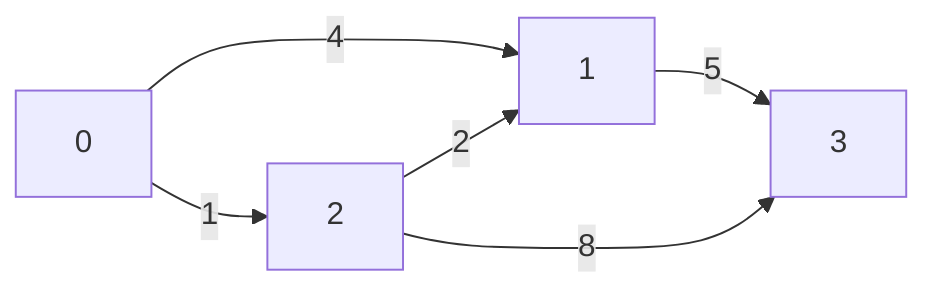

# 10. Graphs

## Table of Contents
- [10.1 Introduction](#101-introduction)
- [10.2 Graph Representation](#102-graph-representation)
- [10.3 BFS (Breadth-First Search)](#103-bfs-breadth-first-search)
- [10.4 DFS (Depth-First Search)](#104-dfs-depth-first-search)
- [10.5 Cycle Detection](#105-cycle-detection)
- [10.6 Topological Sort](#106-topological-sort)
- [10.7 Shortest Path Algorithms](#107-shortest-path-algorithms)
- [10.8 Minimum Spanning Tree](#108-minimum-spanning-tree)
- [10.9 Practice & Assessment](#109-practice--assessment)

---

## 10.1 Introduction

### Definition
A **Graph** is a non-linear data structure consisting of **vertices** (nodes) and **edges** (connections).

### Terminology

| Term | Meaning |
|------|---------|
| Vertex (Node) | A point in the graph |
| Edge | Connection between two vertices |
| Directed | Edges have direction (A → B) |
| Undirected | Edges go both ways (A — B) |
| Weighted | Edges have associated costs/weights |
| Degree | Number of edges connected to a vertex |
| Path | Sequence of vertices connected by edges |
| Cycle | Path that starts and ends at the same vertex |
| Connected | Every vertex reachable from every other |
| DAG | Directed Acyclic Graph |



---

## 10.2 Graph Representation

### Adjacency Matrix

```cpp
// n×n matrix, mat[i][j] = 1 if edge from i to j
int n = 5;
vector<vector<int>> mat(n, vector<int>(n, 0));

// Add edge (undirected)
mat[0][1] = 1; mat[1][0] = 1;
mat[0][2] = 1; mat[2][0] = 1;
mat[1][3] = 1; mat[3][1] = 1;
```

### Adjacency List (Preferred)

```cpp
// Each vertex stores a list of its neighbors
int n = 5;
vector<vector<int>> adj(n);

// Add edge (undirected)
void addEdge(vector<vector<int>>& adj, int u, int v) {
    adj[u].push_back(v);
    adj[v].push_back(u);
}

// Weighted graph
vector<vector<pair<int,int>>> adjW(n);  // {neighbor, weight}
adjW[0].push_back({1, 5});
adjW[1].push_back({0, 5});
```

### Comparison

| Feature | Adjacency Matrix | Adjacency List |
|---------|-----------------|----------------|
| Space | O(V²) | O(V + E) |
| Check edge (u,v) | O(1) | O(degree(u)) |
| All neighbors of u | O(V) | O(degree(u)) |
| Add edge | O(1) | O(1) |
| Best for | Dense graphs | Sparse graphs |



---

## 10.3 BFS (Breadth-First Search)

### Concept
Explore **level by level** — visit all neighbors first, then their neighbors.



### Implementation

```cpp
void bfs(vector<vector<int>>& adj, int src) {
    int n = adj.size();
    vector<bool> visited(n, false);
    queue<int> q;
    
    visited[src] = true;
    q.push(src);
    
    while (!q.empty()) {
        int u = q.front(); q.pop();
        cout << u << " ";
        
        for (int v : adj[u]) {
            if (!visited[v]) {
                visited[v] = true;
                q.push(v);
            }
        }
    }
}
```

### BFS Shortest Path (Unweighted)

```cpp
vector<int> bfsShortestPath(vector<vector<int>>& adj, int src) {
    int n = adj.size();
    vector<int> dist(n, -1);
    queue<int> q;
    
    dist[src] = 0;
    q.push(src);
    
    while (!q.empty()) {
        int u = q.front(); q.pop();
        for (int v : adj[u]) {
            if (dist[v] == -1) {
                dist[v] = dist[u] + 1;
                q.push(v);
            }
        }
    }
    return dist;
}
```

### Dry Run



BFS from vertex 0:

| Step | Queue | Visited | Output |
|------|-------|---------|--------|
| Init | [0] | {0} | — |
| 1 | [1, 2] | {0, 1, 2} | 0 |
| 2 | [2, 3] | {0, 1, 2, 3} | 1 |
| 3 | [3] | {0, 1, 2, 3} | 2 |
| 4 | [4] | {0, 1, 2, 3, 4} | 3 |
| 5 | [] | {0, 1, 2, 3, 4} | 4 |

**BFS Order**: `0 1 2 3 4`

**Complexity**: O(V + E) time, O(V) space.

---

## 10.4 DFS (Depth-First Search)

### Concept
Explore **as deep as possible** before backtracking.



### Recursive Implementation

```cpp
void dfs(vector<vector<int>>& adj, int u, vector<bool>& visited) {
    visited[u] = true;
    cout << u << " ";
    
    for (int v : adj[u]) {
        if (!visited[v]) {
            dfs(adj, v, visited);
        }
    }
}

// Call: vector<bool> visited(n, false); dfs(adj, 0, visited);
```

### Iterative DFS (Using Stack)

```cpp
void dfsIterative(vector<vector<int>>& adj, int src) {
    int n = adj.size();
    vector<bool> visited(n, false);
    stack<int> st;
    st.push(src);
    
    while (!st.empty()) {
        int u = st.top(); st.pop();
        if (visited[u]) continue;
        visited[u] = true;
        cout << u << " ";
        
        for (int v : adj[u]) {
            if (!visited[v]) st.push(v);
        }
    }
}
```

### Connected Components

```cpp
int countComponents(int n, vector<vector<int>>& adj) {
    vector<bool> visited(n, false);
    int count = 0;
    for (int i = 0; i < n; i++) {
        if (!visited[i]) {
            dfs(adj, i, visited);
            count++;
        }
    }
    return count;
}
```

### BFS vs DFS

| Feature | BFS | DFS |
|---------|-----|-----|
| Data structure | Queue | Stack / Recursion |
| Explores | Level by level | Deep first |
| Shortest path (unweighted) | Yes | No |
| Space | O(V) (queue) | O(V) (stack/recursion) |
| Use case | Shortest path, level order | Topological sort, cycle detection |

---

## 10.5 Cycle Detection

### Undirected Graph (DFS)

```cpp
bool hasCycleDFS(vector<vector<int>>& adj, int u, int parent, vector<bool>& visited) {
    visited[u] = true;
    for (int v : adj[u]) {
        if (!visited[v]) {
            if (hasCycleDFS(adj, v, u, visited)) return true;
        } else if (v != parent) {
            return true;  // back edge = cycle
        }
    }
    return false;
}

bool hasCycle(int n, vector<vector<int>>& adj) {
    vector<bool> visited(n, false);
    for (int i = 0; i < n; i++)
        if (!visited[i] && hasCycleDFS(adj, i, -1, visited))
            return true;
    return false;
}
```

### Directed Graph (DFS with Colors)

```cpp
// 0 = white (unvisited), 1 = gray (in progress), 2 = black (done)
bool hasCycleDirected(vector<vector<int>>& adj, int u, vector<int>& color) {
    color[u] = 1;  // gray
    for (int v : adj[u]) {
        if (color[v] == 1) return true;  // back edge = cycle
        if (color[v] == 0 && hasCycleDirected(adj, v, color))
            return true;
    }
    color[u] = 2;  // black
    return false;
}
```

---

## 10.6 Topological Sort

### Definition
A linear ordering of vertices in a **DAG** such that for every directed edge (u, v), u comes before v.

### Kahn's Algorithm (BFS — In-degree method)

```cpp
vector<int> topologicalSort(int n, vector<vector<int>>& adj) {
    vector<int> inDegree(n, 0);
    for (int u = 0; u < n; u++)
        for (int v : adj[u])
            inDegree[v]++;
    
    queue<int> q;
    for (int i = 0; i < n; i++)
        if (inDegree[i] == 0) q.push(i);
    
    vector<int> order;
    while (!q.empty()) {
        int u = q.front(); q.pop();
        order.push_back(u);
        for (int v : adj[u]) {
            inDegree[v]--;
            if (inDegree[v] == 0) q.push(v);
        }
    }
    
    if (order.size() != n) return {};  // cycle detected!
    return order;
}
```

### DFS-Based Topological Sort

```cpp
void topoDFS(vector<vector<int>>& adj, int u, vector<bool>& visited, stack<int>& st) {
    visited[u] = true;
    for (int v : adj[u])
        if (!visited[v])
            topoDFS(adj, v, visited, st);
    st.push(u);  // push after processing all descendants
}

vector<int> topologicalSortDFS(int n, vector<vector<int>>& adj) {
    vector<bool> visited(n, false);
    stack<int> st;
    for (int i = 0; i < n; i++)
        if (!visited[i]) topoDFS(adj, i, visited, st);
    
    vector<int> order;
    while (!st.empty()) {
        order.push_back(st.top()); st.pop();
    }
    return order;
}
```

---

## 10.7 Shortest Path Algorithms

### 10.7.1 Dijkstra's Algorithm — O((V+E) log V)

**Use case**: Single-source shortest path for **non-negative** weighted graphs.



```cpp
vector<int> dijkstra(int n, vector<vector<pair<int,int>>>& adj, int src) {
    vector<int> dist(n, INT_MAX);
    priority_queue<pair<int,int>, vector<pair<int,int>>, greater<>> pq;
    
    dist[src] = 0;
    pq.push({0, src});
    
    while (!pq.empty()) {
        auto [d, u] = pq.top(); pq.pop();
        if (d > dist[u]) continue;  // skip outdated entries
        
        for (auto [v, w] : adj[u]) {
            if (dist[u] + w < dist[v]) {
                dist[v] = dist[u] + w;
                pq.push({dist[v], v});
            }
        }
    }
    return dist;
}
```

**Dry Run** for the graph above (source = 0):

| Step | u | dist[] | PQ |
|------|---|--------|-----|
| Init | — | [0, ∞, ∞, ∞] | {(0,0)} |
| 1 | 0 | [0, 4, 1, ∞] | {(1,2), (4,1)} |
| 2 | 2 | [0, 3, 1, 9] | {(3,1), (4,1), (9,3)} |
| 3 | 1 | [0, 3, 1, 8] | {(8,3), (9,3)} |
| 4 | 3 | [0, 3, 1, 8] | {} |

**Result**: `dist = [0, 3, 1, 8]`

### 10.7.2 Bellman-Ford — O(V × E)

**Use case**: Single-source shortest path, **allows negative weights**, detects **negative cycles**.

```cpp
vector<int> bellmanFord(int n, vector<tuple<int,int,int>>& edges, int src) {
    vector<int> dist(n, INT_MAX);
    dist[src] = 0;
    
    // Relax all edges V-1 times
    for (int i = 0; i < n - 1; i++) {
        for (auto [u, v, w] : edges) {
            if (dist[u] != INT_MAX && dist[u] + w < dist[v]) {
                dist[v] = dist[u] + w;
            }
        }
    }
    
    // Check for negative cycles (one more pass)
    for (auto [u, v, w] : edges) {
        if (dist[u] != INT_MAX && dist[u] + w < dist[v]) {
            cout << "Negative cycle detected!\n";
            return {};
        }
    }
    return dist;
}
```

### Comparison

| Feature | Dijkstra | Bellman-Ford |
|---------|----------|-------------|
| Negative weights | No | Yes |
| Negative cycle detection | No | Yes |
| Time | O((V+E) log V) | O(V × E) |
| Data structure | Min-heap | Edge list |
| Best for | Non-negative, sparse | Negative weights |

---

## 10.8 Minimum Spanning Tree

### Definition
A **MST** connects all vertices with minimum total edge weight (no cycles).

### Kruskal's Algorithm — O(E log E)

Sort edges by weight, add if no cycle (use Union-Find).

```cpp
struct DSU {
    vector<int> parent, rank_;
    DSU(int n) : parent(n), rank_(n, 0) {
        iota(parent.begin(), parent.end(), 0);
    }
    int find(int x) {
        if (parent[x] != x) parent[x] = find(parent[x]);
        return parent[x];
    }
    bool unite(int x, int y) {
        int px = find(x), py = find(y);
        if (px == py) return false;
        if (rank_[px] < rank_[py]) swap(px, py);
        parent[py] = px;
        if (rank_[px] == rank_[py]) rank_[px]++;
        return true;
    }
};

int kruskal(int n, vector<tuple<int,int,int>>& edges) {
    sort(edges.begin(), edges.end());  // sort by weight
    DSU dsu(n);
    int mstWeight = 0, edgesUsed = 0;
    
    for (auto [w, u, v] : edges) {
        if (dsu.unite(u, v)) {
            mstWeight += w;
            edgesUsed++;
            if (edgesUsed == n - 1) break;
        }
    }
    return mstWeight;
}
```

### Prim's Algorithm — O((V+E) log V)

Start from any vertex, always add the cheapest edge connecting to unvisited vertex.

```cpp
int prim(int n, vector<vector<pair<int,int>>>& adj) {
    vector<bool> inMST(n, false);
    priority_queue<pair<int,int>, vector<pair<int,int>>, greater<>> pq;
    pq.push({0, 0});  // {weight, vertex}
    int mstWeight = 0;
    
    while (!pq.empty()) {
        auto [w, u] = pq.top(); pq.pop();
        if (inMST[u]) continue;
        inMST[u] = true;
        mstWeight += w;
        
        for (auto [v, wt] : adj[u]) {
            if (!inMST[v]) pq.push({wt, v});
        }
    }
    return mstWeight;
}
```

### Kruskal vs Prim

| Feature | Kruskal | Prim |
|---------|---------|------|
| Approach | Edge-based (greedy) | Vertex-based (greedy) |
| Data structure | Union-Find | Min-heap |
| Time | O(E log E) | O((V+E) log V) |
| Best for | Sparse graphs | Dense graphs |

---

## 10.9 Practice & Assessment

### MCQs

**Q1.** BFS uses which data structure?
- A) Stack
- B) Queue
- C) Heap
- D) Array

**Answer:** B) Queue

---

**Q2.** Dijkstra's algorithm does NOT work with:
- A) Directed graphs
- B) Weighted graphs
- C) Negative edge weights
- D) Sparse graphs

**Answer:** C) Negative edge weights

---

**Q3.** Topological sort is possible only for:
- A) Undirected graphs
- B) DAGs (Directed Acyclic Graphs)
- C) Weighted graphs
- D) Complete graphs

**Answer:** B) DAGs

---

**Q4.** Time complexity of BFS/DFS on adjacency list:
- A) O(V)
- B) O(E)
- C) O(V + E)
- D) O(V × E)

**Answer:** C) O(V + E)

---

**Q5.** Kruskal's algorithm uses which auxiliary data structure?
- A) Queue
- B) Stack
- C) Union-Find (Disjoint Set)
- D) Hash table

**Answer:** C) Union-Find (Disjoint Set)

---

### Output Prediction

**P1.** BFS starting from vertex 0 on graph: 0-1, 0-2, 1-3, 2-3
**Answer:** `0 1 2 3` (level by level)

**P2.** DFS starting from vertex 0 on same graph (neighbors in order):
**Answer:** `0 1 3 2` (goes deep first: 0→1→3→backtrack→2)

---

### Coding Exercises

| # | Problem | Difficulty | Source |
|---|---------|-----------|--------|
| 1 | Number of Islands | Medium | [LeetCode 200](https://leetcode.com/problems/number-of-islands/) |
| 2 | Clone Graph | Medium | [LeetCode 133](https://leetcode.com/problems/clone-graph/) |
| 3 | Course Schedule (Cycle) | Medium | [LeetCode 207](https://leetcode.com/problems/course-schedule/) |
| 4 | Course Schedule II (Topo Sort) | Medium | [LeetCode 210](https://leetcode.com/problems/course-schedule-ii/) |
| 5 | Rotting Oranges (BFS) | Medium | [LeetCode 994](https://leetcode.com/problems/rotting-oranges/) |
| 6 | Network Delay Time (Dijkstra) | Medium | [LeetCode 743](https://leetcode.com/problems/network-delay-time/) |
| 7 | Cheapest Flights K Stops | Medium | [LeetCode 787](https://leetcode.com/problems/cheapest-flights-within-k-stops/) |
| 8 | Word Ladder | Hard | [LeetCode 127](https://leetcode.com/problems/word-ladder/) |
| 9 | Minimum Spanning Tree | Medium | [GFG](https://practice.geeksforgeeks.org/problems/minimum-spanning-tree/1) |
| 10 | Detect Cycle in Directed Graph | Medium | [GFG](https://practice.geeksforgeeks.org/problems/detect-cycle-in-a-directed-graph/1) |
| 11 | Shortest Path in Binary Matrix | Medium | [LeetCode 1091](https://leetcode.com/problems/shortest-path-in-binary-matrix/) |
| 12 | Critical Connections | Hard | [LeetCode 1192](https://leetcode.com/problems/critical-connections-in-a-network/) |

---

### Interview Questions

1. **Explain BFS vs DFS. When would you use each?**
2. **How do you detect a cycle in directed vs undirected graphs?**
3. **Explain Dijkstra's algorithm step by step.**
4. **When would you use Bellman-Ford over Dijkstra?**
5. **What is topological sorting? Give a real-world example.**
6. **Explain Kruskal's vs Prim's for MST.**
7. **How do you find the shortest path in an unweighted graph?**
8. **What is a bipartite graph? How do you check if a graph is bipartite?**
9. **Explain Union-Find and its role in Kruskal's algorithm.**
10. **What are strongly connected components?**

---

> **Next Topic**: [11 - Recursion & Backtracking](11-recursion-and-backtracking.md)
