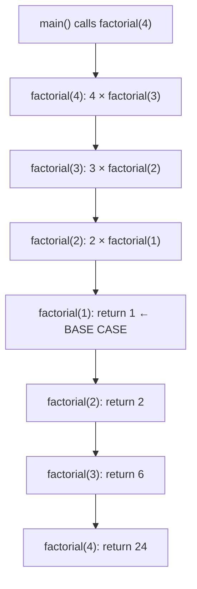
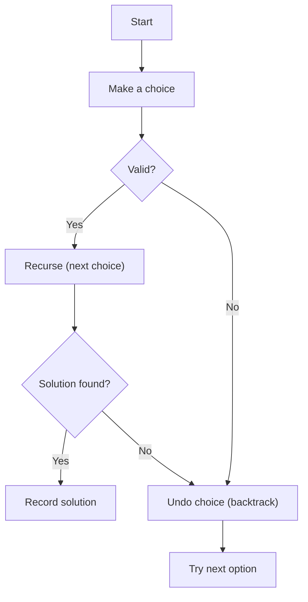
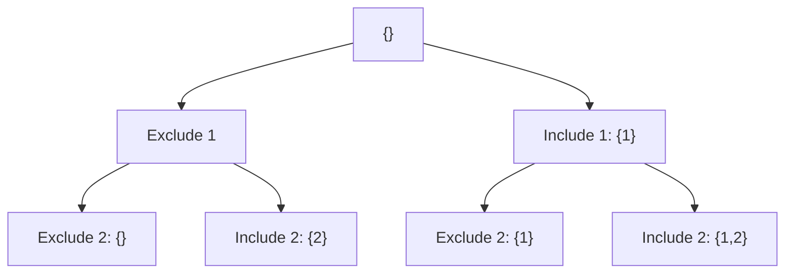
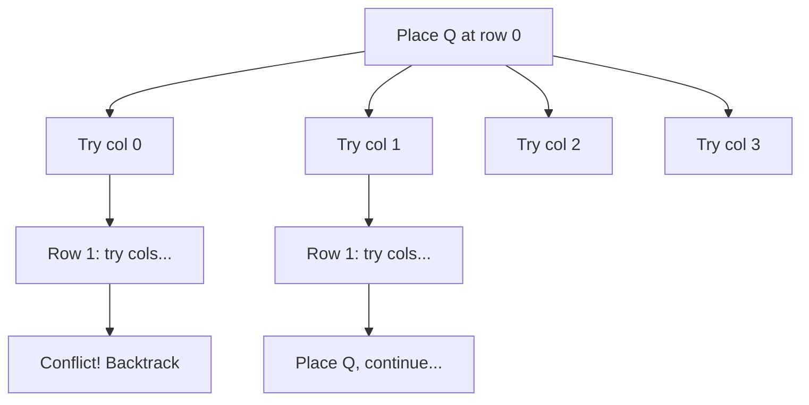

# 11. Recursion & Backtracking

## Table of Contents
- [11.1 Recursion Fundamentals](#111-recursion-fundamentals)
- [11.2 Recursion Examples](#112-recursion-examples)
- [11.3 Backtracking Strategy](#113-backtracking-strategy)
- [11.4 Classic Backtracking Problems](#114-classic-backtracking-problems)
- [11.5 Practice & Assessment](#115-practice--assessment)

---

## 11.1 Recursion Fundamentals

### How Recursion Works

When a function calls itself, each call creates a **stack frame** with its own local variables. The calls "stack up" until a **base case** is reached, then they unwind.



### Template

```cpp
return_type solve(params) {
    // 1. Base case — stop condition
    if (base_condition) return base_value;
    
    // 2. Recursive case — make progress toward base case
    // (optional) Make a choice
    return solve(smaller_params);
}
```

### Key Concepts
- **Base case**: Prevents infinite recursion (stack overflow).
- **Recursive case**: Reduces the problem size.
- **Stack depth**: Max simultaneous recursive calls (risk of stack overflow ~10⁴–10⁵ in C++).
- **Tail recursion**: Last operation is the recursive call — compiler can optimize to iteration.

---

## 11.2 Recursion Examples

### Sum of Array

```cpp
int sumArray(vector<int>& arr, int n) {
    if (n == 0) return 0;
    return arr[n - 1] + sumArray(arr, n - 1);
}
```

### Check Palindrome

```cpp
bool isPalin(string& s, int l, int r) {
    if (l >= r) return true;
    if (s[l] != s[r]) return false;
    return isPalin(s, l + 1, r - 1);
}
```

### Print All Subsequences

```cpp
void subsequences(string s, int i, string cur) {
    if (i == s.size()) {
        cout << "\"" << cur << "\"\n";
        return;
    }
    // Exclude s[i]
    subsequences(s, i + 1, cur);
    // Include s[i]
    subsequences(s, i + 1, cur + s[i]);
}
// subsequences("abc", 0, "") prints all 2^3 = 8 subsequences
```

### Tower of Hanoi

```cpp
void hanoi(int n, char from, char to, char aux) {
    if (n == 0) return;
    hanoi(n - 1, from, aux, to);
    cout << "Move disk " << n << " from " << from << " to " << to << "\n";
    hanoi(n - 1, aux, to, from);
}
// hanoi(3, 'A', 'C', 'B') — moves 3 disks from A to C using B
```

**Number of moves**: 2ⁿ - 1

---

## 11.3 Backtracking Strategy

### What is Backtracking?

Backtracking is a systematic way to try **all possibilities** by building solutions incrementally and **abandoning** (pruning) paths that can't lead to a valid solution.



### Template

```cpp
void backtrack(state, choices) {
    if (is_solution(state)) {
        record_solution(state);
        return;
    }
    for (choice : choices) {
        if (is_valid(choice)) {
            make_choice(state, choice);      // DO
            backtrack(state, remaining);     // RECURSE
            undo_choice(state, choice);      // UNDO (backtrack)
        }
    }
}
```

---

## 11.4 Classic Backtracking Problems

### 11.4.1 Generate All Subsets

```cpp
void subsets(vector<int>& nums, int i, vector<int>& cur, vector<vector<int>>& result) {
    if (i == nums.size()) {
        result.push_back(cur);
        return;
    }
    // Exclude nums[i]
    subsets(nums, i + 1, cur, result);
    // Include nums[i]
    cur.push_back(nums[i]);
    subsets(nums, i + 1, cur, result);
    cur.pop_back();  // backtrack
}

vector<vector<int>> allSubsets(vector<int>& nums) {
    vector<vector<int>> result;
    vector<int> cur;
    subsets(nums, 0, cur, result);
    return result;
}
```



**Output for {1, 2}**: `{}, {2}, {1}, {1,2}`

### 11.4.2 Generate All Permutations

```cpp
void permute(vector<int>& nums, int start, vector<vector<int>>& result) {
    if (start == nums.size()) {
        result.push_back(nums);
        return;
    }
    for (int i = start; i < nums.size(); i++) {
        swap(nums[start], nums[i]);         // choose
        permute(nums, start + 1, result);    // explore
        swap(nums[start], nums[i]);          // un-choose (backtrack)
    }
}
```

**For {1, 2, 3}**: 3! = 6 permutations

### 11.4.3 N-Queens Problem

Place N queens on an N×N chessboard so no two queens attack each other.



```cpp
class NQueens {
    int n;
    vector<string> board;
    vector<vector<vector<string>>> solutions;
    
    bool isSafe(int row, int col) {
        // Check column
        for (int i = 0; i < row; i++)
            if (board[i][col] == 'Q') return false;
        // Check upper-left diagonal
        for (int i = row-1, j = col-1; i >= 0 && j >= 0; i--, j--)
            if (board[i][j] == 'Q') return false;
        // Check upper-right diagonal
        for (int i = row-1, j = col+1; i >= 0 && j < n; i--, j++)
            if (board[i][j] == 'Q') return false;
        return true;
    }
    
    void solve(int row) {
        if (row == n) {
            solutions.push_back({board});
            return;
        }
        for (int col = 0; col < n; col++) {
            if (isSafe(row, col)) {
                board[row][col] = 'Q';    // place queen
                solve(row + 1);            // recurse
                board[row][col] = '.';    // backtrack
            }
        }
    }
    
public:
    vector<vector<vector<string>>> solveNQueens(int n) {
        this->n = n;
        board.assign(n, string(n, '.'));
        solve(0);
        return solutions;
    }
};
```

**Optimized with bit sets** for O(1) conflict checking:

```cpp
void solveNQueens(int n) {
    int count = 0;
    vector<bool> cols(n), diag1(2*n), diag2(2*n);
    
    function<void(int)> solve = [&](int row) {
        if (row == n) { count++; return; }
        for (int col = 0; col < n; col++) {
            if (!cols[col] && !diag1[row-col+n] && !diag2[row+col]) {
                cols[col] = diag1[row-col+n] = diag2[row+col] = true;
                solve(row + 1);
                cols[col] = diag1[row-col+n] = diag2[row+col] = false;
            }
        }
    };
    solve(0);
    cout << count << " solutions\n";
}
```

### 11.4.4 Sudoku Solver

```cpp
bool solveSudoku(vector<vector<char>>& board) {
    for (int i = 0; i < 9; i++) {
        for (int j = 0; j < 9; j++) {
            if (board[i][j] == '.') {
                for (char c = '1'; c <= '9'; c++) {
                    if (isValid(board, i, j, c)) {
                        board[i][j] = c;          // place
                        if (solveSudoku(board))
                            return true;
                        board[i][j] = '.';         // backtrack
                    }
                }
                return false;  // no valid digit works
            }
        }
    }
    return true;  // all cells filled
}

bool isValid(vector<vector<char>>& board, int row, int col, char c) {
    for (int i = 0; i < 9; i++) {
        if (board[row][i] == c) return false;           // row check
        if (board[i][col] == c) return false;           // column check
        int br = 3 * (row / 3) + i / 3;
        int bc = 3 * (col / 3) + i % 3;
        if (board[br][bc] == c) return false;           // box check
    }
    return true;
}
```

### 11.4.5 Combination Sum

```cpp
void combinationSum(vector<int>& candidates, int target, int start,
                    vector<int>& cur, vector<vector<int>>& result) {
    if (target == 0) {
        result.push_back(cur);
        return;
    }
    for (int i = start; i < candidates.size(); i++) {
        if (candidates[i] > target) break;  // pruning (if sorted)
        cur.push_back(candidates[i]);
        combinationSum(candidates, target - candidates[i], i, cur, result);
        cur.pop_back();  // backtrack
    }
}
```

### Pruning Tips

1. **Sort** the input to enable early termination.
2. **Skip duplicates** to avoid generating duplicate solutions.
3. **Constraint checking** before recursion (don't recurse if invalid).
4. **Bound checking** — if partial solution can't possibly lead to answer, prune.

---

## 11.5 Practice & Assessment

### MCQs

**Q1.** What is the key difference between recursion and backtracking?
- A) Backtracking never uses recursion
- B) Backtracking explores all choices and undoes invalid ones
- C) Recursion is slower
- D) They are the same thing

**Answer:** B) Backtracking explores all choices and undoes invalid ones.

---

**Q2.** How many subsets does a set of n elements have?
- A) n
- B) n²
- C) 2ⁿ
- D) n!

**Answer:** C) 2ⁿ

---

**Q3.** How many permutations does a set of n elements have?
- A) 2ⁿ
- B) n²
- C) n!
- D) nⁿ

**Answer:** C) n!

---

**Q4.** In the N-Queens problem for n=8, a queen can be attacked from:
- A) Same row only
- B) Same row and column
- C) Same row, column, and both diagonals
- D) Adjacent cells only

**Answer:** C) Same row, column, and both diagonals.

---

**Q5.** What is pruning in backtracking?
- A) Removing elements from the solution
- B) Stopping early when a path can't lead to a solution
- C) Sorting the input
- D) Using dynamic programming

**Answer:** B) Stopping early when a path can't lead to a solution.

---

### Output Prediction

**P1.** How many times is "base" printed?
```cpp
void f(int n) {
    if (n == 0) { cout << "base "; return; }
    f(n - 1);
    f(n - 1);
}
f(3);
```
**Answer:** 2³ = 8 times. Each call spawns 2 calls, depth 3.

**P2.** What does this print?
```cpp
void f(int n) {
    if (n == 0) return;
    f(n - 1);
    cout << n << " ";
}
f(5);
```
**Answer:** `1 2 3 4 5` (prints after recursive call — ascending order)

---

### Coding Exercises

| # | Problem | Difficulty | Source |
|---|---------|-----------|--------|
| 1 | Subsets | Medium | [LeetCode 78](https://leetcode.com/problems/subsets/) |
| 2 | Permutations | Medium | [LeetCode 46](https://leetcode.com/problems/permutations/) |
| 3 | Combination Sum | Medium | [LeetCode 39](https://leetcode.com/problems/combination-sum/) |
| 4 | Letter Combinations of Phone | Medium | [LeetCode 17](https://leetcode.com/problems/letter-combinations-of-a-phone-number/) |
| 5 | N-Queens | Hard | [LeetCode 51](https://leetcode.com/problems/n-queens/) |
| 6 | Sudoku Solver | Hard | [LeetCode 37](https://leetcode.com/problems/sudoku-solver/) |
| 7 | Word Search | Medium | [LeetCode 79](https://leetcode.com/problems/word-search/) |
| 8 | Palindrome Partitioning | Medium | [LeetCode 131](https://leetcode.com/problems/palindrome-partitioning/) |
| 9 | Generate Parentheses | Medium | [LeetCode 22](https://leetcode.com/problems/generate-parentheses/) |
| 10 | Subsets II (with duplicates) | Medium | [LeetCode 90](https://leetcode.com/problems/subsets-ii/) |
| 11 | Permutations II (with duplicates) | Medium | [LeetCode 47](https://leetcode.com/problems/permutations-ii/) |
| 12 | Rat in a Maze | Medium | [GFG](https://practice.geeksforgeeks.org/problems/rat-in-a-maze-problem/1) |

---

### Interview Questions

1. **Explain recursion with an example. What is a base case?**
2. **What is the maximum recursion depth in C++? What happens when exceeded?**
3. **Explain backtracking with the N-Queens example.**
4. **How do you generate all subsets of a set?**
5. **What is the difference between subsets and permutations?**
6. **How do you handle duplicates in backtracking?**
7. **What is pruning and why is it important?**
8. **Explain the Sudoku solver approach.**
9. **What is the time complexity of generating all permutations?**
10. **How do you convert a recursive solution to iterative?**

---

> **Next Topic**: [12 - Greedy Algorithms](12-greedy-algorithms.md)
