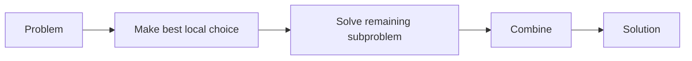
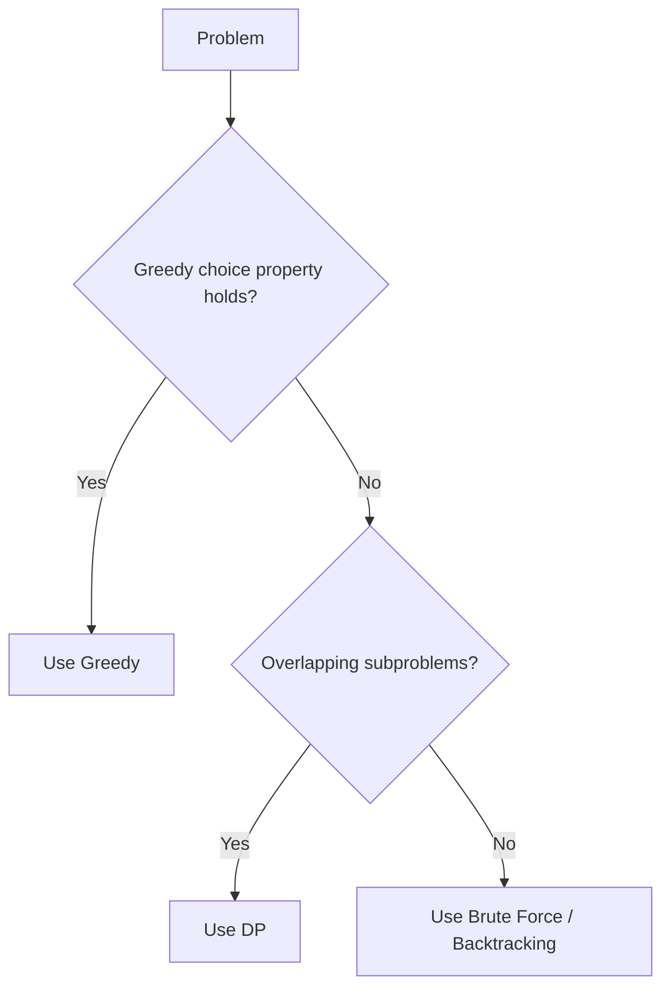

# 12. Greedy Algorithms

## Table of Contents
- [12.1 Introduction](#121-introduction)
- [12.2 Activity Selection](#122-activity-selection)
- [12.3 Fractional Knapsack](#123-fractional-knapsack)
- [12.4 Huffman Coding](#124-huffman-coding)
- [12.5 More Greedy Problems](#125-more-greedy-problems)
- [12.6 Greedy vs DP](#126-greedy-vs-dp)
- [12.7 Practice & Assessment](#127-practice--assessment)

---

## 12.1 Introduction

### What is Greedy?

A **greedy algorithm** makes the **locally optimal choice** at each step, hoping to find the **globally optimal** solution.

**Key Properties:**
1. **Greedy Choice Property**: A globally optimal solution can be reached by making locally optimal choices.
2. **Optimal Substructure**: An optimal solution contains optimal solutions to subproblems.



### When Does Greedy Work?
- When the greedy choice property holds (you can **prove** local = global).
- Scheduling, interval problems, most graph algorithms (Dijkstra, Kruskal, Prim).

### When Does Greedy Fail?
- **0/1 Knapsack**: Can't take fractions → greedy gives wrong answer.
- **Coin Change** (arbitrary denominations): Greedy may miss optimal.

---

## 12.2 Activity Selection (Interval Scheduling)

### Problem
Given n activities with start and end times, select the **maximum number** of non-overlapping activities.

### Greedy Strategy
**Sort by end time**. Always pick the activity that finishes earliest (leaves most room).

```cpp
int activitySelection(vector<pair<int,int>>& activities) {
    // Sort by end time
    sort(activities.begin(), activities.end(), [](auto& a, auto& b) {
        return a.second < b.second;
    });
    
    int count = 1;
    int lastEnd = activities[0].second;
    
    for (int i = 1; i < activities.size(); i++) {
        if (activities[i].first >= lastEnd) {  // non-overlapping
            count++;
            lastEnd = activities[i].second;
        }
    }
    return count;
}
```

**Example**: activities = {(1,4), (3,5), (0,6), (5,7), (3,9), (5,9), (6,10), (8,11), (8,12), (2,14), (12,16)}

After sorting by end time and selecting:
- Pick (1,4) → end=4
- Skip (3,5) — starts at 3 < 4
- Skip (0,6) — starts at 0 < 4
- Pick (5,7) → end=7
- Skip (3,9), (5,9)
- Skip (6,10) — starts at 6 < 7
- Pick (8,11) → end=11
- Skip (8,12)
- Skip (2,14)
- Pick (12,16) → end=16

**Result**: 4 activities selected.

**Complexity**: O(n log n) for sorting + O(n) for selection = **O(n log n)**

---

## 12.3 Fractional Knapsack

### Problem
Given items with weights and values, and a knapsack capacity W, maximize total value. You **can take fractions** of items.

### Greedy Strategy
Sort by **value-to-weight ratio** (value/weight). Take items with highest ratio first.

```cpp
double fractionalKnapsack(int W, vector<pair<int,int>>& items) {
    // items[i] = {value, weight}
    // Sort by value/weight ratio (descending)
    sort(items.begin(), items.end(), [](auto& a, auto& b) {
        return (double)a.first / a.second > (double)b.first / b.second;
    });
    
    double totalValue = 0;
    int remaining = W;
    
    for (auto& [val, wt] : items) {
        if (wt <= remaining) {
            totalValue += val;
            remaining -= wt;
        } else {
            totalValue += val * ((double)remaining / wt);
            break;
        }
    }
    return totalValue;
}
```

**Example**: W=50, items={(60,10), (100,20), (120,30)}

| Item | Value | Weight | Ratio | Take |
|------|-------|--------|-------|------|
| 1 | 60 | 10 | 6.0 | Full (10 kg) |
| 2 | 100 | 20 | 5.0 | Full (20 kg) |
| 3 | 120 | 30 | 4.0 | 20/30 fraction |

Value = 60 + 100 + 120 × (20/30) = 60 + 100 + 80 = **240**

---

## 12.4 Huffman Coding

### Concept
Assign **variable-length codes** to characters based on frequency. More frequent characters get shorter codes.

```cpp
struct HuffNode {
    char ch;
    int freq;
    HuffNode *left, *right;
    HuffNode(char c, int f) : ch(c), freq(f), left(nullptr), right(nullptr) {}
};

auto cmp = [](HuffNode* a, HuffNode* b) { return a->freq > b->freq; };

HuffNode* buildHuffmanTree(unordered_map<char, int>& freq) {
    priority_queue<HuffNode*, vector<HuffNode*>, decltype(cmp)> pq(cmp);
    
    for (auto& [ch, f] : freq)
        pq.push(new HuffNode(ch, f));
    
    while (pq.size() > 1) {
        HuffNode* left = pq.top(); pq.pop();
        HuffNode* right = pq.top(); pq.pop();
        HuffNode* parent = new HuffNode('\0', left->freq + right->freq);
        parent->left = left;
        parent->right = right;
        pq.push(parent);
    }
    return pq.top();
}

void printCodes(HuffNode* root, string code) {
    if (!root) return;
    if (root->ch != '\0')
        cout << root->ch << ": " << code << "\n";
    printCodes(root->left, code + "0");
    printCodes(root->right, code + "1");
}
```

**Time**: O(n log n) where n = number of unique characters.

---

## 12.5 More Greedy Problems

### Jump Game

```cpp
bool canJump(vector<int>& nums) {
    int maxReach = 0;
    for (int i = 0; i < nums.size(); i++) {
        if (i > maxReach) return false;
        maxReach = max(maxReach, i + nums[i]);
    }
    return true;
}
```

### Minimum Number of Platforms

```cpp
int minPlatforms(vector<int>& arrival, vector<int>& departure) {
    sort(arrival.begin(), arrival.end());
    sort(departure.begin(), departure.end());
    
    int platforms = 0, maxPlatforms = 0;
    int i = 0, j = 0, n = arrival.size();
    
    while (i < n && j < n) {
        if (arrival[i] <= departure[j]) {
            platforms++;
            i++;
        } else {
            platforms--;
            j++;
        }
        maxPlatforms = max(maxPlatforms, platforms);
    }
    return maxPlatforms;
}
```

### Job Sequencing (Maximize Profit with Deadlines)

```cpp
int jobSequencing(vector<pair<int,int>>& jobs) {
    // jobs[i] = {deadline, profit}
    sort(jobs.begin(), jobs.end(), [](auto& a, auto& b) {
        return a.second > b.second;  // sort by profit descending
    });
    
    int maxDeadline = 0;
    for (auto& j : jobs) maxDeadline = max(maxDeadline, j.first);
    
    vector<bool> slot(maxDeadline + 1, false);
    int totalProfit = 0;
    
    for (auto& [deadline, profit] : jobs) {
        for (int t = deadline; t >= 1; t--) {
            if (!slot[t]) {
                slot[t] = true;
                totalProfit += profit;
                break;
            }
        }
    }
    return totalProfit;
}
```

---

## 12.6 Greedy vs DP

| Feature | Greedy | Dynamic Programming |
|---------|--------|-------------------|
| Approach | Local optimal choice | Try all, store results |
| Guarantee | Not always optimal | Always optimal (if applicable) |
| Speed | Usually faster | Can be slower |
| Proof needed | Must prove greedy works | Just need overlapping subproblems |
| Examples | Activity selection, Dijkstra | Knapsack 0/1, LCS |

### When to Use Which?



### Example: Coin Change
- **Greedy works** for {1, 5, 10, 25}: Amount 30 → 25+5 = 2 coins ✓
- **Greedy fails** for {1, 3, 4}: Amount 6 → Greedy: 4+1+1=3 coins; Optimal: 3+3=2 coins ✗

---

## 12.7 Practice & Assessment

### MCQs

**Q1.** Greedy algorithms make:
- A) Globally optimal choices
- B) Locally optimal choices at each step
- C) Random choices
- D) Choices based on all future possibilities

**Answer:** B) Locally optimal choices at each step

---

**Q2.** Which problem CANNOT be solved optimally by greedy?
- A) Activity selection
- B) 0/1 Knapsack
- C) Fractional Knapsack
- D) Huffman coding

**Answer:** B) 0/1 Knapsack — requires DP.

---

**Q3.** In activity selection, we sort by:
- A) Start time
- B) Duration
- C) End time
- D) Activity name

**Answer:** C) End time

---

**Q4.** Fractional Knapsack sorts by:
- A) Weight
- B) Value
- C) Value/Weight ratio
- D) Weight/Value ratio

**Answer:** C) Value/Weight ratio (descending)

---

**Q5.** The time complexity of Huffman coding is:
- A) O(n)
- B) O(n log n)
- C) O(n²)
- D) O(2ⁿ)

**Answer:** B) O(n log n)

---

### Coding Exercises

| # | Problem | Difficulty | Source |
|---|---------|-----------|--------|
| 1 | Jump Game | Medium | [LeetCode 55](https://leetcode.com/problems/jump-game/) |
| 2 | Jump Game II | Medium | [LeetCode 45](https://leetcode.com/problems/jump-game-ii/) |
| 3 | Non-overlapping Intervals | Medium | [LeetCode 435](https://leetcode.com/problems/non-overlapping-intervals/) |
| 4 | Meeting Rooms II | Medium | [LeetCode 253](https://leetcode.com/problems/meeting-rooms-ii/) |
| 5 | Gas Station | Medium | [LeetCode 134](https://leetcode.com/problems/gas-station/) |
| 6 | Assign Cookies | Easy | [LeetCode 455](https://leetcode.com/problems/assign-cookies/) |
| 7 | Minimum Number of Arrows | Medium | [LeetCode 452](https://leetcode.com/problems/minimum-number-of-arrows-to-burst-balloons/) |
| 8 | Task Scheduler | Medium | [LeetCode 621](https://leetcode.com/problems/task-scheduler/) |
| 9 | Partition Labels | Medium | [LeetCode 763](https://leetcode.com/problems/partition-labels/) |
| 10 | Candy | Hard | [LeetCode 135](https://leetcode.com/problems/candy/) |

---

### Interview Questions

1. **What is a greedy algorithm? Give an example.**
2. **How do you prove that a greedy algorithm is correct?**
3. **Explain the activity selection problem.**
4. **What is the difference between greedy and dynamic programming?**
5. **When does greedy fail? Give a specific example.**
6. **Explain fractional knapsack vs 0/1 knapsack.**
7. **What is Huffman coding and where is it used?**
8. **How would you solve the Jump Game problem?**
9. **Explain the interval scheduling maximization problem.**
10. **How does Dijkstra's algorithm use greedy approach?**

---

> **Next Topic**: [13 - Dynamic Programming](13-dynamic-programming.md)
