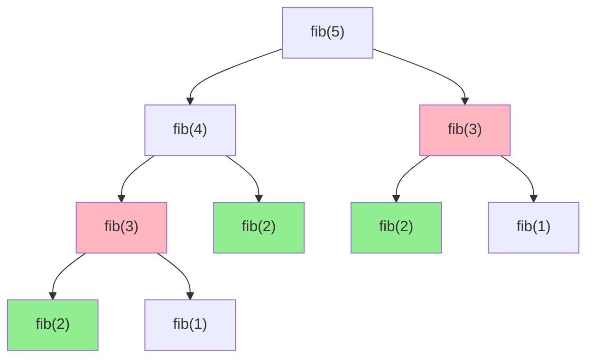
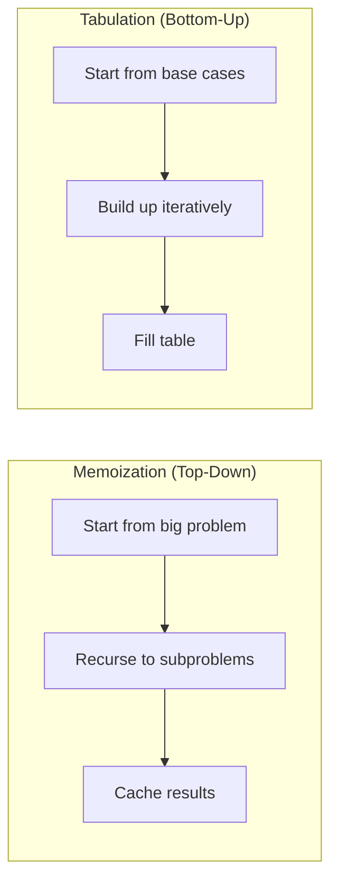

# 13. Dynamic Programming (DP)

## Table of Contents
- [13.1 Introduction](#131-introduction)
- [13.2 Memoization vs Tabulation](#132-memoization-vs-tabulation)
- [13.3 Classic DP Problems](#133-classic-dp-problems)
- [13.4 DP Patterns & Templates](#134-dp-patterns--templates)
- [13.5 Practice & Assessment](#135-practice--assessment)

---

## 13.1 Introduction

### What is Dynamic Programming?

DP solves complex problems by breaking them into **overlapping subproblems** and storing results to avoid redundant computation.

### Two Key Properties

1. **Overlapping Subproblems**: Same subproblem is solved multiple times.
2. **Optimal Substructure**: Optimal solution uses optimal solutions to subproblems.

### DP vs Other Approaches

| Approach | When to Use |
|----------|------------|
| Brute Force | Small inputs, no structure |
| Greedy | Local choice = global optimal |
| Divide & Conquer | Non-overlapping subproblems (merge sort) |
| **DP** | Overlapping subproblems + optimal substructure |



**fib(3)** is computed **twice**, **fib(2)** is computed **three times** → DP caches these!

---

## 13.2 Memoization vs Tabulation

### Top-Down (Memoization)

Start from the original problem, recurse, and **cache** results.

```cpp
// Fibonacci — Memoization
int fib(int n, vector<int>& dp) {
    if (n <= 1) return n;
    if (dp[n] != -1) return dp[n];
    return dp[n] = fib(n - 1, dp) + fib(n - 2, dp);
}

int main() {
    int n = 10;
    vector<int> dp(n + 1, -1);
    cout << fib(n, dp) << "\n";  // 55
}
```

### Bottom-Up (Tabulation)

Build solution from **smallest subproblems** up to the answer.

```cpp
// Fibonacci — Tabulation
int fib(int n) {
    if (n <= 1) return n;
    vector<int> dp(n + 1);
    dp[0] = 0; dp[1] = 1;
    for (int i = 2; i <= n; i++)
        dp[i] = dp[i-1] + dp[i-2];
    return dp[n];
}
```

### Space-Optimized

```cpp
// Fibonacci — O(1) space
int fib(int n) {
    if (n <= 1) return n;
    int prev2 = 0, prev1 = 1;
    for (int i = 2; i <= n; i++) {
        int cur = prev1 + prev2;
        prev2 = prev1;
        prev1 = cur;
    }
    return prev1;
}
```



### Comparison

| Feature | Memoization | Tabulation |
|---------|-------------|------------|
| Direction | Top-down | Bottom-up |
| Implementation | Recursive + cache | Iterative + table |
| Computes | Only needed subproblems | All subproblems |
| Stack overflow risk | Yes (deep recursion) | No |
| Easier to write | Often yes | Sometimes |

---

## 13.3 Classic DP Problems

### 13.3.1 0/1 Knapsack

**Problem**: Given n items with weights and values, find max value within weight capacity W. Each item is taken or not (no fractions).

**State**: `dp[i][w]` = max value using first `i` items with capacity `w`.

**Transition**: `dp[i][w] = max(dp[i-1][w], dp[i-1][w-wt[i]] + val[i])`

```cpp
int knapsack(int W, vector<int>& wt, vector<int>& val) {
    int n = wt.size();
    vector<vector<int>> dp(n + 1, vector<int>(W + 1, 0));
    
    for (int i = 1; i <= n; i++) {
        for (int w = 0; w <= W; w++) {
            dp[i][w] = dp[i-1][w];  // don't take item i
            if (wt[i-1] <= w)
                dp[i][w] = max(dp[i][w], dp[i-1][w - wt[i-1]] + val[i-1]);
        }
    }
    return dp[n][W];
}
```

**Space-optimized** (1D array):

```cpp
int knapsack1D(int W, vector<int>& wt, vector<int>& val) {
    int n = wt.size();
    vector<int> dp(W + 1, 0);
    for (int i = 0; i < n; i++)
        for (int w = W; w >= wt[i]; w--)  // reverse to avoid using same item twice
            dp[w] = max(dp[w], dp[w - wt[i]] + val[i]);
    return dp[W];
}
```

**Example**: W=7, items: {wt=1,val=1}, {wt=3,val=4}, {wt=4,val=5}, {wt=5,val=7}

| i\w | 0 | 1 | 2 | 3 | 4 | 5 | 6 | 7 |
|-----|---|---|---|---|---|---|---|---|
| 0 | 0 | 0 | 0 | 0 | 0 | 0 | 0 | 0 |
| 1 | 0 | 1 | 1 | 1 | 1 | 1 | 1 | 1 |
| 2 | 0 | 1 | 1 | 4 | 5 | 5 | 5 | 5 |
| 3 | 0 | 1 | 1 | 4 | 5 | 6 | 6 | 9 |
| 4 | 0 | 1 | 1 | 4 | 5 | 7 | 8 | 9 |

**Answer**: dp[4][7] = **9**

### 13.3.2 Unbounded Knapsack

Each item can be used **unlimited** times.

```cpp
int unboundedKnapsack(int W, vector<int>& wt, vector<int>& val) {
    int n = wt.size();
    vector<int> dp(W + 1, 0);
    for (int w = 1; w <= W; w++)
        for (int i = 0; i < n; i++)
            if (wt[i] <= w)
                dp[w] = max(dp[w], dp[w - wt[i]] + val[i]);
    return dp[W];
}
```

### 13.3.3 Longest Common Subsequence (LCS)

**Problem**: Find length of longest subsequence present in both strings.

**State**: `dp[i][j]` = LCS of first `i` chars of s1 and first `j` chars of s2.

```cpp
int lcs(string& s1, string& s2) {
    int m = s1.size(), n = s2.size();
    vector<vector<int>> dp(m + 1, vector<int>(n + 1, 0));
    
    for (int i = 1; i <= m; i++) {
        for (int j = 1; j <= n; j++) {
            if (s1[i-1] == s2[j-1])
                dp[i][j] = dp[i-1][j-1] + 1;
            else
                dp[i][j] = max(dp[i-1][j], dp[i][j-1]);
        }
    }
    return dp[m][n];
}
```

**Print the LCS**:

```cpp
string printLCS(string& s1, string& s2, vector<vector<int>>& dp) {
    string result;
    int i = s1.size(), j = s2.size();
    while (i > 0 && j > 0) {
        if (s1[i-1] == s2[j-1]) {
            result += s1[i-1];
            i--; j--;
        } else if (dp[i-1][j] > dp[i][j-1]) {
            i--;
        } else {
            j--;
        }
    }
    reverse(result.begin(), result.end());
    return result;
}
```

**Example**: s1="ABCBDAB", s2="BDCAB" → LCS="BCAB" (length 4)

### 13.3.4 Longest Increasing Subsequence (LIS)

```cpp
// O(n²) DP
int lis(vector<int>& arr) {
    int n = arr.size();
    vector<int> dp(n, 1);  // dp[i] = LIS ending at i
    int ans = 1;
    for (int i = 1; i < n; i++) {
        for (int j = 0; j < i; j++) {
            if (arr[j] < arr[i])
                dp[i] = max(dp[i], dp[j] + 1);
        }
        ans = max(ans, dp[i]);
    }
    return ans;
}
```

```cpp
// O(n log n) using patience sorting
int lisOptimal(vector<int>& arr) {
    vector<int> tails;
    for (int x : arr) {
        auto it = lower_bound(tails.begin(), tails.end(), x);
        if (it == tails.end()) tails.push_back(x);
        else *it = x;
    }
    return tails.size();
}
```

**Example**: arr = {10, 9, 2, 5, 3, 7, 101, 18}  
LIS = {2, 3, 7, 18} or {2, 5, 7, 101} → length **4**

### 13.3.5 Coin Change

**Problem**: Given coin denominations, find minimum coins to make amount.

```cpp
int coinChange(vector<int>& coins, int amount) {
    vector<int> dp(amount + 1, amount + 1);
    dp[0] = 0;
    
    for (int i = 1; i <= amount; i++) {
        for (int coin : coins) {
            if (coin <= i)
                dp[i] = min(dp[i], dp[i - coin] + 1);
        }
    }
    return dp[amount] > amount ? -1 : dp[amount];
}
```

**Example**: coins={1,3,4}, amount=6 → dp[6]=2 (3+3)

| Amount | 0 | 1 | 2 | 3 | 4 | 5 | 6 |
|--------|---|---|---|---|---|---|---|
| Min coins | 0 | 1 | 2 | 1 | 1 | 2 | 2 |

### Coin Change 2 (Count Ways)

```cpp
int coinChangeWays(vector<int>& coins, int amount) {
    vector<int> dp(amount + 1, 0);
    dp[0] = 1;
    for (int coin : coins)
        for (int i = coin; i <= amount; i++)
            dp[i] += dp[i - coin];
    return dp[amount];
}
```

### 13.3.6 Matrix Chain Multiplication

**Problem**: Find minimum multiplications to multiply a chain of matrices.

```cpp
int matrixChainMul(vector<int>& dims) {
    int n = dims.size() - 1;  // number of matrices
    vector<vector<int>> dp(n, vector<int>(n, 0));
    
    for (int len = 2; len <= n; len++) {
        for (int i = 0; i <= n - len; i++) {
            int j = i + len - 1;
            dp[i][j] = INT_MAX;
            for (int k = i; k < j; k++) {
                int cost = dp[i][k] + dp[k+1][j] + dims[i]*dims[k+1]*dims[j+1];
                dp[i][j] = min(dp[i][j], cost);
            }
        }
    }
    return dp[0][n-1];
}
```

### 13.3.7 Edit Distance

```cpp
int editDistance(string& s1, string& s2) {
    int m = s1.size(), n = s2.size();
    vector<vector<int>> dp(m + 1, vector<int>(n + 1));
    
    for (int i = 0; i <= m; i++) dp[i][0] = i;
    for (int j = 0; j <= n; j++) dp[0][j] = j;
    
    for (int i = 1; i <= m; i++) {
        for (int j = 1; j <= n; j++) {
            if (s1[i-1] == s2[j-1])
                dp[i][j] = dp[i-1][j-1];
            else
                dp[i][j] = 1 + min({dp[i-1][j],     // delete
                                     dp[i][j-1],     // insert
                                     dp[i-1][j-1]}); // replace
        }
    }
    return dp[m][n];
}
```

### 13.3.8 House Robber

```cpp
int rob(vector<int>& nums) {
    int n = nums.size();
    if (n == 1) return nums[0];
    int prev2 = 0, prev1 = nums[0];
    for (int i = 1; i < n; i++) {
        int cur = max(prev1, prev2 + nums[i]);
        prev2 = prev1;
        prev1 = cur;
    }
    return prev1;
}
```

### 13.3.9 Longest Palindromic Subsequence

```cpp
int longestPalinSubseq(string s) {
    int n = s.size();
    vector<vector<int>> dp(n, vector<int>(n, 0));
    for (int i = 0; i < n; i++) dp[i][i] = 1;
    
    for (int len = 2; len <= n; len++) {
        for (int i = 0; i <= n - len; i++) {
            int j = i + len - 1;
            if (s[i] == s[j])
                dp[i][j] = dp[i+1][j-1] + 2;
            else
                dp[i][j] = max(dp[i+1][j], dp[i][j-1]);
        }
    }
    return dp[0][n-1];
}
```

---

## 13.4 DP Patterns & Templates

### Pattern 1: Linear DP

```cpp
// Template: dp[i] depends on dp[i-1], dp[i-2], etc.
for (int i = base; i < n; i++)
    dp[i] = f(dp[i-1], dp[i-2], ...);
```
**Examples**: Fibonacci, climbing stairs, house robber, max subarray.

### Pattern 2: Grid DP

```cpp
// Template: dp[i][j] depends on dp[i-1][j], dp[i][j-1], etc.
for (int i = 0; i < m; i++)
    for (int j = 0; j < n; j++)
        dp[i][j] = f(dp[i-1][j], dp[i][j-1], ...);
```
**Examples**: Unique paths, minimum path sum, edit distance.

### Pattern 3: Knapsack

```cpp
// 0/1: reverse inner loop
for (int i = 0; i < n; i++)
    for (int w = W; w >= wt[i]; w--)
        dp[w] = max(dp[w], dp[w-wt[i]] + val[i]);

// Unbounded: forward inner loop
for (int w = 1; w <= W; w++)
    for (int i = 0; i < n; i++)
        if (wt[i] <= w) dp[w] = max(dp[w], dp[w-wt[i]] + val[i]);
```

### Pattern 4: Interval DP

```cpp
// Template: dp[i][j] = best for range [i..j]
for (int len = 2; len <= n; len++)
    for (int i = 0; i + len - 1 < n; i++) {
        int j = i + len - 1;
        for (int k = i; k < j; k++)
            dp[i][j] = f(dp[i][k], dp[k+1][j]);
    }
```
**Examples**: Matrix chain, palindrome partitioning, burst balloons.

### Pattern 5: String DP

```cpp
// Template: dp[i][j] for s1[0..i-1] and s2[0..j-1]
for (int i = 1; i <= m; i++)
    for (int j = 1; j <= n; j++)
        if (s1[i-1] == s2[j-1]) dp[i][j] = dp[i-1][j-1] + 1;
        else dp[i][j] = f(dp[i-1][j], dp[i][j-1]);
```
**Examples**: LCS, edit distance, wildcard matching.

### Complexity Table

| Problem | Time | Space |
|---------|------|-------|
| Fibonacci | O(n) | O(1) optimized |
| 0/1 Knapsack | O(nW) | O(W) optimized |
| LCS | O(mn) | O(min(m,n)) optimized |
| LIS | O(n log n) | O(n) |
| Coin Change | O(nA) | O(A) |
| Edit Distance | O(mn) | O(n) optimized |
| Matrix Chain | O(n³) | O(n²) |

---

## 13.5 Practice & Assessment

### MCQs

**Q1.** The two key properties for DP are:
- A) Greedy choice and optimal substructure
- B) Overlapping subproblems and optimal substructure
- C) Divide and conquer
- D) Backtracking and pruning

**Answer:** B) Overlapping subproblems and optimal substructure

---

**Q2.** Memoization is a:
- A) Bottom-up approach
- B) Top-down approach with caching
- C) Greedy approach
- D) Brute force approach

**Answer:** B) Top-down approach with caching

---

**Q3.** Time complexity of 0/1 Knapsack with n items and capacity W:
- A) O(n²)
- B) O(nW)
- C) O(2ⁿ)
- D) O(W²)

**Answer:** B) O(nW) — pseudo-polynomial

---

**Q4.** The LCS of "ABCDE" and "ACE" is:
- A) "AE"
- B) "ACE"
- C) "ABC"
- D) "ABCE"

**Answer:** B) "ACE" (length 3)

---

**Q5.** In coin change, dp[0] is initialized to:
- A) -1
- B) infinity
- C) 0
- D) 1

**Answer:** C) 0 (zero coins needed for amount 0)

---

### Output Prediction

**P1.**
```cpp
vector<int> dp(6, 0);
dp[0] = 0; dp[1] = 1;
for (int i = 2; i <= 5; i++) dp[i] = dp[i-1] + dp[i-2];
cout << dp[5] << "\n";
```
**Answer:** `5` (Fibonacci: 0,1,1,2,3,5)

**P2.** Coin change: coins={1,2,5}, amount=11. Min coins?
**Answer:** `3` (5+5+1)

---

### Coding Exercises

| # | Problem | Difficulty | Source |
|---|---------|-----------|--------|
| 1 | Climbing Stairs | Easy | [LeetCode 70](https://leetcode.com/problems/climbing-stairs/) |
| 2 | House Robber | Medium | [LeetCode 198](https://leetcode.com/problems/house-robber/) |
| 3 | Coin Change | Medium | [LeetCode 322](https://leetcode.com/problems/coin-change/) |
| 4 | Longest Increasing Subsequence | Medium | [LeetCode 300](https://leetcode.com/problems/longest-increasing-subsequence/) |
| 5 | Longest Common Subsequence | Medium | [LeetCode 1143](https://leetcode.com/problems/longest-common-subsequence/) |
| 6 | 0/1 Knapsack | Medium | [GFG](https://practice.geeksforgeeks.org/problems/0-1-knapsack-problem0945/1) |
| 7 | Edit Distance | Medium | [LeetCode 72](https://leetcode.com/problems/edit-distance/) |
| 8 | Unique Paths | Medium | [LeetCode 62](https://leetcode.com/problems/unique-paths/) |
| 9 | Word Break | Medium | [LeetCode 139](https://leetcode.com/problems/word-break/) |
| 10 | Longest Palindromic Substring | Medium | [LeetCode 5](https://leetcode.com/problems/longest-palindromic-substring/) |
| 11 | Partition Equal Subset Sum | Medium | [LeetCode 416](https://leetcode.com/problems/partition-equal-subset-sum/) |
| 12 | Target Sum | Medium | [LeetCode 494](https://leetcode.com/problems/target-sum/) |
| 13 | Burst Balloons | Hard | [LeetCode 312](https://leetcode.com/problems/burst-balloons/) |
| 14 | Regular Expression Matching | Hard | [LeetCode 10](https://leetcode.com/problems/regular-expression-matching/) |
| 15 | Minimum Cost to Cut a Stick | Hard | [LeetCode 1547](https://leetcode.com/problems/minimum-cost-to-cut-a-stick/) |

---

### Interview Questions

1. **What is dynamic programming? Explain with an example.**
2. **What is the difference between memoization and tabulation?**
3. **Explain the 0/1 Knapsack problem.**
4. **How do you identify if a problem can be solved with DP?**
5. **What is the LCS problem? Explain with code.**
6. **How do you optimize space in DP?**
7. **Explain the coin change problem (both min coins and count ways).**
8. **What is the LIS problem? Explain the O(n log n) solution.**
9. **What is the edit distance problem?**
10. **How do you reconstruct the solution (not just the value) in DP?**

---

> **Next Topic**: [14 - Bit Manipulation](14-bit-manipulation.md)
