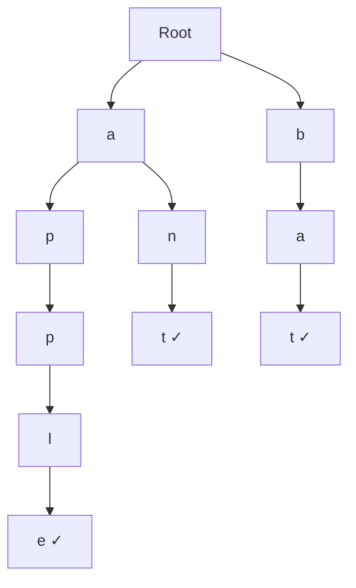
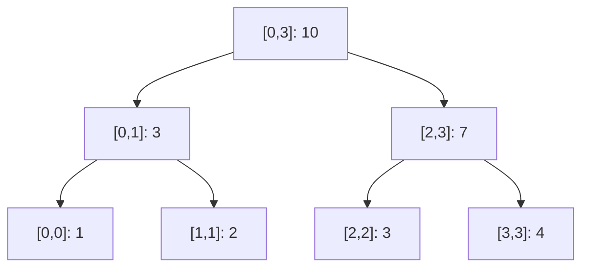
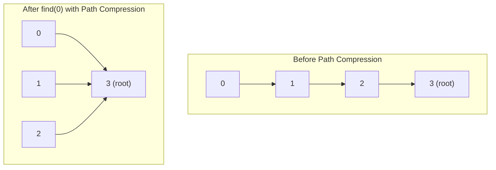

# 15. Advanced Data Structures

## Table of Contents
- [15.1 Trie (Prefix Tree)](#151-trie-prefix-tree)
- [15.2 Segment Tree](#152-segment-tree)
- [15.3 Fenwick Tree (BIT)](#153-fenwick-tree-bit)
- [15.4 Disjoint Set (Union-Find)](#154-disjoint-set-union-find)
- [15.5 Suffix Structures (Overview)](#155-suffix-structures-overview)
- [15.6 Practice & Assessment](#156-practice--assessment)

---

## 15.1 Trie (Prefix Tree)

### Definition
A **Trie** is a tree-like data structure for storing strings, where each node represents a character. It enables efficient **prefix-based** searches.



Words stored: "apple", "ant", "bat"

### Implementation

```cpp
struct TrieNode {
    TrieNode* children[26];
    bool isEnd;
    
    TrieNode() : isEnd(false) {
        memset(children, 0, sizeof(children));
    }
};

class Trie {
    TrieNode* root;
public:
    Trie() { root = new TrieNode(); }
    
    // Insert a word — O(word length)
    void insert(string word) {
        TrieNode* node = root;
        for (char c : word) {
            int idx = c - 'a';
            if (!node->children[idx])
                node->children[idx] = new TrieNode();
            node = node->children[idx];
        }
        node->isEnd = true;
    }
    
    // Search for exact word — O(word length)
    bool search(string word) {
        TrieNode* node = root;
        for (char c : word) {
            int idx = c - 'a';
            if (!node->children[idx]) return false;
            node = node->children[idx];
        }
        return node->isEnd;
    }
    
    // Check if any word starts with prefix — O(prefix length)
    bool startsWith(string prefix) {
        TrieNode* node = root;
        for (char c : prefix) {
            int idx = c - 'a';
            if (!node->children[idx]) return false;
            node = node->children[idx];
        }
        return true;
    }
};
```

### Usage

```cpp
Trie trie;
trie.insert("apple");
trie.insert("app");
trie.insert("ant");

cout << trie.search("apple");     // true
cout << trie.search("app");       // true
cout << trie.search("ap");        // false
cout << trie.startsWith("ap");    // true
```

### Complexity

| Operation | Time | Space |
|-----------|------|-------|
| Insert | O(L) | O(L) per word |
| Search | O(L) | — |
| Prefix check | O(L) | — |
| Total space | — | O(N × L × 26) worst case |

L = word length, N = number of words

### Applications
- Autocomplete / typeahead
- Spell checker
- Word games (Boggle)
- IP routing (longest prefix match)
- XOR maximization

---

## 15.2 Segment Tree

### Definition
A **Segment Tree** is a binary tree that stores information about **intervals/segments** of an array. Supports **range queries** and **point updates** in O(log n).



Array: `[1, 2, 3, 4]` — Segment tree stores range sums.

### Implementation (Range Sum, Point Update)

```cpp
class SegTree {
    vector<int> tree;
    int n;
    
    void build(vector<int>& arr, int node, int start, int end) {
        if (start == end) {
            tree[node] = arr[start];
            return;
        }
        int mid = (start + end) / 2;
        build(arr, 2*node, start, mid);
        build(arr, 2*node+1, mid+1, end);
        tree[node] = tree[2*node] + tree[2*node+1];
    }
    
    void update(int node, int start, int end, int idx, int val) {
        if (start == end) {
            tree[node] = val;
            return;
        }
        int mid = (start + end) / 2;
        if (idx <= mid) update(2*node, start, mid, idx, val);
        else update(2*node+1, mid+1, end, idx, val);
        tree[node] = tree[2*node] + tree[2*node+1];
    }
    
    int query(int node, int start, int end, int l, int r) {
        if (r < start || end < l) return 0;       // out of range
        if (l <= start && end <= r) return tree[node]; // fully in range
        int mid = (start + end) / 2;
        return query(2*node, start, mid, l, r) +
               query(2*node+1, mid+1, end, l, r);
    }
    
public:
    SegTree(vector<int>& arr) {
        n = arr.size();
        tree.resize(4 * n);
        build(arr, 1, 0, n - 1);
    }
    
    void update(int idx, int val) { update(1, 0, n-1, idx, val); }
    int query(int l, int r) { return query(1, 0, n-1, l, r); }
};
```

### Usage

```cpp
vector<int> arr = {1, 3, 5, 7, 9, 11};
SegTree st(arr);

cout << st.query(1, 3) << "\n";  // sum of arr[1..3] = 3+5+7 = 15
st.update(2, 10);                // arr[2] = 10
cout << st.query(1, 3) << "\n";  // 3+10+7 = 20
```

### Range Minimum Query (RMQ) Variant

```cpp
// Change merge operation to min
tree[node] = min(tree[2*node], tree[2*node+1]);

// Query returns 0 → change to INT_MAX for out-of-range
```

### Complexity

| Operation | Time | Space |
|-----------|------|-------|
| Build | O(n) | O(4n) |
| Point update | O(log n) | — |
| Range query | O(log n) | — |

---

## 15.3 Fenwick Tree (Binary Indexed Tree — BIT)

### Definition
A **Fenwick Tree** is a compact data structure for **prefix sums** with efficient point updates. Simpler to implement than segment tree.

### Key Idea
Each index `i` stores the sum of a specific range determined by the lowest set bit of `i`.

### Implementation

```cpp
class FenwickTree {
    vector<int> bit;
    int n;
public:
    FenwickTree(int n) : n(n), bit(n + 1, 0) {}
    
    // Point update: add val to index i (1-indexed)
    void update(int i, int val) {
        for (; i <= n; i += i & (-i))
            bit[i] += val;
    }
    
    // Prefix sum: sum of arr[1..i]
    int query(int i) {
        int sum = 0;
        for (; i > 0; i -= i & (-i))
            sum += bit[i];
        return sum;
    }
    
    // Range sum: arr[l..r]
    int rangeQuery(int l, int r) {
        return query(r) - query(l - 1);
    }
};
```

### Usage

```cpp
FenwickTree ft(6);
// arr = {0, 1, 3, 5, 7, 9, 11} (1-indexed)
int arr[] = {0, 1, 3, 5, 7, 9, 11};
for (int i = 1; i <= 6; i++) ft.update(i, arr[i]);

cout << ft.query(4) << "\n";        // prefix sum [1..4] = 1+3+5+7 = 16
cout << ft.rangeQuery(2, 5) << "\n"; // sum [2..5] = 3+5+7+9 = 24

ft.update(3, 2);  // add 2 to arr[3] → arr[3] becomes 7
cout << ft.rangeQuery(2, 5) << "\n"; // 3+7+7+9 = 26
```

### Fenwick vs Segment Tree

| Feature | Fenwick Tree | Segment Tree |
|---------|-------------|--------------|
| Space | O(n) | O(4n) |
| Code complexity | Very simple | More complex |
| Operations | Prefix sums, point updates | Any associative operation |
| Range update | Needs tricks | Easy with lazy propagation |
| Flexibility | Limited | Very flexible |

### Complexity

| Operation | Time |
|-----------|------|
| Build | O(n log n) |
| Point update | O(log n) |
| Prefix query | O(log n) |
| Range query | O(log n) |

---

## 15.4 Disjoint Set (Union-Find)

### Definition
A **Disjoint Set Union (DSU)** tracks a collection of non-overlapping sets. Supports:
- **Find**: Which set does an element belong to?
- **Union**: Merge two sets.

### Optimizations
1. **Path compression** (in Find): Make nodes point directly to root.
2. **Union by rank/size**: Attach smaller tree under larger.

Together, these give **nearly O(1)** amortized per operation.

### Implementation

```cpp
class DSU {
    vector<int> parent, rank_;
public:
    DSU(int n) : parent(n), rank_(n, 0) {
        iota(parent.begin(), parent.end(), 0);  // parent[i] = i
    }
    
    int find(int x) {
        if (parent[x] != x)
            parent[x] = find(parent[x]);  // path compression
        return parent[x];
    }
    
    bool unite(int x, int y) {
        int px = find(x), py = find(y);
        if (px == py) return false;  // already same set
        
        // Union by rank
        if (rank_[px] < rank_[py]) swap(px, py);
        parent[py] = px;
        if (rank_[px] == rank_[py]) rank_[px]++;
        return true;
    }
    
    bool connected(int x, int y) {
        return find(x) == find(y);
    }
};
```

### Usage

```cpp
DSU dsu(6);

dsu.unite(0, 1);  // {0,1}, {2}, {3}, {4}, {5}
dsu.unite(2, 3);  // {0,1}, {2,3}, {4}, {5}
dsu.unite(0, 3);  // {0,1,2,3}, {4}, {5}

cout << dsu.connected(1, 2);  // true (same set)
cout << dsu.connected(1, 4);  // false (different sets)
```

### Complexity

| Operation | Time (amortized) |
|-----------|-----------------|
| Find | O(α(n)) ≈ O(1) |
| Union | O(α(n)) ≈ O(1) |

α(n) = inverse Ackermann function — grows incredibly slowly, effectively constant.

### Applications
- Kruskal's MST
- Connected components
- Cycle detection in undirected graphs
- Dynamic connectivity
- Account merging



---

## 15.5 Suffix Structures (Overview)

### Suffix Array

A sorted array of all suffixes of a string. Enables efficient substring searches.

```
String: "banana"
Suffixes:
  0: banana
  1: anana
  2: nana
  3: ana
  4: na
  5: a

Sorted suffix array: [5, 3, 1, 0, 4, 2]
  5: a
  3: ana
  1: anana
  0: banana
  4: na
  2: nana
```

**Construction**: O(n log n) or O(n) with advanced algorithms.  
**Usage**: Binary search for pattern → O(m log n) where m = pattern length.

### Suffix Automaton

A DAG that recognizes all suffixes of a string. Can answer substring queries in O(m).

**Properties**:
- At most 2n-1 states for string of length n.
- O(n) construction.
- Count distinct substrings, find longest repeating substring, etc.

> These are advanced topics typically needed for competitive programming at higher levels.

---

## 15.6 Practice & Assessment

### MCQs

**Q1.** A Trie's search time for a word of length L is:
- A) O(n)
- B) O(L)
- C) O(n log n)
- D) O(L²)

**Answer:** B) O(L)

---

**Q2.** Segment tree query time is:
- A) O(n)
- B) O(1)
- C) O(log n)
- D) O(n log n)

**Answer:** C) O(log n)

---

**Q3.** Union-Find with path compression and union by rank has amortized time per operation of:
- A) O(n)
- B) O(log n)
- C) O(α(n)) ≈ O(1)
- D) O(n²)

**Answer:** C) O(α(n)) ≈ O(1)

---

**Q4.** A Fenwick Tree is best suited for:
- A) String matching
- B) Prefix sums with point updates
- C) Graph traversal
- D) Sorting

**Answer:** B) Prefix sums with point updates

---

**Q5.** The space complexity of a Trie storing N words of average length L is:
- A) O(N)
- B) O(N × L)
- C) O(N × L × 26) worst case
- D) O(L)

**Answer:** C) O(N × L × 26) worst case

---

### Short-Answer Questions

1. **When would you use a Trie over a hash set for string lookups?**
2. **Explain the difference between Segment Tree and Fenwick Tree.**
3. **What is path compression in Union-Find?**
4. **How does a Segment Tree handle range minimum queries?**
5. **What are the applications of a Trie?**

---

### Coding Exercises

| # | Problem | Difficulty | Source |
|---|---------|-----------|--------|
| 1 | Implement Trie | Medium | [LeetCode 208](https://leetcode.com/problems/implement-trie-prefix-tree/) |
| 2 | Word Search II (Trie) | Hard | [LeetCode 212](https://leetcode.com/problems/word-search-ii/) |
| 3 | Range Sum Query - Mutable | Medium | [LeetCode 307](https://leetcode.com/problems/range-sum-query-mutable/) |
| 4 | Count of Smaller Numbers After Self | Hard | [LeetCode 315](https://leetcode.com/problems/count-of-smaller-numbers-after-self/) |
| 5 | Number of Islands (Union-Find) | Medium | [LeetCode 200](https://leetcode.com/problems/number-of-islands/) |
| 6 | Redundant Connection | Medium | [LeetCode 684](https://leetcode.com/problems/redundant-connection/) |
| 7 | Accounts Merge | Medium | [LeetCode 721](https://leetcode.com/problems/accounts-merge/) |
| 8 | Design Add & Search Words | Medium | [LeetCode 211](https://leetcode.com/problems/design-add-and-search-words-data-structure/) |
| 9 | Maximum XOR (Trie) | Medium | [LeetCode 421](https://leetcode.com/problems/maximum-xor-of-two-numbers-in-an-array/) |
| 10 | Count Inversions (BIT/Merge Sort) | Hard | [GFG](https://practice.geeksforgeeks.org/problems/inversion-of-array-1587115620/1) |

---

### Interview Questions

1. **What is a Trie? How does it differ from a hash table for strings?**
2. **Explain Segment Tree with a range sum example.**
3. **What is lazy propagation in Segment Trees?**
4. **Explain Fenwick Tree and when you'd use it over Segment Tree.**
5. **What is Union-Find? Explain path compression and union by rank.**
6. **How does Kruskal's algorithm use Union-Find?**
7. **How would you implement autocomplete using a Trie?**
8. **What is a suffix array and when would you use it?**
9. **How do you handle range updates in a Fenwick Tree?**
10. **Compare all advanced data structures: when to use which?**

---

> **Next Topic**: [16 - C++ STL Reference](16-cpp-stl.md)
