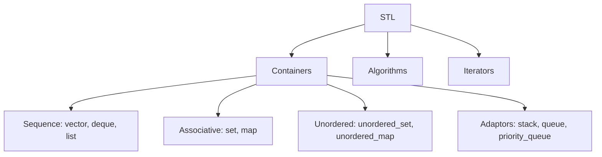

# 16. C++ STL (Standard Template Library)

## Table of Contents
- [16.1 Overview](#161-overview)
- [16.2 Sequence Containers](#162-sequence-containers)
- [16.3 Associative Containers](#163-associative-containers)
- [16.4 Container Adaptors](#164-container-adaptors)
- [16.5 STL Algorithms](#165-stl-algorithms)
- [16.6 Iterators & Utilities](#166-iterators--utilities)
- [16.7 STL Summary Table](#167-stl-summary-table)
- [16.8 Practice & Assessment](#168-practice--assessment)

---

## 16.1 Overview

The **STL** provides ready-made, optimized data structures and algorithms. Using STL is essential for competitive programming and interviews.



---

## 16.2 Sequence Containers

### `vector` — Dynamic Array

```cpp
#include <vector>
vector<int> v;              // empty
vector<int> v2(5, 0);       // {0,0,0,0,0}
vector<int> v3 = {1,2,3};   // {1,2,3}
vector<vector<int>> mat(n, vector<int>(m));  // 2D

// Operations
v.push_back(10);          // add to end — O(1) amortized
v.pop_back();              // remove last — O(1)
v[0];                      // access — O(1)
v.at(0);                   // access with bounds check
v.front(); v.back();       // first/last element
v.size();                  // number of elements
v.empty();                 // is it empty?
v.clear();                 // remove all
v.resize(10);              // resize
v.insert(v.begin()+i, x); // insert at position — O(n)
v.erase(v.begin()+i);     // erase at position — O(n)
```

### `pair` — Store Two Values

```cpp
#include <utility>
pair<int, string> p = {1, "hello"};
cout << p.first << " " << p.second;  // 1 hello

// Make pair
auto p2 = make_pair(3, 4);

// Pairs compare lexicographically (first, then second)
vector<pair<int,int>> v = {{3,1}, {1,2}, {1,1}};
sort(v.begin(), v.end());
// Sorted: {1,1}, {1,2}, {3,1}
```

### `deque` — Double-Ended Queue

```cpp
#include <deque>
deque<int> dq;
dq.push_back(10);     // O(1)
dq.push_front(5);     // O(1)
dq.pop_back();         // O(1)
dq.pop_front();        // O(1)
dq[1];                 // O(1) random access
```

### `list` — Doubly Linked List

```cpp
#include <list>
list<int> l = {1, 2, 3};
l.push_front(0);       // O(1)
l.push_back(4);        // O(1)
l.insert(next(l.begin(), 2), 10);  // O(1) insert at position
l.remove(3);           // remove all 3s — O(n)
// NO random access: l[0] is NOT valid
```

---

## 16.3 Associative Containers

### `set` — Sorted Unique Elements (Red-Black Tree)

```cpp
#include <set>
set<int> s;
s.insert(5);           // O(log n)
s.insert(3);
s.insert(5);           // ignored (duplicate)
s.erase(3);            // O(log n)
s.count(5);            // 1 (exists) or 0
s.find(5);             // iterator or s.end()
s.size();              // 1

// Ordered iteration
for (int x : s) cout << x << " ";  // sorted order

// Lower/upper bound
auto it = s.lower_bound(4);  // first element >= 4
auto it2 = s.upper_bound(4); // first element > 4
```

### `multiset` — Sorted, Allows Duplicates

```cpp
#include <set>
multiset<int> ms;
ms.insert(5);
ms.insert(5);
ms.insert(3);
cout << ms.count(5);   // 2

ms.erase(ms.find(5));  // removes ONE occurrence of 5
ms.erase(5);           // removes ALL occurrences of 5
```

### `map` — Sorted Key-Value (Red-Black Tree)

```cpp
#include <map>
map<string, int> mp;
mp["apple"] = 5;       // O(log n)
mp["banana"] = 3;
mp.insert({"cherry", 7});

cout << mp["apple"];    // 5
mp.erase("banana");    // O(log n)

// Ordered iteration (sorted by key)
for (auto& [key, val] : mp)
    cout << key << ": " << val << "\n";
// apple: 5, cherry: 7

// Check existence
if (mp.count("apple")) cout << "exists\n";
```

### `unordered_set` / `unordered_map` — Hash-Based

```cpp
#include <unordered_set>
#include <unordered_map>

unordered_set<int> us;       // O(1) average operations
unordered_map<int,int> um;   // O(1) average operations
// Same interface as set/map, but NO ordering
// Faster for lookups, no lower_bound/upper_bound
```

---

## 16.4 Container Adaptors

### `stack`

```cpp
#include <stack>
stack<int> st;
st.push(10);    st.push(20);
st.top();       // 20
st.pop();       // removes 20
st.empty();     st.size();
```

### `queue`

```cpp
#include <queue>
queue<int> q;
q.push(10);    q.push(20);
q.front();      // 10
q.back();       // 20
q.pop();        // removes 10
```

### `priority_queue`

```cpp
// Max-heap (default)
priority_queue<int> pq;
pq.push(10); pq.push(30); pq.push(20);
pq.top();    // 30

// Min-heap
priority_queue<int, vector<int>, greater<int>> minPQ;
minPQ.push(10); minPQ.push(30); minPQ.push(20);
minPQ.top();  // 10
```

---

## 16.5 STL Algorithms

### Sorting

```cpp
#include <algorithm>
vector<int> v = {5, 2, 8, 1, 9};

sort(v.begin(), v.end());              // ascending
sort(v.begin(), v.end(), greater<>());  // descending

// Custom comparator
sort(v.begin(), v.end(), [](int a, int b) {
    return abs(a) < abs(b);  // sort by absolute value
});

// Partial sort (first k elements sorted)
partial_sort(v.begin(), v.begin()+3, v.end());

// Stable sort (preserves order of equal elements)
stable_sort(v.begin(), v.end());

// nth_element — O(n) average
nth_element(v.begin(), v.begin()+k, v.end());
// v[k] = correct element if sorted, left side ≤ v[k] ≤ right side
```

### Searching

```cpp
// Binary search (sorted array)
bool found = binary_search(v.begin(), v.end(), 5);

// First position >= value
auto it = lower_bound(v.begin(), v.end(), 5);

// First position > value  
auto it2 = upper_bound(v.begin(), v.end(), 5);

// Find (any container)
auto it3 = find(v.begin(), v.end(), 5);
if (it3 != v.end()) cout << "Found at index " << (it3 - v.begin());

// Count
int cnt = count(v.begin(), v.end(), 5);
```

### Min/Max

```cpp
int mx = *max_element(v.begin(), v.end());
int mn = *min_element(v.begin(), v.end());
auto [lo, hi] = minmax_element(v.begin(), v.end());

int m = max({1, 2, 3, 4, 5});  // max of multiple values
```

### Permutations

```cpp
sort(v.begin(), v.end());  // must be sorted first
do {
    for (int x : v) cout << x << " ";
    cout << "\n";
} while (next_permutation(v.begin(), v.end()));
```

### Other Useful Algorithms

```cpp
// Reverse
reverse(v.begin(), v.end());

// Rotate
rotate(v.begin(), v.begin()+2, v.end());  // left rotate by 2

// Accumulate (sum)
int sum = accumulate(v.begin(), v.end(), 0);
long long sum = accumulate(v.begin(), v.end(), 0LL);

// Unique (remove consecutive duplicates — sort first for all duplicates)
sort(v.begin(), v.end());
v.erase(unique(v.begin(), v.end()), v.end());

// Fill
fill(v.begin(), v.end(), 0);

// Copy
copy(v.begin(), v.end(), result.begin());

// Transform
transform(v.begin(), v.end(), v.begin(), [](int x) { return x * 2; });

// iota (fill with incrementing values)
vector<int> v(5);
iota(v.begin(), v.end(), 1);  // {1, 2, 3, 4, 5}
```

---

## 16.6 Iterators & Utilities

### Iterator Types

```cpp
vector<int> v = {1, 2, 3, 4, 5};

// begin/end
auto it = v.begin();    // points to first element
auto end = v.end();     // points past last element

// Reverse iterators
auto rit = v.rbegin();  // points to last element
auto rend = v.rend();   // points before first element

// Advance
advance(it, 3);  // move iterator 3 positions forward
auto next_it = next(it, 2);  // returns iterator 2 positions ahead
auto prev_it = prev(it, 1);  // returns iterator 1 position back

// Distance
int dist = distance(v.begin(), it);
```

### `auto` and Structured Bindings

```cpp
// auto type deduction
auto x = 42;         // int
auto s = "hello"s;   // string

// Structured bindings (C++17)
map<string,int> mp = {{"a",1}, {"b",2}};
for (auto& [key, val] : mp)
    cout << key << "=" << val << "\n";

// With pair
auto [first, second] = make_pair(1, 2);
```

### Lambda Functions

```cpp
// Basic lambda
auto add = [](int a, int b) { return a + b; };
cout << add(3, 4);  // 7

// Lambda with capture
int x = 10;
auto addX = [x](int a) { return a + x; };
auto addXRef = [&x](int a) { x += a; return x; };

// In sort
sort(v.begin(), v.end(), [](int a, int b) {
    return a > b;  // descending
});
```

---

## 16.7 STL Summary Table

| Container | Insert | Access | Search | Delete | Ordered | Notes |
|-----------|--------|--------|--------|--------|---------|-------|
| `vector` | O(1)* back | O(1) | O(n) | O(n) | No | Dynamic array |
| `deque` | O(1) both | O(1) | O(n) | O(n) | No | Double-ended |
| `list` | O(1) any† | O(n) | O(n) | O(1)† | No | Linked list |
| `set` | O(log n) | — | O(log n) | O(log n) | Yes | Unique, sorted |
| `multiset` | O(log n) | — | O(log n) | O(log n) | Yes | Duplicates, sorted |
| `map` | O(log n) | O(log n) | O(log n) | O(log n) | Yes | Key-value, sorted |
| `unordered_set` | O(1)‡ | — | O(1)‡ | O(1)‡ | No | Hash-based |
| `unordered_map` | O(1)‡ | O(1)‡ | O(1)‡ | O(1)‡ | No | Hash-based |
| `stack` | O(1) | O(1) top | — | O(1) | — | LIFO |
| `queue` | O(1) | O(1) front | — | O(1) | — | FIFO |
| `priority_queue` | O(log n) | O(1) top | — | O(log n) | — | Heap |

\* amortized, † if iterator given, ‡ average case (worst O(n))

---

## 16.8 Practice & Assessment

### MCQs

**Q1.** Which container gives O(1) random access and O(1) amortized push_back?
- A) `list`
- B) `set`
- C) `vector`
- D) `map`

**Answer:** C) `vector`

---

**Q2.** `lower_bound` returns an iterator to:
- A) The last element ≤ value
- B) The first element ≥ value
- C) The first element > value
- D) The exact element

**Answer:** B) The first element ≥ value

---

**Q3.** Which container does NOT allow duplicates?
- A) `vector`
- B) `multiset`
- C) `set`
- D) `deque`

**Answer:** C) `set`

---

**Q4.** `map` is implemented as:
- A) Hash table
- B) Red-Black Tree
- C) Array
- D) Linked list

**Answer:** B) Red-Black Tree

---

**Q5.** Time complexity of `sort()` in C++ STL:
- A) O(n)
- B) O(n log n)
- C) O(n²)
- D) O(log n)

**Answer:** B) O(n log n) — uses IntroSort

---

### Output Prediction

**P1.**
```cpp
set<int> s = {5, 3, 1, 4, 2};
for (int x : s) cout << x << " ";
```
**Answer:** `1 2 3 4 5` (set stores sorted)

**P2.**
```cpp
map<int,int> mp = {{3,30}, {1,10}, {2,20}};
cout << mp.begin()->first << "\n";
```
**Answer:** `1` (map sorted by key)

**P3.**
```cpp
vector<int> v = {3, 1, 4, 1, 5};
sort(v.begin(), v.end());
v.erase(unique(v.begin(), v.end()), v.end());
cout << v.size() << "\n";
```
**Answer:** `4` (unique values: 1, 3, 4, 5)

---

### Interview Questions

1. **Compare `vector` vs `list` vs `deque`. When to use each?**
2. **What is the difference between `map` and `unordered_map`?**
3. **How does `priority_queue` work internally?**
4. **Explain `lower_bound` and `upper_bound` with examples.**
5. **What is the difference between `set` and `multiset`?**
6. **How does `sort()` work internally in C++ STL?**
7. **What are iterators? Explain different types.**
8. **How do you use lambda functions with STL algorithms?**
9. **Explain `nth_element` and when it's useful.**
10. **How would you remove duplicates from a vector efficiently?**

---

> **Next Topic**: [17 - Problem-Solving Patterns](17-problem-solving-patterns.md)
