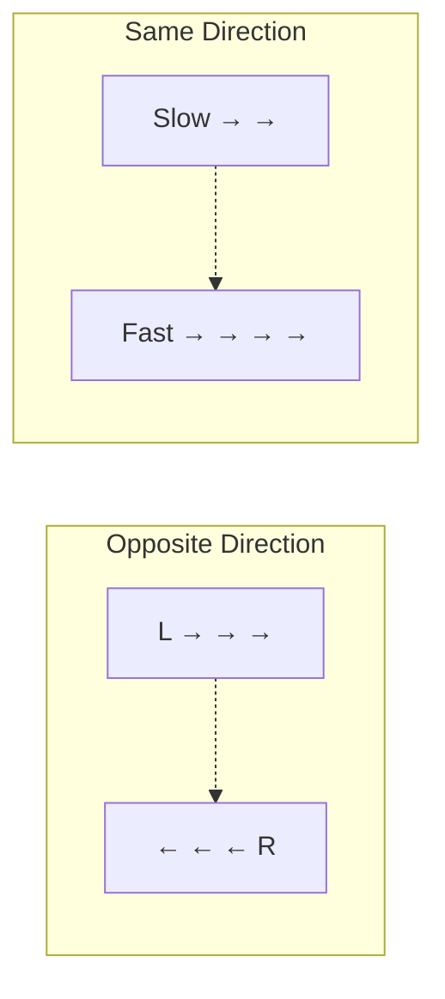
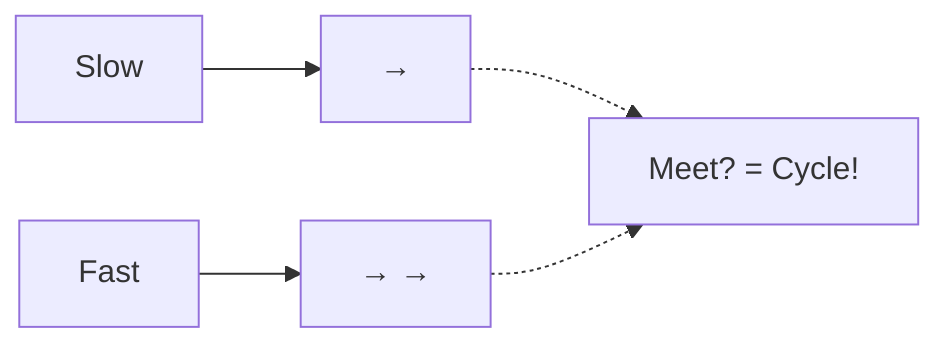
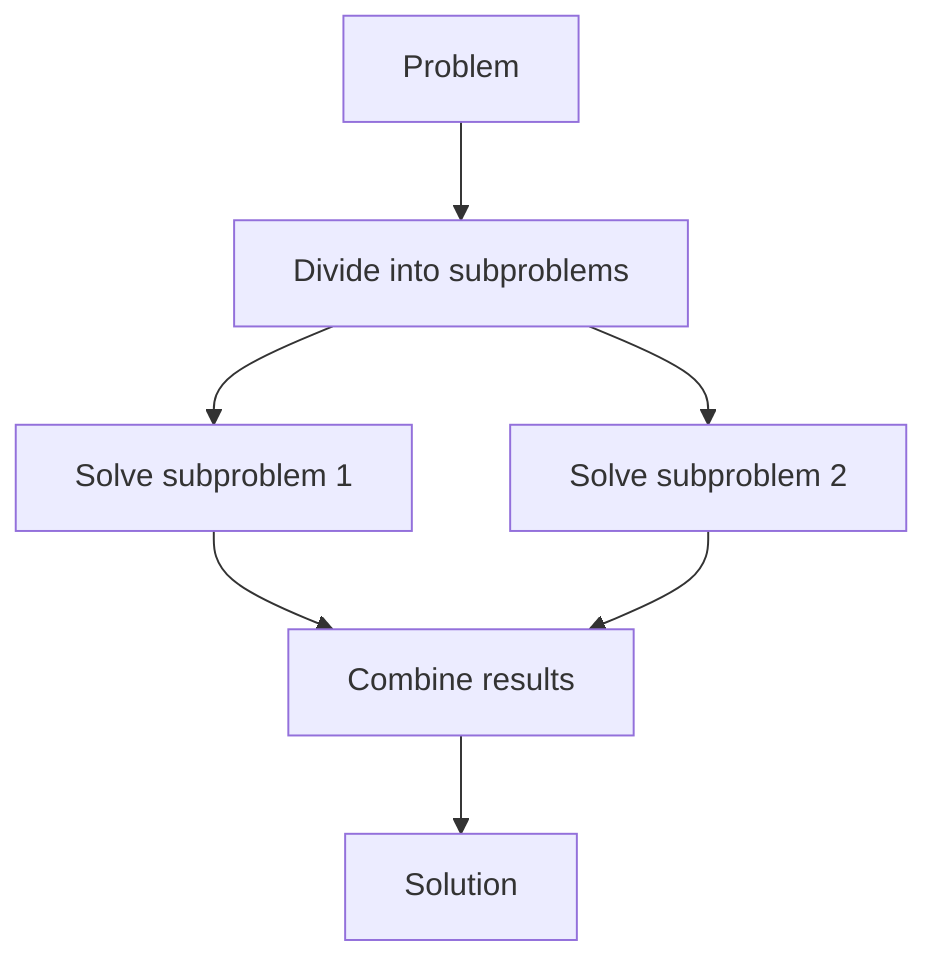
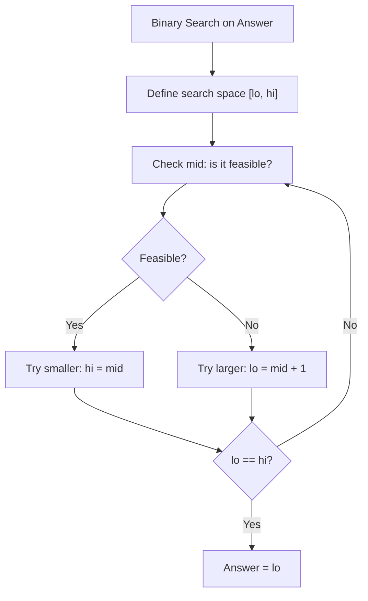
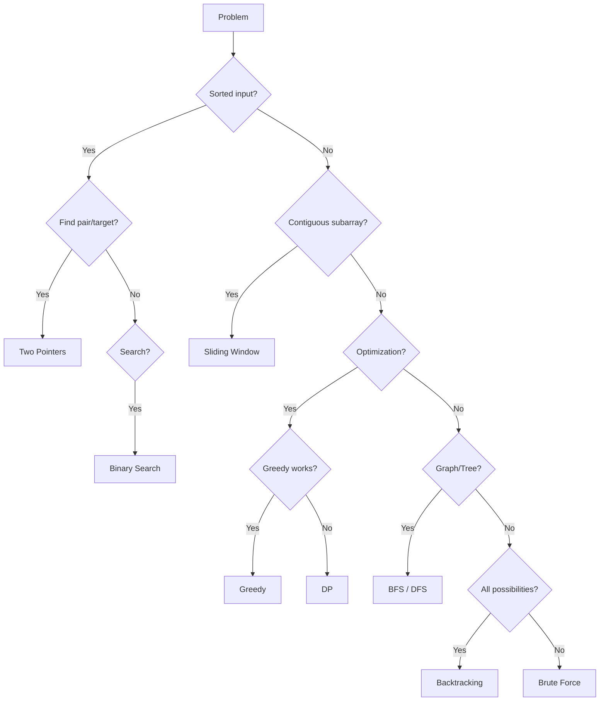

# 17. Problem-Solving Patterns

## Table of Contents
- [17.1 Two Pointers](#171-two-pointers)
- [17.2 Sliding Window](#172-sliding-window)
- [17.3 Fast & Slow Pointers](#173-fast--slow-pointers)
- [17.4 Divide and Conquer](#174-divide-and-conquer)
- [17.5 Binary Search Patterns](#175-binary-search-patterns)
- [17.6 Greedy Patterns](#176-greedy-patterns)
- [17.7 DP Patterns](#177-dp-patterns)
- [17.8 Pattern Recognition Guide](#178-pattern-recognition-guide)
- [17.9 Practice & Assessment](#179-practice--assessment)

---

## 17.1 Two Pointers

### When to Use
- **Sorted arrays**: finding pairs, triplets.
- **Opposite direction**: converging from both ends.
- **Same direction**: fast/slow for removing, partitioning.



### Template: Pair Sum in Sorted Array

```cpp
// Find pair with given sum in sorted array
pair<int,int> twoSum(vector<int>& arr, int target) {
    int l = 0, r = arr.size() - 1;
    while (l < r) {
        int sum = arr[l] + arr[r];
        if (sum == target) return {l, r};
        else if (sum < target) l++;
        else r--;
    }
    return {-1, -1};
}
```

### Template: Remove Duplicates

```cpp
int removeDuplicates(vector<int>& arr) {
    if (arr.empty()) return 0;
    int slow = 0;
    for (int fast = 1; fast < arr.size(); fast++)
        if (arr[fast] != arr[slow])
            arr[++slow] = arr[fast];
    return slow + 1;
}
```

### Three Sum Pattern

```cpp
vector<vector<int>> threeSum(vector<int>& nums) {
    sort(nums.begin(), nums.end());
    vector<vector<int>> result;
    for (int i = 0; i < nums.size() - 2; i++) {
        if (i > 0 && nums[i] == nums[i-1]) continue;  // skip duplicates
        int l = i + 1, r = nums.size() - 1;
        while (l < r) {
            int sum = nums[i] + nums[l] + nums[r];
            if (sum == 0) {
                result.push_back({nums[i], nums[l], nums[r]});
                while (l < r && nums[l] == nums[l+1]) l++;
                while (l < r && nums[r] == nums[r-1]) r--;
                l++; r--;
            } else if (sum < 0) l++;
            else r--;
        }
    }
    return result;
}
```

---

## 17.2 Sliding Window

### When to Use
- Subarray/substring problems with a **contiguous** range.
- Finding max/min/count within a window.

### Fixed-Size Window Template

```cpp
// Max sum of subarray of size k
int maxSumK(vector<int>& arr, int k) {
    int sum = 0;
    for (int i = 0; i < k; i++) sum += arr[i];
    
    int maxSum = sum;
    for (int i = k; i < arr.size(); i++) {
        sum += arr[i] - arr[i - k];   // slide: add new, remove old
        maxSum = max(maxSum, sum);
    }
    return maxSum;
}
```

### Variable-Size Window Template

```cpp
// Smallest subarray with sum >= target
int minSubarray(vector<int>& arr, int target) {
    int l = 0, sum = 0, minLen = INT_MAX;
    for (int r = 0; r < arr.size(); r++) {
        sum += arr[r];           // expand window
        while (sum >= target) {  // shrink window
            minLen = min(minLen, r - l + 1);
            sum -= arr[l++];
        }
    }
    return minLen == INT_MAX ? 0 : minLen;
}
```

### Sliding Window with Hash Map

```cpp
// Longest substring with at most k distinct characters
int longestKDistinct(string s, int k) {
    unordered_map<char, int> freq;
    int l = 0, maxLen = 0;
    for (int r = 0; r < s.size(); r++) {
        freq[s[r]]++;
        while (freq.size() > k) {
            freq[s[l]]--;
            if (freq[s[l]] == 0) freq.erase(s[l]);
            l++;
        }
        maxLen = max(maxLen, r - l + 1);
    }
    return maxLen;
}
```

---

## 17.3 Fast & Slow Pointers

### When to Use
- Cycle detection in linked list or array.
- Finding middle of linked list.
- Happy number problem.



### Template: Floyd's Cycle Detection

```cpp
bool hasCycle(ListNode* head) {
    ListNode *slow = head, *fast = head;
    while (fast && fast->next) {
        slow = slow->next;
        fast = fast->next->next;
        if (slow == fast) return true;
    }
    return false;
}
```

### Happy Number

```cpp
int getNext(int n) {
    int sum = 0;
    while (n) {
        int d = n % 10;
        sum += d * d;
        n /= 10;
    }
    return sum;
}

bool isHappy(int n) {
    int slow = n, fast = getNext(n);
    while (fast != 1 && slow != fast) {
        slow = getNext(slow);
        fast = getNext(getNext(fast));
    }
    return fast == 1;
}
```

---

## 17.4 Divide and Conquer

### When to Use
- Problem can be split into **independent** subproblems.
- Subproblems are similar to original (recursive structure).



### Template: Merge Sort

```cpp
void mergeSort(vector<int>& arr, int l, int r) {
    if (l >= r) return;
    int m = l + (r - l) / 2;
    mergeSort(arr, l, m);       // divide
    mergeSort(arr, m + 1, r);   // divide
    merge(arr, l, m, r);        // combine
}
```

### Count Inversions

```cpp
long long mergeCount(vector<int>& arr, int l, int m, int r) {
    vector<int> left(arr.begin()+l, arr.begin()+m+1);
    vector<int> right(arr.begin()+m+1, arr.begin()+r+1);
    int i = 0, j = 0, k = l;
    long long inv = 0;
    while (i < left.size() && j < right.size()) {
        if (left[i] <= right[j]) arr[k++] = left[i++];
        else { arr[k++] = right[j++]; inv += left.size() - i; }
    }
    while (i < left.size()) arr[k++] = left[i++];
    while (j < right.size()) arr[k++] = right[j++];
    return inv;
}
```

---

## 17.5 Binary Search Patterns

### Pattern 1: Standard Search

```cpp
int binarySearch(vector<int>& arr, int target) {
    int lo = 0, hi = arr.size() - 1;
    while (lo <= hi) {
        int mid = lo + (hi - lo) / 2;
        if (arr[mid] == target) return mid;
        else if (arr[mid] < target) lo = mid + 1;
        else hi = mid - 1;
    }
    return -1;
}
```

### Pattern 2: Find First True (Binary Search on Answer)

```cpp
// Find first index where condition is true
int firstTrue(int lo, int hi) {
    while (lo < hi) {
        int mid = lo + (hi - lo) / 2;
        if (condition(mid)) hi = mid;
        else lo = mid + 1;
    }
    return lo;
}
```

### Pattern 3: Search on Answer (Optimization)

```cpp
// "What is the minimum X such that f(X) is true?"
int binarySearchAnswer(int lo, int hi) {
    while (lo < hi) {
        int mid = lo + (hi - lo) / 2;
        if (feasible(mid)) hi = mid;   // try smaller
        else lo = mid + 1;
    }
    return lo;
}
```

**Examples**: Minimum time to complete tasks, allocate pages, split array.



### Pattern 4: Rotated Sorted Array

```cpp
int searchRotated(vector<int>& nums, int target) {
    int lo = 0, hi = nums.size() - 1;
    while (lo <= hi) {
        int mid = lo + (hi - lo) / 2;
        if (nums[mid] == target) return mid;
        
        if (nums[lo] <= nums[mid]) {  // left half sorted
            if (nums[lo] <= target && target < nums[mid])
                hi = mid - 1;
            else lo = mid + 1;
        } else {  // right half sorted
            if (nums[mid] < target && target <= nums[hi])
                lo = mid + 1;
            else hi = mid - 1;
        }
    }
    return -1;
}
```

---

## 17.6 Greedy Patterns

### Interval Scheduling
Sort by end time, greedily pick non-overlapping intervals.

### Huffman-style Merging
Always merge the two smallest elements (use min-heap).

### Exchange Argument
Prove that any other ordering can be improved by swapping to greedy order.

---

## 17.7 DP Patterns

### Pattern Recognition

| If you see... | Think... | Pattern |
|--------------|----------|---------|
| "Min/max ways" | DP | Optimization |
| "Count number of ways" | DP | Counting |
| "Is it possible?" | DP/Backtracking | Decision |
| "Subsequence" | DP | LCS/LIS |
| "Subarray/substring" | Sliding window or DP | Contiguous |
| "Partition into groups" | DP | Knapsack variant |
| "String matching" | DP | Edit distance / wildcard |
| "Grid paths" | DP | Grid DP |
| "Make/break choices" | DP | Knapsack / Include-Exclude |

---

## 17.8 Pattern Recognition Guide



---

## 17.9 Practice & Assessment

### MCQs

**Q1.** Two-pointer technique works best on:
- A) Unsorted arrays
- B) Sorted arrays
- C) Trees
- D) Graphs

**Answer:** B) Sorted arrays

---

**Q2.** Sliding window is ideal for:
- A) Shortest path
- B) Contiguous subarray/substring problems
- C) Tree traversal
- D) Sorting

**Answer:** B) Contiguous subarray/substring problems

---

**Q3.** "Binary search on answer" is used when:
- A) Array is sorted
- B) You need to minimize/maximize a value that has a monotonic feasibility
- C) You need BFS
- D) The answer is always at the midpoint

**Answer:** B) Minimize/maximize with monotonic feasibility

---

**Q4.** Fast-slow pointer technique is mainly used for:
- A) Sorting
- B) Cycle detection
- C) Binary search
- D) DP

**Answer:** B) Cycle detection

---

### Coding Exercises

| # | Problem | Pattern | Difficulty | Source |
|---|---------|---------|-----------|--------|
| 1 | Two Sum II - Sorted | Two Pointers | Medium | [LeetCode 167](https://leetcode.com/problems/two-sum-ii-input-array-is-sorted/) |
| 2 | Container With Most Water | Two Pointers | Medium | [LeetCode 11](https://leetcode.com/problems/container-with-most-water/) |
| 3 | Max Consecutive Ones III | Sliding Window | Medium | [LeetCode 1004](https://leetcode.com/problems/max-consecutive-ones-iii/) |
| 4 | Minimum Window Substring | Sliding Window | Hard | [LeetCode 76](https://leetcode.com/problems/minimum-window-substring/) |
| 5 | Linked List Cycle II | Fast-Slow | Medium | [LeetCode 142](https://leetcode.com/problems/linked-list-cycle-ii/) |
| 6 | Search in Rotated Array | Binary Search | Medium | [LeetCode 33](https://leetcode.com/problems/search-in-rotated-sorted-array/) |
| 7 | Koko Eating Bananas | BS on Answer | Medium | [LeetCode 875](https://leetcode.com/problems/koko-eating-bananas/) |
| 8 | Split Array Largest Sum | BS on Answer | Hard | [LeetCode 410](https://leetcode.com/problems/split-array-largest-sum/) |
| 9 | Merge Sort (Count Inversions) | Divide & Conquer | Hard | [GFG](https://practice.geeksforgeeks.org/problems/inversion-of-array-1587115620/1) |
| 10 | Longest Repeating Char Replacement | Sliding Window | Medium | [LeetCode 424](https://leetcode.com/problems/longest-repeating-character-replacement/) |

---

### Interview Questions

1. **How do you identify which pattern to use for a problem?**
2. **Explain two-pointer vs sliding window. When to use each?**
3. **What is "binary search on answer"? Give an example.**
4. **How does the fast-slow pointer technique detect cycles?**
5. **Explain divide and conquer with merge sort.**
6. **How do you decide between greedy and DP?**
7. **What are the different types of sliding window problems?**
8. **How would you search in a rotated sorted array?**
9. **Give an example where binary search is used on a non-array.**
10. **What is the monotonic stack/queue pattern?**

---

> **Next Topic**: [18 - Competitive Programming Tips](18-competitive-programming-tips.md)
