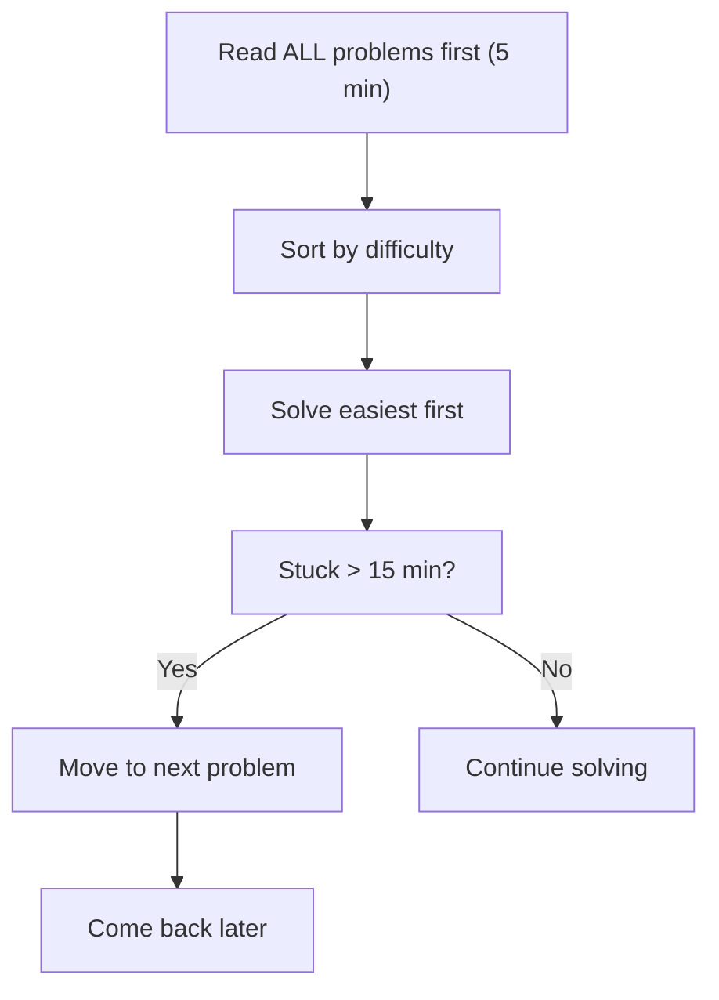

# 18. Competitive Programming Tips

## Table of Contents
- [18.1 Fast I/O & Setup](#181-fast-io--setup)
- [18.2 Useful Macros & Typedefs](#182-useful-macros--typedefs)
- [18.3 Modular Arithmetic](#183-modular-arithmetic)
- [18.4 Number Theory Essentials](#184-number-theory-essentials)
- [18.5 Common Pitfalls & Debugging](#185-common-pitfalls--debugging)
- [18.6 Useful Code Snippets](#186-useful-code-snippets)
- [18.7 Time Management & Strategy](#187-time-management--strategy)
- [18.8 Practice & Assessment](#188-practice--assessment)

---

## 18.1 Fast I/O & Setup

### Standard CP Template

```cpp
#include <bits/stdc++.h>
using namespace std;

#define int long long
#define endl '\n'

void solve() {
    // your solution here
}

signed main() {
    ios_base::sync_with_stdio(false);
    cin.tie(NULL);
    
    int t;
    cin >> t;
    while (t--) {
        solve();
    }
    return 0;
}
```

### Why Fast I/O?

```cpp
// SLOW — flushes after every endl, syncs with C I/O
cout << x << endl;
scanf/printf mixed with cin/cout;

// FAST
ios_base::sync_with_stdio(false);  // disable sync with C I/O
cin.tie(NULL);                     // untie cin from cout
cout << x << '\n';                 // '\n' instead of endl
```

---

## 18.2 Useful Macros & Typedefs

```cpp
#include <bits/stdc++.h>
using namespace std;

typedef long long ll;
typedef pair<int,int> pii;
typedef vector<int> vi;
typedef vector<pii> vpii;

#define pb push_back
#define mp make_pair
#define fi first
#define se second
#define all(v) (v).begin(), (v).end()
#define rall(v) (v).rbegin(), (v).rend()
#define sz(v) (int)(v).size()
#define rep(i, a, b) for (int i = (a); i < (b); i++)
#define FOR(i, n) for (int i = 0; i < (n); i++)

const int MOD = 1e9 + 7;
const int INF = 1e18;
const int MAXN = 2e5 + 5;
```

---

## 18.3 Modular Arithmetic

### Rules

```
(a + b) % m = ((a % m) + (b % m)) % m
(a * b) % m = ((a % m) * (b % m)) % m
(a - b) % m = ((a % m) - (b % m) + m) % m   // +m to avoid negative
(a / b) % m = (a * modInverse(b, m)) % m      // NOT simple division
```

### Modular Exponentiation (Binary Exponentiation)

```cpp
long long power(long long base, long long exp, long long mod) {
    long long result = 1;
    base %= mod;
    while (exp > 0) {
        if (exp & 1) result = result * base % mod;
        base = base * base % mod;
        exp >>= 1;
    }
    return result;
}
```

### Modular Inverse (Fermat's Little Theorem)

```cpp
// Only when mod is prime
long long modInverse(long long a, long long mod) {
    return power(a, mod - 2, mod);
}

// Division under mod
long long modDivide(long long a, long long b, long long mod) {
    return a % mod * modInverse(b, mod) % mod;
}
```

### nCr under Mod

```cpp
const int MAXN = 2e5 + 5;
const int MOD = 1e9 + 7;
long long fact[MAXN], inv_fact[MAXN];

void precompute() {
    fact[0] = 1;
    for (int i = 1; i < MAXN; i++)
        fact[i] = fact[i-1] * i % MOD;
    inv_fact[MAXN-1] = power(fact[MAXN-1], MOD-2, MOD);
    for (int i = MAXN-2; i >= 0; i--)
        inv_fact[i] = inv_fact[i+1] * (i+1) % MOD;
}

long long nCr(int n, int r) {
    if (r < 0 || r > n) return 0;
    return fact[n] % MOD * inv_fact[r] % MOD * inv_fact[n-r] % MOD;
}
```

---

## 18.4 Number Theory Essentials

### GCD & LCM

```cpp
long long gcd(long long a, long long b) {
    return b == 0 ? a : gcd(b, a % b);
}
// Or use __gcd(a, b) or C++17 std::gcd(a, b)

long long lcm(long long a, long long b) {
    return a / gcd(a, b) * b;  // divide first to avoid overflow
}
```

### Sieve of Eratosthenes

```cpp
const int MAXN = 1e7 + 5;
bool is_prime[MAXN];

void sieve() {
    fill(is_prime, is_prime + MAXN, true);
    is_prime[0] = is_prime[1] = false;
    for (int i = 2; i * i < MAXN; i++)
        if (is_prime[i])
            for (int j = i * i; j < MAXN; j += i)
                is_prime[j] = false;
}
```

### Prime Factorization

```cpp
// O(sqrt(n))
vector<pair<int,int>> factorize(int n) {
    vector<pair<int,int>> factors;
    for (int i = 2; i * i <= n; i++) {
        int cnt = 0;
        while (n % i == 0) { n /= i; cnt++; }
        if (cnt) factors.push_back({i, cnt});
    }
    if (n > 1) factors.push_back({n, 1});
    return factors;
}
```

---

## 18.5 Common Pitfalls & Debugging

### Integer Overflow

```cpp
// WRONG: overflow for large n
int result = n * (n + 1) / 2;

// CORRECT
long long result = (long long)n * (n + 1) / 2;
```

### Off-by-One Errors

```cpp
// Common mistakes:
for (int i = 0; i <= n; i++)  // n+1 iterations, not n
arr[n]                        // out of bounds if size is n (0 to n-1)
mid = (lo + hi) / 2           // may overflow; use lo + (hi - lo) / 2
```

### Uninitialized Variables

```cpp
// WRONG
int dp[n][m];   // garbage values

// CORRECT
memset(dp, 0, sizeof(dp));
// or
vector<vector<int>> dp(n, vector<int>(m, 0));
```

### Floating-Point Comparison

```cpp
// WRONG
if (a == b)

// CORRECT
if (abs(a - b) < 1e-9)
```

### Debugging Tips

```cpp
// Quick debug macro
#define dbg(x) cerr << #x << " = " << x << endl

// For arrays/vectors
#define dbgv(v) { cerr << #v << ": "; for (auto& x : v) cerr << x << " "; cerr << endl; }

// Usage
int x = 42;
dbg(x);         // Output: x = 42
vector<int> v = {1,2,3};
dbgv(v);        // Output: v: 1 2 3
```

---

## 18.6 Useful Code Snippets

### Binary Lifting (LCA)

```cpp
const int LOG = 20;
int up[MAXN][LOG], depth[MAXN];

void dfs(int u, int par, vector<int> adj[]) {
    up[u][0] = par;
    for (int j = 1; j < LOG; j++)
        up[u][j] = up[up[u][j-1]][j-1];
    for (int v : adj[u]) {
        if (v != par) {
            depth[v] = depth[u] + 1;
            dfs(v, u, adj);
        }
    }
}

int lca(int u, int v) {
    if (depth[u] < depth[v]) swap(u, v);
    int diff = depth[u] - depth[v];
    for (int j = 0; j < LOG; j++)
        if ((diff >> j) & 1) u = up[u][j];
    if (u == v) return u;
    for (int j = LOG - 1; j >= 0; j--)
        if (up[u][j] != up[v][j]) {
            u = up[u][j];
            v = up[v][j];
        }
    return up[u][0];
}
```

### Coordinate Compression

```cpp
vector<int> compress(vector<int>& arr) {
    vector<int> sorted_arr = arr;
    sort(sorted_arr.begin(), sorted_arr.end());
    sorted_arr.erase(unique(sorted_arr.begin(), sorted_arr.end()), sorted_arr.end());
    
    vector<int> compressed(arr.size());
    for (int i = 0; i < arr.size(); i++)
        compressed[i] = lower_bound(sorted_arr.begin(), sorted_arr.end(), arr[i])
                        - sorted_arr.begin();
    return compressed;
}
```

### Sparse Table (Range Min Query — O(1) per query)

```cpp
const int LOG = 20;
int sparse[MAXN][LOG];

void build(vector<int>& arr) {
    int n = arr.size();
    for (int i = 0; i < n; i++) sparse[i][0] = arr[i];
    for (int j = 1; (1 << j) <= n; j++)
        for (int i = 0; i + (1 << j) - 1 < n; i++)
            sparse[i][j] = min(sparse[i][j-1], sparse[i + (1 << (j-1))][j-1]);
}

int query(int l, int r) {
    int k = __lg(r - l + 1);
    return min(sparse[l][k], sparse[r - (1 << k) + 1][k]);
}
```

---

## 18.7 Time Management & Strategy

### Contest Strategy



### Time Estimates

| Complexity | n ≤ | Approx Time (1s) |
|-----------|-----|-------------------|
| O(n!) | 10 | ✅ |
| O(2ⁿ) | 20-25 | ✅ |
| O(n³) | 500 | ✅ |
| O(n²) | 5000 | ✅ |
| O(n√n) | 10⁵ | ✅ |
| O(n log n) | 10⁶ | ✅ |
| O(n) | 10⁷-10⁸ | ✅ |

### Choosing the Right Approach

| n range | Expected Complexity | Techniques |
|---------|-------------------|------------|
| n ≤ 10 | O(n!), O(2ⁿ) | Brute force, permutation |
| n ≤ 20 | O(2ⁿ) | Bitmask DP |
| n ≤ 500 | O(n³) | Floyd-Warshall, DP |
| n ≤ 5000 | O(n²) | DP, two pointers |
| n ≤ 10⁶ | O(n log n) | Sort, binary search, segment tree |
| n ≤ 10⁸ | O(n) | Linear scan, math |

---

## 18.8 Practice & Assessment

### MCQs

**Q1.** `ios_base::sync_with_stdio(false)` does what?
- A) Makes program run faster in all cases
- B) Disables synchronization between C and C++ I/O
- C) Enables parallel I/O
- D) Flushes output buffer

**Answer:** B) Disables synchronization between C and C++ I/O

---

**Q2.** For `n = 10^6`, which complexity is feasible in 1 second?
- A) O(n²)
- B) O(n log n)
- C) O(2ⁿ)
- D) O(n³)

**Answer:** B) O(n log n)

---

**Q3.** To compute `(a / b) % MOD`, you use:
- A) `(a % MOD) / (b % MOD)`
- B) `a * power(b, MOD-2, MOD) % MOD`
- C) `(a / b) % MOD` directly
- D) `a - b % MOD`

**Answer:** B) `a * power(b, MOD-2, MOD) % MOD`

---

**Q4.** `#define int long long` combined with `signed main()` is used to:
- A) Improve readability
- B) Avoid overflow by making all `int` variables 64-bit
- C) Speed up execution
- D) Enable fast I/O

**Answer:** B) Avoid overflow by making all `int` variables 64-bit

---

### Output Prediction

**P1.**
```cpp
long long x = power(2, 10, 1000000007);
cout << x;
```
**Answer:** `1024`

**P2.**
```cpp
cout << __gcd(12, 18);
```
**Answer:** `6`

**P3.**
```cpp
vector<int> v = {5, 3, 1, 4};
sort(all(v));
cout << *lower_bound(all(v), 3) << " " << *upper_bound(all(v), 3);
```
**Answer:** `3 4`

---

### Coding Exercises

| # | Problem | Topic | Difficulty | Source |
|---|---------|-------|-----------|--------|
| 1 | Power of Two | Bit Manipulation | Easy | [LeetCode 231](https://leetcode.com/problems/power-of-two/) |
| 2 | Count Primes | Sieve | Medium | [LeetCode 204](https://leetcode.com/problems/count-primes/) |
| 3 | Modular Exponentiation | Number Theory | Medium | [GFG](https://practice.geeksforgeeks.org/problems/modular-exponentiation-for-large-numbers5537/1) |
| 4 | nCr mod p | Combinatorics | Hard | [GFG](https://practice.geeksforgeeks.org/problems/ncr1019/1) |
| 5 | LCA of Binary Tree | Binary Lifting | Medium | [LeetCode 236](https://leetcode.com/problems/lowest-common-ancestor-of-a-binary-tree/) |

---

### Interview Questions

1. **Why do we use `(a % MOD + MOD) % MOD` for subtraction?**
2. **Explain binary exponentiation and its time complexity.**
3. **What is Fermat's Little Theorem and how is it used for modular inverse?**
4. **How does the Sieve of Eratosthenes work?**
5. **How do you choose between int and long long?**
6. **What are common causes of TLE in competitive programming?**
7. **How do you debug a wrong answer on a CP problem?**
8. **Explain coordinate compression and when it's needed.**
9. **What is a sparse table? How is it better than a segment tree for static RMQ?**
10. **How do you estimate the required time complexity from constraints?**

---

> **Next Topic**: [19 - DSA Cheat Sheet & Summary](19-dsa-cheat-sheet.md)
