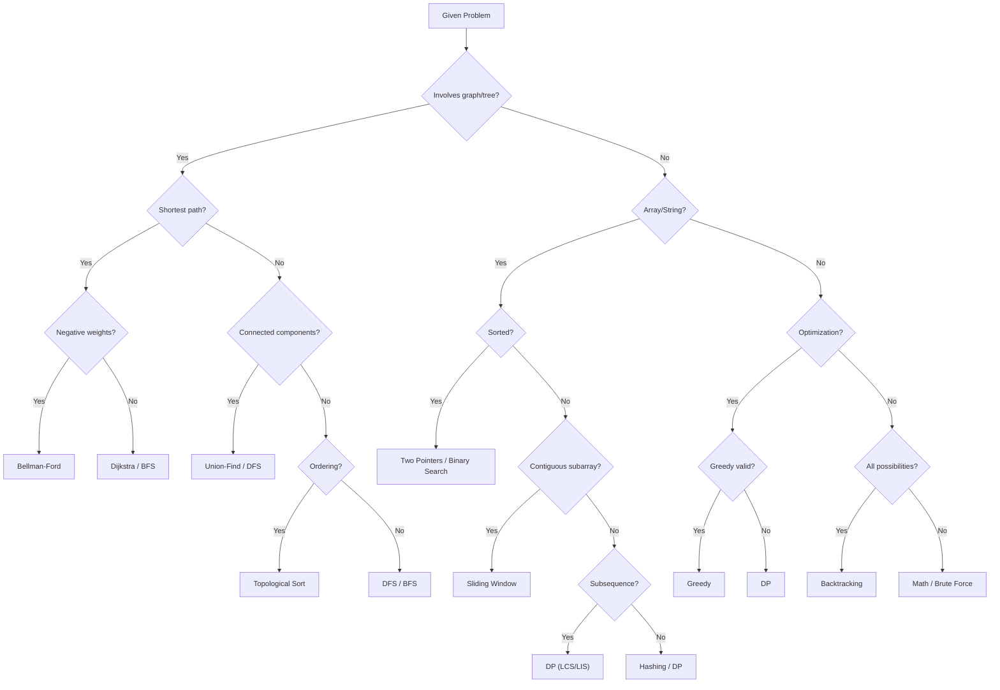

# 19. DSA Cheat Sheet & Summary

## Table of Contents
- [19.1 Big-O Complexity Chart](#191-big-o-complexity-chart)
- [19.2 Data Structures Summary](#192-data-structures-summary)
- [19.3 Sorting Algorithms](#193-sorting-algorithms)
- [19.4 Graph Algorithms](#194-graph-algorithms)
- [19.5 DP Patterns Quick Reference](#195-dp-patterns-quick-reference)
- [19.6 STL Quick Reference](#196-stl-quick-reference)
- [19.7 Code Templates](#197-code-templates)
- [19.8 Pattern Decision Flowchart](#198-pattern-decision-flowchart)
- [19.9 Practice Problem Lists](#199-practice-problem-lists)

---

## 19.1 Big-O Complexity Chart

| Complexity | Name | Example | n = 10⁶ |
|-----------|------|---------|---------|
| O(1) | Constant | Array access | ✅ |
| O(log n) | Logarithmic | Binary search | ✅ |
| O(√n) | Square root | Trial division | ✅ |
| O(n) | Linear | Linear scan | ✅ |
| O(n log n) | Linearithmic | Merge sort | ✅ |
| O(n²) | Quadratic | Bubble sort | ❌ (10¹²) |
| O(n³) | Cubic | Floyd-Warshall | ❌ |
| O(2ⁿ) | Exponential | Subsets | ❌ |
| O(n!) | Factorial | Permutations | ❌ |

---

## 19.2 Data Structures Summary

| Structure | Access | Search | Insert | Delete | Space | Use Case |
|-----------|--------|--------|--------|--------|-------|----------|
| Array | O(1) | O(n) | O(n) | O(n) | O(n) | Random access, cache-friendly |
| Linked List | O(n) | O(n) | O(1)* | O(1)* | O(n) | Frequent insert/delete |
| Stack | O(n) | O(n) | O(1) | O(1) | O(n) | LIFO, undo, parentheses |
| Queue | O(n) | O(n) | O(1) | O(1) | O(n) | FIFO, BFS |
| Hash Table | — | O(1)† | O(1)† | O(1)† | O(n) | Fast lookup |
| BST | O(log n) | O(log n) | O(log n) | O(log n) | O(n) | Sorted data |
| Heap | O(1) top | O(n) | O(log n) | O(log n) | O(n) | Priority queue |
| Trie | O(L) | O(L) | O(L) | O(L) | O(N×L) | Prefix search |
| Segment Tree | O(1) | O(log n) | O(log n) | — | O(n) | Range queries |
| Union-Find | — | O(α(n)) | O(α(n)) | — | O(n) | Connected components |

\* with pointer, † average case

---

## 19.3 Sorting Algorithms

| Algorithm | Best | Average | Worst | Space | Stable |
|-----------|------|---------|-------|-------|--------|
| Bubble Sort | O(n) | O(n²) | O(n²) | O(1) | ✅ |
| Selection Sort | O(n²) | O(n²) | O(n²) | O(1) | ❌ |
| Insertion Sort | O(n) | O(n²) | O(n²) | O(1) | ✅ |
| Merge Sort | O(n log n) | O(n log n) | O(n log n) | O(n) | ✅ |
| Quick Sort | O(n log n) | O(n log n) | O(n²) | O(log n) | ❌ |
| Heap Sort | O(n log n) | O(n log n) | O(n log n) | O(1) | ❌ |
| Counting Sort | O(n+k) | O(n+k) | O(n+k) | O(k) | ✅ |
| Radix Sort | O(d·n) | O(d·n) | O(d·n) | O(n+k) | ✅ |

---

## 19.4 Graph Algorithms

| Algorithm | Time | Space | Use Case |
|-----------|------|-------|----------|
| BFS | O(V+E) | O(V) | Shortest path (unweighted), level-order |
| DFS | O(V+E) | O(V) | Connectivity, cycle detection, topological |
| Dijkstra | O((V+E) log V) | O(V) | Shortest path (non-negative weights) |
| Bellman-Ford | O(V·E) | O(V) | Shortest path (negative weights) |
| Floyd-Warshall | O(V³) | O(V²) | All-pairs shortest path |
| Kruskal | O(E log E) | O(V) | MST (edge list) |
| Prim | O((V+E) log V) | O(V) | MST (dense graph) |
| Topological Sort | O(V+E) | O(V) | DAG ordering, prerequisites |
| Tarjan's SCC | O(V+E) | O(V) | Strongly connected components |

---

## 19.5 DP Patterns Quick Reference

| Pattern | Example Problems | Recurrence Idea |
|---------|-----------------|-----------------|
| **0/1 Knapsack** | Subset sum, partition | `dp[i][w] = max(include, exclude)` |
| **Unbounded Knapsack** | Coin change, rod cutting | `dp[w] = max/min over items` |
| **LCS** | Longest common subsequence | `dp[i][j] = dp[i-1][j-1]+1` or `max(dp[i-1][j], dp[i][j-1])` |
| **LIS** | Longest increasing subsequence | Binary search + patience sort: O(n log n) |
| **Grid DP** | Unique paths, min path sum | `dp[i][j] = f(dp[i-1][j], dp[i][j-1])` |
| **String DP** | Edit distance, wildcard | `dp[i][j]` on two string indices |
| **Interval DP** | MCM, burst balloons | `dp[i][j] = min/max over k in [i,j]` |
| **Bitmask DP** | TSP, assignment | `dp[mask][i]` = state with visited set |
| **Digit DP** | Count numbers with property | `dp[pos][tight][state]` |
| **Tree DP** | Diameter, max path sum | `dp[node]` from children |

---

## 19.6 STL Quick Reference

### Containers

```
vector<T>              → Dynamic array
deque<T>               → Double-ended queue
list<T>                → Doubly linked list
set<T>                 → Sorted unique (BST)
multiset<T>            → Sorted with duplicates
map<K,V>               → Sorted key-value (BST)
unordered_set<T>       → Hash set
unordered_map<K,V>     → Hash map
stack<T>               → LIFO adaptor
queue<T>               → FIFO adaptor
priority_queue<T>      → Max-heap
priority_queue<T,vector<T>,greater<T>>  → Min-heap
```

### Algorithms

```
sort(begin, end)                → O(n log n)
stable_sort(begin, end)         → O(n log n) stable
binary_search(begin, end, val)  → O(log n) bool
lower_bound(begin, end, val)    → first >= val
upper_bound(begin, end, val)    → first > val
min_element / max_element       → O(n)
nth_element(b, b+k, e)          → O(n) avg kth element
next_permutation(b, e)          → next lexicographic perm
accumulate(b, e, init)          → sum/fold
unique(b, e)                    → remove consecutive dups
reverse(b, e)                   → reverse range
```

---

## 19.7 Code Templates

### DFS (Graph)

```cpp
vector<int> adj[MAXN];
bool vis[MAXN];

void dfs(int u) {
    vis[u] = true;
    for (int v : adj[u])
        if (!vis[v]) dfs(v);
}
```

### BFS (Graph)

```cpp
void bfs(int src) {
    queue<int> q;
    q.push(src);
    vis[src] = true;
    while (!q.empty()) {
        int u = q.front(); q.pop();
        for (int v : adj[u]) {
            if (!vis[v]) {
                vis[v] = true;
                q.push(v);
            }
        }
    }
}
```

### Binary Search

```cpp
int lo = 0, hi = n - 1;
while (lo <= hi) {
    int mid = lo + (hi - lo) / 2;
    if (arr[mid] == target) return mid;
    else if (arr[mid] < target) lo = mid + 1;
    else hi = mid - 1;
}
```

### Binary Search on Answer

```cpp
int lo = minPossible, hi = maxPossible;
while (lo < hi) {
    int mid = lo + (hi - lo) / 2;
    if (feasible(mid)) hi = mid;
    else lo = mid + 1;
}
// answer = lo
```

### Dijkstra

```cpp
vector<pair<int,int>> adj[MAXN];
int dist[MAXN];

void dijkstra(int src) {
    fill(dist, dist + MAXN, INT_MAX);
    priority_queue<pii, vector<pii>, greater<pii>> pq;
    dist[src] = 0;
    pq.push({0, src});
    while (!pq.empty()) {
        auto [d, u] = pq.top(); pq.pop();
        if (d > dist[u]) continue;
        for (auto [v, w] : adj[u]) {
            if (dist[u] + w < dist[v]) {
                dist[v] = dist[u] + w;
                pq.push({dist[v], v});
            }
        }
    }
}
```

### Union-Find (DSU)

```cpp
int par[MAXN], rnk[MAXN];

void init(int n) {
    for (int i = 0; i <= n; i++) par[i] = i, rnk[i] = 0;
}

int find(int x) {
    return par[x] == x ? x : par[x] = find(par[x]);
}

void unite(int a, int b) {
    a = find(a); b = find(b);
    if (a == b) return;
    if (rnk[a] < rnk[b]) swap(a, b);
    par[b] = a;
    if (rnk[a] == rnk[b]) rnk[a]++;
}
```

### Segment Tree

```cpp
int tree[4 * MAXN];

void build(int arr[], int node, int s, int e) {
    if (s == e) { tree[node] = arr[s]; return; }
    int mid = (s + e) / 2;
    build(arr, 2*node, s, mid);
    build(arr, 2*node+1, mid+1, e);
    tree[node] = tree[2*node] + tree[2*node+1];
}

int query(int node, int s, int e, int l, int r) {
    if (r < s || e < l) return 0;
    if (l <= s && e <= r) return tree[node];
    int mid = (s + e) / 2;
    return query(2*node, s, mid, l, r) + query(2*node+1, mid+1, e, l, r);
}

void update(int node, int s, int e, int idx, int val) {
    if (s == e) { tree[node] = val; return; }
    int mid = (s + e) / 2;
    if (idx <= mid) update(2*node, s, mid, idx, val);
    else update(2*node+1, mid+1, e, idx, val);
    tree[node] = tree[2*node] + tree[2*node+1];
}
```

### Knapsack 0/1

```cpp
int knapsack(int W, vector<int>& wt, vector<int>& val) {
    int n = wt.size();
    vector<int> dp(W + 1, 0);
    for (int i = 0; i < n; i++)
        for (int w = W; w >= wt[i]; w--)
            dp[w] = max(dp[w], dp[w - wt[i]] + val[i]);
    return dp[W];
}
```

### Modular Arithmetic

```cpp
long long power(long long b, long long e, long long m) {
    long long r = 1; b %= m;
    while (e > 0) {
        if (e & 1) r = r * b % m;
        b = b * b % m; e >>= 1;
    }
    return r;
}
long long modInv(long long a, long long m) { return power(a, m-2, m); }
```

---

## 19.8 Pattern Decision Flowchart



---

## 19.9 Practice Problem Lists

### Beginner (50 Problems)

| # | Problem | Topic | Source |
|---|---------|-------|--------|
| 1 | Two Sum | Arrays/Hashing | [LC 1](https://leetcode.com/problems/two-sum/) |
| 2 | Valid Parentheses | Stack | [LC 20](https://leetcode.com/problems/valid-parentheses/) |
| 3 | Merge Two Sorted Lists | Linked List | [LC 21](https://leetcode.com/problems/merge-two-sorted-lists/) |
| 4 | Best Time to Buy and Sell Stock | Arrays | [LC 121](https://leetcode.com/problems/best-time-to-buy-and-sell-stock/) |
| 5 | Valid Palindrome | Strings | [LC 125](https://leetcode.com/problems/valid-palindrome/) |
| 6 | Invert Binary Tree | Trees | [LC 226](https://leetcode.com/problems/invert-binary-tree/) |
| 7 | Maximum Subarray | Arrays/DP | [LC 53](https://leetcode.com/problems/maximum-subarray/) |
| 8 | Climbing Stairs | DP | [LC 70](https://leetcode.com/problems/climbing-stairs/) |
| 9 | Linked List Cycle | Linked List | [LC 141](https://leetcode.com/problems/linked-list-cycle/) |
| 10 | Binary Search | Searching | [LC 704](https://leetcode.com/problems/binary-search/) |

### Intermediate (30 Problems)

| # | Problem | Topic | Source |
|---|---------|-------|--------|
| 1 | 3Sum | Two Pointers | [LC 15](https://leetcode.com/problems/3sum/) |
| 2 | LRU Cache | Design | [LC 146](https://leetcode.com/problems/lru-cache/) |
| 3 | Course Schedule | Graph/Topo Sort | [LC 207](https://leetcode.com/problems/course-schedule/) |
| 4 | Longest Substring Without Repeating | Sliding Window | [LC 3](https://leetcode.com/problems/longest-substring-without-repeating-characters/) |
| 5 | Number of Islands | Graph/DFS | [LC 200](https://leetcode.com/problems/number-of-islands/) |
| 6 | Coin Change | DP | [LC 322](https://leetcode.com/problems/coin-change/) |
| 7 | Word Break | DP | [LC 139](https://leetcode.com/problems/word-break/) |
| 8 | Kth Largest Element | Heap | [LC 215](https://leetcode.com/problems/kth-largest-element-in-an-array/) |
| 9 | Combination Sum | Backtracking | [LC 39](https://leetcode.com/problems/combination-sum/) |
| 10 | Decode Ways | DP | [LC 91](https://leetcode.com/problems/decode-ways/) |

### Advanced (20 Problems)

| # | Problem | Topic | Source |
|---|---------|-------|--------|
| 1 | Median of Two Sorted Arrays | Binary Search | [LC 4](https://leetcode.com/problems/median-of-two-sorted-arrays/) |
| 2 | N-Queens | Backtracking | [LC 51](https://leetcode.com/problems/n-queens/) |
| 3 | Word Ladder | BFS | [LC 127](https://leetcode.com/problems/word-ladder/) |
| 4 | Trapping Rain Water | Two Pointers/Stack | [LC 42](https://leetcode.com/problems/trapping-rain-water/) |
| 5 | Merge K Sorted Lists | Heap | [LC 23](https://leetcode.com/problems/merge-k-sorted-lists/) |
| 6 | Edit Distance | DP | [LC 72](https://leetcode.com/problems/edit-distance/) |
| 7 | Serialize and Deserialize Binary Tree | Trees | [LC 297](https://leetcode.com/problems/serialize-and-deserialize-binary-tree/) |
| 8 | Burst Balloons | Interval DP | [LC 312](https://leetcode.com/problems/burst-balloons/) |
| 9 | Minimum Window Substring | Sliding Window | [LC 76](https://leetcode.com/problems/minimum-window-substring/) |
| 10 | Alien Dictionary | Topological Sort | [LC 269](https://leetcode.com/problems/alien-dictionary/) |

---

### Complete Topic Index

| File | Topic | Key Concepts |
|------|-------|-------------|
| [01](01-cpp-fundamentals.md) | C++ Fundamentals | I/O, types, control flow, functions |
| [02](02-complexity-analysis.md) | Complexity Analysis | Big-O, Big-Θ, Big-Ω, Master Theorem |
| [03](03-arrays-and-strings.md) | Arrays & Strings | Binary search, sorting, two pointers, KMP |
| [04](04-linked-lists.md) | Linked Lists | Singly, doubly, circular, Floyd's cycle |
| [05](05-stacks.md) | Stacks | Balanced parens, NGE, min stack |
| [06](06-queues.md) | Queues | Circular queue, deque, sliding window max |
| [07](07-trees.md) | Trees | BST, traversals, LCA, AVL |
| [08](08-heaps.md) | Heaps | Heap sort, K largest, merge K sorted |
| [09](09-hashing.md) | Hashing | Hash maps, two sum, group anagrams |
| [10](10-graphs.md) | Graphs | BFS, DFS, Dijkstra, Kruskal, Prim |
| [11](11-recursion-and-backtracking.md) | Recursion & Backtracking | Subsets, permutations, N-Queens |
| [12](12-greedy-algorithms.md) | Greedy | Activity selection, Huffman, job sequencing |
| [13](13-dynamic-programming.md) | Dynamic Programming | Knapsack, LCS, LIS, MCM, bitmask DP |
| [14](14-bit-manipulation.md) | Bit Manipulation | Bitwise ops, XOR tricks, bitmask DP |
| [15](15-advanced-data-structures.md) | Advanced DS | Trie, segment tree, Fenwick, DSU |
| [16](16-cpp-stl.md) | C++ STL | Containers, algorithms, iterators |
| [17](17-problem-solving-patterns.md) | Problem-Solving Patterns | Two pointers, sliding window, BS on answer |
| [18](18-competitive-programming-tips.md) | CP Tips | Fast I/O, modular arithmetic, sieve |
| [19](19-dsa-cheat-sheet.md) | Cheat Sheet | Summary tables, templates, problem lists |

---

> **Happy Coding! Master DSA one topic at a time.**
