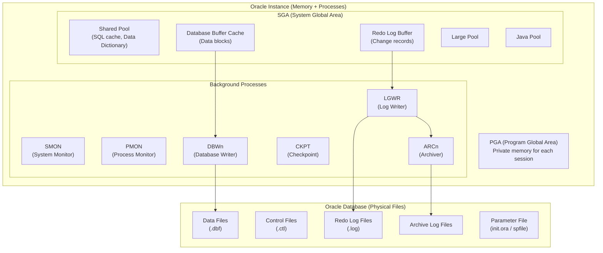
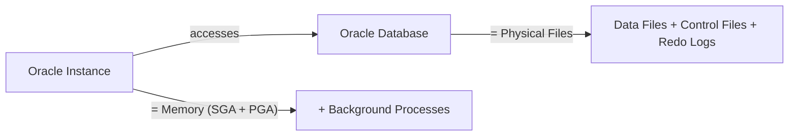

# 01. Oracle Database Basics

## Table of Contents
- [1.1 What is a DBMS?](#11-what-is-a-dbms)
- [1.2 What is an RDBMS?](#12-what-is-an-rdbms)
- [1.3 Oracle Architecture](#13-oracle-architecture)
- [1.4 Oracle Instance vs Database](#14-oracle-instance-vs-database)
- [1.5 Data Types in Oracle](#15-data-types-in-oracle)
- [1.6 Practice & Assessment](#16-practice--assessment)

---

## 1.1 What is a DBMS?

### Definition
A **DBMS (Database Management System)** is software that helps you store, organize, and manage data. Think of it as a smart filing cabinet that can quickly find, add, update, or delete information.

### Why Do We Need a DBMS?
- **No data redundancy** — Avoid storing the same data multiple times.
- **Data integrity** — Rules ensure data is correct and consistent.
- **Security** — Control who can see or change data.
- **Concurrent access** — Multiple users can work with data at the same time.
- **Backup & Recovery** — Protects data from loss.

### Types of DBMS

| Type | Description | Example |
|------|-------------|---------|
| Hierarchical | Tree-like structure | IBM IMS |
| Network | Graph-like structure | IDMS |
| Relational (RDBMS) | Tables with rows & columns | Oracle, MySQL |
| Object-Oriented | Objects like in programming | ObjectDB |
| NoSQL | Non-tabular (documents, graphs) | MongoDB, Redis |

---

## 1.2 What is an RDBMS?

### Definition
An **RDBMS (Relational Database Management System)** stores data in **tables** (also called relations). Each table has **rows** (records) and **columns** (fields). Tables can be linked to each other using **keys** (relationships).

### Key Concepts

| Term | Meaning |
|------|---------|
| Table (Relation) | A collection of related data in rows and columns |
| Row (Tuple) | One record in a table |
| Column (Attribute) | One field/property in a table |
| Primary Key | A column that uniquely identifies each row |
| Foreign Key | A column that links to another table's primary key |

### Why Oracle is an RDBMS
- Oracle stores all data in tables with relationships.
- Supports SQL (Structured Query Language) for data access.
- Enforces ACID properties (Atomicity, Consistency, Isolation, Durability).
- Industry-leading enterprise database since 1979.

### Example: Simple Table

```
CUSTOMERS Table:
+-------------+-----------+----------+-------------+
| CUSTOMER_ID | FIRST_NAME| LAST_NAME| CITY        |
+-------------+-----------+----------+-------------+
| 1           | Ravi      | Kumar    | Mumbai      |
| 2           | Priya     | Sharma   | Delhi       |
| 3           | Amit      | Patel    | Ahmedabad   |
+-------------+-----------+----------+-------------+
```

---

## 1.3 Oracle Architecture

### Overview Diagram



### SGA (System Global Area) — Shared Memory

| Component | Purpose |
|-----------|---------|
| **Shared Pool** | Caches parsed SQL statements and data dictionary info |
| **Database Buffer Cache** | Stores copies of data blocks read from disk |
| **Redo Log Buffer** | Temporarily stores change records before writing to redo log files |
| **Large Pool** | Used for backup/restore operations and shared server |
| **Java Pool** | Memory for Java stored procedures |

### PGA (Program Global Area) — Private Memory
- Each user session gets its own PGA.
- Stores session-specific data: sort areas, cursor info, variables.

### Background Processes

| Process | Full Name | What It Does |
|---------|-----------|--------------|
| **SMON** | System Monitor | Recovers the database after a crash; cleans up temporary segments |
| **PMON** | Process Monitor | Cleans up failed user processes; releases locks |
| **DBWn** | Database Writer | Writes modified (dirty) blocks from buffer cache to data files |
| **LGWR** | Log Writer | Writes redo entries from redo log buffer to redo log files |
| **CKPT** | Checkpoint | Signals DBWn to write; updates file headers with checkpoint info |
| **ARCn** | Archiver | Copies filled redo log files to archive destination (if in ARCHIVELOG mode) |

---

## 1.4 Oracle Instance vs Database

### The Key Difference



| Aspect | Instance | Database |
|--------|----------|----------|
| **What is it?** | Memory structures + background processes | Physical files on disk |
| **Lifespan** | Temporary (exists while running) | Permanent (persists on disk) |
| **Components** | SGA, PGA, SMON, PMON, DBWn, LGWR... | .dbf, .ctl, .log files |
| **Analogy** | The engine running | The car body & storage |
| **Started by** | STARTUP command | Created by CREATE DATABASE |

### How They Work Together
1. You start the **instance** (allocates memory, starts processes).
2. The instance **mounts** the database (reads control files).
3. The instance **opens** the database (makes data files accessible).
4. Users connect to the **instance**, which reads/writes the **database** files.

### Startup Sequence

```sql
-- Step 1: Start instance (NOMOUNT state)
STARTUP NOMOUNT;
-- Instance started: SGA allocated, background processes running
-- Database NOT yet accessible

-- Step 2: Mount database (reads control file)
ALTER DATABASE MOUNT;
-- Now Oracle knows the location of data files and redo logs

-- Step 3: Open database (makes data available)
ALTER DATABASE OPEN;
-- Users can now connect and run queries
```

---

## 1.5 Data Types in Oracle

### String/Character Types

| Data Type | Description | Max Size | Example |
|-----------|-------------|----------|---------|
| `VARCHAR2(n)` | Variable-length string | 4000 bytes | `VARCHAR2(50)` for names |
| `CHAR(n)` | Fixed-length string (padded with spaces) | 2000 bytes | `CHAR(2)` for state codes |
| `NVARCHAR2(n)` | Unicode variable-length | 4000 bytes | Multi-language text |
| `NCHAR(n)` | Unicode fixed-length | 2000 bytes | Unicode fixed codes |
| `CLOB` | Character Large Object | Up to 4 GB | Long documents |
| `NCLOB` | Unicode CLOB | Up to 4 GB | Unicode documents |

### Numeric Types

| Data Type | Description | Example |
|-----------|-------------|---------|
| `NUMBER(p,s)` | Precision p, scale s | `NUMBER(10,2)` for money (99999999.99) |
| `NUMBER(p)` | Integer with p digits | `NUMBER(5)` stores up to 99999 |
| `NUMBER` | Any numeric value | General purpose |
| `FLOAT(p)` | Floating point | Scientific calculations |
| `BINARY_FLOAT` | 32-bit floating point | Fast math |
| `BINARY_DOUBLE` | 64-bit floating point | High precision math |

### Date/Time Types

| Data Type | Description | Example |
|-----------|-------------|---------|
| `DATE` | Date and time (to second) | `'15-JAN-2024'` |
| `TIMESTAMP` | Date with fractional seconds | Precise timing |
| `TIMESTAMP WITH TIME ZONE` | With timezone info | Global applications |
| `INTERVAL YEAR TO MONTH` | Duration in years/months | Age calculations |
| `INTERVAL DAY TO SECOND` | Duration in days/seconds | Time differences |

### LOB (Large Object) Types

| Data Type | Description | Max Size |
|-----------|-------------|----------|
| `BLOB` | Binary Large Object (images, video) | 4 GB |
| `CLOB` | Character Large Object (text) | 4 GB |
| `NCLOB` | National Character LOB | 4 GB |
| `BFILE` | Pointer to external file | OS file size |

### Other Types

| Data Type | Description |
|-----------|-------------|
| `ROWID` | Physical row address |
| `RAW(n)` | Raw binary data (up to 2000 bytes) |
| `LONG RAW` | Raw binary data (up to 2 GB, deprecated) |
| `XMLType` | Stores XML data |

### Common Mistakes with Data Types

| Mistake | Problem | Fix |
|---------|---------|-----|
| Using `CHAR` for variable data | Wastes space (pads with spaces) | Use `VARCHAR2` |
| `NUMBER` without precision for money | May store too many decimals | Use `NUMBER(10,2)` |
| Storing dates as `VARCHAR2` | Can't do date calculations | Use `DATE` or `TIMESTAMP` |
| Using `LONG` type | Deprecated, many restrictions | Use `CLOB` or `BLOB` |

### Example: Creating Table with Various Types

```sql
CREATE TABLE employees (
    emp_id      NUMBER(6)        PRIMARY KEY,
    first_name  VARCHAR2(50)     NOT NULL,
    last_name   VARCHAR2(50)     NOT NULL,
    email       VARCHAR2(100)    UNIQUE,
    hire_date   DATE             DEFAULT SYSDATE,
    salary      NUMBER(10,2),
    department  VARCHAR2(30),
    is_active   CHAR(1)          DEFAULT 'Y' CHECK (is_active IN ('Y','N')),
    photo       BLOB,
    resume      CLOB
);
```

---

## 1.6 Practice & Assessment

### MCQs

**Q1.** What does RDBMS stand for?
- A) Relational Data Base Monitoring System
- B) Relational Database Management System
- C) Remote Database Management System
- D) Relational Data Backup Management System

**Answer:** B) Relational Database Management System

---

**Q2.** Which component of SGA stores recently accessed data blocks?
- A) Shared Pool
- B) Redo Log Buffer
- C) Database Buffer Cache
- D) Large Pool

**Answer:** C) Database Buffer Cache

---

**Q3.** Which background process writes dirty buffers from memory to data files?
- A) LGWR
- B) SMON
- C) DBWn
- D) PMON

**Answer:** C) DBWn (Database Writer)

---

**Q4.** What is the maximum size of `VARCHAR2` in Oracle?
- A) 255 bytes
- B) 2000 bytes
- C) 4000 bytes
- D) 32767 bytes

**Answer:** C) 4000 bytes (in SQL; up to 32767 in PL/SQL with extended mode)

---

**Q5.** An Oracle Instance consists of:
- A) Data files and control files
- B) Memory structures (SGA/PGA) and background processes
- C) Only the SGA
- D) Tables and indexes

**Answer:** B) Memory structures (SGA/PGA) and background processes

---

**Q6.** Which data type is best for storing currency values like salary?
- A) `VARCHAR2(10)`
- B) `FLOAT`
- C) `NUMBER(10,2)`
- D) `CHAR(10)`

**Answer:** C) `NUMBER(10,2)`

---

### Short Answer Questions

1. **What is the difference between a DBMS and an RDBMS?**
   > A DBMS is any software that manages databases. An RDBMS specifically uses tables with rows/columns and supports relationships between tables using keys. RDBMS enforces ACID properties and uses SQL.

2. **What does LGWR do?**
   > LGWR (Log Writer) writes redo log entries from the redo log buffer in memory to the redo log files on disk. This ensures transaction changes are permanently recorded.

3. **What is the difference between `VARCHAR2` and `CHAR`?**
   > `VARCHAR2` stores variable-length strings (uses only needed space). `CHAR` stores fixed-length strings (pads with spaces to fill declared size). Use `VARCHAR2` for most text data.

4. **Can you have an instance without a database?**
   > Yes. When you do `STARTUP NOMOUNT`, the instance is running (SGA allocated, processes started) but no database is mounted. This state is used for creating a new database or certain recovery operations.

---

### Interview Questions

1. **Explain Oracle Architecture in brief.**
2. **What is the difference between SGA and PGA?**
3. **What are the main background processes and their roles?**
4. **What happens during Oracle startup (NOMOUNT → MOUNT → OPEN)?**
5. **What is the difference between Instance and Database?**
6. **Why should we use `VARCHAR2` instead of `CHAR` for variable-length data?**
7. **What are control files and why are they important?**
8. **What is a redo log and why is it needed?**
9. **Explain what happens when a user executes a SELECT statement (simplified).**
10. **What are the ACID properties? How does Oracle ensure them?**

---

> **Next Topic**: [02 - SQL Fundamentals](02-sql-fundamentals.md)
