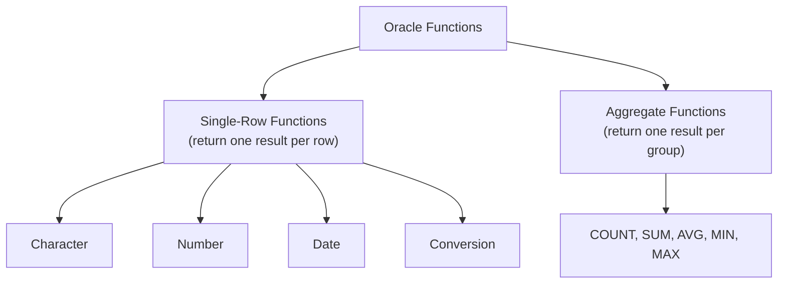

# 04. Functions in Oracle SQL

## Table of Contents
- [4.1 Overview of Functions](#41-overview-of-functions)
- [4.2 Character Functions](#42-character-functions)
- [4.3 Number Functions](#43-number-functions)
- [4.4 Date Functions](#44-date-functions)
- [4.5 Conversion Functions](#45-conversion-functions)
- [4.6 Aggregate Functions](#46-aggregate-functions)
- [4.7 Practice & Assessment](#47-practice--assessment)

---

## 4.1 Overview of Functions



| Type | Description | Example |
|------|-------------|---------|
| Single-Row | Returns one result for each row | `UPPER('hello')` → `'HELLO'` |
| Aggregate | Returns one result for a group of rows | `SUM(amount)` → total of all amounts |

---

## 4.2 Character Functions

### UPPER, LOWER, INITCAP

```sql
-- UPPER: Convert to uppercase
SELECT UPPER('hello world') FROM DUAL;
-- Output: HELLO WORLD

-- LOWER: Convert to lowercase
SELECT LOWER('HELLO WORLD') FROM DUAL;
-- Output: hello world

-- INITCAP: First letter of each word capitalized
SELECT INITCAP('hello world') FROM DUAL;
-- Output: Hello World
```

**Practical Use:**
```sql
-- Case-insensitive search
SELECT first_name FROM customers
WHERE UPPER(first_name) = 'RAVI';
```

### SUBSTR (Substring)

**Syntax:** `SUBSTR(string, start_position, length)`
- Position starts at 1 (not 0).
- If length is omitted, returns till end.

```sql
SELECT SUBSTR('Hello World', 1, 5) FROM DUAL;   -- Hello
SELECT SUBSTR('Hello World', 7) FROM DUAL;       -- World
SELECT SUBSTR('Hello World', -5) FROM DUAL;      -- World (from end)
```

**Practical Example:**
```sql
SELECT first_name, SUBSTR(first_name, 1, 3) AS short_name
FROM customers;
```

**Output:**
```
+------------+------------+
| FIRST_NAME | SHORT_NAME |
+------------+------------+
| Ravi       | Rav        |
| Priya      | Pri        |
| Amit       | Ami        |
| Sneha      | Sne        |
| Vikram     | Vik        |
+------------+------------+
```

### LENGTH

```sql
SELECT first_name, LENGTH(first_name) AS name_length
FROM customers;
```

**Output:**
```
+------------+-------------+
| FIRST_NAME | NAME_LENGTH |
+------------+-------------+
| Ravi       | 4           |
| Priya      | 5           |
| Amit       | 4           |
| Sneha      | 5           |
| Vikram     | 6           |
+------------+-------------+
```

### CONCAT and || (Concatenation)

```sql
-- CONCAT: joins two strings (only takes 2 arguments)
SELECT CONCAT('Hello', ' World') FROM DUAL;
-- Output: Hello World

-- || operator: joins multiple strings
SELECT first_name || ' ' || last_name AS full_name
FROM customers;
```

**Output:**
```
+--------------+
| FULL_NAME    |
+--------------+
| Ravi Kumar   |
| Priya Sharma |
| Amit Patel   |
| Sneha Reddy  |
| Vikram Singh |
+--------------+
```

### TRIM, LTRIM, RTRIM

```sql
-- TRIM: removes characters from both sides
SELECT TRIM('  Hello  ') FROM DUAL;          -- 'Hello'
SELECT TRIM('x' FROM 'xxHelloxx') FROM DUAL; -- 'Hello'

-- LTRIM: removes from left
SELECT LTRIM('   Hello') FROM DUAL;          -- 'Hello'

-- RTRIM: removes from right
SELECT RTRIM('Hello   ') FROM DUAL;          -- 'Hello'
```

### LPAD, RPAD (Padding)

```sql
-- LPAD: pads from left to reach specified length
SELECT LPAD('42', 5, '0') FROM DUAL;    -- '00042'
SELECT LPAD('Hi', 10, '*') FROM DUAL;   -- '********Hi'

-- RPAD: pads from right
SELECT RPAD('Hi', 10, '-') FROM DUAL;   -- 'Hi--------'
```

### REPLACE and TRANSLATE

```sql
-- REPLACE: replaces a substring
SELECT REPLACE('Hello World', 'World', 'Oracle') FROM DUAL;
-- Output: Hello Oracle

-- TRANSLATE: character-by-character replacement
SELECT TRANSLATE('Hello', 'Helo', 'JAVA') FROM DUAL;
-- H→J, e→A, l→V, o→A → Output: JAVVA
```

### INSTR (Find Position)

**Syntax:** `INSTR(string, search_string, start_pos, occurrence)`

```sql
SELECT INSTR('Hello World', 'o') FROM DUAL;        -- 5 (first 'o')
SELECT INSTR('Hello World', 'o', 6) FROM DUAL;     -- 8 (first 'o' from pos 6)
SELECT INSTR('Hello World', 'o', 1, 2) FROM DUAL;  -- 8 (2nd occurrence)
```

### Summary Table

| Function | Purpose | Example | Result |
|----------|---------|---------|--------|
| `UPPER(s)` | Uppercase | `UPPER('hi')` | `'HI'` |
| `LOWER(s)` | Lowercase | `LOWER('HI')` | `'hi'` |
| `INITCAP(s)` | Capitalize words | `INITCAP('hi there')` | `'Hi There'` |
| `SUBSTR(s,p,l)` | Extract substring | `SUBSTR('Hello',1,3)` | `'Hel'` |
| `LENGTH(s)` | String length | `LENGTH('Hello')` | `5` |
| `CONCAT(a,b)` | Join two strings | `CONCAT('A','B')` | `'AB'` |
| `TRIM(s)` | Remove spaces | `TRIM(' Hi ')` | `'Hi'` |
| `LPAD(s,n,c)` | Left pad | `LPAD('5',3,'0')` | `'005'` |
| `REPLACE(s,a,b)` | Replace substring | `REPLACE('Hi','i','ey')` | `'Hey'` |
| `INSTR(s,sub)` | Find position | `INSTR('Hello','l')` | `3` |

---

## 4.3 Number Functions

### ROUND

**Syntax:** `ROUND(number, decimal_places)`

```sql
SELECT ROUND(45.678, 2) FROM DUAL;   -- 45.68
SELECT ROUND(45.678, 0) FROM DUAL;   -- 46
SELECT ROUND(45.678, -1) FROM DUAL;  -- 50 (rounds to tens)
SELECT ROUND(1234.5, -2) FROM DUAL;  -- 1200
```

### TRUNC (Truncate — no rounding)

```sql
SELECT TRUNC(45.678, 2) FROM DUAL;   -- 45.67 (just cuts off)
SELECT TRUNC(45.678, 0) FROM DUAL;   -- 45
SELECT TRUNC(45.678, -1) FROM DUAL;  -- 40
```

### MOD (Modulo/Remainder)

```sql
SELECT MOD(10, 3) FROM DUAL;   -- 1
SELECT MOD(15, 5) FROM DUAL;   -- 0
SELECT MOD(7, 2) FROM DUAL;    -- 1 (odd number check)
```

### ABS, CEIL, FLOOR, POWER, SQRT

```sql
SELECT ABS(-25) FROM DUAL;         -- 25
SELECT CEIL(4.2) FROM DUAL;        -- 5 (rounds up)
SELECT FLOOR(4.9) FROM DUAL;       -- 4 (rounds down)
SELECT POWER(2, 10) FROM DUAL;     -- 1024
SELECT SQRT(144) FROM DUAL;        -- 12
```

### SIGN

```sql
SELECT SIGN(-5) FROM DUAL;   -- -1
SELECT SIGN(0) FROM DUAL;    -- 0
SELECT SIGN(10) FROM DUAL;   -- 1
```

### Summary Table

| Function | Purpose | Example | Result |
|----------|---------|---------|--------|
| `ROUND(n,d)` | Round to d decimal places | `ROUND(3.456,2)` | `3.46` |
| `TRUNC(n,d)` | Truncate to d decimal places | `TRUNC(3.456,2)` | `3.45` |
| `MOD(m,n)` | Remainder of m/n | `MOD(10,3)` | `1` |
| `ABS(n)` | Absolute value | `ABS(-7)` | `7` |
| `CEIL(n)` | Smallest integer >= n | `CEIL(4.1)` | `5` |
| `FLOOR(n)` | Largest integer <= n | `FLOOR(4.9)` | `4` |
| `POWER(m,n)` | m raised to power n | `POWER(2,3)` | `8` |
| `SQRT(n)` | Square root | `SQRT(25)` | `5` |

---

## 4.4 Date Functions

### Oracle DATE Format
Oracle stores dates internally as numbers. Default display format: `DD-MON-YY` (e.g., `15-JAN-24`).

### SYSDATE and CURRENT_DATE

```sql
-- Current date and time from database server
SELECT SYSDATE FROM DUAL;
-- Output: 03-MAY-26 (example)

-- Current date in session timezone
SELECT CURRENT_DATE FROM DUAL;

-- Current timestamp with fractional seconds
SELECT SYSTIMESTAMP FROM DUAL;
```

### Date Arithmetic

```sql
-- Add days to a date
SELECT SYSDATE + 7 AS next_week FROM DUAL;

-- Difference between dates (returns days)
SELECT SYSDATE - TO_DATE('2024-01-01','YYYY-MM-DD') AS days_since 
FROM DUAL;
```

### ADD_MONTHS

```sql
SELECT ADD_MONTHS(SYSDATE, 3) AS three_months_later FROM DUAL;
SELECT ADD_MONTHS(SYSDATE, -6) AS six_months_ago FROM DUAL;
```

### MONTHS_BETWEEN

```sql
SELECT MONTHS_BETWEEN(
    TO_DATE('2024-06-15','YYYY-MM-DD'),
    TO_DATE('2024-01-15','YYYY-MM-DD')
) AS months_diff FROM DUAL;
-- Output: 5
```

### NEXT_DAY

```sql
-- Next occurrence of a day of the week
SELECT NEXT_DAY(SYSDATE, 'MONDAY') FROM DUAL;
-- Returns the date of next Monday
```

### LAST_DAY

```sql
-- Last day of the month
SELECT LAST_DAY(TO_DATE('2024-02-10','YYYY-MM-DD')) FROM DUAL;
-- Output: 29-FEB-24 (2024 is leap year)
```

### ROUND and TRUNC for Dates

```sql
-- Round to nearest month
SELECT ROUND(TO_DATE('2024-01-17','YYYY-MM-DD'), 'MONTH') FROM DUAL;
-- Output: 01-FEB-24 (past 15th, rounds up)

-- Truncate to beginning of month
SELECT TRUNC(TO_DATE('2024-01-17','YYYY-MM-DD'), 'MONTH') FROM DUAL;
-- Output: 01-JAN-24

-- Truncate to beginning of year
SELECT TRUNC(SYSDATE, 'YEAR') FROM DUAL;
-- Output: 01-JAN-26
```

### EXTRACT

```sql
SELECT EXTRACT(YEAR FROM SYSDATE) AS yr,
       EXTRACT(MONTH FROM SYSDATE) AS mn,
       EXTRACT(DAY FROM SYSDATE) AS dy
FROM DUAL;
-- Output: 2026, 5, 3
```

### Summary Table

| Function | Purpose | Example |
|----------|---------|---------|
| `SYSDATE` | Current date/time | System clock |
| `ADD_MONTHS(d, n)` | Add n months | `ADD_MONTHS(SYSDATE, 3)` |
| `MONTHS_BETWEEN(d1, d2)` | Months between two dates | Returns number |
| `NEXT_DAY(d, day)` | Next specified weekday | `NEXT_DAY(SYSDATE,'FRI')` |
| `LAST_DAY(d)` | Last day of the month | `LAST_DAY(SYSDATE)` |
| `ROUND(d, fmt)` | Round date to format | `ROUND(d, 'MONTH')` |
| `TRUNC(d, fmt)` | Truncate date | `TRUNC(d, 'YEAR')` |
| `EXTRACT(part FROM d)` | Extract year/month/day | `EXTRACT(YEAR FROM d)` |

---

## 4.5 Conversion Functions

### TO_CHAR (Date/Number → String)

```sql
-- Date to String
SELECT TO_CHAR(SYSDATE, 'DD-MM-YYYY') FROM DUAL;      -- 03-05-2026
SELECT TO_CHAR(SYSDATE, 'Day, Month DD, YYYY') FROM DUAL; -- Sunday, May 03, 2026
SELECT TO_CHAR(SYSDATE, 'HH24:MI:SS') FROM DUAL;      -- 14:30:45

-- Number to String (with formatting)
SELECT TO_CHAR(12345.67, '99,999.99') FROM DUAL;    -- 12,345.67
SELECT TO_CHAR(12345.67, '$99,999.00') FROM DUAL;   -- $12,345.67
SELECT TO_CHAR(5, '0000') FROM DUAL;                -- 0005
```

### Common Date Format Models

| Format | Meaning | Example |
|--------|---------|---------|
| `YYYY` | 4-digit year | 2024 |
| `YY` | 2-digit year | 24 |
| `MM` | Month number | 01-12 |
| `MON` | Abbreviated month | JAN, FEB |
| `MONTH` | Full month name | JANUARY |
| `DD` | Day of month | 01-31 |
| `DY` | Abbreviated day | MON, TUE |
| `DAY` | Full day name | MONDAY |
| `HH24` | Hour (24-hour) | 00-23 |
| `MI` | Minutes | 00-59 |
| `SS` | Seconds | 00-59 |

### TO_DATE (String → Date)

```sql
SELECT TO_DATE('15-01-2024', 'DD-MM-YYYY') FROM DUAL;
SELECT TO_DATE('2024/03/20', 'YYYY/MM/DD') FROM DUAL;
SELECT TO_DATE('January 15, 2024', 'Month DD, YYYY') FROM DUAL;
```

**Common Error:**
```sql
-- ORA-01858: a non-numeric character was found where a numeric was expected
SELECT TO_DATE('15/01/2024', 'DD-MM-YYYY') FROM DUAL;
-- Fix: format must MATCH the string pattern
SELECT TO_DATE('15/01/2024', 'DD/MM/YYYY') FROM DUAL;
```

### TO_NUMBER (String → Number)

```sql
SELECT TO_NUMBER('12345') FROM DUAL;            -- 12345
SELECT TO_NUMBER('12,345.67', '99,999.99') FROM DUAL;  -- 12345.67
```

### NVL (Replace NULL)

```sql
-- NVL(value, replacement_if_null)
SELECT first_name, NVL(email, 'No Email') AS email
FROM customers;
```

**Output:**
```
+------------+-----------------+
| FIRST_NAME | EMAIL           |
+------------+-----------------+
| Ravi       | ravi@email.com  |
| Priya      | priya@email.com |
| Amit       | amit@email.com  |
| Sneha      | sneha@email.com |
| Vikram     | No Email        |
+------------+-----------------+
```

### NVL2

```sql
-- NVL2(value, if_not_null, if_null)
SELECT first_name, 
       NVL2(email, 'Has Email', 'No Email') AS email_status
FROM customers;
```

### NULLIF

```sql
-- NULLIF(a, b): returns NULL if a = b, otherwise returns a
SELECT NULLIF(10, 10) FROM DUAL;   -- NULL
SELECT NULLIF(10, 20) FROM DUAL;   -- 10
```

### COALESCE

```sql
-- COALESCE: returns first non-NULL value
SELECT COALESCE(NULL, NULL, 'Third', 'Fourth') FROM DUAL;
-- Output: Third

SELECT first_name, 
       COALESCE(email, city || '@default.com') AS contact
FROM customers;
```

### DECODE (Oracle-specific IF-ELSE)

```sql
SELECT order_id, status,
       DECODE(status,
              'DELIVERED', 'Complete',
              'SHIPPED',   'In Transit',
              'PENDING',   'Waiting',
              'Other') AS status_text
FROM orders;
```

### CASE Expression (Standard SQL)

```sql
SELECT order_id, amount,
       CASE 
           WHEN amount >= 3000 THEN 'High'
           WHEN amount >= 1500 THEN 'Medium'
           ELSE 'Low'
       END AS order_category
FROM orders;
```

**Output:**
```
+----------+---------+----------------+
| ORDER_ID | AMOUNT  | ORDER_CATEGORY |
+----------+---------+----------------+
| 1001     | 2500.00 | Medium         |
| 1002     | 1800.50 | Medium         |
| 1003     | 3200.00 | High           |
| 1004     | 950.75  | Low            |
| 1005     | 4100.00 | High           |
| 1006     | 1500.00 | Medium         |
| 1007     | 750.25  | Low            |
| 1008     | 2200.00 | Medium         |
+----------+---------+----------------+
```

---

## 4.6 Aggregate Functions

### Definition
Aggregate functions operate on a set of rows and return a single result.

| Function | Purpose |
|----------|---------|
| `COUNT()` | Number of rows |
| `SUM()` | Total of values |
| `AVG()` | Average of values |
| `MIN()` | Smallest value |
| `MAX()` | Largest value |

### Examples

```sql
-- COUNT
SELECT COUNT(*) AS total_orders FROM orders;                    -- 8
SELECT COUNT(email) AS has_email FROM customers;               -- 4 (ignores NULL)
SELECT COUNT(DISTINCT status) AS unique_statuses FROM orders;  -- 4

-- SUM
SELECT SUM(amount) AS total_revenue FROM orders;
-- Output: 17000.50 (sum of all amounts)

-- AVG
SELECT ROUND(AVG(amount), 2) AS avg_order FROM orders;
-- Output: 2125.06

-- MIN and MAX
SELECT MIN(amount) AS smallest, MAX(amount) AS largest
FROM orders;
-- Output: 750.25, 4100.00

-- Combined with GROUP BY
SELECT status, 
       COUNT(*) AS cnt,
       SUM(amount) AS total,
       ROUND(AVG(amount), 2) AS avg_amt
FROM orders
GROUP BY status;
```

**Output:**
```
+-----------+-----+---------+---------+
| STATUS    | CNT | TOTAL   | AVG_AMT |
+-----------+-----+---------+---------+
| DELIVERED | 3   | 8400.50 | 2800.17 |
| SHIPPED   | 2   | 5400.00 | 2700.00 |
| PENDING   | 2   | 1701.00 | 850.50  |
| CANCELLED | 1   | 1500.00 | 1500.00 |
+-----------+-----+---------+---------+
```

### Important Notes
- `COUNT(*)` counts all rows including NULLs.
- `COUNT(column)` counts only non-NULL values.
- `SUM`, `AVG` ignore NULL values.
- Cannot use aggregate functions in WHERE — use HAVING instead.

---

## 4.7 Practice & Assessment

### MCQs

**Q1.** `SUBSTR('Oracle', 2, 3)` returns:
- A) Ora
- B) rac
- C) racl
- D) cle

**Answer:** B) rac (starts at position 2, takes 3 characters)

---

**Q2.** `NVL(NULL, 'Hello')` returns:
- A) NULL
- B) 'Hello'
- C) Error
- D) 0

**Answer:** B) 'Hello'

---

**Q3.** `TRUNC(45.678, 1)` returns:
- A) 45.7
- B) 45.6
- C) 46
- D) 45.67

**Answer:** B) 45.6 (truncates, no rounding)

---

**Q4.** Which function returns the last day of the month?
- A) END_MONTH
- B) LAST_DAY
- C) MONTH_END
- D) LAST_DATE

**Answer:** B) LAST_DAY

---

**Q5.** `COUNT(column_name)` vs `COUNT(*)`:
- A) They are identical
- B) COUNT(*) ignores NULLs, COUNT(col) doesn't
- C) COUNT(col) ignores NULLs, COUNT(*) counts all rows
- D) COUNT(*) is faster

**Answer:** C) COUNT(col) ignores NULLs, COUNT(*) counts all rows

---

**Q6.** `TO_CHAR(SYSDATE, 'YYYY')` returns:
- A) The full date string
- B) Just the 4-digit year as a string
- C) The month
- D) Error

**Answer:** B) Just the 4-digit year as a string

---

### SQL Coding Problems

**Problem 1:** Display customer names in format "KUMAR, Ravi" (last name uppercase, first name as-is).
```sql
-- Solution:
SELECT UPPER(last_name) || ', ' || first_name AS formatted_name
FROM customers;
```

**Problem 2:** Find customers who joined more than 12 months ago from today.
```sql
-- Solution:
SELECT first_name, join_date
FROM customers
WHERE MONTHS_BETWEEN(SYSDATE, join_date) > 12;
```

**Problem 3:** Replace NULL emails with 'firstname@company.com' pattern.
```sql
-- Solution:
SELECT first_name,
       NVL(email, LOWER(first_name) || '@company.com') AS email
FROM customers;
```

---

### Output Prediction

**P1.**
```sql
SELECT LENGTH('Hello') + INSTR('Hello', 'l') FROM DUAL;
```
**Answer:** `5 + 3 = 8`

**P2.**
```sql
SELECT ROUND(15.5) - TRUNC(15.5) FROM DUAL;
```
**Answer:** `16 - 15 = 1`

**P3.**
```sql
SELECT NVL(NULL, NVL(NULL, 'Found')) FROM DUAL;
```
**Answer:** `'Found'` (inner NVL returns 'Found', outer NVL gets 'Found' which is not NULL)

---

### Interview Questions

1. **What is the difference between ROUND and TRUNC?**
2. **Explain NVL, NVL2, COALESCE — when to use each?**
3. **What is the difference between DECODE and CASE?**
4. **How do aggregate functions handle NULL values?**
5. **Explain TO_CHAR and TO_DATE with examples.**
6. **What is the difference between CONCAT and `||`?**
7. **What does `MONTHS_BETWEEN` return — is it always a whole number?**
8. **How does SUBSTR handle negative start positions?**
9. **What is the difference between TRIM, LTRIM, and RTRIM?**
10. **Can you use aggregate functions in the WHERE clause? Why not?**

---

> **Next Topic**: [05 - Joins](05-joins.md)
