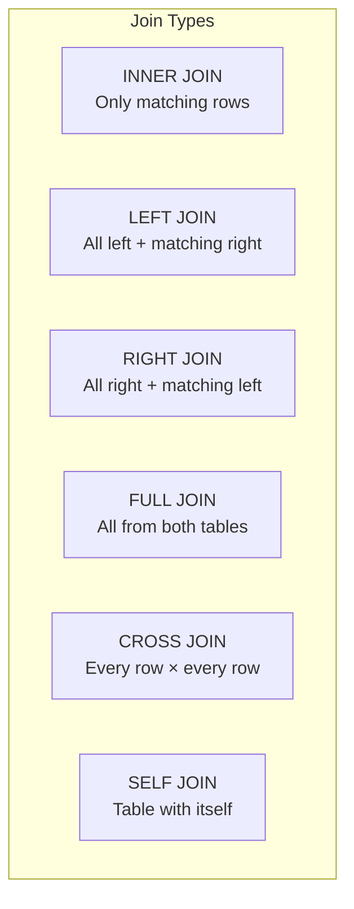
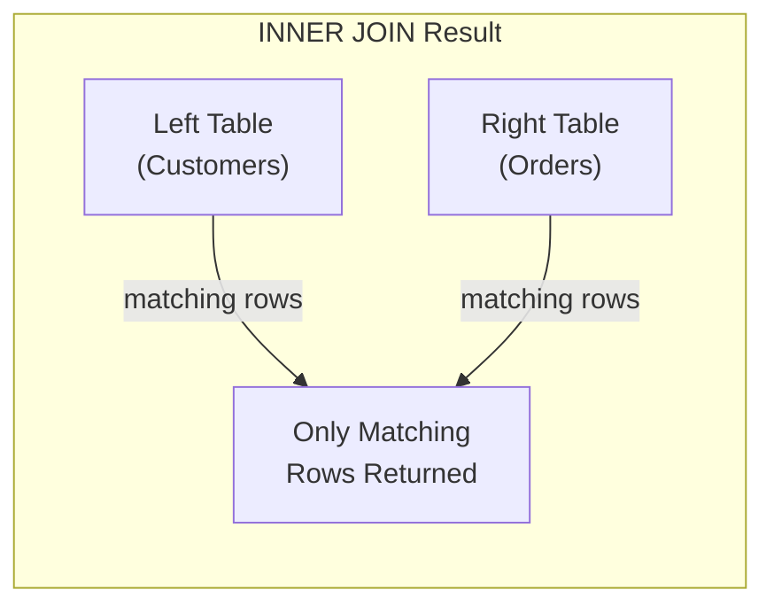
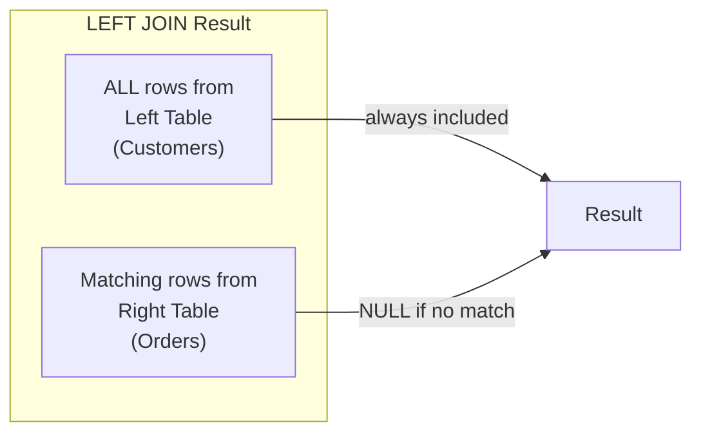
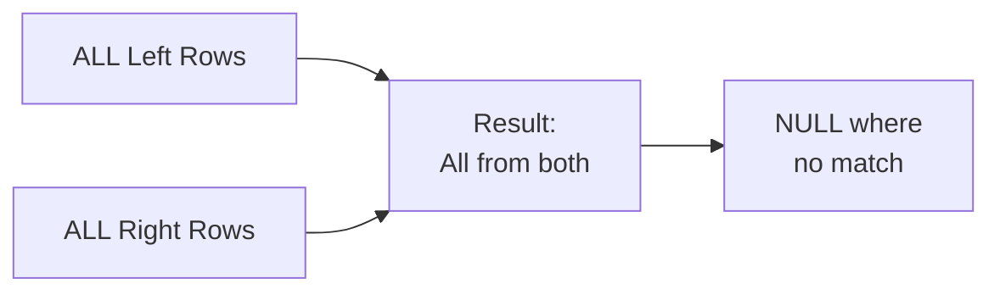

# 05. Joins in Oracle SQL

## Table of Contents
- [5.1 What are Joins?](#51-what-are-joins)
- [5.2 INNER JOIN](#52-inner-join)
- [5.3 LEFT OUTER JOIN](#53-left-outer-join)
- [5.4 RIGHT OUTER JOIN](#54-right-outer-join)
- [5.5 FULL OUTER JOIN](#55-full-outer-join)
- [5.6 SELF JOIN](#56-self-join)
- [5.7 CROSS JOIN](#57-cross-join)
- [5.8 Join Comparison Summary](#58-join-comparison-summary)
- [5.9 Practice & Assessment](#59-practice--assessment)

---

## 5.1 What are Joins?

### Definition
A **JOIN** combines rows from two or more tables based on a related column (usually a foreign key relationship). Joins let you retrieve data that is spread across multiple tables.

### Join Diagram Overview



### Sample Tables for Examples

**CUSTOMERS:**
```
+-------------+------------+-----------+-----------+
| CUSTOMER_ID | FIRST_NAME | LAST_NAME | CITY      |
+-------------+------------+-----------+-----------+
| 1           | Ravi       | Kumar     | Mumbai    |
| 2           | Priya      | Sharma    | Delhi     |
| 3           | Amit       | Patel     | Ahmedabad |
| 4           | Sneha      | Reddy     | Hyderabad |
| 5           | Vikram     | Singh     | Mumbai    |
+-------------+------------+-----------+-----------+
```

**ORDERS:**
```
+----------+-------------+---------+-----------+
| ORDER_ID | CUSTOMER_ID | AMOUNT  | STATUS    |
+----------+-------------+---------+-----------+
| 1001     | 1           | 2500.00 | DELIVERED |
| 1002     | 1           | 1800.50 | DELIVERED |
| 1003     | 2           | 3200.00 | SHIPPED   |
| 1004     | 3           | 950.75  | PENDING   |
| 1005     | 2           | 4100.00 | DELIVERED |
| 1006     | 4           | 1500.00 | CANCELLED |
| 1007     | 1           | 750.25  | PENDING   |
| 1008     | 3           | 2200.00 | SHIPPED   |
+----------+-------------+---------+-----------+
```

> Note: Customer 5 (Vikram) has NO orders.

---

## 5.2 INNER JOIN

### Definition
Returns **only** the rows where there is a match in **both** tables. If a row in the left table has no match in the right table, it is excluded.

### Visual



### Syntax

```sql
-- Modern ANSI syntax (recommended)
SELECT columns
FROM table1
INNER JOIN table2 ON table1.column = table2.column;

-- Old Oracle syntax (still works)
SELECT columns
FROM table1, table2
WHERE table1.column = table2.column;
```

### Examples

**Example 1: Basic INNER JOIN**
```sql
SELECT c.first_name, c.last_name, o.order_id, o.amount
FROM customers c
INNER JOIN orders o ON c.customer_id = o.customer_id;
```

**Output:**
```
+------------+-----------+----------+---------+
| FIRST_NAME | LAST_NAME | ORDER_ID | AMOUNT  |
+------------+-----------+----------+---------+
| Ravi       | Kumar     | 1001     | 2500.00 |
| Ravi       | Kumar     | 1002     | 1800.50 |
| Ravi       | Kumar     | 1007     | 750.25  |
| Priya      | Sharma    | 1003     | 3200.00 |
| Priya      | Sharma    | 1005     | 4100.00 |
| Amit       | Patel     | 1004     | 950.75  |
| Amit       | Patel     | 1008     | 2200.00 |
| Sneha      | Reddy     | 1006     | 1500.00 |
+------------+-----------+----------+---------+
```

> **Notice:** Vikram (customer_id=5) is NOT in the result because he has no orders.

**Example 2: With additional filter**
```sql
SELECT c.first_name, o.order_id, o.amount
FROM customers c
INNER JOIN orders o ON c.customer_id = o.customer_id
WHERE o.status = 'DELIVERED'
ORDER BY o.amount DESC;
```

**Output:**
```
+------------+----------+---------+
| FIRST_NAME | ORDER_ID | AMOUNT  |
+------------+----------+---------+
| Priya      | 1005     | 4100.00 |
| Ravi       | 1001     | 2500.00 |
| Ravi       | 1002     | 1800.50 |
+------------+----------+---------+
```

---

## 5.3 LEFT OUTER JOIN

### Definition
Returns **all rows from the left table** and matching rows from the right table. If no match exists, the right side columns show NULL.

### Visual



### Syntax

```sql
-- ANSI syntax
SELECT columns
FROM table1
LEFT OUTER JOIN table2 ON table1.column = table2.column;

-- Old Oracle syntax (+ on right side)
SELECT columns
FROM table1, table2
WHERE table1.column = table2.column(+);
```

### Example

```sql
SELECT c.first_name, c.last_name, o.order_id, o.amount
FROM customers c
LEFT OUTER JOIN orders o ON c.customer_id = o.customer_id;
```

**Output:**
```
+------------+-----------+----------+---------+
| FIRST_NAME | LAST_NAME | ORDER_ID | AMOUNT  |
+------------+-----------+----------+---------+
| Ravi       | Kumar     | 1001     | 2500.00 |
| Ravi       | Kumar     | 1002     | 1800.50 |
| Ravi       | Kumar     | 1007     | 750.25  |
| Priya      | Sharma    | 1003     | 3200.00 |
| Priya      | Sharma    | 1005     | 4100.00 |
| Amit       | Patel     | 1004     | 950.75  |
| Amit       | Patel     | 1008     | 2200.00 |
| Sneha      | Reddy     | 1006     | 1500.00 |
| Vikram     | Singh     | NULL     | NULL    |
+------------+-----------+----------+---------+
```

> **Notice:** Vikram appears with NULL for order columns because he has no orders.

### Use Case: Find customers with NO orders

```sql
SELECT c.first_name, c.last_name
FROM customers c
LEFT OUTER JOIN orders o ON c.customer_id = o.customer_id
WHERE o.order_id IS NULL;
```

**Output:**
```
+------------+-----------+
| FIRST_NAME | LAST_NAME |
+------------+-----------+
| Vikram     | Singh     |
+------------+-----------+
```

---

## 5.4 RIGHT OUTER JOIN

### Definition
Returns **all rows from the right table** and matching rows from the left table. If no match exists, the left side columns show NULL.

### Syntax

```sql
SELECT columns
FROM table1
RIGHT OUTER JOIN table2 ON table1.column = table2.column;
```

### Example

```sql
-- Right join (all orders, even if customer is deleted/missing)
SELECT c.first_name, o.order_id, o.amount
FROM customers c
RIGHT OUTER JOIN orders o ON c.customer_id = o.customer_id;
```

> In our data, every order has a valid customer_id, so this gives the same result as INNER JOIN. RIGHT JOIN is useful when the right table might have orphan records.

### When to Use
- RIGHT JOIN is less common. Most queries can be rewritten as LEFT JOIN by swapping table order.
- Use when you want "all orders including those without a valid customer."

---

## 5.5 FULL OUTER JOIN

### Definition
Returns **all rows from both tables**. Where there's a match, columns are filled. Where there's no match, NULLs appear.

### Visual



### Syntax

```sql
SELECT columns
FROM table1
FULL OUTER JOIN table2 ON table1.column = table2.column;
```

### Example

Let's add an order with a non-existent customer for illustration:

```sql
-- Assuming order 1009 has customer_id = 99 (doesn't exist in customers)
-- FULL OUTER JOIN would show:
SELECT c.first_name, o.order_id, o.amount
FROM customers c
FULL OUTER JOIN orders o ON c.customer_id = o.customer_id;
```

**Conceptual Output:**
```
+------------+----------+---------+
| FIRST_NAME | ORDER_ID | AMOUNT  |
+------------+----------+---------+
| Ravi       | 1001     | 2500.00 |
| Ravi       | 1002     | 1800.50 |
| ...        | ...      | ...     |
| Vikram     | NULL     | NULL    |  ← Customer with no order
| NULL       | 1009     | 500.00  |  ← Order with no valid customer
+------------+----------+---------+
```

---

## 5.6 SELF JOIN

### Definition
A table is joined **with itself**. Useful for comparing rows within the same table or for hierarchical data.

### Example: Employees and Managers

```sql
-- Create employees table with manager relationship
CREATE TABLE employees (
    emp_id    NUMBER(5) PRIMARY KEY,
    emp_name  VARCHAR2(30),
    manager_id NUMBER(5) REFERENCES employees(emp_id)
);

INSERT INTO employees VALUES (1, 'Amit', NULL);     -- CEO, no manager
INSERT INTO employees VALUES (2, 'Ravi', 1);        -- Reports to Amit
INSERT INTO employees VALUES (3, 'Priya', 1);       -- Reports to Amit
INSERT INTO employees VALUES (4, 'Sneha', 2);       -- Reports to Ravi
INSERT INTO employees VALUES (5, 'Vikram', 2);      -- Reports to Ravi
COMMIT;
```

```sql
-- Find each employee and their manager's name
SELECT e.emp_name AS employee, 
       m.emp_name AS manager
FROM employees e
LEFT JOIN employees m ON e.manager_id = m.emp_id;
```

**Output:**
```
+----------+---------+
| EMPLOYEE | MANAGER |
+----------+---------+
| Amit     | NULL    |
| Ravi     | Amit    |
| Priya    | Amit    |
| Sneha    | Ravi    |
| Vikram   | Ravi    |
+----------+---------+
```

### Example: Find customers in the same city

```sql
SELECT c1.first_name AS customer1, 
       c2.first_name AS customer2,
       c1.city
FROM customers c1
JOIN customers c2 ON c1.city = c2.city
WHERE c1.customer_id < c2.customer_id;  -- avoid duplicates
```

**Output:**
```
+-----------+-----------+--------+
| CUSTOMER1 | CUSTOMER2 | CITY   |
+-----------+-----------+--------+
| Ravi      | Vikram    | Mumbai |
+-----------+-----------+--------+
```

---

## 5.7 CROSS JOIN

### Definition
Returns the **Cartesian product** — every row from the first table combined with every row from the second table. If table A has 5 rows and table B has 8 rows, result has 5 × 8 = 40 rows.

### Syntax

```sql
-- Explicit CROSS JOIN
SELECT columns
FROM table1
CROSS JOIN table2;

-- Implicit (no WHERE clause)
SELECT columns
FROM table1, table2;
```

### Example

```sql
-- Small example
SELECT c.first_name, o.status
FROM customers c
CROSS JOIN (SELECT DISTINCT status FROM orders) o;
```

**Output (partial):** Each customer paired with each status = 5 × 4 = 20 rows.
```
+------------+-----------+
| FIRST_NAME | STATUS    |
+------------+-----------+
| Ravi       | DELIVERED |
| Ravi       | SHIPPED   |
| Ravi       | PENDING   |
| Ravi       | CANCELLED |
| Priya      | DELIVERED |
| Priya      | SHIPPED   |
| ...        | ...       |
+------------+-----------+
```

### When to Use
- Generating all possible combinations (e.g., all products × all stores).
- Creating test data.
- Usually NOT what you want — be careful of accidental cross joins.

---

## 5.8 Join Comparison Summary

| Join Type | Returns | NULL behavior |
|-----------|---------|---------------|
| INNER JOIN | Only matching rows from both | No NULLs from join |
| LEFT JOIN | All left + matching right | NULL for unmatched right |
| RIGHT JOIN | All right + matching left | NULL for unmatched left |
| FULL JOIN | All from both | NULL on both sides for unmatched |
| SELF JOIN | Table joined with itself | Depends on join type used |
| CROSS JOIN | Cartesian product (all × all) | No NULLs from join |

### Performance Tips
- Always use **indexed columns** in JOIN conditions.
- INNER JOIN is usually fastest (smallest result set).
- Avoid CROSS JOIN on large tables (exponential rows).
- Use table aliases for readability.
- Prefer ANSI JOIN syntax over old comma-separated style.

---

## 5.9 Practice & Assessment

### MCQs

**Q1.** An INNER JOIN returns:
- A) All rows from both tables
- B) Only rows where the join condition matches in both tables
- C) All rows from the left table
- D) The Cartesian product

**Answer:** B) Only rows where the join condition matches in both tables

---

**Q2.** A LEFT OUTER JOIN shows NULL values when:
- A) The left table has no matching row in the right table
- B) The right table has no matching row in the left table
- C) Both tables have NULLs
- D) Never shows NULLs

**Answer:** B) The right table has no matching row in the left table

---

**Q3.** If Table A has 5 rows and Table B has 4 rows, a CROSS JOIN produces:
- A) 5 rows
- B) 4 rows
- C) 9 rows
- D) 20 rows

**Answer:** D) 20 rows (5 × 4)

---

**Q4.** Which join is used to find an employee's manager from the same table?
- A) INNER JOIN
- B) LEFT JOIN
- C) SELF JOIN
- D) CROSS JOIN

**Answer:** C) SELF JOIN

---

**Q5.** In old Oracle syntax, `table1.col = table2.col(+)` is equivalent to:
- A) INNER JOIN
- B) LEFT OUTER JOIN
- C) RIGHT OUTER JOIN
- D) FULL OUTER JOIN

**Answer:** B) LEFT OUTER JOIN (the `(+)` is on the right/deficient side)

---

### SQL Coding Problems

**Problem 1:** Write a query to show all customers and their total order amounts. Include customers with no orders (show 0).
```sql
-- Solution:
SELECT c.first_name, c.last_name, 
       NVL(SUM(o.amount), 0) AS total_spent
FROM customers c
LEFT JOIN orders o ON c.customer_id = o.customer_id
GROUP BY c.first_name, c.last_name;
```

**Problem 2:** Find pairs of customers who live in the same city (no duplicates).
```sql
-- Solution:
SELECT c1.first_name || ' ' || c1.last_name AS customer1,
       c2.first_name || ' ' || c2.last_name AS customer2,
       c1.city
FROM customers c1
JOIN customers c2 ON c1.city = c2.city 
                 AND c1.customer_id < c2.customer_id;
```

**Problem 3:** List all customers who have NEVER placed an order.
```sql
-- Solution:
SELECT c.first_name, c.last_name
FROM customers c
LEFT JOIN orders o ON c.customer_id = o.customer_id
WHERE o.order_id IS NULL;
```

---

### Output Prediction

**P1.** How many rows does this return?
```sql
SELECT c.first_name, o.order_id
FROM customers c
INNER JOIN orders o ON c.customer_id = o.customer_id;
```
**Answer:** 8 rows (all orders have valid customers, and there are 8 orders)

**P2.** How many rows does LEFT JOIN return?
```sql
SELECT c.first_name, o.order_id
FROM customers c
LEFT JOIN orders o ON c.customer_id = o.customer_id;
```
**Answer:** 9 rows (8 matched + 1 for Vikram with NULL)

---

### Interview Questions

1. **What is the difference between INNER JOIN and LEFT JOIN?**
2. **When would you use a FULL OUTER JOIN?**
3. **Explain SELF JOIN with a real-world example.**
4. **What is a Cartesian product and when does it happen?**
5. **Can you join more than 2 tables? How?**
6. **What is the difference between ON and WHERE in a JOIN?**
7. **How do you find records that exist in one table but not another?**
8. **What is the old Oracle (+) syntax for outer joins?**
9. **How does JOIN performance relate to indexes?**
10. **What is a NATURAL JOIN? Why is it risky?**

---

> **Next Topic**: [06 - Subqueries](06-subqueries.md)
