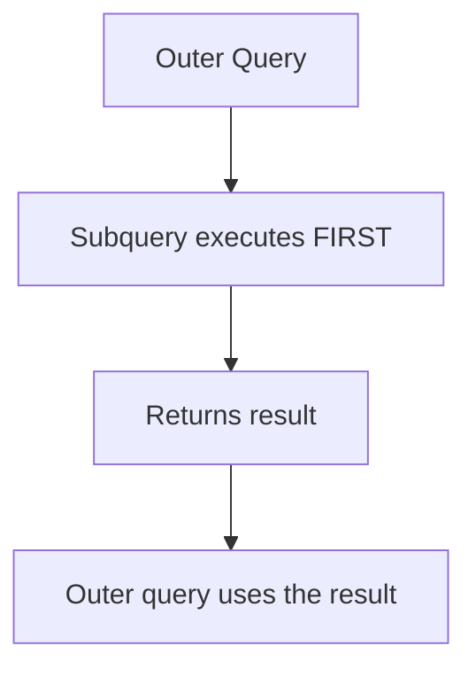

# 06. Subqueries in Oracle SQL

## Table of Contents
- [6.1 What is a Subquery?](#61-what-is-a-subquery)
- [6.2 Single-Row Subquery](#62-single-row-subquery)
- [6.3 Multiple-Row Subquery](#63-multiple-row-subquery)
- [6.4 Correlated Subquery](#64-correlated-subquery)
- [6.5 Nested Subquery](#65-nested-subquery)
- [6.6 Subqueries in Different Clauses](#66-subqueries-in-different-clauses)
- [6.7 Practice & Assessment](#67-practice--assessment)

---

## 6.1 What is a Subquery?

### Definition
A **subquery** (also called inner query or nested query) is a query written inside another query. The inner query runs first, and its result is used by the outer query.

### Syntax
```sql
SELECT columns
FROM table
WHERE column OPERATOR (SELECT column FROM table WHERE condition);
```



### Types of Subqueries

| Type | Returns | Used With |
|------|---------|-----------|
| Single-row | One value (one row, one column) | `=`, `>`, `<`, `>=`, `<=` |
| Multiple-row | Multiple values | `IN`, `ANY`, `ALL` |
| Correlated | Depends on outer query row | `EXISTS`, row-by-row |
| Nested | Subquery inside subquery | Any operator |

---

## 6.2 Single-Row Subquery

### Definition
Returns **exactly one row and one column**. Used with single-row operators: `=`, `>`, `<`, `>=`, `<=`, `<>`.

### Examples

**Example 1: Find customers who placed the highest order**
```sql
SELECT c.first_name, c.last_name
FROM customers c
JOIN orders o ON c.customer_id = o.customer_id
WHERE o.amount = (SELECT MAX(amount) FROM orders);
```

**How it works:**
1. Inner query: `SELECT MAX(amount) FROM orders` → returns `4100.00`
2. Outer query: finds the customer whose order amount = 4100.00

**Output:**
```
+------------+-----------+
| FIRST_NAME | LAST_NAME |
+------------+-----------+
| Priya      | Sharma    |
+------------+-----------+
```

**Example 2: Find orders above average amount**
```sql
SELECT order_id, amount
FROM orders
WHERE amount > (SELECT AVG(amount) FROM orders);
```

**How it works:**
1. Inner: `AVG(amount)` = 2125.06
2. Outer: returns orders where amount > 2125.06

**Output:**
```
+----------+---------+
| ORDER_ID | AMOUNT  |
+----------+---------+
| 1001     | 2500.00 |
| 1003     | 3200.00 |
| 1005     | 4100.00 |
| 1008     | 2200.00 |
+----------+---------+
```

**Example 3: Find the customer who joined most recently**
```sql
SELECT first_name, join_date
FROM customers
WHERE join_date = (SELECT MAX(join_date) FROM customers);
```

**Output:**
```
+------------+------------+
| FIRST_NAME | JOIN_DATE  |
+------------+------------+
| Vikram     | 05-JAN-24  |
+------------+------------+
```

### Common Error
```sql
-- ERROR: ORA-01427: single-row subquery returns more than one row
SELECT first_name FROM customers
WHERE city = (SELECT city FROM customers WHERE customer_id > 1);
-- Subquery returns multiple cities! Use IN instead of =
```

---

## 6.3 Multiple-Row Subquery

### Definition
Returns **more than one row**. Must use multi-row operators: `IN`, `ANY`, `ALL`.

| Operator | Meaning |
|----------|---------|
| `IN` | Equal to any value in the list |
| `ANY` | Compares to any value (at least one must be true) |
| `ALL` | Compares to all values (all must be true) |

### Examples with IN

**Example 1: Customers who have placed orders**
```sql
SELECT first_name, last_name
FROM customers
WHERE customer_id IN (SELECT DISTINCT customer_id FROM orders);
```

**Output:**
```
+------------+-----------+
| FIRST_NAME | LAST_NAME |
+------------+-----------+
| Ravi       | Kumar     |
| Priya      | Sharma    |
| Amit       | Patel     |
| Sneha      | Reddy     |
+------------+-----------+
```
> Vikram excluded — he has no orders.

**Example 2: Customers who have NOT placed orders**
```sql
SELECT first_name, last_name
FROM customers
WHERE customer_id NOT IN (SELECT DISTINCT customer_id FROM orders);
```

**Output:**
```
+------------+-----------+
| FIRST_NAME | LAST_NAME |
+------------+-----------+
| Vikram     | Singh     |
+------------+-----------+
```

### Examples with ANY

**`> ANY` means "greater than the smallest value in the list"**

```sql
-- Orders with amount greater than ANY pending order amount
SELECT order_id, amount
FROM orders
WHERE amount > ANY (SELECT amount FROM orders WHERE status = 'PENDING');
```

**How it works:**
1. Inner query returns pending amounts: 950.75, 750.25
2. `> ANY` means > 750.25 (the smallest)
3. Almost all orders qualify

### Examples with ALL

**`> ALL` means "greater than the largest value in the list"**

```sql
-- Orders with amount greater than ALL pending order amounts
SELECT order_id, amount
FROM orders
WHERE amount > ALL (SELECT amount FROM orders WHERE status = 'PENDING');
```

**How it works:**
1. Inner query returns: 950.75, 750.25
2. `> ALL` means > 950.75 (must be greater than ALL values)

**Output:**
```
+----------+---------+
| ORDER_ID | AMOUNT  |
+----------+---------+
| 1001     | 2500.00 |
| 1002     | 1800.50 |
| 1003     | 3200.00 |
| 1005     | 4100.00 |
| 1006     | 1500.00 |
| 1008     | 2200.00 |
+----------+---------+
```

---

## 6.4 Correlated Subquery

### Definition
A **correlated subquery** references a column from the outer query. It executes **once for each row** of the outer query (row by row). This is different from a regular subquery which executes only once.

### Example 1: Find orders above the customer's average

```sql
SELECT o.order_id, o.customer_id, o.amount
FROM orders o
WHERE o.amount > (
    SELECT AVG(o2.amount)
    FROM orders o2
    WHERE o2.customer_id = o.customer_id   -- references outer query!
);
```

**How it works:**
- For each order row, the subquery calculates the average for THAT customer.
- Order is included only if its amount exceeds that customer's average.

**Output:**
```
+----------+-------------+---------+
| ORDER_ID | CUSTOMER_ID | AMOUNT  |
+----------+-------------+---------+
| 1001     | 1           | 2500.00 |  (Ravi avg=1683.58, 2500>1683)
| 1005     | 2           | 4100.00 |  (Priya avg=3650, 4100>3650)
| 1008     | 3           | 2200.00 |  (Amit avg=1575.38, 2200>1575)
+----------+-------------+---------+
```

### Example 2: EXISTS (most common use of correlated subquery)

`EXISTS` returns TRUE if the subquery returns at least one row.

```sql
-- Customers who have at least one order
SELECT c.first_name, c.last_name
FROM customers c
WHERE EXISTS (
    SELECT 1 FROM orders o WHERE o.customer_id = c.customer_id
);
```

**Output:**
```
+------------+-----------+
| FIRST_NAME | LAST_NAME |
+------------+-----------+
| Ravi       | Kumar     |
| Priya      | Sharma    |
| Amit       | Patel     |
| Sneha      | Reddy     |
+------------+-----------+
```

```sql
-- NOT EXISTS: Customers with NO orders
SELECT c.first_name, c.last_name
FROM customers c
WHERE NOT EXISTS (
    SELECT 1 FROM orders o WHERE o.customer_id = c.customer_id
);
```

**Output:**
```
+------------+-----------+
| FIRST_NAME | LAST_NAME |
+------------+-----------+
| Vikram     | Singh     |
+------------+-----------+
```

### EXISTS vs IN

| Aspect | EXISTS | IN |
|--------|--------|-----|
| How it works | Checks if subquery returns any row | Checks if value is in a list |
| NULL handling | Handles NULLs correctly | `NOT IN` fails with NULLs |
| Performance (large subquery) | Usually faster | May be slower |
| Correlated | Yes | Can be either |

---

## 6.5 Nested Subquery

### Definition
A subquery inside another subquery. Can go multiple levels deep.

### Example

```sql
-- Find customers whose orders are above the average 
-- of the top 3 highest order amounts
SELECT c.first_name, o.amount
FROM customers c
JOIN orders o ON c.customer_id = o.customer_id
WHERE o.amount > (
    SELECT AVG(amount) FROM (
        SELECT amount FROM orders ORDER BY amount DESC FETCH FIRST 3 ROWS ONLY
    )
);
```

**How it works:**
1. Innermost: Gets top 3 amounts (4100, 3200, 2500)
2. Middle: Calculates their average = 3266.67
3. Outer: Finds orders above 3266.67

**Output:**
```
+------------+---------+
| FIRST_NAME | AMOUNT  |
+------------+---------+
| Priya      | 4100.00 |
+------------+---------+
```

---

## 6.6 Subqueries in Different Clauses

### In SELECT (Scalar Subquery)

```sql
SELECT first_name,
       (SELECT COUNT(*) FROM orders o 
        WHERE o.customer_id = c.customer_id) AS order_count
FROM customers c;
```

**Output:**
```
+------------+-------------+
| FIRST_NAME | ORDER_COUNT |
+------------+-------------+
| Ravi       | 3           |
| Priya      | 2           |
| Amit       | 2           |
| Sneha      | 1           |
| Vikram     | 0           |
+------------+-------------+
```

### In FROM (Inline View)

```sql
SELECT customer_id, total_spent
FROM (
    SELECT customer_id, SUM(amount) AS total_spent
    FROM orders
    GROUP BY customer_id
) 
WHERE total_spent > 3000;
```

### In HAVING

```sql
SELECT customer_id, SUM(amount) AS total
FROM orders
GROUP BY customer_id
HAVING SUM(amount) > (SELECT AVG(amount) * 2 FROM orders);
```

---

## 6.7 Practice & Assessment

### MCQs

**Q1.** A single-row subquery can be used with which operator?
- A) IN
- B) ANY
- C) =
- D) ALL

**Answer:** C) = (and other single-value operators like >, <)

---

**Q2.** What happens if a single-row subquery returns multiple rows?
- A) It picks the first row
- B) ORA-01427 error
- C) It returns NULL
- D) It works normally

**Answer:** B) ORA-01427: single-row subquery returns more than one row

---

**Q3.** `> ALL (subquery)` means:
- A) Greater than the smallest value
- B) Greater than the largest value
- C) Greater than the average
- D) Greater than any one value

**Answer:** B) Greater than the largest value in the subquery result

---

**Q4.** A correlated subquery:
- A) Runs once for the entire outer query
- B) Runs once for each row of the outer query
- C) Cannot reference the outer query
- D) Always uses IN operator

**Answer:** B) Runs once for each row of the outer query

---

**Q5.** `EXISTS` returns:
- A) The matching rows
- B) TRUE/FALSE based on whether the subquery returns any rows
- C) The count of matching rows
- D) NULL if no match

**Answer:** B) TRUE/FALSE based on whether the subquery returns any rows

---

### SQL Coding Problems

**Problem 1:** Find the customer(s) with the second highest total order amount.
```sql
-- Solution:
SELECT customer_id, SUM(amount) AS total
FROM orders
GROUP BY customer_id
HAVING SUM(amount) = (
    SELECT MAX(total) FROM (
        SELECT SUM(amount) AS total
        FROM orders
        GROUP BY customer_id
        HAVING SUM(amount) < (SELECT MAX(SUM(amount)) FROM orders GROUP BY customer_id)
    )
);
```

**Problem 2:** Find all orders whose amount is above the average for their specific status.
```sql
-- Solution:
SELECT o.order_id, o.status, o.amount
FROM orders o
WHERE o.amount > (
    SELECT AVG(o2.amount)
    FROM orders o2
    WHERE o2.status = o.status
);
```

**Problem 3:** Using EXISTS, find cities that have at least one customer who has placed an order.
```sql
-- Solution:
SELECT DISTINCT c.city
FROM customers c
WHERE EXISTS (
    SELECT 1 FROM orders o WHERE o.customer_id = c.customer_id
);
```

---

### Output Prediction

**P1.**
```sql
SELECT COUNT(*) FROM customers
WHERE customer_id IN (SELECT customer_id FROM orders WHERE amount > 3000);
```
**Answer:** `1` (only customer_id=2 has order > 3000)

**P2.**
```sql
SELECT first_name FROM customers
WHERE customer_id NOT IN (SELECT DISTINCT customer_id FROM orders);
```
**Answer:** `Vikram`

---

### Interview Questions

1. **What is the difference between a correlated and non-correlated subquery?**
2. **When would you use EXISTS over IN?**
3. **What is the problem with NOT IN when NULLs are present?**
4. **Can a subquery return more than one column?**
5. **What is a scalar subquery?**
6. **What is an inline view (subquery in FROM)?**
7. **How does `> ANY` differ from `> ALL`?**
8. **Can you use ORDER BY inside a subquery?**
9. **How do you optimize a slow correlated subquery?**
10. **What is the difference between subquery and JOIN for the same task?**

---

> **Next Topic**: [07 - Constraints](07-constraints.md)
