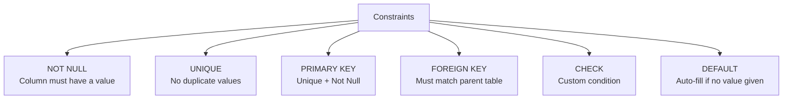
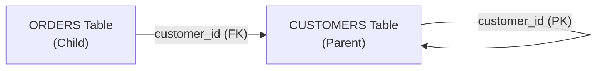

# 07. Constraints in Oracle SQL

## Table of Contents
- [7.1 What are Constraints?](#71-what-are-constraints)
- [7.2 NOT NULL](#72-not-null)
- [7.3 UNIQUE](#73-unique)
- [7.4 PRIMARY KEY](#74-primary-key)
- [7.5 FOREIGN KEY](#75-foreign-key)
- [7.6 CHECK](#76-check)
- [7.7 DEFAULT](#77-default)
- [7.8 Adding/Dropping Constraints](#78-addingdropping-constraints)
- [7.9 Practice & Assessment](#79-practice--assessment)

---

## 7.1 What are Constraints?

### Definition
**Constraints** are rules enforced on table columns to ensure data integrity. They prevent invalid data from being inserted.



### Where to Define Constraints

| Level | Defined | Example |
|-------|---------|---------|
| Column-level | After column definition | `name VARCHAR2(50) NOT NULL` |
| Table-level | After all columns | `CONSTRAINT pk_id PRIMARY KEY (id)` |

---

## 7.2 NOT NULL

### Definition
Ensures a column **cannot have NULL values**. Every row must have a value for this column.

### Syntax (Column-level only)

```sql
CREATE TABLE students (
    student_id   NUMBER(5)    PRIMARY KEY,
    first_name   VARCHAR2(30) NOT NULL,
    last_name    VARCHAR2(30) NOT NULL,
    email        VARCHAR2(60)            -- this CAN be null
);
```

### What Happens on Violation

```sql
INSERT INTO students (student_id, first_name, last_name)
VALUES (1, NULL, 'Kumar');
-- ERROR: ORA-01400: cannot insert NULL into ("SCHEMA"."STUDENTS"."FIRST_NAME")
```

### Correct Usage

```sql
INSERT INTO students VALUES (1, 'Ravi', 'Kumar', 'ravi@email.com');  -- OK
INSERT INTO students VALUES (2, 'Priya', 'Sharma', NULL);            -- OK (email allows NULL)
```

---

## 7.3 UNIQUE

### Definition
Ensures all values in a column (or combination of columns) are **different**. NULL is allowed (and multiple NULLs are permitted).

### Syntax

```sql
-- Column-level
CREATE TABLE users (
    user_id    NUMBER(5) PRIMARY KEY,
    username   VARCHAR2(30) UNIQUE,
    email      VARCHAR2(60) UNIQUE
);

-- Table-level (composite unique)
CREATE TABLE enrollments (
    student_id  NUMBER(5),
    course_id   NUMBER(5),
    CONSTRAINT uk_enrollment UNIQUE (student_id, course_id)
);
```

### What Happens on Violation

```sql
INSERT INTO users VALUES (1, 'ravi123', 'ravi@email.com');
INSERT INTO users VALUES (2, 'ravi123', 'other@email.com');
-- ERROR: ORA-00001: unique constraint (SCHEMA.SYS_C007xxx) violated
```

### Key Point: UNIQUE vs PRIMARY KEY

| Aspect | UNIQUE | PRIMARY KEY |
|--------|--------|-------------|
| NULL allowed | Yes (multiple NULLs OK) | No |
| Number per table | Multiple | Only one |
| Index created | Unique index | Unique index |

---

## 7.4 PRIMARY KEY

### Definition
**Uniquely identifies each row** in a table. It is a combination of `NOT NULL` + `UNIQUE`. Each table can have only **one** primary key.

### Syntax

```sql
-- Column-level
CREATE TABLE departments (
    dept_id    NUMBER(3) PRIMARY KEY,
    dept_name  VARCHAR2(50) NOT NULL
);

-- Table-level (named constraint)
CREATE TABLE departments (
    dept_id    NUMBER(3),
    dept_name  VARCHAR2(50) NOT NULL,
    CONSTRAINT pk_dept PRIMARY KEY (dept_id)
);

-- Composite Primary Key
CREATE TABLE order_items (
    order_id   NUMBER(6),
    item_no    NUMBER(3),
    product_id NUMBER(5),
    quantity   NUMBER(4),
    CONSTRAINT pk_order_item PRIMARY KEY (order_id, item_no)
);
```

### What Happens on Violation

```sql
-- Duplicate PK
INSERT INTO departments VALUES (1, 'Sales');
INSERT INTO departments VALUES (1, 'Marketing');
-- ERROR: ORA-00001: unique constraint (SCHEMA.PK_DEPT) violated

-- NULL PK
INSERT INTO departments VALUES (NULL, 'HR');
-- ERROR: ORA-01400: cannot insert NULL into ("SCHEMA"."DEPARTMENTS"."DEPT_ID")
```

---

## 7.5 FOREIGN KEY

### Definition
Creates a link between two tables. The foreign key column must contain a value that exists in the referenced table's primary key (or unique column). This enforces **referential integrity**.



### Syntax

```sql
-- Column-level
CREATE TABLE orders (
    order_id    NUMBER(6) PRIMARY KEY,
    customer_id NUMBER(5) REFERENCES customers(customer_id),
    amount      NUMBER(10,2)
);

-- Table-level (named constraint)
CREATE TABLE orders (
    order_id    NUMBER(6) PRIMARY KEY,
    customer_id NUMBER(5),
    amount      NUMBER(10,2),
    CONSTRAINT fk_orders_customer 
        FOREIGN KEY (customer_id) REFERENCES customers(customer_id)
);
```

### ON DELETE Options

```sql
-- ON DELETE CASCADE: delete child rows when parent is deleted
CONSTRAINT fk_orders_customer 
    FOREIGN KEY (customer_id) REFERENCES customers(customer_id)
    ON DELETE CASCADE;

-- ON DELETE SET NULL: set FK to NULL when parent is deleted
CONSTRAINT fk_orders_customer 
    FOREIGN KEY (customer_id) REFERENCES customers(customer_id)
    ON DELETE SET NULL;
```

### What Happens on Violation

```sql
-- Insert with non-existent parent
INSERT INTO orders VALUES (1010, 999, 500.00, 'PENDING');
-- ERROR: ORA-02291: integrity constraint violated - parent key not found

-- Delete parent with existing children (no CASCADE)
DELETE FROM customers WHERE customer_id = 1;
-- ERROR: ORA-02292: integrity constraint violated - child record found
```

---

## 7.6 CHECK

### Definition
Ensures values in a column satisfy a **specific condition**. The condition must evaluate to TRUE for the row to be accepted.

### Syntax

```sql
-- Column-level
CREATE TABLE products (
    product_id   NUMBER(5) PRIMARY KEY,
    product_name VARCHAR2(50) NOT NULL,
    price        NUMBER(10,2) CHECK (price > 0),
    quantity     NUMBER(5)    CHECK (quantity >= 0),
    category     VARCHAR2(20) CHECK (category IN ('Electronics','Clothing','Food'))
);

-- Table-level (named constraint)
CREATE TABLE employees (
    emp_id     NUMBER(5) PRIMARY KEY,
    salary     NUMBER(10,2),
    bonus      NUMBER(10,2),
    CONSTRAINT chk_salary CHECK (salary > 0),
    CONSTRAINT chk_bonus_less_salary CHECK (bonus <= salary)
);
```

### What Happens on Violation

```sql
INSERT INTO products VALUES (1, 'Laptop', -500, 10, 'Electronics');
-- ERROR: ORA-02290: check constraint (SCHEMA.SYS_C007xxx) violated
-- Price must be > 0

INSERT INTO products VALUES (2, 'Shirt', 500, 10, 'Toys');
-- ERROR: ORA-02290: check constraint violated
-- Category must be in the allowed list
```

### Limitations
- CHECK cannot reference other tables (use triggers for that).
- CHECK cannot use subqueries.
- CHECK cannot use SYSDATE or other non-deterministic functions.

---

## 7.7 DEFAULT

### Definition
Provides a **default value** for a column when no value is specified during INSERT.

### Syntax

```sql
CREATE TABLE orders (
    order_id    NUMBER(6) PRIMARY KEY,
    order_date  DATE DEFAULT SYSDATE,
    status      VARCHAR2(20) DEFAULT 'PENDING',
    quantity    NUMBER(5) DEFAULT 1
);
```

### How It Works

```sql
-- Insert without specifying order_date and status
INSERT INTO orders (order_id, quantity) VALUES (2001, 5);
-- order_date = current date (SYSDATE)
-- status = 'PENDING'

-- Explicitly set NULL overrides default
INSERT INTO orders (order_id, order_date, status, quantity) 
VALUES (2002, NULL, NULL, 3);
-- order_date = NULL (not SYSDATE!)
-- status = NULL (not 'PENDING'!)
```

### DEFAULT with NOT NULL

```sql
CREATE TABLE logs (
    log_id      NUMBER PRIMARY KEY,
    log_date    DATE DEFAULT SYSDATE NOT NULL,
    message     VARCHAR2(200) NOT NULL
);
-- log_date will always have a value: either provided or SYSDATE
```

---

## 7.8 Adding/Dropping Constraints

### Add Constraint to Existing Table

```sql
-- Add NOT NULL
ALTER TABLE customers MODIFY email NOT NULL;

-- Add UNIQUE
ALTER TABLE customers ADD CONSTRAINT uk_email UNIQUE (email);

-- Add PRIMARY KEY
ALTER TABLE products ADD CONSTRAINT pk_product PRIMARY KEY (product_id);

-- Add FOREIGN KEY
ALTER TABLE orders ADD CONSTRAINT fk_cust 
    FOREIGN KEY (customer_id) REFERENCES customers(customer_id);

-- Add CHECK
ALTER TABLE products ADD CONSTRAINT chk_price CHECK (price > 0);
```

### Drop Constraint

```sql
-- Drop by name
ALTER TABLE customers DROP CONSTRAINT uk_email;

-- Drop PRIMARY KEY
ALTER TABLE departments DROP PRIMARY KEY;

-- Drop PRIMARY KEY with CASCADE (also drops FKs referencing it)
ALTER TABLE customers DROP PRIMARY KEY CASCADE;
```

### Disable/Enable Constraint

```sql
-- Disable (for bulk loading)
ALTER TABLE orders DISABLE CONSTRAINT fk_cust;

-- Enable
ALTER TABLE orders ENABLE CONSTRAINT fk_cust;
```

### View Constraints

```sql
-- See all constraints on a table
SELECT constraint_name, constraint_type, search_condition
FROM user_constraints
WHERE table_name = 'ORDERS';

-- Constraint types: P=Primary, U=Unique, R=Foreign Key, C=Check/Not Null
```

---

## 7.9 Practice & Assessment

### MCQs

**Q1.** How many PRIMARY KEY constraints can a table have?
- A) Unlimited
- B) One
- C) Two
- D) Depends on columns

**Answer:** B) One (but it can be a composite key on multiple columns)

---

**Q2.** Which constraint allows NULL values?
- A) PRIMARY KEY
- B) NOT NULL
- C) UNIQUE
- D) None of the above

**Answer:** C) UNIQUE (allows multiple NULL values)

---

**Q3.** `ON DELETE CASCADE` means:
- A) The delete is cancelled
- B) Child rows are automatically deleted when parent is deleted
- C) Parent row becomes NULL
- D) An error is raised

**Answer:** B) Child rows are automatically deleted when parent is deleted

---

**Q4.** Which constraint CANNOT reference another table?
- A) FOREIGN KEY
- B) CHECK
- C) PRIMARY KEY
- D) UNIQUE

**Answer:** B) CHECK (it cannot contain subqueries or reference other tables)

---

**Q5.** A DEFAULT value is used when:
- A) You INSERT NULL explicitly
- B) You don't specify the column in INSERT
- C) Always
- D) When the column is NOT NULL

**Answer:** B) When you don't specify the column in INSERT

---

### SQL Coding Problems

**Problem 1:** Create a table `PRODUCTS` with: product_id (PK), name (not null), price (must be > 0), category (must be 'A', 'B', or 'C'), created_date (defaults to today).
```sql
-- Solution:
CREATE TABLE products (
    product_id   NUMBER(5)     CONSTRAINT pk_prod PRIMARY KEY,
    name         VARCHAR2(50)  NOT NULL,
    price        NUMBER(10,2)  CONSTRAINT chk_price CHECK (price > 0),
    category     CHAR(1)       CONSTRAINT chk_cat CHECK (category IN ('A','B','C')),
    created_date DATE          DEFAULT SYSDATE
);
```

**Problem 2:** Add a foreign key from ORDERS to PRODUCTS. If a product is deleted, set the reference to NULL.
```sql
-- Solution:
ALTER TABLE orders ADD product_id NUMBER(5);
ALTER TABLE orders ADD CONSTRAINT fk_order_prod
    FOREIGN KEY (product_id) REFERENCES products(product_id)
    ON DELETE SET NULL;
```

---

### Interview Questions

1. **What are the 5 types of constraints in Oracle?**
2. **What is the difference between PRIMARY KEY and UNIQUE?**
3. **Can a FOREIGN KEY reference a UNIQUE column (not just PK)?**
4. **What is referential integrity?**
5. **Explain ON DELETE CASCADE vs ON DELETE SET NULL.**
6. **Can we have a CHECK constraint that references SYSDATE?**
7. **How do you disable a constraint temporarily for bulk loading?**
8. **What is a composite primary key?**
9. **What happens if you try to drop a parent table with child references?**
10. **How do you view all constraints on a table?**

---

> **Next Topic**: [08 - DDL Commands](08-ddl-commands.md)
