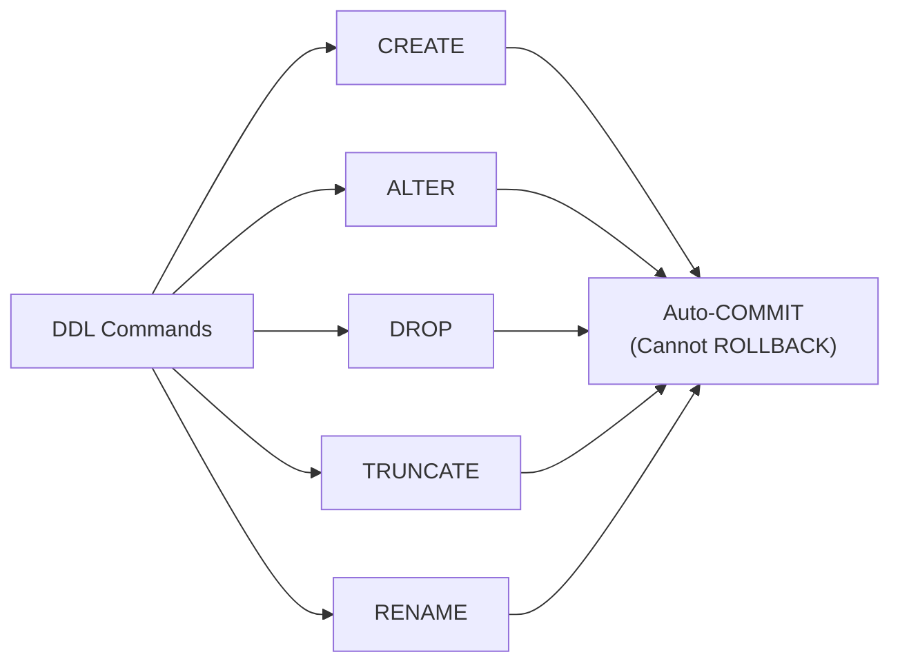

# 08. DDL (Data Definition Language) Commands

## Table of Contents
- [8.1 What is DDL?](#81-what-is-ddl)
- [8.2 CREATE](#82-create)
- [8.3 ALTER](#83-alter)
- [8.4 DROP](#84-drop)
- [8.5 TRUNCATE](#85-truncate)
- [8.6 RENAME](#86-rename)
- [8.7 Practice & Assessment](#87-practice--assessment)

---

## 8.1 What is DDL?

**DDL** commands define or modify the **structure** of database objects (tables, views, indexes, sequences). DDL commands **auto-commit** — they cannot be rolled back.

| Command | Purpose |
|---------|---------|
| `CREATE` | Create new objects |
| `ALTER` | Modify existing objects |
| `DROP` | Delete objects permanently |
| `TRUNCATE` | Remove all rows (fast) |
| `RENAME` | Rename objects |



---

## 8.2 CREATE

### CREATE TABLE

```sql
CREATE TABLE table_name (
    column1  datatype  [constraint],
    column2  datatype  [constraint],
    ...
    [table-level constraints]
);
```

**Example:**
```sql
CREATE TABLE products (
    product_id    NUMBER(5)    PRIMARY KEY,
    product_name  VARCHAR2(100) NOT NULL,
    category      VARCHAR2(30),
    price         NUMBER(10,2) CHECK (price >= 0),
    stock_qty     NUMBER(6)    DEFAULT 0,
    created_date  DATE         DEFAULT SYSDATE
);
```

### CREATE TABLE AS SELECT (CTAS)

Create a new table from the result of a query (copies data too):

```sql
-- Copy entire table structure and data
CREATE TABLE orders_backup AS
SELECT * FROM orders;

-- Copy only structure (no data)
CREATE TABLE orders_empty AS
SELECT * FROM orders WHERE 1 = 0;

-- Create with specific columns and filter
CREATE TABLE delivered_orders AS
SELECT order_id, customer_id, amount
FROM orders
WHERE status = 'DELIVERED';
```

### CREATE VIEW

```sql
CREATE VIEW high_value_orders AS
SELECT o.order_id, c.first_name, o.amount, o.status
FROM orders o
JOIN customers c ON o.customer_id = c.customer_id
WHERE o.amount > 2000;
```

### CREATE INDEX

```sql
CREATE INDEX idx_orders_customer ON orders(customer_id);
CREATE UNIQUE INDEX idx_cust_email ON customers(email);
```

### CREATE SEQUENCE

```sql
CREATE SEQUENCE seq_order_id
    START WITH 2000
    INCREMENT BY 1
    MAXVALUE 999999
    NOCACHE
    NOCYCLE;
```

---

## 8.3 ALTER

### ALTER TABLE — Add Column

```sql
ALTER TABLE customers ADD phone VARCHAR2(15);
ALTER TABLE customers ADD (
    address VARCHAR2(100),
    pincode VARCHAR2(6)
);
```

### ALTER TABLE — Modify Column

```sql
-- Change data type size
ALTER TABLE customers MODIFY phone VARCHAR2(20);

-- Change data type (column must be empty or compatible)
ALTER TABLE customers MODIFY pincode NUMBER(6);

-- Add NOT NULL (column must have no NULLs)
ALTER TABLE customers MODIFY phone NOT NULL;
```

### ALTER TABLE — Drop Column

```sql
-- Drop a column
ALTER TABLE customers DROP COLUMN address;

-- Drop multiple columns
ALTER TABLE customers DROP (phone, pincode);

-- Mark column as unused (faster for large tables)
ALTER TABLE customers SET UNUSED COLUMN phone;
-- Later: 
ALTER TABLE customers DROP UNUSED COLUMNS;
```

### ALTER TABLE — Rename Column

```sql
ALTER TABLE customers RENAME COLUMN first_name TO fname;
```

### ALTER TABLE — Add/Drop Constraints

```sql
-- Add constraint
ALTER TABLE products ADD CONSTRAINT chk_stock CHECK (stock_qty >= 0);

-- Drop constraint
ALTER TABLE products DROP CONSTRAINT chk_stock;

-- Rename constraint
ALTER TABLE products RENAME CONSTRAINT chk_price TO chk_positive_price;
```

---

## 8.4 DROP

### DROP TABLE

```sql
-- Drop table (fails if other tables reference it via FK)
DROP TABLE products;

-- Drop table and all referencing FKs
DROP TABLE customers CASCADE CONSTRAINTS;

-- Drop table and free space immediately
DROP TABLE orders PURGE;
-- Without PURGE, table goes to recycle bin (can be recovered with FLASHBACK)
```

### DROP VIEW

```sql
DROP VIEW high_value_orders;
```

### DROP INDEX

```sql
DROP INDEX idx_orders_customer;
```

### DROP SEQUENCE

```sql
DROP SEQUENCE seq_order_id;
```

### Important Notes
- `DROP` is **permanent** (unless table goes to recycle bin).
- `DROP TABLE` removes the table structure AND all data.
- `DROP TABLE CASCADE CONSTRAINTS` also drops foreign keys pointing to it.
- You **cannot** drop a table if another table's FK references it (without CASCADE).

---

## 8.5 TRUNCATE

### Definition
Removes **all rows** from a table but keeps the table structure. Much faster than `DELETE` for large tables.

### Syntax

```sql
TRUNCATE TABLE orders;
```

### TRUNCATE vs DELETE

| Aspect | TRUNCATE | DELETE |
|--------|----------|--------|
| Speed | Very fast (deallocates space) | Slower (row by row) |
| WHERE clause | Not possible | Can filter rows |
| Rollback | Cannot (auto-commit) | Can rollback |
| Triggers | Does NOT fire triggers | Fires triggers |
| Space | Releases storage | Does not release storage |
| Identity reset | Resets (if any) | Does not reset |
| Undo data | Minimal | Full undo generated |

### Example

```sql
-- Remove all rows instantly
TRUNCATE TABLE orders_backup;
-- Table still exists with same columns, but ZERO rows
```

### Common Error

```sql
TRUNCATE TABLE customers;
-- ERROR: ORA-02266: unique/primary keys in table referenced by enabled foreign keys
-- Fix: Disable FKs first, or truncate child tables first
```

---

## 8.6 RENAME

### Rename Table

```sql
RENAME orders TO customer_orders;
```

### Rename Column (using ALTER)

```sql
ALTER TABLE customers RENAME COLUMN last_name TO surname;
```

### Rename Constraint

```sql
ALTER TABLE products RENAME CONSTRAINT SYS_C007001 TO chk_price_positive;
```

---

## 8.7 Practice & Assessment

### MCQs

**Q1.** Which DDL command auto-commits?
- A) Only CREATE
- B) Only DROP
- C) All DDL commands auto-commit
- D) None — DDL can be rolled back

**Answer:** C) All DDL commands auto-commit

---

**Q2.** `TRUNCATE TABLE` vs `DELETE FROM table`:
- A) TRUNCATE can be rolled back, DELETE cannot
- B) TRUNCATE is faster and cannot be rolled back
- C) They are identical
- D) DELETE is faster

**Answer:** B) TRUNCATE is faster and cannot be rolled back

---

**Q3.** To copy a table structure WITHOUT data:
- A) `CREATE TABLE new_t AS SELECT * FROM old_t`
- B) `CREATE TABLE new_t AS SELECT * FROM old_t WHERE 1=0`
- C) `COPY TABLE old_t TO new_t`
- D) `ALTER TABLE old_t COPY TO new_t`

**Answer:** B) `CREATE TABLE new_t AS SELECT * FROM old_t WHERE 1=0`

---

**Q4.** `DROP TABLE customers PURGE` means:
- A) Table goes to recycle bin
- B) Table is permanently deleted (skips recycle bin)
- C) Only data is removed
- D) Constraints are removed

**Answer:** B) Table is permanently deleted (skips recycle bin)

---

**Q5.** To change a column's data type size:
- A) DROP and re-CREATE the table
- B) `ALTER TABLE t MODIFY column new_datatype`
- C) `UPDATE TABLE t SET column TYPE = new_type`
- D) `CHANGE COLUMN` command

**Answer:** B) `ALTER TABLE t MODIFY column new_datatype`

---

### SQL Coding Problems

**Problem 1:** Create a table EMPLOYEES with emp_id (PK, auto-sequence), name (not null), dept (default 'General'), salary (> 0), hire_date (default today).
```sql
-- Solution:
CREATE SEQUENCE seq_emp_id START WITH 1 INCREMENT BY 1;

CREATE TABLE employees (
    emp_id     NUMBER(6)    DEFAULT seq_emp_id.NEXTVAL PRIMARY KEY,
    name       VARCHAR2(50) NOT NULL,
    dept       VARCHAR2(30) DEFAULT 'General',
    salary     NUMBER(10,2) CONSTRAINT chk_sal CHECK (salary > 0),
    hire_date  DATE         DEFAULT SYSDATE
);
```

**Problem 2:** Add a column `email` to customers, make it unique, then rename it to `contact_email`.
```sql
-- Solution:
ALTER TABLE customers ADD email VARCHAR2(100);
ALTER TABLE customers ADD CONSTRAINT uk_cust_email UNIQUE (email);
ALTER TABLE customers RENAME COLUMN email TO contact_email;
```

---

### Interview Questions

1. **What is the difference between DDL and DML?**
2. **Why can't you ROLLBACK a DDL statement?**
3. **What is `CREATE TABLE AS SELECT`? Does it copy constraints?**
4. **Explain the difference between DROP, DELETE, and TRUNCATE.**
5. **What is the Oracle Recycle Bin? How to recover a dropped table?**
6. **What does `SET UNUSED COLUMN` do?**
7. **Can you ALTER a column's data type if it has data?**
8. **What happens to indexes when you DROP a table?**
9. **Can you TRUNCATE a table with foreign key references?**
10. **What is `CASCADE CONSTRAINTS` in DROP TABLE?**

---

> **Next Topic**: [09 - DML Commands](09-dml-commands.md)
