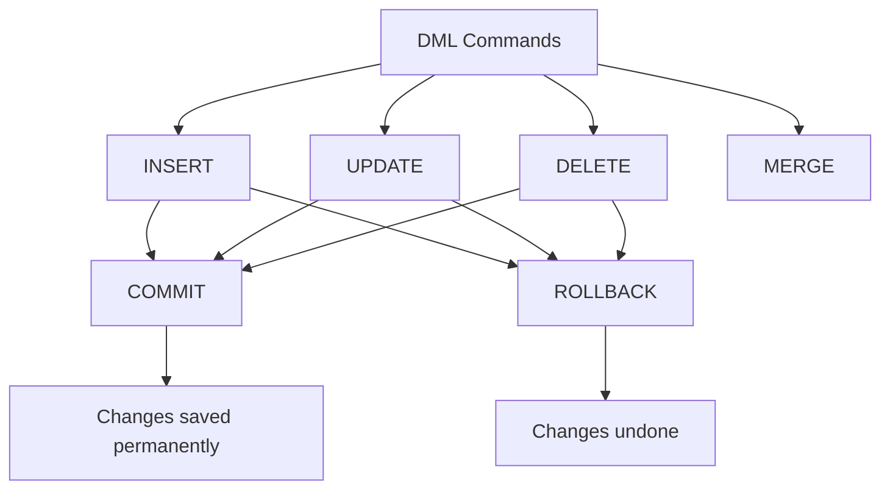

# 09. DML (Data Manipulation Language) Commands

## Table of Contents
- [9.1 What is DML?](#91-what-is-dml)
- [9.2 INSERT](#92-insert)
- [9.3 UPDATE](#93-update)
- [9.4 DELETE](#94-delete)
- [9.5 MERGE](#95-merge)
- [9.6 Practice & Assessment](#96-practice--assessment)

---

## 9.1 What is DML?

**DML** commands manipulate the **data** inside tables (add, modify, remove rows). Unlike DDL, DML commands **do NOT auto-commit** — you can ROLLBACK changes.

| Command | Purpose |
|---------|---------|
| `INSERT` | Add new rows |
| `UPDATE` | Modify existing rows |
| `DELETE` | Remove rows |
| `MERGE` | Insert or update (upsert) |



---

## 9.2 INSERT

### Single Row Insert

```sql
-- Syntax: specify all columns
INSERT INTO table_name (col1, col2, col3)
VALUES (val1, val2, val3);

-- Syntax: all columns in order (must match table definition)
INSERT INTO table_name
VALUES (val1, val2, val3, ...);
```

**Example:**
```sql
-- Specifying columns (recommended)
INSERT INTO customers (customer_id, first_name, last_name, email, city, join_date)
VALUES (6, 'Deepa', 'Nair', 'deepa@email.com', 'Chennai', SYSDATE);

-- All columns in order
INSERT INTO customers
VALUES (7, 'Rahul', 'Joshi', 'rahul@email.com', 'Pune', TO_DATE('2024-06-15','YYYY-MM-DD'));
```

### Insert with NULL and DEFAULT

```sql
-- Explicitly insert NULL
INSERT INTO customers (customer_id, first_name, last_name, email, city, join_date)
VALUES (8, 'Kiran', 'Das', NULL, 'Kolkata', DEFAULT);
-- email = NULL, join_date = default value (if defined)
```

### Multi-Row Insert (INSERT ALL)

```sql
-- Insert multiple rows at once
INSERT ALL
    INTO orders (order_id, customer_id, amount, status) VALUES (2001, 1, 500, 'PENDING')
    INTO orders (order_id, customer_id, amount, status) VALUES (2002, 2, 750, 'PENDING')
    INTO orders (order_id, customer_id, amount, status) VALUES (2003, 3, 1200, 'PENDING')
SELECT * FROM DUAL;
```

### Insert from SELECT (Copy Data)

```sql
-- Copy rows from one table to another
INSERT INTO orders_archive
SELECT * FROM orders WHERE status = 'DELIVERED';

-- Insert specific columns
INSERT INTO customer_names (id, full_name)
SELECT customer_id, first_name || ' ' || last_name
FROM customers;
```

### Conditional INSERT ALL

```sql
INSERT ALL
    WHEN amount >= 3000 THEN INTO high_value_orders (order_id, amount)
        VALUES (order_id, amount)
    WHEN amount < 3000 THEN INTO low_value_orders (order_id, amount)
        VALUES (order_id, amount)
SELECT order_id, amount FROM orders;
```

### Common Errors

| Error | Cause | Fix |
|-------|-------|-----|
| `ORA-00001: unique constraint violated` | Duplicate PK or UNIQUE value | Use different value |
| `ORA-02291: parent key not found` | FK references non-existent parent | Insert parent first |
| `ORA-01400: cannot insert NULL` | NOT NULL column missing | Provide a value |
| `ORA-01438: value larger than specified precision` | Number too big for column | Check column size |

---

## 9.3 UPDATE

### Syntax

```sql
UPDATE table_name
SET column1 = value1, column2 = value2
WHERE condition;
```

> **WARNING:** If you omit the WHERE clause, ALL rows will be updated!

### Examples

**Example 1: Update single row**
```sql
UPDATE customers
SET city = 'Bangalore'
WHERE customer_id = 5;
-- Only Vikram's city changes
```

**Before:**
```
| 5 | Vikram | Singh | NULL | Mumbai |
```
**After:**
```
| 5 | Vikram | Singh | NULL | Bangalore |
```

**Example 2: Update multiple columns**
```sql
UPDATE orders
SET status = 'DELIVERED', amount = amount * 1.05
WHERE order_id = 1004;
```

**Example 3: Update with subquery**
```sql
-- Set all Mumbai customers' email to a pattern
UPDATE customers
SET email = LOWER(first_name) || '.mumbai@company.com'
WHERE city = 'Mumbai';
```

**Example 4: Update using value from another table**
```sql
UPDATE orders o
SET o.status = 'ARCHIVED'
WHERE o.customer_id IN (
    SELECT customer_id FROM customers WHERE join_date < TO_DATE('2023-03-01','YYYY-MM-DD')
);
```

### Dangerous: UPDATE without WHERE

```sql
-- THIS UPDATES ALL ROWS!
UPDATE orders SET status = 'CANCELLED';
-- Every single order is now CANCELLED!

-- Always use WHERE to be safe
-- Use ROLLBACK immediately if this was a mistake:
ROLLBACK;
```

---

## 9.4 DELETE

### Syntax

```sql
DELETE FROM table_name
WHERE condition;
```

> **WARNING:** If you omit WHERE, ALL rows are deleted!

### Examples

**Example 1: Delete specific rows**
```sql
DELETE FROM orders
WHERE status = 'CANCELLED';
-- Removes only cancelled orders
```

**Example 2: Delete with subquery**
```sql
DELETE FROM orders
WHERE customer_id IN (
    SELECT customer_id FROM customers WHERE city = 'Hyderabad'
);
```

**Example 3: Delete all rows (equivalent to TRUNCATE but slower)**
```sql
DELETE FROM orders_backup;
-- All rows removed but can ROLLBACK
-- Table structure remains
```

### DELETE vs TRUNCATE

| Feature | DELETE | TRUNCATE |
|---------|--------|----------|
| WHERE clause | Yes | No |
| Rollback | Yes | No |
| Triggers fired | Yes | No |
| Speed | Slower | Faster |
| Space freed | No (until next reuse) | Yes |
| Redo/Undo data | Full | Minimal |

### Common Errors

```sql
-- FK violation
DELETE FROM customers WHERE customer_id = 1;
-- ERROR: ORA-02292: integrity constraint violated - child record found
-- Fix: Delete child records first, or use ON DELETE CASCADE
```

---

## 9.5 MERGE

### Definition
`MERGE` performs INSERT or UPDATE (or DELETE) in a single statement based on whether a matching row exists. Also called "UPSERT".

### Syntax

```sql
MERGE INTO target_table t
USING source_table s
ON (t.key_column = s.key_column)
WHEN MATCHED THEN
    UPDATE SET t.col1 = s.col1, t.col2 = s.col2
WHEN NOT MATCHED THEN
    INSERT (col1, col2, col3)
    VALUES (s.col1, s.col2, s.col3);
```

### Example

```sql
-- Sync a staging table into the main table
CREATE TABLE customers_staging (
    customer_id  NUMBER(5),
    first_name   VARCHAR2(30),
    last_name    VARCHAR2(30),
    city         VARCHAR2(30)
);

INSERT INTO customers_staging VALUES (1, 'Ravi', 'Kumar', 'Pune');       -- existing: update city
INSERT INTO customers_staging VALUES (9, 'Neha', 'Gupta', 'Jaipur');    -- new: insert

MERGE INTO customers c
USING customers_staging s
ON (c.customer_id = s.customer_id)
WHEN MATCHED THEN
    UPDATE SET c.city = s.city,
               c.first_name = s.first_name
WHEN NOT MATCHED THEN
    INSERT (customer_id, first_name, last_name, city)
    VALUES (s.customer_id, s.first_name, s.last_name, s.city);
```

**Result:**
- Customer 1 (Ravi): city updated from Mumbai to Pune.
- Customer 9 (Neha): new row inserted.

### MERGE with DELETE

```sql
MERGE INTO orders o
USING orders_staging s
ON (o.order_id = s.order_id)
WHEN MATCHED THEN
    UPDATE SET o.amount = s.amount, o.status = s.status
    DELETE WHERE o.status = 'CANCELLED'    -- delete after update
WHEN NOT MATCHED THEN
    INSERT (order_id, customer_id, amount, status)
    VALUES (s.order_id, s.customer_id, s.amount, s.status);
```

---

## 9.6 Practice & Assessment

### MCQs

**Q1.** DML statements can be rolled back because:
- A) They auto-commit
- B) They generate undo data and don't auto-commit
- C) They are stored in redo logs
- D) Oracle doesn't support rollback

**Answer:** B) They generate undo data and don't auto-commit

---

**Q2.** `INSERT ALL` is used to:
- A) Insert into all tables
- B) Insert multiple rows in one statement
- C) Insert and update at the same time
- D) Copy tables

**Answer:** B) Insert multiple rows in one statement

---

**Q3.** What happens with `UPDATE orders SET status = 'DONE'` (no WHERE)?
- A) Error: WHERE required
- B) Updates only the first row
- C) Updates ALL rows in the table
- D) Updates nothing

**Answer:** C) Updates ALL rows in the table

---

**Q4.** MERGE statement is used for:
- A) Combining two queries
- B) INSERT or UPDATE based on a condition
- C) Merging two tables into one
- D) Joining tables

**Answer:** B) INSERT or UPDATE based on a condition (UPSERT)

---

**Q5.** Which DML command fires row-level triggers?
- A) TRUNCATE
- B) DROP
- C) DELETE
- D) CREATE

**Answer:** C) DELETE (and INSERT, UPDATE)

---

### SQL Coding Problems

**Problem 1:** Insert 3 new customers using INSERT ALL.
```sql
-- Solution:
INSERT ALL
    INTO customers (customer_id, first_name, last_name, city) 
        VALUES (10, 'Arjun', 'Rao', 'Bangalore')
    INTO customers (customer_id, first_name, last_name, city) 
        VALUES (11, 'Meera', 'Iyer', 'Chennai')
    INTO customers (customer_id, first_name, last_name, city) 
        VALUES (12, 'Suresh', 'Pillai', 'Kochi')
SELECT * FROM DUAL;
```

**Problem 2:** Update all PENDING orders older than 30 days to CANCELLED.
```sql
-- Solution:
UPDATE orders
SET status = 'CANCELLED'
WHERE status = 'PENDING'
  AND order_date < SYSDATE - 30;
```

**Problem 3:** Delete all orders for customers who are from 'Hyderabad'.
```sql
-- Solution:
DELETE FROM orders
WHERE customer_id IN (
    SELECT customer_id FROM customers WHERE city = 'Hyderabad'
);
```

---

### Interview Questions

1. **What is the difference between DML and DDL?**
2. **Can you rollback an INSERT? How?**
3. **What happens if you UPDATE without a WHERE clause?**
4. **Explain the MERGE statement with a use case.**
5. **What is the difference between DELETE and TRUNCATE?**
6. **How does INSERT ALL differ from INSERT...SELECT?**
7. **What is the INSERT...RETURNING clause?**
8. **Can you UPDATE a column that is part of a PRIMARY KEY?**
9. **What locks are acquired during DML operations?**
10. **How do you insert data from one table to another?**

---

> **Next Topic**: [10 - TCL (Transaction Control)](10-tcl-transaction-control.md)
