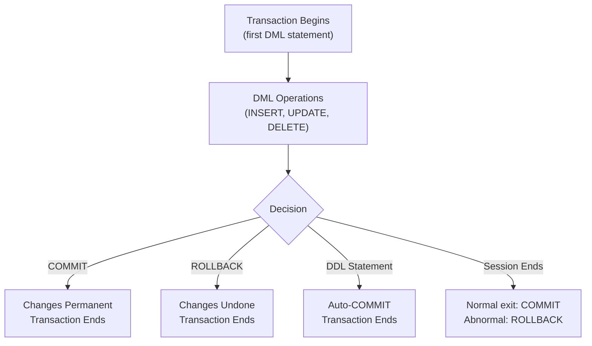

# 10. TCL (Transaction Control Language)

## Table of Contents
- [10.1 What is a Transaction?](#101-what-is-a-transaction)
- [10.2 COMMIT](#102-commit)
- [10.3 ROLLBACK](#103-rollback)
- [10.4 SAVEPOINT](#104-savepoint)
- [10.5 Transaction Examples](#105-transaction-examples)
- [10.6 Practice & Assessment](#106-practice--assessment)

---

## 10.1 What is a Transaction?

### Definition
A **transaction** is a logical unit of work — a sequence of one or more SQL statements that must either ALL succeed or ALL fail together.

### ACID Properties

| Property | Meaning | Example |
|----------|---------|---------|
| **A**tomicity | All or nothing | Transfer money: debit AND credit must both happen |
| **C**onsistency | Data stays valid | Balance can never go negative |
| **I**solation | Transactions don't interfere | Two users updating same row don't conflict |
| **D**urability | Once committed, permanent | Even after power failure, committed data survives |

### Transaction Lifecycle



### When Does a Transaction Begin/End?

| Event | Effect |
|-------|--------|
| First DML statement | Transaction begins |
| COMMIT | Transaction ends (changes saved) |
| ROLLBACK | Transaction ends (changes undone) |
| DDL statement (CREATE, ALTER, DROP) | Auto-commits previous DML |
| Session disconnect (normal) | Auto-commits |
| Session crash/kill | Auto-rollback |

---

## 10.2 COMMIT

### Definition
`COMMIT` permanently saves all changes made in the current transaction. Once committed, changes **cannot be undone**.

### Syntax

```sql
COMMIT;
-- or
COMMIT WORK;  -- same thing
```

### Example

```sql
INSERT INTO customers (customer_id, first_name, last_name, city)
VALUES (20, 'Test', 'User', 'TestCity');

UPDATE orders SET status = 'SHIPPED' WHERE order_id = 1004;

-- Save both changes permanently
COMMIT;
-- Now both INSERT and UPDATE are permanent
```

### What COMMIT Does Internally
1. Generates a System Change Number (SCN).
2. LGWR writes redo log buffer to redo log files.
3. Locks held by the transaction are released.
4. Other users can now see the changes.

---

## 10.3 ROLLBACK

### Definition
`ROLLBACK` undoes all changes made in the current transaction (since the last COMMIT or session start).

### Syntax

```sql
ROLLBACK;
-- or
ROLLBACK WORK;
```

### Example

```sql
-- Check current data
SELECT * FROM customers WHERE customer_id = 1;
-- City: Mumbai

-- Make changes
UPDATE customers SET city = 'Pune' WHERE customer_id = 1;
DELETE FROM orders WHERE order_id = 1001;

-- Oops! Undo everything
ROLLBACK;

-- Data is back to original
SELECT * FROM customers WHERE customer_id = 1;
-- City: Mumbai (restored!)
-- Order 1001 still exists
```

### Important Notes
- ROLLBACK only undoes changes since the last COMMIT.
- After ROLLBACK, the transaction ends and a new one begins with the next DML.
- You **cannot** rollback DDL statements (they auto-commit).

---

## 10.4 SAVEPOINT

### Definition
A **SAVEPOINT** marks a point within a transaction that you can rollback to, without undoing the entire transaction.

### Syntax

```sql
SAVEPOINT savepoint_name;
ROLLBACK TO savepoint_name;
```

### Example

```sql
-- Start transaction
INSERT INTO orders VALUES (3001, 1, SYSDATE, 500, 'PENDING');
SAVEPOINT sp1;

INSERT INTO orders VALUES (3002, 2, SYSDATE, 700, 'PENDING');
SAVEPOINT sp2;

INSERT INTO orders VALUES (3003, 3, SYSDATE, 300, 'PENDING');
-- Oops, order 3003 was wrong

ROLLBACK TO sp2;
-- Order 3003 is undone
-- Orders 3001 and 3002 still exist (not committed yet)

-- Can still work:
INSERT INTO orders VALUES (3004, 3, SYSDATE, 350, 'PENDING');

COMMIT;
-- Orders 3001, 3002, 3004 are saved. Order 3003 never happened.
```

### SAVEPOINT Rules
- After `ROLLBACK TO sp2`, savepoint sp2 still exists but any savepoint after it is gone.
- `COMMIT` erases all savepoints.
- `ROLLBACK` (without TO) erases all savepoints and undoes everything.
- Savepoints with the same name: later one replaces earlier one.


---

## 10.5 Transaction Examples

### Example 1: Bank Transfer

```sql
-- Transfer Rs. 1000 from Account A to Account B
SAVEPOINT before_transfer;

UPDATE accounts SET balance = balance - 1000 WHERE account_id = 'A';
UPDATE accounts SET balance = balance + 1000 WHERE account_id = 'B';

-- Verify
SELECT balance FROM accounts WHERE account_id IN ('A', 'B');

-- If everything looks good:
COMMIT;

-- If something went wrong:
-- ROLLBACK TO before_transfer;
```

### Example 2: Batch Processing with Error Handling

```sql
-- Process multiple operations
INSERT INTO orders VALUES (4001, 1, SYSDATE, 1000, 'PENDING');
SAVEPOINT after_first;

INSERT INTO orders VALUES (4002, 2, SYSDATE, 2000, 'PENDING');
SAVEPOINT after_second;

-- This might fail (FK violation if customer 99 doesn't exist)
BEGIN
    INSERT INTO orders VALUES (4003, 99, SYSDATE, 500, 'PENDING');
EXCEPTION
    WHEN OTHERS THEN
        ROLLBACK TO after_second;  -- undo only the failed insert
        DBMS_OUTPUT.PUT_LINE('Order 4003 failed, continuing...');
END;
/

-- Commit successful operations
COMMIT;
```

### Example 3: Auto-commit with DDL

```sql
INSERT INTO customers VALUES (30, 'Test', 'User', NULL, 'TestCity', SYSDATE);
-- NOT yet committed

CREATE TABLE temp_table (id NUMBER);
-- DDL auto-commits! The INSERT above is now PERMANENT
-- You CANNOT rollback the INSERT anymore

ROLLBACK;
-- This does NOTHING — the INSERT was already auto-committed
```

---

## 10.6 Practice & Assessment

### MCQs

**Q1.** Which of the following is NOT a TCL command?
- A) COMMIT
- B) ROLLBACK
- C) SAVEPOINT
- D) DELETE

**Answer:** D) DELETE (it's DML)

---

**Q2.** When does a transaction begin in Oracle?
- A) When you type COMMIT
- B) When the first DML statement is executed
- C) When you connect to the database
- D) When you type BEGIN TRANSACTION

**Answer:** B) When the first DML statement is executed

---

**Q3.** What happens to uncommitted DML before a DDL statement?
- A) It is rolled back
- B) It is automatically committed
- C) It is saved as a savepoint
- D) Nothing happens

**Answer:** B) It is automatically committed (DDL causes implicit commit)

---

**Q4.** After `ROLLBACK TO sp1`:
- A) All savepoints are erased
- B) Only changes after sp1 are undone
- C) The entire transaction is rolled back
- D) sp1 is deleted

**Answer:** B) Only changes after sp1 are undone

---

**Q5.** If a session crashes without COMMIT:
- A) All changes are committed
- B) All uncommitted changes are rolled back by PMON
- C) Changes are saved to a temp file
- D) Nothing happens

**Answer:** B) All uncommitted changes are rolled back by PMON

---

### SQL Coding Problems

**Problem 1:** Write a transaction that inserts an order, creates a savepoint, inserts another order, then rolls back only the second insert, and commits.
```sql
-- Solution:
INSERT INTO orders VALUES (5001, 1, SYSDATE, 100, 'PENDING');
SAVEPOINT sp1;
INSERT INTO orders VALUES (5002, 2, SYSDATE, 200, 'PENDING');
ROLLBACK TO sp1;
COMMIT;
-- Only order 5001 is saved
```

**Problem 2:** Demonstrate that DDL auto-commits previous DML.
```sql
-- Solution:
INSERT INTO customers (customer_id, first_name, last_name, city)
VALUES (50, 'Auto', 'Commit', 'TestCity');
-- Not yet committed

CREATE TABLE dummy (id NUMBER);  -- DDL: auto-commits everything!

ROLLBACK;  -- Too late — INSERT is already permanent!

SELECT * FROM customers WHERE customer_id = 50;
-- Row exists! Cannot be rolled back.

-- Cleanup
DELETE FROM customers WHERE customer_id = 50;
DROP TABLE dummy;
COMMIT;
```

---

### Interview Questions

1. **What are the ACID properties? Explain each.**
2. **What is the difference between COMMIT and ROLLBACK?**
3. **When does Oracle auto-commit?**
4. **What is a SAVEPOINT and when would you use it?**
5. **What happens to locks after COMMIT?**
6. **Can you COMMIT inside a trigger?**
7. **What is the role of redo logs in transactions?**
8. **What happens if the database crashes mid-transaction?**
9. **Explain READ COMMITTED vs SERIALIZABLE isolation levels.**
10. **What is a deadlock? How does Oracle handle it?**

---

> **Next Topic**: [11 - Views](11-views.md)
