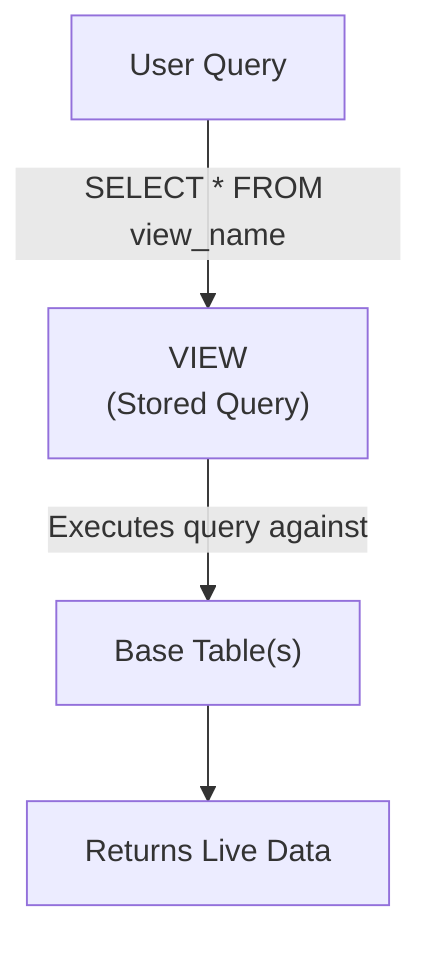

# 11. Views in Oracle SQL

## Table of Contents
- [11.1 What is a View?](#111-what-is-a-view)
- [11.2 Creating Views](#112-creating-views)
- [11.3 Updating Through Views](#113-updating-through-views)
- [11.4 WITH CHECK OPTION](#114-with-check-option)
- [11.5 Dropping Views](#115-dropping-views)
- [11.6 Practice & Assessment](#116-practice--assessment)

---

## 11.1 What is a View?

### Definition
A **view** is a virtual table based on a SELECT query. It does not store data itself — it stores the query, and data is fetched from base tables each time the view is accessed.

### Why Use Views?

| Reason | Explanation |
|--------|-------------|
| **Security** | Hide sensitive columns (e.g., salary) from users |
| **Simplicity** | Simplify complex queries with joins |
| **Abstraction** | Change underlying tables without affecting users |
| **Reusability** | Write complex logic once, use many times |



---

## 11.2 Creating Views

### Syntax

```sql
CREATE [OR REPLACE] VIEW view_name AS
SELECT columns
FROM table(s)
WHERE condition;
```

### Example 1: Simple View

```sql
CREATE VIEW vw_mumbai_customers AS
SELECT customer_id, first_name, last_name, email
FROM customers
WHERE city = 'Mumbai';
```

**Using the view:**
```sql
SELECT * FROM vw_mumbai_customers;
```

**Output:**
```
+-------------+------------+-----------+----------------+
| CUSTOMER_ID | FIRST_NAME | LAST_NAME | EMAIL          |
+-------------+------------+-----------+----------------+
| 1           | Ravi       | Kumar     | ravi@email.com |
| 5           | Vikram     | Singh     | NULL           |
+-------------+------------+-----------+----------------+
```

### Example 2: View with Join

```sql
CREATE OR REPLACE VIEW vw_order_details AS
SELECT o.order_id, 
       c.first_name || ' ' || c.last_name AS customer_name,
       c.city,
       o.amount, 
       o.status,
       o.order_date
FROM orders o
JOIN customers c ON o.customer_id = c.customer_id;
```

**Using it:**
```sql
SELECT customer_name, SUM(amount) AS total
FROM vw_order_details
WHERE status = 'DELIVERED'
GROUP BY customer_name;
```

### Example 3: View with Aggregate (Read-only)

```sql
CREATE VIEW vw_customer_summary AS
SELECT c.customer_id, 
       c.first_name,
       COUNT(o.order_id) AS total_orders,
       NVL(SUM(o.amount), 0) AS total_spent
FROM customers c
LEFT JOIN orders o ON c.customer_id = o.customer_id
GROUP BY c.customer_id, c.first_name;
```

### OR REPLACE

```sql
-- If view already exists, replace it (no need to DROP first)
CREATE OR REPLACE VIEW vw_mumbai_customers AS
SELECT customer_id, first_name, last_name, email, join_date
FROM customers
WHERE city = 'Mumbai';
```

---

## 11.3 Updating Through Views

### When Can You UPDATE/INSERT/DELETE Through a View?

A view is **updatable** if:
- It is based on a single table.
- It does NOT contain: GROUP BY, DISTINCT, aggregate functions, UNION, joins (in most cases).
- All NOT NULL columns of the base table are included.

### Example: Updatable View

```sql
CREATE VIEW vw_pending_orders AS
SELECT order_id, customer_id, amount, status
FROM orders
WHERE status = 'PENDING';

-- UPDATE through view
UPDATE vw_pending_orders SET amount = 1000 WHERE order_id = 1004;
-- This updates the base 'orders' table!

-- INSERT through view
INSERT INTO vw_pending_orders (order_id, customer_id, amount, status)
VALUES (9001, 1, 500, 'PENDING');
-- Inserted into base 'orders' table
```

### Non-Updatable Views

```sql
-- This view has a JOIN — NOT updatable
CREATE VIEW vw_order_names AS
SELECT o.order_id, c.first_name, o.amount
FROM orders o JOIN customers c ON o.customer_id = c.customer_id;

UPDATE vw_order_names SET amount = 999 WHERE order_id = 1001;
-- ERROR: ORA-01779: cannot modify a column which maps to a non key-preserved table
```

---

## 11.4 WITH CHECK OPTION

### Definition
`WITH CHECK OPTION` ensures that any INSERT or UPDATE through the view still satisfies the view's WHERE condition. It prevents users from creating rows that would "disappear" from the view.

### Example

```sql
CREATE VIEW vw_pending_orders AS
SELECT order_id, customer_id, amount, status
FROM orders
WHERE status = 'PENDING'
WITH CHECK OPTION;

-- Try to change status to something else
UPDATE vw_pending_orders SET status = 'SHIPPED' WHERE order_id = 1004;
-- ERROR: ORA-01402: view WITH CHECK OPTION where-clause violation
-- Cannot change status away from 'PENDING' because the row would no longer be in the view

-- This works:
UPDATE vw_pending_orders SET amount = 1100 WHERE order_id = 1004;
-- OK: row still has status='PENDING', still visible in view
```

---

## 11.5 Dropping Views

### Syntax

```sql
DROP VIEW view_name;
```

### Example

```sql
DROP VIEW vw_mumbai_customers;
-- View is removed. Base table is NOT affected.
```

### Important Notes
- Dropping a view does NOT affect the data in base tables.
- If a view references another view that is dropped, the dependent view becomes **invalid**.
- Use `CREATE OR REPLACE VIEW` to modify a view without dropping it first.

---

## 11.6 Practice & Assessment

### MCQs

**Q1.** A view stores:
- A) Actual data
- B) A copy of data
- C) A stored SELECT query
- D) Indexes

**Answer:** C) A stored SELECT query

---

**Q2.** Which view CANNOT be updated?
- A) Simple single-table view
- B) View with GROUP BY
- C) View without WHERE clause
- D) View with WITH CHECK OPTION

**Answer:** B) View with GROUP BY (aggregate views are not updatable)

---

**Q3.** `WITH CHECK OPTION` prevents:
- A) All inserts and updates
- B) Inserts/updates that would make the row invisible to the view
- C) Dropping the view
- D) SELECT from the view

**Answer:** B) Inserts/updates that would make the row invisible to the view

---

**Q4.** `CREATE OR REPLACE VIEW` does what if the view already exists?
- A) Creates a second view
- B) Throws an error
- C) Replaces the existing view definition
- D) Drops and recreates the table

**Answer:** C) Replaces the existing view definition

---

### SQL Coding Problems

**Problem 1:** Create a view showing each customer's name, city, and their highest order amount.
```sql
-- Solution:
CREATE VIEW vw_customer_max_order AS
SELECT c.first_name || ' ' || c.last_name AS customer_name,
       c.city,
       MAX(o.amount) AS max_order
FROM customers c
LEFT JOIN orders o ON c.customer_id = o.customer_id
GROUP BY c.first_name || ' ' || c.last_name, c.city;
```

**Problem 2:** Create an updatable view for Delhi customers with CHECK OPTION.
```sql
-- Solution:
CREATE VIEW vw_delhi_customers AS
SELECT customer_id, first_name, last_name, email, city
FROM customers
WHERE city = 'Delhi'
WITH CHECK OPTION;
```

---

### Interview Questions

1. **What is a view and why is it used?**
2. **What is the difference between a view and a table?**
3. **When is a view updatable?**
4. **What is WITH CHECK OPTION?**
5. **What is a materialized view? How is it different from a regular view?**
6. **Does a view improve performance?**
7. **What happens to views when the base table is dropped?**
8. **Can a view be based on another view?**
9. **What is FORCE in CREATE FORCE VIEW?**
10. **How do you check which views exist in your schema?**

---

> **Next Topic**: [12 - Indexes](12-indexes.md)
