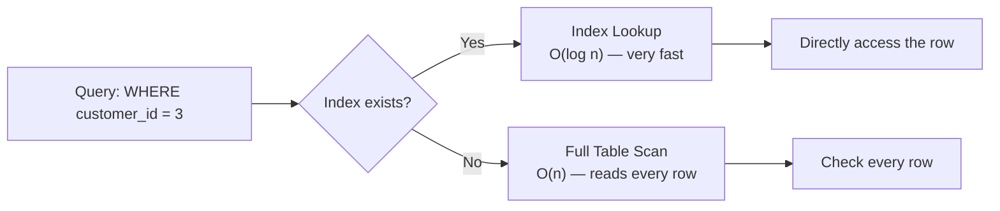

# 12. Indexes in Oracle SQL

## Table of Contents
- [12.1 What is an Index?](#121-what-is-an-index)
- [12.2 Creating Indexes](#122-creating-indexes)
- [12.3 Types of Indexes](#123-types-of-indexes)
- [12.4 When to Use / Not Use Indexes](#124-when-to-use--not-use-indexes)
- [12.5 Dropping Indexes](#125-dropping-indexes)
- [12.6 Practice & Assessment](#126-practice--assessment)

---

## 12.1 What is an Index?

### Definition
An **index** is a database object that speeds up data retrieval. It works like a book index — instead of reading every page (full table scan), you look up the index to find the exact page (row).

### How It Works



### Analogy
- **Without index:** Reading an entire 500-page book to find one topic.
- **With index:** Looking at the back-of-book index to find page 247 directly.

---

## 12.2 Creating Indexes

### Syntax

```sql
-- Basic index
CREATE INDEX index_name ON table_name (column_name);

-- Unique index
CREATE UNIQUE INDEX index_name ON table_name (column_name);

-- Composite index (multiple columns)
CREATE INDEX index_name ON table_name (col1, col2);
```

### Examples

```sql
-- Speed up searches by city
CREATE INDEX idx_cust_city ON customers (city);

-- Speed up order lookups by customer
CREATE INDEX idx_orders_custid ON orders (customer_id);

-- Unique index on email
CREATE UNIQUE INDEX idx_cust_email ON customers (email);

-- Composite index for common query pattern
CREATE INDEX idx_orders_status_date ON orders (status, order_date);
```

### Automatically Created Indexes
Oracle automatically creates indexes for:
- **PRIMARY KEY** constraints (unique index)
- **UNIQUE** constraints (unique index)

```sql
-- You DON'T need to manually create an index on a PK column
-- Oracle does it for you!
```

---

## 12.3 Types of Indexes

| Type | Description | Use Case |
|------|-------------|----------|
| **B-Tree** (default) | Balanced tree structure | Most queries (=, >, <, BETWEEN) |
| **Unique** | No duplicate values allowed | Columns that must be unique |
| **Composite** | Index on multiple columns | Queries filtering on multiple columns |
| **Bitmap** | Bitmap for each distinct value | Low-cardinality columns (e.g., gender, status) |
| **Function-based** | Index on an expression | Queries using functions on columns |

### B-Tree Index (Default)

```sql
CREATE INDEX idx_amount ON orders (amount);
-- Good for: WHERE amount > 2000, WHERE amount BETWEEN 1000 AND 3000
```

### Bitmap Index

```sql
-- Good for columns with few distinct values
CREATE BITMAP INDEX idx_status ON orders (status);
-- status has only 4 values: DELIVERED, SHIPPED, PENDING, CANCELLED
```

### Function-Based Index

```sql
-- Without this, queries with UPPER() won't use regular index
CREATE INDEX idx_upper_name ON customers (UPPER(first_name));

-- Now this query uses the index:
SELECT * FROM customers WHERE UPPER(first_name) = 'RAVI';
```

### Composite Index

```sql
CREATE INDEX idx_cust_city_date ON customers (city, join_date);

-- This index helps with:
-- WHERE city = 'Mumbai'                           ✅ (leftmost column)
-- WHERE city = 'Mumbai' AND join_date > ...       ✅ (both columns)
-- WHERE join_date > ...                           ❌ (not leftmost!)
```

> **Important:** Composite index is used only when the query references the **leftmost** column(s).

---

## 12.4 When to Use / Not Use Indexes

### When to Create Indexes

| Scenario | Reason |
|----------|--------|
| Columns in WHERE clause (frequently searched) | Speeds up filtering |
| JOIN columns (foreign keys) | Speeds up joins |
| ORDER BY columns | Speeds up sorting |
| Columns with high cardinality (many unique values) | Index is effective |
| Large tables (millions of rows) | Full scan is slow |

### When NOT to Create Indexes

| Scenario | Reason |
|----------|--------|
| Small tables (< 1000 rows) | Full scan is faster |
| Columns with few distinct values (in B-tree) | Use bitmap instead |
| Tables with heavy INSERT/UPDATE/DELETE | Index maintenance is costly |
| Columns rarely used in WHERE | Wastes space |
| Already has an index on the column | Duplicate index |

### Performance Comparison

```sql
-- Without index on 'city' (1 million rows):
SELECT * FROM customers WHERE city = 'Mumbai';
-- Full table scan: ~5 seconds

-- After creating index:
CREATE INDEX idx_city ON customers (city);
SELECT * FROM customers WHERE city = 'Mumbai';
-- Index scan: ~0.01 seconds
```

---

## 12.5 Dropping Indexes

### Syntax

```sql
DROP INDEX index_name;
```

### Example

```sql
DROP INDEX idx_cust_city;
-- Index removed. Table data is NOT affected.
```

### Rebuilding Indexes

```sql
-- Rebuild an index (after many deletes cause fragmentation)
ALTER INDEX idx_orders_custid REBUILD;
```

---

## 12.6 Practice & Assessment

### MCQs

**Q1.** An index is automatically created for:
- A) Every column
- B) PRIMARY KEY and UNIQUE constraints
- C) Foreign keys
- D) DATE columns

**Answer:** B) PRIMARY KEY and UNIQUE constraints

---

**Q2.** A bitmap index is best for:
- A) Columns with millions of unique values
- B) Columns with few distinct values (low cardinality)
- C) Primary keys
- D) CLOB columns

**Answer:** B) Columns with few distinct values (low cardinality)

---

**Q3.** A composite index on (city, join_date) helps which query?
- A) `WHERE join_date > '01-JAN-24'`
- B) `WHERE city = 'Mumbai'`
- C) `WHERE amount > 1000`
- D) `WHERE email LIKE '%@%'`

**Answer:** B) `WHERE city = 'Mumbai'` (leftmost column)

---

**Q4.** Too many indexes on a table cause:
- A) Faster queries always
- B) Slower INSERT/UPDATE/DELETE operations
- C) More disk space but no issues
- D) Table corruption

**Answer:** B) Slower INSERT/UPDATE/DELETE operations (indexes must be maintained)

---

### Interview Questions

1. **What is an index and how does it improve performance?**
2. **What is the difference between B-tree and bitmap indexes?**
3. **What is a composite index? Does column order matter?**
4. **What is a function-based index?**
5. **When should you NOT create an index?**
6. **How do you check if a query is using an index? (EXPLAIN PLAN)**
7. **What happens to indexes when you DROP a table?**
8. **What is index fragmentation and how to fix it?**
9. **Does Oracle create an index on FOREIGN KEY columns automatically?**
10. **What is the difference between a unique index and a unique constraint?**

---

> **Next Topic**: [13 - Sequences](13-sequences.md)
