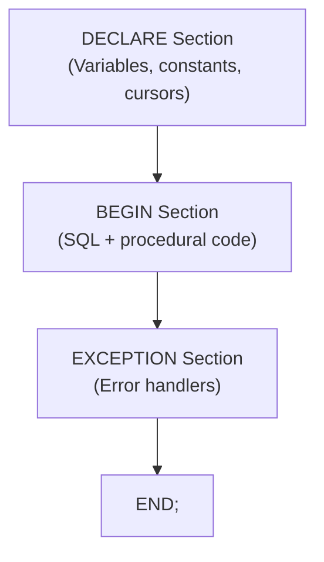

# 15. PL/SQL Programming

## Table of Contents
- [15.1 PL/SQL Structure](#151-plsql-structure)
- [15.2 Variables and Constants](#152-variables-and-constants)
- [15.3 IF Statements](#153-if-statements)
- [15.4 CASE Statements](#154-case-statements)
- [15.5 Loops](#155-loops)
- [15.6 Cursors](#156-cursors)
- [15.7 Exception Handling](#157-exception-handling)
- [15.8 Procedures](#158-procedures)
- [15.9 Functions](#159-functions)
- [15.10 Packages](#1510-packages)
- [15.11 Triggers](#1511-triggers)
- [15.12 Practice & Assessment](#1512-practice--assessment)

---

## 15.1 PL/SQL Structure

### Definition
**PL/SQL** (Procedural Language/SQL) extends SQL with procedural features like variables, loops, conditions, and error handling. It lets you write complete programs in the database.

### Block Structure

```sql
DECLARE
    -- Variable declarations (optional)
BEGIN
    -- Executable statements (required)
EXCEPTION
    -- Error handling (optional)
END;
/
```



### Example: Hello World

```sql
BEGIN
    DBMS_OUTPUT.PUT_LINE('Hello, Oracle!');
END;
/
```

**Output:**
```
Hello, Oracle!
```

> **Note:** Enable output with `SET SERVEROUTPUT ON` in SQL*Plus or SQL Developer.

### Example: Full Block

```sql
DECLARE
    v_name VARCHAR2(50);
    v_count NUMBER;
BEGIN
    SELECT first_name INTO v_name
    FROM customers
    WHERE customer_id = 1;
    
    SELECT COUNT(*) INTO v_count
    FROM orders
    WHERE customer_id = 1;
    
    DBMS_OUTPUT.PUT_LINE(v_name || ' has ' || v_count || ' orders.');
EXCEPTION
    WHEN NO_DATA_FOUND THEN
        DBMS_OUTPUT.PUT_LINE('Customer not found.');
END;
/
```

**Output:**
```
Ravi has 3 orders.
```

---

## 15.2 Variables and Constants

### Declaration

```sql
DECLARE
    -- Variables
    v_name      VARCHAR2(50);
    v_salary    NUMBER(10,2) := 50000;     -- initialized
    v_hire_date DATE := SYSDATE;
    v_is_active BOOLEAN := TRUE;
    
    -- Constants
    c_tax_rate  CONSTANT NUMBER := 0.18;
    c_company   CONSTANT VARCHAR2(30) := 'Oracle Corp';
    
    -- %TYPE: same type as a table column
    v_city      customers.city%TYPE;
    
    -- %ROWTYPE: entire row structure
    v_customer  customers%ROWTYPE;
BEGIN
    -- Assignment
    v_name := 'Ravi Kumar';
    
    -- Select INTO
    SELECT * INTO v_customer FROM customers WHERE customer_id = 1;
    
    DBMS_OUTPUT.PUT_LINE('Name: ' || v_customer.first_name);
    DBMS_OUTPUT.PUT_LINE('City: ' || v_customer.city);
END;
/
```

### Important Rules
- Variables start with `v_`, constants with `c_` (convention).
- Use `%TYPE` to match column data type automatically.
- Use `%ROWTYPE` to match entire row structure.
- `:=` is the assignment operator.
- PL/SQL `BOOLEAN` type cannot be used in SQL statements.

---

## 15.3 IF Statements

### Syntax

```sql
-- Simple IF
IF condition THEN
    statements;
END IF;

-- IF-ELSE
IF condition THEN
    statements;
ELSE
    statements;
END IF;

-- IF-ELSIF-ELSE
IF condition1 THEN
    statements;
ELSIF condition2 THEN
    statements;
ELSIF condition3 THEN
    statements;
ELSE
    statements;
END IF;
```

### Example

```sql
DECLARE
    v_amount NUMBER;
    v_category VARCHAR2(20);
BEGIN
    SELECT amount INTO v_amount
    FROM orders WHERE order_id = 1001;
    
    IF v_amount >= 3000 THEN
        v_category := 'High Value';
    ELSIF v_amount >= 1500 THEN
        v_category := 'Medium Value';
    ELSE
        v_category := 'Low Value';
    END IF;
    
    DBMS_OUTPUT.PUT_LINE('Order 1001: ' || v_category || ' (' || v_amount || ')');
END;
/
```

**Output:**
```
Order 1001: Medium Value (2500)
```

---

## 15.4 CASE Statements

### Simple CASE

```sql
DECLARE
    v_status VARCHAR2(20) := 'SHIPPED';
    v_message VARCHAR2(50);
BEGIN
    v_message := CASE v_status
        WHEN 'DELIVERED'  THEN 'Order completed'
        WHEN 'SHIPPED'    THEN 'Order in transit'
        WHEN 'PENDING'    THEN 'Order waiting'
        WHEN 'CANCELLED'  THEN 'Order cancelled'
        ELSE 'Unknown status'
    END;
    
    DBMS_OUTPUT.PUT_LINE(v_message);
END;
/
```

### Searched CASE

```sql
DECLARE
    v_salary NUMBER := 75000;
    v_grade VARCHAR2(10);
BEGIN
    CASE
        WHEN v_salary >= 100000 THEN v_grade := 'A';
        WHEN v_salary >= 70000  THEN v_grade := 'B';
        WHEN v_salary >= 40000  THEN v_grade := 'C';
        ELSE v_grade := 'D';
    END CASE;
    
    DBMS_OUTPUT.PUT_LINE('Grade: ' || v_grade);
END;
/
```

---

## 15.5 Loops

### Simple LOOP (with EXIT)

```sql
DECLARE
    v_counter NUMBER := 1;
BEGIN
    LOOP
        DBMS_OUTPUT.PUT_LINE('Count: ' || v_counter);
        v_counter := v_counter + 1;
        EXIT WHEN v_counter > 5;
    END LOOP;
END;
/
```

**Output:**
```
Count: 1
Count: 2
Count: 3
Count: 4
Count: 5
```

### WHILE LOOP

```sql
DECLARE
    v_counter NUMBER := 1;
BEGIN
    WHILE v_counter <= 5 LOOP
        DBMS_OUTPUT.PUT_LINE('While: ' || v_counter);
        v_counter := v_counter + 1;
    END LOOP;
END;
/
```

### FOR LOOP

```sql
BEGIN
    FOR i IN 1..5 LOOP
        DBMS_OUTPUT.PUT_LINE('For: ' || i);
    END LOOP;
    
    -- Reverse
    FOR i IN REVERSE 1..5 LOOP
        DBMS_OUTPUT.PUT_LINE('Reverse: ' || i);
    END LOOP;
END;
/
```

### FOR LOOP with Cursor (Cursor FOR Loop)

```sql
BEGIN
    FOR rec IN (SELECT first_name, city FROM customers) LOOP
        DBMS_OUTPUT.PUT_LINE(rec.first_name || ' - ' || rec.city);
    END LOOP;
END;
/
```

**Output:**
```
Ravi - Mumbai
Priya - Delhi
Amit - Ahmedabad
Sneha - Hyderabad
Vikram - Mumbai
```

---

## 15.6 Cursors

### Implicit Cursor
Oracle automatically creates for single-row queries (SELECT INTO).

```sql
DECLARE
    v_name VARCHAR2(50);
BEGIN
    SELECT first_name INTO v_name FROM customers WHERE customer_id = 1;
    DBMS_OUTPUT.PUT_LINE('Found: ' || v_name);
    DBMS_OUTPUT.PUT_LINE('Rows affected: ' || SQL%ROWCOUNT);
END;
/
```

### Explicit Cursor
For queries returning multiple rows.

```sql
DECLARE
    CURSOR c_orders IS
        SELECT order_id, amount, status FROM orders WHERE customer_id = 1;
    v_order c_orders%ROWTYPE;
BEGIN
    OPEN c_orders;
    LOOP
        FETCH c_orders INTO v_order;
        EXIT WHEN c_orders%NOTFOUND;
        DBMS_OUTPUT.PUT_LINE('Order ' || v_order.order_id || 
                             ': ' || v_order.amount || 
                             ' (' || v_order.status || ')');
    END LOOP;
    CLOSE c_orders;
END;
/
```

**Output:**
```
Order 1001: 2500 (DELIVERED)
Order 1002: 1800.5 (DELIVERED)
Order 1007: 750.25 (PENDING)
```

### Cursor Attributes

| Attribute | Description |
|-----------|-------------|
| `%FOUND` | TRUE if last FETCH returned a row |
| `%NOTFOUND` | TRUE if last FETCH returned no row |
| `%ROWCOUNT` | Number of rows fetched so far |
| `%ISOPEN` | TRUE if cursor is currently open |

### Cursor with Parameters

```sql
DECLARE
    CURSOR c_orders(p_status VARCHAR2) IS
        SELECT order_id, amount FROM orders WHERE status = p_status;
BEGIN
    FOR rec IN c_orders('DELIVERED') LOOP
        DBMS_OUTPUT.PUT_LINE(rec.order_id || ': ' || rec.amount);
    END LOOP;
END;
/
```

---

## 15.7 Exception Handling

### Syntax

```sql
BEGIN
    -- code
EXCEPTION
    WHEN exception_name THEN
        -- handle error
    WHEN OTHERS THEN
        -- catch-all handler
END;
```

### Predefined Exceptions

| Exception | Error Code | When Raised |
|-----------|-----------|-------------|
| `NO_DATA_FOUND` | ORA-01403 | SELECT INTO returns no rows |
| `TOO_MANY_ROWS` | ORA-01422 | SELECT INTO returns multiple rows |
| `ZERO_DIVIDE` | ORA-01476 | Division by zero |
| `DUP_VAL_ON_INDEX` | ORA-00001 | Unique constraint violation |
| `VALUE_ERROR` | ORA-06502 | Type conversion or size error |
| `INVALID_CURSOR` | ORA-01001 | Cursor not open |

### Example

```sql
DECLARE
    v_name VARCHAR2(50);
    v_salary NUMBER;
BEGIN
    SELECT first_name INTO v_name
    FROM customers WHERE customer_id = 999;
    
    DBMS_OUTPUT.PUT_LINE('Found: ' || v_name);
    
EXCEPTION
    WHEN NO_DATA_FOUND THEN
        DBMS_OUTPUT.PUT_LINE('Error: Customer 999 not found!');
    WHEN TOO_MANY_ROWS THEN
        DBMS_OUTPUT.PUT_LINE('Error: Multiple rows returned!');
    WHEN OTHERS THEN
        DBMS_OUTPUT.PUT_LINE('Unexpected error: ' || SQLERRM);
END;
/
```

**Output:**
```
Error: Customer 999 not found!
```

### User-Defined Exceptions

```sql
DECLARE
    e_low_balance EXCEPTION;
    v_balance NUMBER := 500;
BEGIN
    IF v_balance < 1000 THEN
        RAISE e_low_balance;
    END IF;
EXCEPTION
    WHEN e_low_balance THEN
        DBMS_OUTPUT.PUT_LINE('Error: Balance too low! Current: ' || v_balance);
END;
/
```

### RAISE_APPLICATION_ERROR

```sql
BEGIN
    IF some_condition THEN
        RAISE_APPLICATION_ERROR(-20001, 'Custom error: Invalid amount');
        -- Error numbers: -20000 to -20999 (user range)
    END IF;
END;
/
```

---

## 15.8 Procedures

### Definition
A **procedure** is a named PL/SQL block stored in the database. It can accept parameters and be called repeatedly.

### Syntax

```sql
CREATE [OR REPLACE] PROCEDURE procedure_name (
    param1  [IN | OUT | IN OUT]  datatype,
    param2  [IN | OUT | IN OUT]  datatype
) AS
    -- local variables
BEGIN
    -- code
EXCEPTION
    -- error handling
END procedure_name;
/
```

### Parameter Modes

| Mode | Description |
|------|-------------|
| `IN` (default) | Input only — cannot be changed inside |
| `OUT` | Output only — procedure sets the value |
| `IN OUT` | Both input and output |

### Example

```sql
CREATE OR REPLACE PROCEDURE update_order_status (
    p_order_id  IN  NUMBER,
    p_new_status IN VARCHAR2,
    p_success   OUT BOOLEAN
) AS
    v_count NUMBER;
BEGIN
    SELECT COUNT(*) INTO v_count FROM orders WHERE order_id = p_order_id;
    
    IF v_count = 0 THEN
        p_success := FALSE;
        DBMS_OUTPUT.PUT_LINE('Order not found: ' || p_order_id);
    ELSE
        UPDATE orders SET status = p_new_status WHERE order_id = p_order_id;
        COMMIT;
        p_success := TRUE;
        DBMS_OUTPUT.PUT_LINE('Order ' || p_order_id || ' updated to ' || p_new_status);
    END IF;
EXCEPTION
    WHEN OTHERS THEN
        ROLLBACK;
        p_success := FALSE;
        DBMS_OUTPUT.PUT_LINE('Error: ' || SQLERRM);
END update_order_status;
/
```

### Calling a Procedure

```sql
DECLARE
    v_result BOOLEAN;
BEGIN
    update_order_status(1004, 'SHIPPED', v_result);
END;
/
```

---

## 15.9 Functions

### Definition
A **function** is like a procedure but it **returns a value**. Functions can be used in SQL statements.

### Syntax

```sql
CREATE [OR REPLACE] FUNCTION function_name (
    param1  datatype,
    param2  datatype
) RETURN return_datatype AS
    -- local variables
BEGIN
    -- code
    RETURN value;
END function_name;
/
```

### Example

```sql
CREATE OR REPLACE FUNCTION get_customer_total (
    p_customer_id IN NUMBER
) RETURN NUMBER AS
    v_total NUMBER;
BEGIN
    SELECT NVL(SUM(amount), 0) INTO v_total
    FROM orders
    WHERE customer_id = p_customer_id;
    
    RETURN v_total;
END get_customer_total;
/
```

### Using the Function

```sql
-- In SQL
SELECT first_name, get_customer_total(customer_id) AS total_spent
FROM customers;

-- In PL/SQL
DECLARE
    v_total NUMBER;
BEGIN
    v_total := get_customer_total(1);
    DBMS_OUTPUT.PUT_LINE('Total: ' || v_total);
END;
/
```

### Procedure vs Function

| Aspect | Procedure | Function |
|--------|-----------|----------|
| Returns value | No (uses OUT params) | Yes (RETURN statement) |
| Used in SQL | No | Yes |
| Purpose | Perform action | Compute and return value |
| Call syntax | `proc_name(params)` | `var := func_name(params)` |

---

## 15.10 Packages

### Definition
A **package** groups related procedures, functions, variables, and cursors into a single unit. It has two parts: **specification** (public interface) and **body** (implementation).

### Package Specification

```sql
CREATE OR REPLACE PACKAGE pkg_customer AS
    -- Public declarations (visible to callers)
    PROCEDURE add_customer(
        p_name IN VARCHAR2, p_city IN VARCHAR2
    );
    FUNCTION get_order_count(p_customer_id IN NUMBER) RETURN NUMBER;
    FUNCTION get_total_spent(p_customer_id IN NUMBER) RETURN NUMBER;
END pkg_customer;
/
```

### Package Body

```sql
CREATE OR REPLACE PACKAGE BODY pkg_customer AS
    -- Private variable (not visible outside)
    v_next_id NUMBER := 100;
    
    PROCEDURE add_customer(
        p_name IN VARCHAR2, p_city IN VARCHAR2
    ) AS
    BEGIN
        v_next_id := v_next_id + 1;
        INSERT INTO customers (customer_id, first_name, last_name, city)
        VALUES (v_next_id, p_name, 'Unknown', p_city);
        COMMIT;
    END add_customer;
    
    FUNCTION get_order_count(p_customer_id IN NUMBER) RETURN NUMBER AS
        v_count NUMBER;
    BEGIN
        SELECT COUNT(*) INTO v_count FROM orders WHERE customer_id = p_customer_id;
        RETURN v_count;
    END get_order_count;
    
    FUNCTION get_total_spent(p_customer_id IN NUMBER) RETURN NUMBER AS
        v_total NUMBER;
    BEGIN
        SELECT NVL(SUM(amount), 0) INTO v_total FROM orders WHERE customer_id = p_customer_id;
        RETURN v_total;
    END get_total_spent;
END pkg_customer;
/
```

### Using the Package

```sql
-- Call procedure
EXEC pkg_customer.add_customer('Neha', 'Jaipur');

-- Call function
SELECT pkg_customer.get_total_spent(1) FROM DUAL;
```

---

## 15.11 Triggers

### Definition
A **trigger** is PL/SQL code that automatically executes when a specified event occurs (INSERT, UPDATE, DELETE) on a table.

### Syntax

```sql
CREATE [OR REPLACE] TRIGGER trigger_name
{BEFORE | AFTER} {INSERT | UPDATE | DELETE} [OR INSERT | UPDATE | DELETE]
ON table_name
[FOR EACH ROW]
[WHEN (condition)]
DECLARE
    -- variables
BEGIN
    -- code
END;
/
```

### Trigger Types

| Type | Fires | Use Case |
|------|-------|----------|
| BEFORE row | Before each row is affected | Validate/modify data before save |
| AFTER row | After each row is affected | Audit logging, cascading updates |
| BEFORE statement | Once before the statement | Pre-checks |
| AFTER statement | Once after the statement | Summary actions |

### Example 1: Audit Trigger

```sql
CREATE TABLE orders_audit (
    audit_id    NUMBER GENERATED ALWAYS AS IDENTITY,
    order_id    NUMBER,
    action      VARCHAR2(10),
    old_status  VARCHAR2(20),
    new_status  VARCHAR2(20),
    change_date DATE DEFAULT SYSDATE,
    changed_by  VARCHAR2(30) DEFAULT USER
);

CREATE OR REPLACE TRIGGER trg_orders_audit
AFTER UPDATE OF status ON orders
FOR EACH ROW
BEGIN
    INSERT INTO orders_audit (order_id, action, old_status, new_status)
    VALUES (:OLD.order_id, 'UPDATE', :OLD.status, :NEW.status);
END;
/
```

### Example 2: Before Insert (Auto-set values)

```sql
CREATE OR REPLACE TRIGGER trg_orders_before_insert
BEFORE INSERT ON orders
FOR EACH ROW
BEGIN
    IF :NEW.order_date IS NULL THEN
        :NEW.order_date := SYSDATE;
    END IF;
    IF :NEW.status IS NULL THEN
        :NEW.status := 'PENDING';
    END IF;
END;
/
```

### :OLD and :NEW

| Reference | INSERT | UPDATE | DELETE |
|-----------|--------|--------|--------|
| `:OLD` | NULL | Original value | Original value |
| `:NEW` | New value | New value | NULL |

---

## 15.12 Practice & Assessment

### MCQs

**Q1.** PL/SQL block sections in order:
- A) BEGIN, DECLARE, EXCEPTION
- B) DECLARE, BEGIN, EXCEPTION
- C) BEGIN, EXCEPTION, DECLARE
- D) EXCEPTION, DECLARE, BEGIN

**Answer:** B) DECLARE, BEGIN, EXCEPTION

---

**Q2.** `%ROWTYPE` gives:
- A) One column's data type
- B) The entire row structure of a table
- C) The row count
- D) The cursor type

**Answer:** B) The entire row structure of a table

---

**Q3.** Which exception is raised when SELECT INTO returns no rows?
- A) TOO_MANY_ROWS
- B) NO_DATA_FOUND
- C) ZERO_DIVIDE
- D) VALUE_ERROR

**Answer:** B) NO_DATA_FOUND

---

**Q4.** A function differs from a procedure because:
- A) Functions cannot have parameters
- B) Functions must return a value
- C) Procedures are faster
- D) Functions cannot access tables

**Answer:** B) Functions must return a value

---

**Q5.** `:OLD.column_name` in a trigger refers to:
- A) The new value being inserted
- B) The value before the DML operation
- C) The default value
- D) NULL always

**Answer:** B) The value before the DML operation

---

### SQL/PLSQL Coding Problems

**Problem 1:** Write a PL/SQL block that prints all customers in Mumbai using a cursor FOR loop.
```sql
-- Solution:
BEGIN
    FOR rec IN (SELECT first_name, last_name FROM customers WHERE city = 'Mumbai') LOOP
        DBMS_OUTPUT.PUT_LINE(rec.first_name || ' ' || rec.last_name);
    END LOOP;
END;
/
```

**Problem 2:** Create a function that returns 'High', 'Medium', or 'Low' based on order amount.
```sql
-- Solution:
CREATE OR REPLACE FUNCTION classify_order(p_amount NUMBER)
RETURN VARCHAR2 AS
BEGIN
    IF p_amount >= 3000 THEN RETURN 'High';
    ELSIF p_amount >= 1500 THEN RETURN 'Medium';
    ELSE RETURN 'Low';
    END IF;
END classify_order;
/
```

**Problem 3:** Create a trigger that prevents deletion of orders with status 'DELIVERED'.
```sql
-- Solution:
CREATE OR REPLACE TRIGGER trg_no_delete_delivered
BEFORE DELETE ON orders
FOR EACH ROW
BEGIN
    IF :OLD.status = 'DELIVERED' THEN
        RAISE_APPLICATION_ERROR(-20001, 'Cannot delete delivered orders!');
    END IF;
END;
/
```

---

### Interview Questions

1. **What is PL/SQL and how is it different from SQL?**
2. **Explain the block structure of PL/SQL.**
3. **What is the difference between %TYPE and %ROWTYPE?**
4. **What are implicit and explicit cursors?**
5. **Explain exception handling in PL/SQL.**
6. **What is the difference between a procedure and a function?**
7. **What is a package? Why use packages?**
8. **Explain BEFORE and AFTER triggers.**
9. **What are :OLD and :NEW in triggers?**
10. **Can you COMMIT inside a trigger? Why not?**
11. **What is RAISE_APPLICATION_ERROR?**
12. **Explain cursor FOR loop vs explicit cursor.**

---

> **Next Topic**: [16 - Transactions (ACID)](16-transactions.md)
