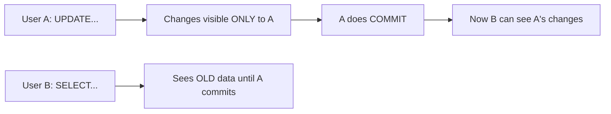

# 16. Transactions (ACID Properties & Isolation)

## Table of Contents
- [16.1 ACID Properties in Depth](#161-acid-properties-in-depth)
- [16.2 Autocommit vs Manual Commit](#162-autocommit-vs-manual-commit)
- [16.3 Isolation Levels](#163-isolation-levels)
- [16.4 Locking in Oracle](#164-locking-in-oracle)
- [16.5 Transaction Examples](#165-transaction-examples)
- [16.6 Practice & Assessment](#166-practice--assessment)

---

## 16.1 ACID Properties in Depth

### Atomicity
All operations in a transaction succeed or all fail — no partial execution.

```sql
-- Example: Bank transfer (must be atomic)
BEGIN
    UPDATE accounts SET balance = balance - 1000 WHERE acc_id = 'A';
    UPDATE accounts SET balance = balance + 1000 WHERE acc_id = 'B';
    COMMIT;  -- Both succeed
EXCEPTION
    WHEN OTHERS THEN
        ROLLBACK;  -- Both fail
END;
/
```

### Consistency
Database moves from one valid state to another. Constraints are never violated.

### Isolation
Concurrent transactions don't interfere with each other. One transaction's uncommitted changes are invisible to others.



### Durability
Once committed, data survives any failure (power outage, crash). Ensured by redo logs.

---

## 16.2 Autocommit vs Manual Commit

| Mode | Behavior | When |
|------|----------|------|
| **Manual** (default in Oracle) | You must explicitly COMMIT | Standard operations |
| **Autocommit** | Each statement auto-commits | Some tools have this setting |
| **Implicit commit** | DDL causes auto-commit | CREATE, ALTER, DROP |

```sql
-- In SQL*Plus: autocommit off (default)
SET AUTOCOMMIT OFF;

-- Turn on autocommit
SET AUTOCOMMIT ON;
-- Now every DML statement commits immediately (not recommended for transactions)
```

---

## 16.3 Isolation Levels

Oracle supports two isolation levels:

| Level | Description | Phantom Reads | Default |
|-------|-------------|---------------|---------|
| **READ COMMITTED** | Sees committed data at statement start | Possible | Yes |
| **SERIALIZABLE** | Sees data as of transaction start | Not possible | No |

```sql
-- Set isolation level
SET TRANSACTION ISOLATION LEVEL READ COMMITTED;  -- default
SET TRANSACTION ISOLATION LEVEL SERIALIZABLE;

-- Read-only transaction (cannot modify data)
SET TRANSACTION READ ONLY;
```

### Read Committed (Default)
- Each SQL statement sees the most recently committed data.
- Different statements within the same transaction may see different data if others commit in between.

### Serializable
- The transaction sees a snapshot from when it started.
- Appears as if no other transactions ran concurrently.
- May get `ORA-08177: can't serialize access` if conflicts occur.

---

## 16.4 Locking in Oracle

### Types of Locks

| Lock Type | Level | Purpose |
|-----------|-------|---------|
| Row lock (TX) | Row | DML on specific rows |
| Table lock (TM) | Table | Protect table during DML |
| DDL lock | Object | During DDL operations |

### How Locking Works
- **Readers never block writers** (Oracle uses multiversion concurrency).
- **Writers never block readers**.
- **Writers block writers** (on the same row only).

```sql
-- Row locking happens automatically during DML
UPDATE orders SET status = 'SHIPPED' WHERE order_id = 1003;
-- Row 1003 is now locked until COMMIT or ROLLBACK

-- Explicit locking: SELECT FOR UPDATE
SELECT * FROM orders WHERE order_id = 1003 FOR UPDATE;
-- Locks the row; other sessions wait if they try to update it
```

### Deadlock
When two transactions wait for each other's locks:
- Oracle automatically detects deadlocks.
- One transaction gets `ORA-00060: deadlock detected` and must rollback.

---

## 16.5 Transaction Examples

### Safe Transaction Pattern

```sql
DECLARE
    v_balance NUMBER;
BEGIN
    -- Check balance
    SELECT balance INTO v_balance FROM accounts WHERE acc_id = 'A' FOR UPDATE;
    
    IF v_balance >= 1000 THEN
        UPDATE accounts SET balance = balance - 1000 WHERE acc_id = 'A';
        UPDATE accounts SET balance = balance + 1000 WHERE acc_id = 'B';
        COMMIT;
        DBMS_OUTPUT.PUT_LINE('Transfer successful');
    ELSE
        DBMS_OUTPUT.PUT_LINE('Insufficient balance');
    END IF;
EXCEPTION
    WHEN OTHERS THEN
        ROLLBACK;
        DBMS_OUTPUT.PUT_LINE('Transfer failed: ' || SQLERRM);
END;
/
```

---

## 16.6 Practice & Assessment

### MCQs

**Q1.** In Oracle's default isolation level, when can User B see User A's changes?
- A) Immediately when A executes the statement
- B) After A commits
- C) Never
- D) After A's session ends

**Answer:** B) After A commits

---

**Q2.** Readers block writers in Oracle:
- A) Always
- B) Never
- C) Only in SERIALIZABLE mode
- D) Only with SELECT FOR UPDATE

**Answer:** B) Never (Oracle uses multiversion concurrency)

---

**Q3.** A deadlock occurs when:
- A) A transaction runs too long
- B) Two transactions wait for each other's locks
- C) The database crashes
- D) A table is too large

**Answer:** B) Two transactions wait for each other's locks

---

### Interview Questions

1. **Explain ACID properties with examples.**
2. **What is the default isolation level in Oracle?**
3. **How does Oracle handle concurrent access (MVCC)?**
4. **What is a deadlock and how does Oracle resolve it?**
5. **What is SELECT FOR UPDATE?**
6. **What is the difference between READ COMMITTED and SERIALIZABLE?**
7. **When does implicit commit happen?**
8. **What happens if a session disconnects without COMMIT?**

---

> **Next Topic**: [17 - Normalization](17-normalization.md)
