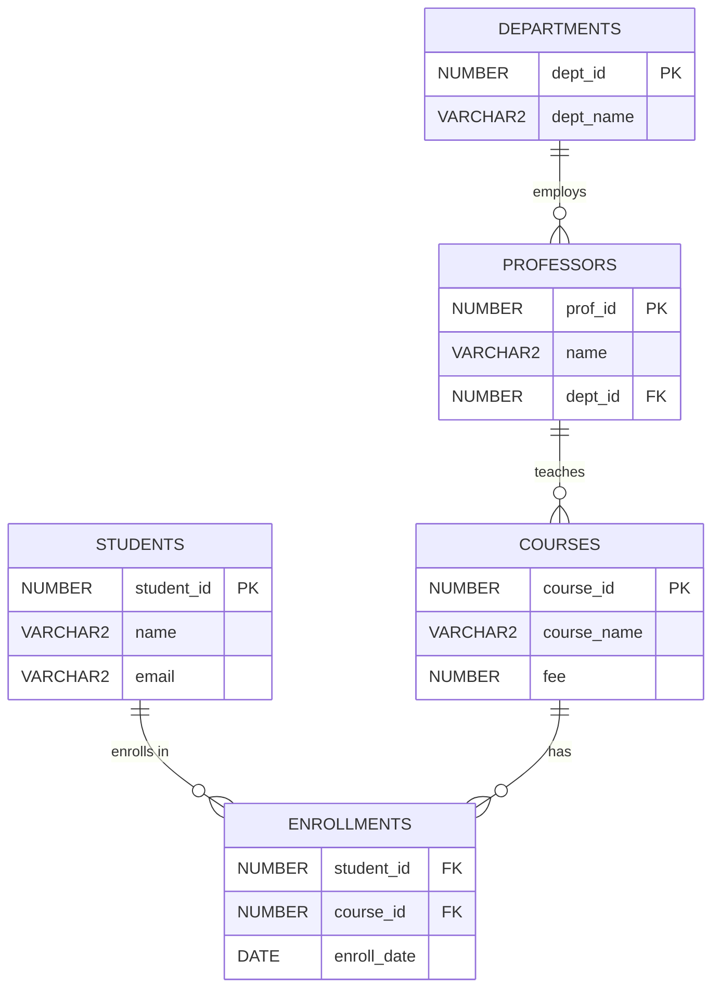

# 17. Normalization

## Table of Contents
- [17.1 What is Normalization?](#171-what-is-normalization)
- [17.2 First Normal Form (1NF)](#172-first-normal-form-1nf)
- [17.3 Second Normal Form (2NF)](#173-second-normal-form-2nf)
- [17.4 Third Normal Form (3NF)](#174-third-normal-form-3nf)
- [17.5 Boyce-Codd Normal Form (BCNF)](#175-boyce-codd-normal-form-bcnf)
- [17.6 Summary & ER Diagram](#176-summary--er-diagram)
- [17.7 Practice & Assessment](#177-practice--assessment)

---

## 17.1 What is Normalization?

### Definition
**Normalization** is the process of organizing tables to reduce **data redundancy** (duplicate data) and improve **data integrity**. It involves breaking large tables into smaller, related tables.

### Why Normalize?

| Problem | Meaning | Example |
|---------|---------|---------|
| **Update anomaly** | Changing data in one place, missing other places | Update customer city in one row but miss another |
| **Insert anomaly** | Cannot insert data without other unrelated data | Cannot add a new course without a student |
| **Delete anomaly** | Deleting data loses other important info | Deleting last student in a course loses course info |

---

## 17.2 First Normal Form (1NF)

### Rule
- Each column contains **atomic (single) values** — no lists or repeating groups.
- Each row is unique (has a primary key).

### Before 1NF (Violates)

```
STUDENTS:
+------+---------+--------------------------+
| S_ID | NAME    | COURSES                  |
+------+---------+--------------------------+
| 1    | Ravi    | Math, Physics, Chemistry |
| 2    | Priya   | Math, Biology            |
+------+---------+--------------------------+
```
> Problem: COURSES column has multiple values (not atomic).

### After 1NF

```
STUDENT_COURSES:
+------+---------+-----------+
| S_ID | NAME    | COURSE    |
+------+---------+-----------+
| 1    | Ravi    | Math      |
| 1    | Ravi    | Physics   |
| 1    | Ravi    | Chemistry |
| 2    | Priya   | Math      |
| 2    | Priya   | Biology   |
+------+---------+-----------+
Primary Key: (S_ID, COURSE)
```

---

## 17.3 Second Normal Form (2NF)

### Rule
- Must be in 1NF.
- No **partial dependency** — every non-key column must depend on the **entire** primary key (not just part of it).
- Applies when you have a **composite** primary key.

### Before 2NF (Violates)

```
STUDENT_COURSES:
+------+-----------+---------+-----------+
| S_ID | COURSE    | S_NAME  | COURSE_FEE|
+------+-----------+---------+-----------+
| 1    | Math      | Ravi    | 5000      |
| 1    | Physics   | Ravi    | 6000      |
| 2    | Math      | Priya   | 5000      |
+------+-----------+---------+-----------+
PK: (S_ID, COURSE)
```

**Problem:**
- `S_NAME` depends only on `S_ID` (not on COURSE) → partial dependency.
- `COURSE_FEE` depends only on `COURSE` (not on S_ID) → partial dependency.

### After 2NF

```
STUDENTS:                    COURSES:                 ENROLLMENTS:
+------+---------+          +-----------+------+     +------+-----------+
| S_ID | S_NAME  |          | COURSE    | FEE  |     | S_ID | COURSE    |
+------+---------+          +-----------+------+     +------+-----------+
| 1    | Ravi    |          | Math      | 5000 |     | 1    | Math      |
| 2    | Priya   |          | Physics   | 6000 |     | 1    | Physics   |
+------+---------+          +-----------+------+     | 2    | Math      |
                                                      +------+-----------+
```

---

## 17.4 Third Normal Form (3NF)

### Rule
- Must be in 2NF.
- No **transitive dependency** — non-key columns should not depend on other non-key columns.

### Before 3NF (Violates)

```
EMPLOYEES:
+--------+---------+---------+-----------+
| EMP_ID | NAME    | DEPT_ID | DEPT_NAME |
+--------+---------+---------+-----------+
| 1      | Ravi    | 10      | Sales     |
| 2      | Priya   | 20      | HR        |
| 3      | Amit    | 10      | Sales     |
+--------+---------+-----------+---------+
PK: EMP_ID
```

**Problem:**
- `DEPT_NAME` depends on `DEPT_ID`, not directly on `EMP_ID`.
- Transitive: EMP_ID → DEPT_ID → DEPT_NAME.
- Update anomaly: If Sales is renamed to "Sales & Marketing", must update multiple rows.

### After 3NF

```
EMPLOYEES:                   DEPARTMENTS:
+--------+---------+---------+   +---------+-----------+
| EMP_ID | NAME    | DEPT_ID |   | DEPT_ID | DEPT_NAME |
+--------+---------+---------+   +---------+-----------+
| 1      | Ravi    | 10      |   | 10      | Sales     |
| 2      | Priya   | 20      |   | 20      | HR        |
| 3      | Amit    | 10      |   +---------+-----------+
+--------+---------+---------+
```

---

## 17.5 Boyce-Codd Normal Form (BCNF)

### Rule
- Must be in 3NF.
- Every determinant must be a candidate key.
- (A stricter version of 3NF that handles certain edge cases.)

### When BCNF Matters
BCNF violations occur when a non-key column determines part of the composite key.

### Example

```
TEACHING:
+---------+---------+-----------+
| STUDENT | SUBJECT | PROFESSOR |
+---------+---------+-----------+
| Ravi    | Math    | Dr. Joshi |
| Priya   | Math    | Dr. Joshi |
| Ravi    | Physics | Dr. Kumar |
+---------+---------+-----------+
PK: (STUDENT, SUBJECT)
```

- **Issue:** Each professor teaches only one subject: PROFESSOR → SUBJECT.
- PROFESSOR is a determinant but NOT a candidate key → violates BCNF.

### After BCNF

```
PROF_SUBJECT:                STUDENT_PROF:
+-----------+---------+      +---------+-----------+
| PROFESSOR | SUBJECT |      | STUDENT | PROFESSOR |
+-----------+---------+      +---------+-----------+
| Dr. Joshi | Math    |      | Ravi    | Dr. Joshi |
| Dr. Kumar | Physics |      | Priya   | Dr. Joshi |
+-----------+---------+      | Ravi    | Dr. Kumar |
                              +---------+-----------+
```

---

## 17.6 Summary & ER Diagram

### Normalization Summary

| Normal Form | Rule | Eliminates |
|-------------|------|------------|
| **1NF** | Atomic values, no repeating groups | Multi-valued columns |
| **2NF** | No partial dependencies (on composite key) | Redundancy from partial keys |
| **3NF** | No transitive dependencies | Non-key→non-key dependencies |
| **BCNF** | Every determinant is a candidate key | Remaining anomalies |

### Normalized ER Diagram Example



---

## 17.7 Practice & Assessment

### MCQs

**Q1.** 1NF requires:
- A) No partial dependencies
- B) Atomic values in each column
- C) No transitive dependencies
- D) All determinants are candidate keys

**Answer:** B) Atomic values in each column

---

**Q2.** 2NF removes:
- A) Multi-valued columns
- B) Partial dependencies on composite keys
- C) Transitive dependencies
- D) Repeating groups

**Answer:** B) Partial dependencies on composite keys

---

**Q3.** If column A → column B → column C (and A is PK), this violates:
- A) 1NF
- B) 2NF
- C) 3NF
- D) No violation

**Answer:** C) 3NF (transitive dependency: A → B → C)

---

**Q4.** BCNF is stricter than 3NF because:
- A) It requires atomic values
- B) Every determinant must be a candidate key
- C) It doesn't allow NULLs
- D) It requires foreign keys

**Answer:** B) Every determinant must be a candidate key

---

### Short Answer

1. **What is an update anomaly? Give an example.**
   > When you update data in one row but the same data exists in other rows and is not updated, creating inconsistency. E.g., changing a department name in one employee row but missing others.

2. **When is 2NF relevant but not for single-column PKs?**
   > 2NF is only relevant when you have a composite primary key. Partial dependency can only exist when the PK has multiple columns.

---

### Interview Questions

1. **What is normalization and why is it important?**
2. **Explain 1NF, 2NF, 3NF with examples.**
3. **What is a transitive dependency?**
4. **What is the difference between 3NF and BCNF?**
5. **What are the disadvantages of over-normalization?**
6. **When would you denormalize a database?**
7. **What is a partial dependency?**
8. **Give a real-world example of normalization from UNF to 3NF.**

---

> **Next Topic**: [18 - Advanced Topics](18-advanced-topics.md)
